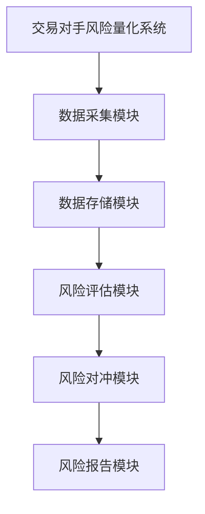
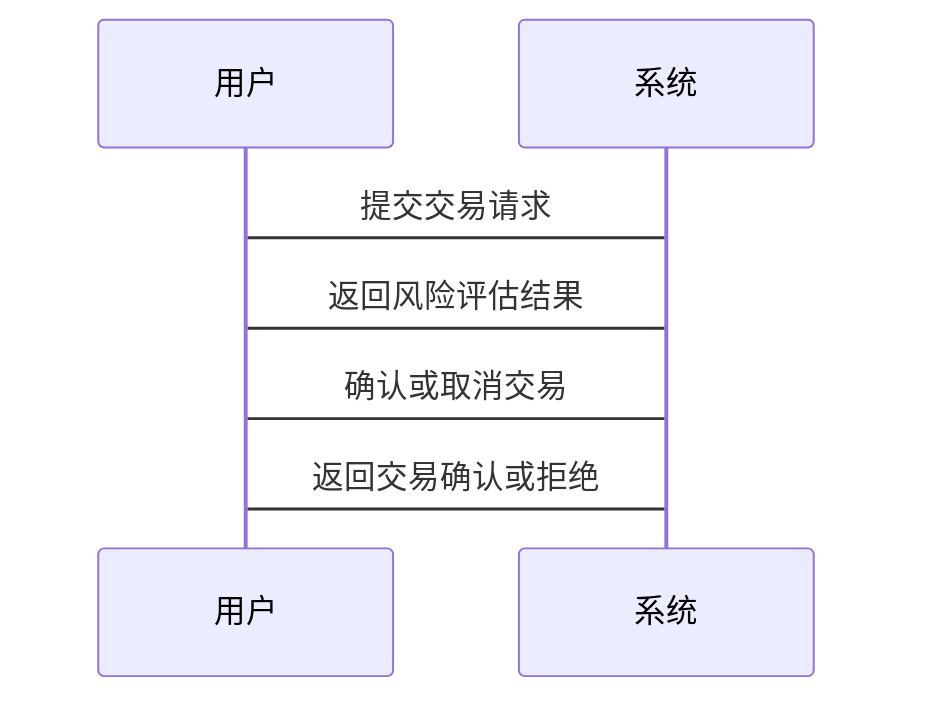

                 


# 《金融衍生品交易对手风险量化模型》

## 关键词

- 金融衍生品
- 交易对手风险
- 风险量化
- 蒙特卡洛模拟
- 信用评分模型
- 交易系统架构
- 风险管理

## 摘要

本文系统地探讨了金融衍生品交易对手风险量化模型的构建与应用。首先，介绍了金融衍生品的基本概念和交易对手风险的重要性，分析了风险的多维度特征。接着，详细讲解了蒙特卡洛模拟和信用评分模型在风险量化中的应用，结合数学模型和算法流程图，深入剖析了量化方法的实现细节。随后，从系统架构的角度，设计了一个完整的交易对手风险量化系统，包括系统功能设计、架构设计和接口设计。最后，通过实际案例展示了模型的应用，并总结了最佳实践和未来发展方向。

---

## 第1章：金融衍生品与交易对手风险的背景

### 1.1 金融衍生品的基本概念

#### 1.1.1 衍生品的定义与分类

金融衍生品（Financial Derivatives）是以基础资产（如股票、债券、商品等）为标的资产，通过对其价格波动进行推测和对冲而产生的金融工具。衍生品可以分为以下几类：

- **远期合约（Forwards）**：约定在未来某一特定时间以预定价格买卖资产的协议。
- **期货合约（Futures）**：标准化的远期合约，通常在交易所进行交易。
- **期权合约（Options）**：赋予买方在特定时间内以预定价格买入或卖出资产的权利，而不承担必须交易的义务。
- **掉期合约（Swaps）**：约定在未来某一时期内，按照预定条件交换现金流的协议。

衍生品的本质是通过杠杆效应放大收益或损失，其价格波动往往比基础资产更为剧烈。

---

#### 1.1.2 衍生品市场的基本结构

衍生品市场的主要参与者包括：

- **买方**：希望通过衍生品对冲或投机市场风险的机构或个人。
- **卖方**：提供衍生品流动性或承担市场风险的机构。
- **交易所**：提供标准化衍生品交易的场所。
- **清算所**：负责衍生品交易的清算和结算，降低交易对手风险。

衍生品市场的核心功能是对冲风险和价格发现。

---

#### 1.1.3 衍生品交易的典型场景

衍生品交易的典型场景包括：

1. **套期保值**：企业通过衍生品对冲其持有的资产或负债的市场风险。
2. **投机交易**：投资者通过衍生品押注市场价格的上涨或下跌。
3. **套利交易**：利用不同市场或资产之间的价格差异进行无风险或低风险的利润获取。

---

### 1.2 交易对手风险的核心概念

#### 1.2.1 交易对手风险的定义

交易对手风险（Counterparty Risk）是指交易对手未能履行其在合约中的义务而导致的损失风险。例如，如果交易对手违约，买方可能无法收回支付的款项或获得约定的资产。

---

#### 1.2.2 交易对手风险的类型

交易对手风险可以分为以下几种类型：

- **信用风险**：交易对手因信用问题未能履行合约义务的风险。
- **结算风险**：交易对手在结算过程中违约的风险。
- **流动性风险**：交易对手无法在市场中及时找到替代交易对手的风险。

---

#### 1.2.3 交易对手风险的影响因素

交易对手风险的影响因素包括：

1. **交易对手的信用状况**：交易对手的财务健康状况直接影响其履约能力。
2. **市场价格波动**：市场价格的剧烈波动可能导致交易对手因损失而违约。
3. **法律和监管环境**：法律和监管框架的不完善可能导致交易对手更容易违约。

---

### 1.3 交易对手风险量化的重要性

#### 1.3.1 量化交易对手风险的目的

量化交易对手风险的主要目的是通过模型和数据分析，准确评估交易对手的信用风险和结算风险，从而制定有效的风险管理策略。

---

#### 1.3.2 量化模型在金融风险管理中的作用

量化模型在金融风险管理中的作用包括：

1. **风险评估**：通过模型量化交易对手的信用风险和市场风险。
2. **风险对冲**：利用模型设计对冲策略，降低交易对手风险。
3. **风险预警**：通过模型监控交易对手的信用状况，及时预警潜在风险。

---

#### 1.3.3 量化模型的发展趋势

随着金融市场的复杂化和数字化，交易对手风险量化模型的发展趋势包括：

1. **数据驱动**：利用大数据技术，从海量数据中提取交易对手的风险特征。
2. **模型优化**：通过机器学习和人工智能技术，提升风险量化模型的精度和效率。
3. **实时监控**：实现交易对手风险的实时监控和动态评估。

---

## 第2章：交易对手风险的多维度分析

### 2.1 交易对手风险的维度

#### 2.1.1 信用风险

信用风险是交易对手因自身信用问题而违约的风险。评估信用风险的关键指标包括：

- **信用评级**：反映交易对手的信用状况。
- **违约概率（PD）**：交易对手在一定时间内违约的可能性。
- **违约损失率（LGD）**：交易对手违约时的平均损失比例。

---

#### 2.1.2 市场风险

市场风险是由于市场价格波动导致交易对手持有的衍生品头寸出现损失的风险。市场风险的主要影响因素包括：

- **波动率**：资产价格波动的剧烈程度。
- **相关性**：不同资产价格波动的相关性。
- **市场流动性**：市场的交易活跃程度。

---

#### 2.1.3 流动性风险

流动性风险是交易对手在市场中无法及时找到替代交易对手而导致的风险。流动性风险的评估指标包括：

- **市场深度**：市场中可交易的资产数量。
- **买卖价差**：市场中买卖价格的差异。
- **市场参与度**：市场中交易对手的数量和活跃程度。

---

### 2.2 交易对手风险量化的核心要素

#### 2.2.1 风险敞口的计算

风险敞口（Exposure）是指交易对手在衍生品交易中对交易方的风险暴露程度。计算风险敞口的关键步骤包括：

1. **确定交易的公允价值**：计算衍生品在当前市场条件下的公允价值。
2. **计算净敞口**：将交易的公允价值与交易对手的信用状况相结合，计算净风险敞口。

---

#### 2.2.2 风险因子的识别

风险因子是影响交易对手风险的关键因素，主要包括：

- **利率波动**：利率的变化直接影响衍生品的公允价值。
- **市场价格波动**：资产价格的波动影响交易对手的履约能力。
- **信用状况变化**：交易对手信用状况的变化影响其违约概率。

---

#### 2.2.3 风险模型的构建

风险模型是量化交易对手风险的核心工具。常见的风险模型包括：

- **VaR模型**：Value at Risk（VaR）是衡量投资组合风险的一种方法，表示在一定置信水平下，投资组合可能遭受的最大损失。
- **CVaR模型**：Conditional Value at Risk（CVaR）是VaR的扩展，衡量在VaR水平下的平均损失。

---

## 第3章：蒙特卡洛模拟在交易对手风险量化中的应用

### 3.1 蒙特卡洛模拟的基本原理

蒙特卡洛模拟（Monte Carlo Simulation）是一种通过随机采样方法模拟复杂系统行为的技术。其基本步骤包括：

1. **定义模型参数**：确定模拟的关键参数和分布。
2. **生成随机数**：根据参数分布生成随机数。
3. **模拟系统行为**：根据随机数模拟系统的运行结果。
4. **统计分析**：分析模拟结果，提取风险量化指标。

---

#### 3.2 蒙特卡洛模拟的实现

以下是蒙特卡洛模拟的Python代码示例：

```python
import numpy as np

def monte_carlo_simulation(n_simulations, initial_value, volatility, time_steps):
    np.random.seed(42)
    simulations = np.zeros(n_simulations)
    for i in range(n_simulations):
        # 生成随机数
        random_numbers = np.random.normal(0, 1, time_steps)
        # 计算模拟路径
        path = initial_value * np.exp(np.cumsum(volatility * random_numbers))
        # 计算最终价值
        final_value = path[-1]
        simulations[i] = final_value
    return simulations

# 示例参数
n_simulations = 1000
initial_value = 100
volatility = 0.2
time_steps = 252  # 252个交易日

simulations = monte_carlo_simulation(n_simulations, initial_value, volatility, time_steps)
print("模拟结果的平均值：", np.mean(simulations))
print("模拟结果的中位数：", np.median(simulations))
```

---

### 3.3 蒙特卡洛模拟的数学模型

蒙特卡洛模拟的核心数学模型是随机过程模拟。常见的随机过程包括布朗运动和几何布朗运动。几何布朗运动的数学公式如下：

$$
dS_t = \mu S_t dt + \sigma S_t dW_t
$$

其中：
- $S_t$ 是资产价格在时间 $t$ 的值。
- $\mu$ 是资产的期望收益率。
- $\sigma$ 是资产的波动率。
- $dW_t$ 是标准布朗运动的增量。

---

## 第4章：信用评分模型在交易对手风险量化中的应用

### 4.1 信用评分模型的基本原理

信用评分模型（Credit Scoring Model）是通过分析交易对手的信用特征，对其信用状况进行评分。常见的信用评分模型包括：

- **线性回归模型**：通过线性回归分析交易对手的信用特征与违约概率之间的关系。
- **逻辑回归模型**：通过逻辑回归模型预测交易对手的违约概率。
- **决策树模型**：通过决策树算法对交易对手进行信用评分。

---

#### 4.2 信用评分模型的实现

以下是信用评分模型的Python代码示例：

```python
from sklearn.linear_model import LogisticRegression
from sklearn.metrics import accuracy_score

# 示例数据
X = [[2, 3], [5, 6], [7, 8], [1, 2], [3, 4]]
y = [0, 1, 1, 0, 1]  # 0表示非违约，1表示违约

# 训练模型
model = LogisticRegression()
model.fit(X, y)

# 预测结果
predictions = model.predict(X)
print("预测结果：", predictions)
print("准确率：", accuracy_score(y, predictions))
```

---

### 4.3 信用评分模型的数学模型

信用评分模型的数学模型通常采用概率模型。例如，逻辑回归模型的损失函数如下：

$$
\text{损失函数} = -\sum_{i=1}^{n} [y_i \ln(p_i) + (1 - y_i) \ln(1 - p_i)]
$$

其中：
- $y_i$ 是交易对手 $i$ 的违约标签（0或1）。
- $p_i$ 是交易对手 $i$ 的违约概率。

---

## 第5章：交易对手风险量化模型的系统架构设计

### 5.1 交易对手风险量化系统的设计目标

交易对手风险量化系统的目的是通过实时监控和分析交易对手的信用状况，量化交易对手的风险敞口，并制定有效的风险管理策略。

---

### 5.2 系统功能设计

系统功能设计包括以下几个模块：

- **数据采集模块**：采集交易对手的信用数据、市场数据和交易数据。
- **风险评估模块**：基于采集的数据，评估交易对手的信用风险和市场风险。
- **风险对冲模块**：根据风险评估结果，制定风险对冲策略。
- **风险报告模块**：生成风险评估报告和风险管理建议。

---

### 5.3 系统架构设计

以下是系统的架构图：



---

### 5.4 系统交互设计

以下是系统的交互流程图：



---

## 第6章：交易对手风险量化模型的项目实战

### 6.1 项目背景与目标

本项目旨在开发一个交易对手风险量化系统，通过数据采集、风险评估和风险对冲，量化交易对手的风险敞口，并制定有效的风险管理策略。

---

### 6.2 项目核心实现

以下是项目的Python代码示例：

```python
import pandas as pd
import numpy as np
from sklearn.linear_model import LogisticRegression

# 数据采集与预处理
data = pd.read_csv('counterparty_data.csv')
features = data[['credit_rating', 'market_value', 'volatility']]
target = data['default_flag']

# 训练模型
model = LogisticRegression()
model.fit(features, target)

# 预测风险
new_counterparty = [[7, 100, 0.2]]  # 新交易对手的特征
predicted_risk = model.predict(new_counterparty)
print("预测风险：", predicted_risk)
```

---

### 6.3 项目小结

通过本项目的实施，我们可以看到交易对手风险量化模型在金融衍生品交易中的重要性。通过数据驱动和模型优化，可以有效降低交易对手风险，提升风险管理效率。

---

## 第7章：交易对手风险量化模型的总结与展望

### 7.1 总结

本文系统地探讨了金融衍生品交易对手风险量化模型的构建与应用。通过分析交易对手风险的多维度特征，结合蒙特卡洛模拟和信用评分模型，提出了有效的风险管理策略。

---

### 7.2 展望

随着金融市场的不断发展，交易对手风险量化模型将更加复杂和多样化。未来的研究方向包括：

1. **人工智能的应用**：利用机器学习技术提升风险量化模型的精度和效率。
2. **大数据技术的应用**：通过大数据分析技术，挖掘交易对手风险的潜在特征。
3. **实时监控系统的优化**：实现交易对手风险的实时监控和动态评估。

---

## 作者

作者：AI天才研究院/AI Genius Institute & 禅与计算机程序设计艺术 /Zen And The Art of Computer Programming

