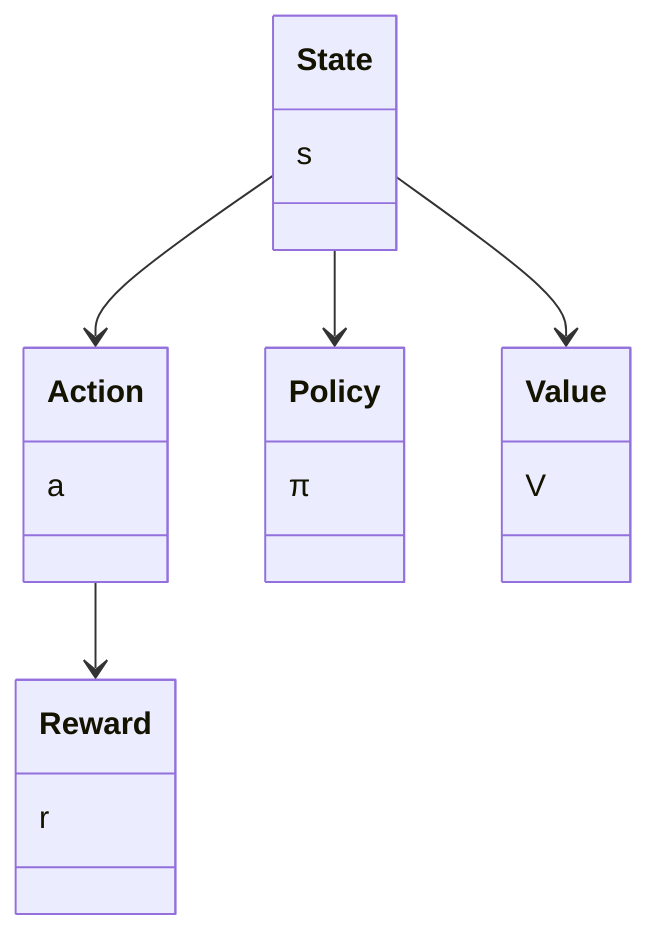
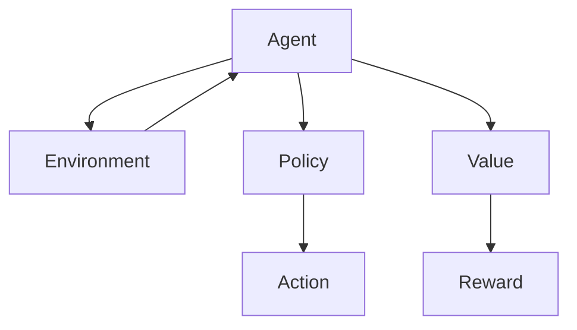
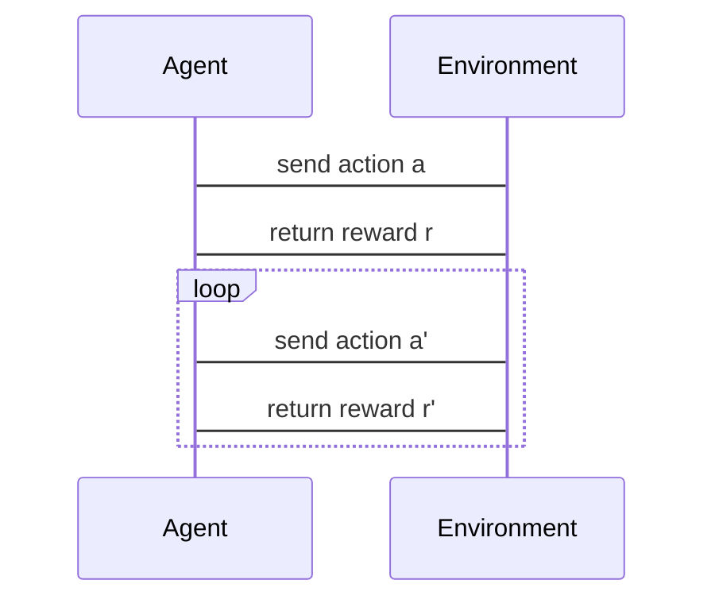

                 


# AI Agent的深度强化学习实现与优化

> **关键词**：AI Agent、深度强化学习、强化学习、深度学习、算法优化

> **摘要**：  
本文深入探讨了AI Agent在深度强化学习中的实现与优化方法。首先介绍了AI Agent的基本概念与强化学习的核心原理，然后详细分析了深度强化学习的算法基础，包括Q-learning、深度Q网络（DQN）、策略梯度方法和Actor-Critic架构。接着，重点讲解了深度强化学习的优化技巧，如网络结构优化、奖励机制设计和探索与利用的平衡。最后，通过实际案例分析了AI Agent的系统架构与项目实现，并总结了深度强化学习在AI Agent中的未来发展方向。

---

# 第1章 AI Agent与强化学习概述

## 1.1 AI Agent的基本概念

### 1.1.1 什么是AI Agent
AI Agent（人工智能代理）是指能够感知环境、做出决策并采取行动的智能体。它通过与环境交互，实现特定目标，如游戏中的智能体、自动驾驶中的决策系统等。

### 1.1.2 AI Agent的核心特征
- **自主性**：能够在没有外部干预的情况下独立运行。
- **反应性**：能够实时感知环境并做出反应。
- **目标导向**：通过最大化目标函数或奖励来优化行为。
- **学习能力**：通过与环境的交互不断优化自身的策略。

### 1.1.3 AI Agent的分类与应用场景
AI Agent可以分为**反应式代理**和**认知式代理**。反应式代理仅依赖当前感知的信息做出决策，而认知式代理则具备复杂推理和规划能力。其应用场景包括游戏AI、机器人控制、自动驾驶、智能推荐系统等。

---

## 1.2 强化学习的基本原理

### 1.2.1 强化学习的定义
强化学习是一种机器学习范式，通过智能体与环境的交互，学习如何采取一系列行动以最大化累计奖励。与监督学习不同，强化学习不需要标签数据，而是通过奖励信号来指导学习过程。

### 1.2.2 强化学习的核心要素
- **状态（State）**：环境在某一时刻的观测。
- **动作（Action）**：智能体在给定状态下采取的行动。
- **奖励（Reward）**：智能体采取行动后获得的反馈，用于指导学习。
- **策略（Policy）**：智能体选择动作的规则，可以是概率分布。
- **价值函数（Value Function）**：衡量某状态下策略的好坏。

### 1.2.3 强化学习与监督学习的区别
| **对比维度** | **监督学习** | **强化学习** |
|--------------|--------------|--------------|
| 数据来源     | 标签数据      | 奖励信号      |
| 反馈机制     | 确定性输出    | 延时反馈      |
| 决策空间     | 离散/连续     | 离散/连续      |
| 应用场景     | 分类、回归     | 游戏、控制、机器人等 |

---

## 1.3 深度强化学习的背景与意义

### 1.3.1 深度学习与强化学习的结合
深度学习擅长处理高维非结构化数据，而强化学习擅长决策和策略优化。两者的结合使得智能体能够处理复杂环境中的非结构化信息，并做出智能决策。

### 1.3.2 深度强化学习的优势
- **处理高维状态空间**：深度神经网络能够有效处理复杂的高维状态。
- **端到端学习**：无需手动设计特征，可以直接从原始数据中学习策略。
- **泛化能力**：深度强化学习能够在新环境中迁移学习。

### 1.3.3 深度强化学习的应用领域
- **游戏AI**：如AlphaGo、Dota AI。
- **自动驾驶**：路径规划和决策控制。
- **智能推荐**：用户行为预测与推荐。
- **机器人控制**：复杂环境中的自主决策。

---

## 1.4 本章小结
本章介绍了AI Agent的基本概念、强化学习的核心原理以及深度强化学习的背景与意义。通过对比监督学习和强化学习的差异，我们理解了深度强化学习的独特优势与应用场景。

---

# 第2章 强化学习算法原理与数学模型

## 2.1 马尔可夫决策过程（MDP）

### 2.1.1 状态、动作、奖励的定义
- **状态空间（S）**：所有可能的状态集合。
- **动作空间（A）**：所有可能的动作集合。
- **奖励函数（R）**：智能体采取动作后获得的奖励。

### 2.1.2 策略与价值函数的数学表达
- **策略（π）**：策略π是状态到动作的概率分布。
- **价值函数（V）**：衡量某状态下策略的好坏。

### 2.1.3 动态规划方法
动态规划通过迭代更新价值函数来逼近最优策略。其核心公式为：
$$ V_{\pi}(s) = \mathbb{E}[r + \gamma V_{\pi}(s')] $$

---

## 2.2 Q-learning算法

### 2.2.1 Q-learning的基本原理
Q-learning通过学习状态-动作对的Q值来逼近最优策略。Q值表示在状态s采取动作a后，后续的期望累计奖励。

### 2.2.2 Q-learning的数学模型
$$ Q(s,a) = Q(s,a) + \alpha [r + \gamma \max Q(s',a') - Q(s,a)] $$
其中：
- α：学习率。
- γ：折扣因子。

### 2.2.3 Q-learning的收敛性分析
Q-learning在离线情况下收敛于最优策略，但在在线情况下可能发散。

---

## 2.3 深度Q网络（DQN）

### 2.3.1 DQN的创新点
DQN通过引入经验回放和目标网络，解决了Q-learning的不稳定问题。

### 2.3.2 DQN的网络结构
- **输入层**：接收环境的状态。
- **隐藏层**：通过神经网络提取特征。
- **输出层**：输出所有动作的Q值。

### 2.3.3 DQN的训练流程
1. 从经验回放中随机抽取一批经验。
2. 计算目标Q值。
3. 更新当前网络参数，最小化Q值的误差。

---

## 2.4 策略梯度方法

### 2.4.1 策略梯度的基本思想
策略梯度直接优化策略，通过梯度上升方法最大化奖励的期望。

### 2.4.2 策略梯度的数学推导
$$ \nabla J(\theta) = \mathbb{E}[ \nabla \log \pi_\theta(a|s) Q(s,a) ] $$
其中：
- πθ(a|s)：策略的概率分布。
- Q(s,a)：Q值函数。

### 2.4.3 策略梯度的优势与挑战
优势：直接优化策略，适用于连续动作空间。  
挑战：梯度估计的方差较大。

---

## 2.5 Actor-Critic方法

### 2.5.1 Actor-Critic的架构
Actor-Critic由两个网络组成：
- **Actor**：负责选择动作。
- **Critic**：负责评估状态和动作的价值。

### 2.5.2 Actor-Critic的数学模型
$$ J(\theta) = \mathbb{E}[ Q(s,a) \log \pi_\theta(a|s) ] $$

### 2.5.3 Actor-Critic的训练流程
1. 更新Critic网络，最小化Q值的误差。
2. 更新Actor网络，最大化Q值的期望。

---

## 2.6 本章小结
本章详细讲解了强化学习的核心算法，包括Q-learning、DQN、策略梯度和Actor-Critic方法。通过数学公式和流程图的分析，我们理解了这些算法的原理与实现细节。

---

# 第3章 深度强化学习的优化与调优

## 3.1 网络结构优化

### 3.1.1 网络架构设计的原则
- **深度与宽度的平衡**：避免过深或过宽的网络。
- **权重初始化**：采用合理的初始化方法，如He初始化。
- **正则化**：使用Dropout或Batch Normalization防止过拟合。

### 3.1.2 模型压缩与轻量化
- **剪枝**：去除冗余的神经元或连接。
- **知识蒸馏**：将大模型的知识迁移到小模型。

---

## 3.2 离线与在线学习的平衡

### 3.2.1 离线学习的挑战
- 数据稀疏性。
- 无法实时更新。

### 3.2.2 在线学习的实时性要求
- 立即响应。
- 动态环境适应。

### 3.2.3 混合学习策略
结合离线和在线学习的优势，采用分阶段或交替学习的方式。

---

## 3.3 奖励机制的设计

### 3.3.1 奖励函数的定义
- **密度奖励**：奖励密度高的区域。
- **稀疏奖励**：仅在特定条件下给予奖励。

### 3.3.2 奖励函数的调整
- 标准化：将奖励范围归一化。
- 动态调整：根据环境变化动态调整奖励权重。

---

## 3.4 探索与利用的平衡

### 3.4.1 ε-greedy策略
- 探索概率ε：随机选择动作的概率。
- 利用概率1-ε：选择当前最优动作的概率。

### 3.4.2 贪婪策略的改进
- 温度参数：通过调整温度参数平衡探索与利用。

---

## 3.5 本章小结
本章讨论了深度强化学习的优化方法，包括网络结构优化、离线与在线学习的平衡、奖励机制设计以及探索与利用的平衡。这些优化方法能够有效提升智能体的性能。

---

# 第4章 深度强化学习的系统架构与实现

## 4.1 系统功能设计

### 4.1.1 领域模型


### 4.1.2 系统架构


---

## 4.2 系统接口设计

### 4.2.1 状态接口
- 输入：当前状态s。
- 输出：动作a。

### 4.2.2 奖励接口
- 输入：状态s和动作a。
- 输出：奖励r。

---

## 4.3 系统交互

### 4.3.1 序列图


---

## 4.4 本章小结
本章分析了深度强化学习的系统架构与实现，包括系统功能设计、架构设计、接口设计和系统交互。通过Mermaid图的展示，我们理解了系统的整体结构与工作流程。

---

# 第5章 项目实战：基于深度强化学习的AI Agent实现

## 5.1 环境安装

### 5.1.1 安装Python
```bash
python --version
```

### 5.1.2 安装深度强化学习库
```bash
pip install gym numpy tensorflow
```

---

## 5.2 系统核心实现

### 5.2.1 DQN网络实现
```python
import tensorflow as tf
import numpy as np

class DQN:
    def __init__(self, state_space, action_space):
        self.state_space = state_space
        self.action_space = action_space
        self.model = self.build_model()
        self.target_model = self.build_model()
        self.update_target_weights()

    def build_model(self):
        model = tf.keras.Sequential([
            tf.keras.layers.Dense(64, activation='relu', input_dim=self.state_space),
            tf.keras.layers.Dense(64, activation='relu'),
            tf.keras.layers.Dense(self.action_space, activation='linear')
        ])
        return model

    def update_target_weights(self):
        self.target_model.set_weights(self.model.get_weights())

    def act(self, state):
        state = np.reshape(state, [1, self.state_space])
        q_values = self.model.predict(state)
        return np.argmax(q_values[0])

    def remember(self, state, action, reward, next_state):
        # 经验回放实现
        pass

    def replay(self, batch_size):
        # 经验回放训练
        pass
```

---

## 5.3 代码实现与分析

### 5.3.1 训练过程
```python
def train(agent, env, episodes=1000):
    for episode in range(episodes):
        state = env.reset()
        done = False
        while not done:
            action = agent.act(state)
            next_state, reward, done, _ = env.step(action)
            agent.remember(state, action, reward, next_state)
            agent.replay(32)
            state = next_state
```

### 5.3.2 测试过程
```python
def test(agent, env):
    state = env.reset()
    done = False
    while not done:
        action = agent.act(state)
        next_state, reward, done, _ = env.step(action)
        state = next_state
    print("Total reward:", reward)
```

---

## 5.4 实际案例分析

### 5.4.1 游戏AI案例
- 环境：OpenAI Gym中的CartPole。
- 实现：使用DQN算法训练智能体控制小车。
- 结果：智能体能够在几百次训练后掌握平衡技巧。

---

## 5.5 项目小结
本章通过实际案例展示了深度强化学习的实现过程，包括环境安装、网络实现、训练与测试。通过代码示例和结果分析，我们理解了深度强化学习在AI Agent中的应用。

---

# 第6章 总结与展望

## 6.1 本章总结
本文系统地介绍了AI Agent的深度强化学习实现与优化方法。从基础概念到算法原理，再到优化与实战，我们全面探讨了深度强化学习的核心内容。

## 6.2 未来展望
- **多智能体协作**：研究多个AI Agent协作的强化学习方法。
- **复杂环境适应**：提升智能体在动态环境中的适应能力。
- **实时决策优化**：优化在线决策的实时性和稳定性。

---

# 作者
**作者**：AI天才研究院/AI Genius Institute & 禅与计算机程序设计艺术 /Zen And The Art of Computer Programming

