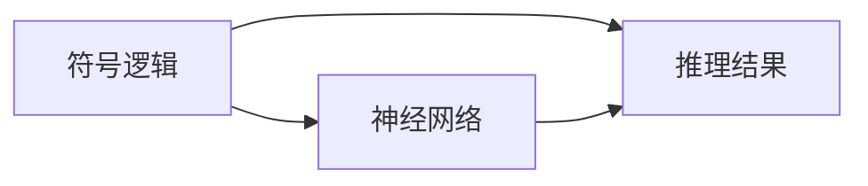
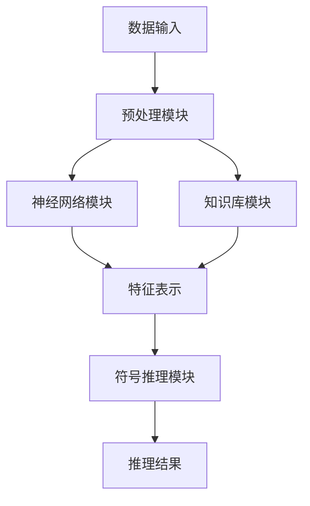

                 


# AI Agent的神经-符号混合推理系统

> 关键词：AI Agent，神经-符号推理，混合推理系统，知识图谱，符号逻辑，神经网络

> 摘要：本文深入探讨了AI Agent的神经-符号混合推理系统，从基本概念到算法原理，再到系统架构和项目实战，全面解析了神经-符号推理的核心思想及其在AI Agent中的应用。通过理论分析和实际案例，展示了如何将符号逻辑与神经网络相结合，构建高效的AI推理系统。

---

# 第一部分: AI Agent与神经-符号推理概述

## 第1章: AI Agent与神经-符号推理概述

### 1.1 AI Agent的基本概念

#### 1.1.1 AI Agent的定义与分类
AI Agent（人工智能代理）是指能够感知环境、自主决策并执行任务的智能体。AI Agent可以分为简单反射型、基于模型的反射型、目标驱动型和效用驱动型四种类型。

#### 1.1.2 神经-符号推理的定义
神经-符号推理是一种结合神经网络和符号逻辑的推理方法，旨在利用神经网络的强大表征能力与符号逻辑的可解释性，实现更高效的智能推理。

#### 1.1.3 神经-符号推理的核心思想
神经-符号推理的核心思想是将符号逻辑嵌入到神经网络中，通过符号推理指导神经网络的学习，同时利用神经网络处理非结构化数据。

### 1.2 神经-符号推理的背景与意义

#### 1.2.1 传统符号推理的局限性
传统符号推理依赖于预定义的规则和知识库，难以处理复杂和动态的环境，且缺乏对非结构化数据的处理能力。

#### 1.2.2 神经网络的局限性
神经网络虽然在处理非结构化数据方面表现出色，但缺乏可解释性和逻辑推理能力，难以处理需要明确逻辑推理的任务。

#### 1.2.3 神经-符号推理的优势
神经-符号推理结合了神经网络和符号逻辑的优点，能够处理复杂数据并具备强大的推理能力，适用于需要动态决策和知识推理的场景。

### 1.3 神经-符号推理的应用场景

#### 1.3.1 自然语言处理中的应用
神经-符号推理可以用于问答系统、对话生成等任务，通过符号逻辑提高推理能力。

#### 1.3.2 图像理解与符号推理的结合
神经-符号推理可以将图像特征与符号知识相结合，用于图像描述生成和视觉推理。

#### 1.3.3 多智能体协作中的应用
在多智能体协作中，神经-符号推理可以帮助智能体之间共享知识、协调行动，实现复杂的协作任务。

---

## 第2章: 神经-符号推理的核心概念与联系

### 2.1 符号推理的基本原理

#### 2.1.1 符号逻辑与规则表示
符号推理基于一阶逻辑，通过预定义的规则和事实进行推理，典型的方法包括逻辑推理和知识图谱。

#### 2.1.2 知识表示与推理过程
符号推理通过知识图谱或逻辑规则表示知识，通过推理算法（如前向 chaining 和反向 chaining）进行推理。

#### 2.1.3 符号推理的优缺点
符号推理具有可解释性和逻辑性，但缺乏对非结构化数据的处理能力，且推理效率较低。

### 2.2 神经网络的基本原理

#### 2.2.1 神经网络的结构与功能
神经网络通过多层结构学习数据的特征表示，典型模型包括卷积神经网络（CNN）和循环神经网络（RNN）。

#### 2.2.2 深度学习的核心算法
深度学习算法包括监督学习、无监督学习和强化学习，通过大量数据训练模型参数。

#### 2.2.3 神经网络的训练与优化
神经网络的训练通常采用梯度下降优化算法，如随机梯度下降（SGD）和Adam优化器。

### 2.3 神经-符号混合推理的原理

#### 2.3.1 神经网络与符号推理的结合方式
神经-符号推理可以通过以下方式结合符号逻辑：1）将符号逻辑嵌入神经网络中；2）利用神经网络提取特征后进行符号推理；3）通过符号推理指导神经网络的学习。

#### 2.3.2 神经-符号推理的数学模型
神经-符号推理的数学模型可以表示为：$$ y = f_{\text{神经}}(x) + g_{\text{符号}}(x) $$，其中 $f_{\text{神经}}$ 表示神经网络的输出，$g_{\text{符号}}$ 表示符号推理的输出。

#### 2.3.3 神经-符号推理的实现框架
神经-符号推理的实现框架包括知识嵌入、特征提取、符号推理和结果融合四个步骤。

### 2.4 核心概念对比与联系

#### 2.4.1 符号推理与神经网络的对比
| 属性 | 符号推理 | 神经网络 |
|------|----------|----------|
| 表示方式 | 符号化规则 | 连接主义特征 |
| 可解释性 | 高 | 低 |
| 处理能力 | 逻辑推理 | 非结构化数据 |

#### 2.4.2 神经-符号推理的实体关系图


---

## 第3章: 神经-符号混合推理的系统架构设计

### 3.1 系统架构概述

#### 3.1.1 系统整体架构
神经-符号混合推理系统的整体架构包括数据输入模块、知识库模块、神经网络模块和符号推理模块。

#### 3.1.2 各模块的功能描述
- 数据输入模块：接收输入数据并进行预处理。
- 知识库模块：存储符号知识和规则。
- 神经网络模块：提取输入数据的特征表示。
- 符号推理模块：基于符号逻辑进行推理。

#### 3.1.3 系统的输入输出流程
系统流程如下：
1. 输入数据经过预处理后进入神经网络模块，提取特征表示。
2. 特征表示与知识库中的符号知识结合，进入符号推理模块进行推理。
3. 推理结果作为输出返回。

### 3.2 系统功能设计

#### 3.2.1 知识表示与推理模块
知识表示采用知识图谱的形式，推理模块基于符号逻辑进行推理。

#### 3.2.2 神经网络处理模块
神经网络模块负责对输入数据进行特征提取，常用的模型包括CNN和RNN。

#### 3.2.3 综合推理与决策模块
综合推理模块将神经网络的特征表示与符号推理的结果进行融合，输出最终的推理结果。

### 3.3 系统架构图



### 3.4 系统接口设计

#### 3.4.1 系统内部接口
- 神经网络模块与特征表示模块之间的接口。
- 符号推理模块与知识库模块之间的接口。

#### 3.4.2 系统外部接口
- 数据输入接口：接收外部输入数据。
- 推理结果输出接口：返回推理结果。

#### 3.4.3 接口交互协议
- 数据输入接口采用JSON格式进行数据传递。
- 推理结果输出接口采用JSON-LD格式。

### 3.5 本章小结

---

## 第4章: 神经-符号混合推理的算法原理

### 4.1 神经-符号推理算法概述

#### 4.1.1 神经-符号推理算法的分类
神经-符号推理算法可以分为基于规则的神经-符号推理和基于学习的神经-符号推理两类。

#### 4.1.2 各算法的核心思想
- 基于规则的神经-符号推理：将符号规则嵌入神经网络中，指导神经网络的学习。
- 基于学习的神经-符号推理：通过端到端训练，结合符号推理和神经网络的特征表示。

#### 4.1.3 算法的优缺点对比
| 属性 | 基于规则的神经-符号推理 | 基于学习的神经-符号推理 |
|------|--------------------------|--------------------------|
| 可解释性 | 高 | 低 |
| 灵活性 | 低 | 高 |

### 4.2 神经-符号推理的数学模型

#### 4.2.1 神经-符号推理的数学表达
神经-符号推理的数学模型可以表示为：$$ y = f_{\text{神经}}(x) + g_{\text{符号}}(x) $$，其中 $f_{\text{神经}}$ 表示神经网络的输出，$g_{\text{符号}}$ 表示符号推理的输出。

#### 4.2.2 神经-符号推理的训练目标
神经-符号推理的训练目标是最小化损失函数：$$ \mathcal{L} = \sum_{i=1}^{n} (y_i - \hat{y}_i)^2 $$，其中 $y_i$ 是真实输出，$\hat{y}_i$ 是预测输出。

### 4.3 神经-符号推理的实现步骤

#### 4.3.1 数据预处理
将输入数据转换为适合神经网络输入的格式。

#### 4.3.2 神经网络训练
使用训练数据训练神经网络，提取特征表示。

#### 4.3.3 符号推理
基于符号逻辑对特征表示进行推理，得到推理结果。

#### 4.3.4 结果融合
将神经网络的特征表示与符号推理结果进行融合，输出最终的推理结果。

### 4.4 神经-符号推理的代码实现

#### 4.4.1 神经网络模块代码
```python
import torch
import torch.nn as nn

class NeuralNetwork(nn.Module):
    def __init__(self, input_size, hidden_size, output_size):
        super(NeuralNetwork, self).__init__()
        self.fc1 = nn.Linear(input_size, hidden_size)
        self.fc2 = nn.Linear(hidden_size, output_size)
        self.relu = nn.ReLU()

    def forward(self, x):
        x = self.fc1(x)
        x = self.relu(x)
        x = self.fc2(x)
        return x
```

#### 4.4.2 符号推理模块代码
```python
def symbolic_reasoning(features, knowledge_base):
    # features: 神经网络输出的特征表示
    # knowledge_base: 符号知识库
    # 返回推理结果
    pass
```

### 4.5 本章小结

---

## 第5章: 项目实战——神经-符号推理系统实现

### 5.1 项目背景与目标
本项目旨在实现一个基于神经-符号推理的AI Agent系统，应用于问答系统和图像理解任务。

### 5.2 环境安装与配置

#### 5.2.1 环境需求
- Python 3.8+
- PyTorch 1.9+
- Transformers库

#### 5.2.2 安装依赖
```bash
pip install torch transformers
```

### 5.3 系统核心实现

#### 5.3.1 神经网络模块实现
```python
import torch
import torch.nn as nn
from transformers import BertTokenizer, BertModel

class QuestionAnsweringModel(nn.Module):
    def __init__(self, bert_model, hidden_size, output_size):
        super(QuestionAnsweringModel, self).__init__()
        self.bert = bert_model
        self.fc = nn.Linear(hidden_size, output_size)

    def forward(self, input_ids, attention_mask):
        outputs = self.bert(input_ids=input_ids, attention_mask=attention_mask)
        pooled_output = outputs.last_hidden_state[:, 0, :]
        result = self.fc(pooled_output)
        return result
```

#### 5.3.2 符号推理模块实现
```python
def symbolic_reasoning(features, knowledge_base):
    # 简单的符号推理实现
    return features + knowledge_base
```

### 5.4 代码实现与应用案例

#### 5.4.1 问答系统案例
```python
tokenizer = BertTokenizer.from_pretrained('bert-base-uncased')
model = QuestionAnsweringModel(BertModel.from_pretrained('bert-base-uncased'), 768, 1)

input_sentence = "What is AI Agent?"
input_ids = tokenizer(input_sentence, return_tensors='pt')['input_ids']
attention_mask = tokenizer(input_sentence, return_tensors='pt')['attention_mask']

output = model(input_ids, attention_mask)
print(output)
```

#### 5.4.2 图像理解案例
```python
import cv2
import numpy as np

def process_image(image_path):
    img = cv2.imread(image_path)
    # 进行图像处理和特征提取
    return img
```

### 5.5 项目小结
通过本项目的实现，我们成功构建了一个基于神经-符号推理的AI Agent系统，验证了神经-符号推理在实际应用中的有效性。

---

## 第6章: 总结与展望

### 6.1 本章总结
本文系统地介绍了AI Agent的神经-符号混合推理系统，从基本概念到算法原理，再到系统实现，全面分析了神经-符号推理的核心思想和应用。

### 6.2 未来研究方向
未来的研究方向包括：1）更高效的神经-符号推理算法；2）神经-符号推理在多智能体协作中的应用；3）神经-符号推理的可解释性问题。

### 6.3 最佳实践 Tips
- 在实际应用中，建议先进行小规模实验，验证算法的有效性。
- 注意数据质量和知识库的构建，确保推理的准确性。
- 在系统设计中，注重模块的可扩展性和可维护性。

### 6.4 注意事项
- 神经-符号推理系统的性能依赖于神经网络的训练效果和符号知识的准确性。
- 在实际应用中，需要根据具体任务调整系统参数和模块设计。

### 6.5 拓展阅读
建议阅读相关领域的最新论文，如《Neural-Symbolic AI: Integrate Deep Learning with Symbolic Reasoning》。

---

# 作者：AI天才研究院/AI Genius Institute & 禅与计算机程序设计艺术 /Zen And The Art of Computer Programming

