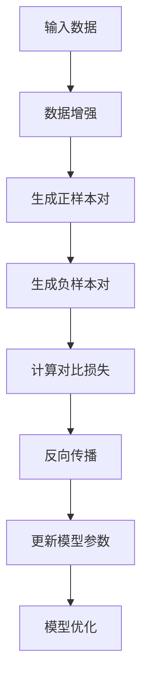
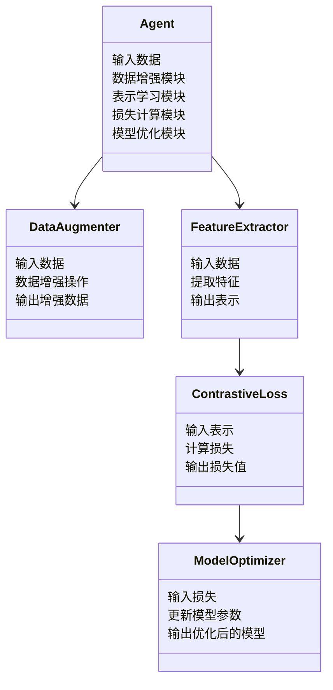

                 


# AI Agent的自监督表示学习：减少标注数据依赖

## 关键词：AI Agent、自监督学习、表示学习、无监督学习、标注数据

## 摘要

在人工智能领域，标注数据的获取成本高昂且耗时，限制了模型的训练和应用。自监督学习作为一种新兴的学习方法，能够在无需大量标注数据的情况下，通过自我监督和对比学习，提升模型的表示学习能力。本文详细探讨AI Agent的自监督表示学习技术，分析其核心原理、算法实现、系统架构，并通过实际案例展示如何减少对标注数据的依赖，提高模型的泛化能力和实用性。

---

## 第一部分：背景介绍

### 第1章：AI Agent与自监督学习的背景

#### 1.1 问题背景

随着人工智能技术的快速发展，AI Agent（智能体）在各个领域的应用日益广泛。然而，AI Agent的训练和部署高度依赖高质量的标注数据，这种依赖带来了几个关键问题：

1. **数据标注成本高昂**：标注数据需要专业人员进行人工标注，耗时且昂贵。
2. **标注数据的局限性**：标注数据通常仅覆盖有限的场景，难以覆盖所有可能的输入。
3. **数据多样性的挑战**：在某些领域，标注数据的获取非常困难，尤其是实时或动态环境中。

#### 1.2 问题描述

AI Agent的核心任务是通过感知环境并采取行动来实现特定目标。为了完成这些任务，模型需要通过表示学习来捕获输入数据的语义信息。传统的监督学习依赖大量标注数据，但在许多实际场景中，标注数据的获取受到限制。这使得AI Agent在面对未见过的数据时，表现不佳，泛化能力不足。

#### 1.3 问题解决

自监督学习是一种无监督学习方法，通过利用未标注数据中的结构信息来学习有用的表示。与监督学习不同，自监督学习不需要外部标注信息，而是通过构建伪标签或对比学习，从数据本身中提取特征。这种方法能够显著减少对标注数据的依赖，同时提高模型的泛化能力。

#### 1.4 边界与外延

自监督学习并非适用于所有场景。其适用范围包括：

- 数据标注成本高的场景
- 数据多样性不足的领域
- 需要实时处理动态数据的环境

与监督学习和无监督学习相比，自监督学习在模型训练过程中结合了两者的优点，既利用了未标注数据，又通过伪标签引导模型学习。

---

## 第二部分：核心概念与联系

### 第2章：自监督学习的核心概念

#### 2.1 核心概念

自监督学习的核心思想是通过构建伪标签来监督模型学习。伪标签通常基于模型对同一数据的不同视角的预测结果生成，例如图像的旋转、文本的同义词替换等。通过这种方式，模型能够从大量未标注数据中学习到有用的表示。

#### 2.2 概念属性特征对比

以下是自监督学习与其他学习方法的关键特征对比：

| **特征维度** | **监督学习**         | **无监督学习**      | **自监督学习**       |
|---------------|----------------------|--------------------|----------------------|
| 数据需求      | 高标注数据           | 无标注数据          | 无标注数据，生成伪标签 |
| 模型能力       | 依赖标注质量         | 依赖数据分布         | 依赖数据内部结构       |
| 适用场景       | 标注数据充足           | 数据多样但无结构       | 标注数据获取困难         |

#### 2.3 ER实体关系图

以下是自监督学习的ER实体关系图，展示了核心概念之间的关系：

```mermaid
er
actor
    name: Actor
    description: 实体执行者，代表数据生成者或模型训练者

agent
    name: Agent
    description: 自监督学习中的智能体，代表学习模型

data
    name: Data
    description: 数据，包括未标注数据和伪标签

process
    name: Process
    description: 自监督学习过程，包括数据预处理和伪标签生成

role
    name: Role
    description: 自监督学习中的角色，包括数据生成者和模型训练者

关系：
actor -|> process: 提供数据
agent -|> process: 学习过程
data -|> process: 输入数据
```

---

## 第三部分：算法原理讲解

### 第3章：自监督学习的算法原理

#### 3.1 数学模型与公式

自监督学习的核心是通过对比学习来优化模型的表示能力。常用的对比学习目标函数如下：

$$ L = \frac{1}{N}\sum_{i=1}^{N} \text{contrast}(x_i, x'_i) $$

其中，\( x_i \) 和 \( x'_i \) 是同一数据的两个不同视角的表示，\( N \) 是样本数量。对比损失函数通常使用交叉熵损失：

$$ \text{contrast}(x_i, x'_i) = -\log \frac{\exp(s(x_i, x'_i))}{\sum_{j} \exp(s(x_i, x_j))} $$

其中，\( s(x_i, x_j) \) 是相似度得分，通常通过点积计算：

$$ s(x_i, x_j) = x_i^\top x_j $$

#### 3.2 算法步骤

以下是自监督学习的标准算法流程：



#### 3.3 代码实现

以下是自监督学习的Python实现示例，基于对比学习：

```python
import torch
import torch.nn as nn
import torch.optim as optim

class SupConLoss(nn.Module):
    def __init__(self, temperature=0.1):
        super(SupConLoss, self).__init__()
        self.temperature = temperature

    def forward(self, features):
        device = features.device
        batch_size = features.size(0)
        labels = torch.arange(batch_size, device=device).long()
        features = torch.cat([features, features], dim=0)
        labels = torch.cat([labels, labels], dim=0)
        similarity_matrix = torch.div(features @ features.T, self.temperature)
        logits = similarity_matrix
        labels = labels.contiguous().view(-1)
        loss = nn.CrossEntropyLoss()(
            logits[:batch_size, :batch_size], labels[:batch_size]
        )
        return loss

# 示例用法
features = torch.randn(2, 128)  # 假设特征维度为128
criterion = SupConLoss()
loss = criterion(features)
print(loss)
```

---

## 第四部分：系统分析与架构设计方案

### 第4章：AI Agent的自监督学习系统

#### 4.1 应用场景

自监督学习在AI Agent中的典型应用场景包括：

1. **图像识别**：在没有标注的情况下，通过图像旋转和裁剪生成伪标签。
2. **自然语言处理**：在文本数据上进行自监督预训练，如BERT。
3. **实时数据分析**：在动态数据流中进行实时特征学习。

#### 4.2 系统功能设计

以下是系统的功能模块设计：



#### 4.3 系统架构设计

以下是系统的整体架构设计：


---

## 第五部分：项目实战

### 第5章：自监督学习的项目实现

#### 5.1 环境配置

项目所需的环境配置如下：

- Python 3.8+
- PyTorch 1.9+
- CUDA 11+

#### 5.2 核心代码实现

以下是自监督学习的Python代码实现：

```python
import torch
import torch.nn as nn
import torch.optim as optim

class SimSiam(nn.Module):
    def __init__(self, encoder_backbone, hidden_dim=2048, projection_dim=128):
        super(SimSiam, self).__init__()
        self.encoder = encoder_backbone
        self.hidden_dim = hidden_dim
        self.projection_dim = projection_dim
        self.fc1 = nn.Linear(hidden_dim, hidden_dim)
        self.fc2 = nn.Linear(hidden_dim, projection_dim)
        self.fc3 = nn.Linear(projection_dim, hidden_dim)

    def forward(self, x):
        x = self.encoder(x)
        x = x.view(x.size(0), -1)
        x = nn.functional.relu(self.fc1(x))
        x = self.fc2(x)
        x = nn.functional.relu(self.fc3(x))
        return x

# 示例用法
encoder = nn.Sequential(
    nn.Linear(128, 256),
    nn.ReLU(),
    nn.Linear(256, 128)
)
model = SimSiam(encoder)
criterion = nn.CrossEntropyLoss()
optimizer = optim.Adam(model.parameters(), lr=1e-3)

# 训练循环
for epoch in range(100):
    for batch in dataloader:
        optimizer.zero_grad()
        x1, x2 = data_augment(batch)
        output = model(x1)
        loss = criterion(output, x2)
        loss.backward()
        optimizer.step()
```

#### 5.3 代码解读与分析

1. **模型定义**：SimSiam模型由编码器和投影头组成，编码器负责提取特征，投影头用于生成最终的表示。
2. **损失计算**：使用对比损失函数，计算正样本对和负样本对的相似度，优化模型以区分正样本和负样本。
3. **数据增强**：在训练过程中，对输入数据进行数据增强操作，生成不同的视角，作为正样本对。

#### 5.4 实际案例分析

通过在图像数据集上进行自监督学习，AI Agent能够从大量未标注数据中学习到图像的语义信息。例如，在图像分类任务中，自监督预训练可以显著提高模型在小样本数据上的表现。

---

## 第六部分：总结与扩展

### 第6章：总结与注意事项

#### 6.1 总结

自监督学习作为一种无监督学习方法，通过生成伪标签和对比学习，显著减少了AI Agent对标注数据的依赖。本文详细探讨了自监督学习的核心原理、算法实现和系统架构，并通过实际案例展示了其在减少标注数据依赖方面的优势。

#### 6.2 注意事项

- **数据质量**：自监督学习依赖数据内部的结构信息，数据质量对模型性能影响显著。
- **模型复杂度**：复杂模型在自监督学习中表现更好，但需要更多的计算资源。
- **应用场景**：自监督学习适用于标注数据获取困难的场景，但在标注数据充足的场景中，监督学习可能表现更优。

#### 6.3 拓展阅读

1. **SimCLR**：一种基于对比学习的自监督学习方法，广泛应用于图像表示学习。
2. **BERT**：自然语言处理中的自监督预训练模型，通过掩盖词任务和下文任务进行自监督学习。
3. **MAE**：基于自监督的图像压缩与重建模型，展示了自监督学习在图像处理中的广泛应用。

---

## 作者：AI天才研究院/AI Genius Institute & 禅与计算机程序设计艺术 /Zen And The Art of Computer Programming

---

通过以上结构和内容，您可以编写一篇详细的关于AI Agent的自监督表示学习的技术博客文章。

