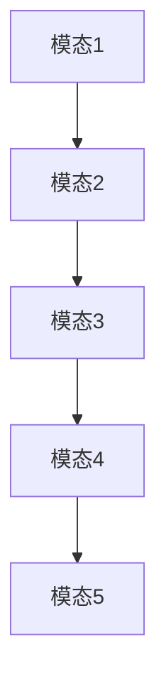
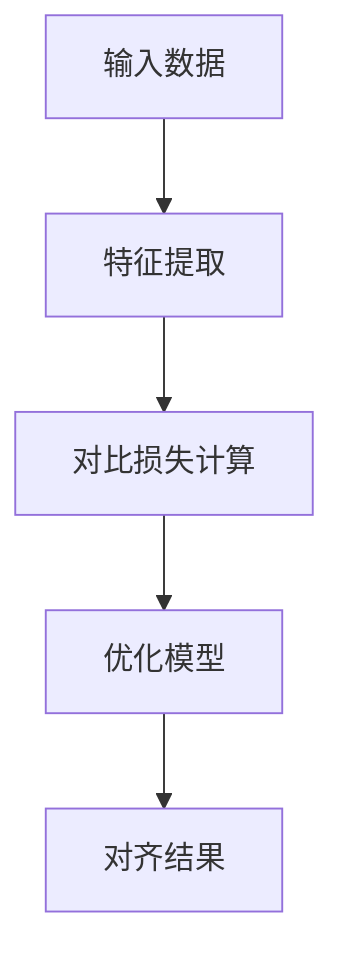
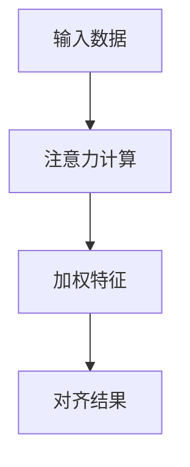
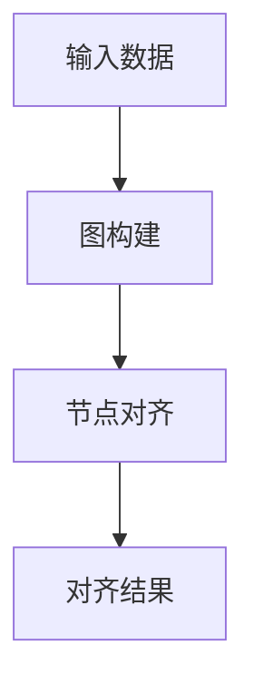
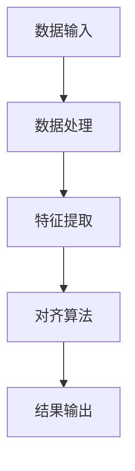
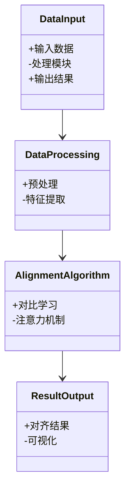
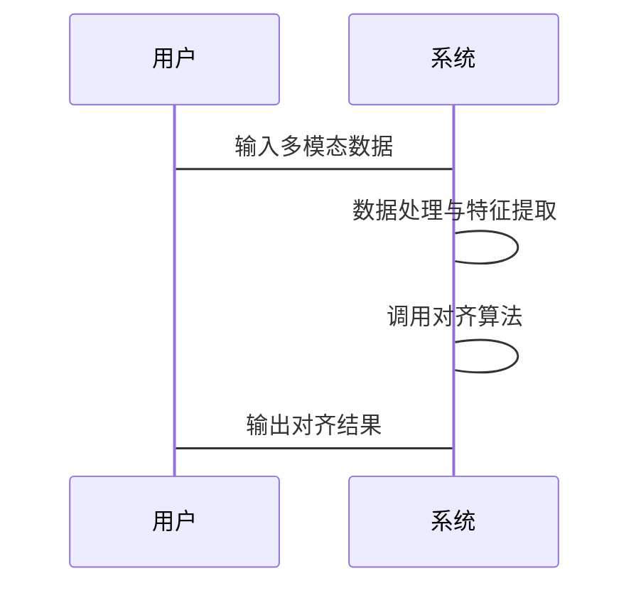

                 


# AI Agent的跨模态知识对齐与融合

**关键词：** AI Agent, 跨模态知识对齐, 多模态数据, 知识融合, 对齐算法, 系统架构

**摘要：**  
AI Agent的跨模态知识对齐与融合是人工智能领域的重要研究方向。随着多模态数据的广泛应用，如何将不同模态的数据（如文本、图像、语音等）有效对齐并融合，成为实现智能决策和理解的关键挑战。本文从跨模态知识对齐的基本概念出发，详细探讨其核心原理、算法实现、系统架构以及实际应用案例。通过理论与实践相结合的方式，深入分析跨模态对齐的技术难点，并提出可行的解决方案，为AI Agent的智能化发展提供理论支持和实践指导。

---

# 第一章: AI Agent与跨模态知识对齐概述

## 1.1 AI Agent的基本概念

### 1.1.1 AI Agent的定义

AI Agent（智能体）是指在环境中能够感知并自主行动以实现目标的实体。它可以是一个软件程序、机器人或其他智能系统。AI Agent的核心目标是通过感知环境、理解任务需求，并采取行动来优化目标的实现。

### 1.1.2 AI Agent的核心特点

- **自主性：** AI Agent能够在没有外部干预的情况下独立运作。
- **反应性：** 能够实时感知环境变化并做出响应。
- **目标导向：** 通过明确的目标驱动行为。
- **学习能力：** 可以通过经验或数据优化自身行为。

### 1.1.3 AI Agent的应用场景

- **自然语言处理：** 如智能对话系统。
- **计算机视觉：** 如图像识别和视频分析。
- **机器人控制：** 如工业机器人和家庭服务机器人。
- **推荐系统：** 如个性化内容推荐。

## 1.2 跨模态知识对齐的背景与意义

### 1.2.1 跨模态数据的定义

跨模态数据指的是来自不同感知渠道的数据形式，例如文本、图像、语音、视频等。这些数据具有不同的特征和语义信息，但它们往往共同描述同一个实体或事件。

### 1.2.2 跨模态知识对齐的必要性

AI Agent需要处理多模态数据时，必须将这些数据对齐，以便统一理解和推理。例如，在智能客服系统中，用户的问题可能同时涉及文本和图像信息，AI Agent需要将这些信息对齐，才能准确理解用户的需求。

### 1.2.3 跨模态知识对齐的应用价值

- **提升决策能力：** 通过多模态数据的对齐，AI Agent能够获得更全面的信息，从而做出更准确的决策。
- **增强用户体验：** 对齐后的多模态数据可以为用户提供更智能化的服务。
- **推动技术进步：** 跨模态对齐技术的进步将推动AI Agent在更多领域的应用。

## 1.3 跨模态知识对齐与融合的定义与特点

### 1.3.1 跨模态知识对齐的定义

跨模态知识对齐是指将不同模态的数据（如文本和图像）映射到一个共同的语义空间，使得不同模态的数据能够互相理解和关联。

### 1.3.2 跨模态知识对齐的核心要素

- **数据表示：** 如何将不同模态的数据表示为可对齐的形式。
- **对齐目标：** 确定对齐的语义目标。
- **对齐策略：** 如何实现数据的对齐。

### 1.3.3 跨模态知识对齐与融合的区别与联系

- **区别：** 对齐是将数据映射到共同空间，而融合是将对齐后的数据进行综合处理。
- **联系：** 对齐是融合的前提，融合是对齐的目标。

## 1.4 本章小结

本章介绍了AI Agent的基本概念、跨模态知识对齐的背景与意义，以及对齐与融合的定义与特点。这些内容为后续章节的深入分析奠定了基础。

---

# 第二章: 跨模态知识对齐的核心概念与联系

## 2.1 跨模态数据的表示方法

### 2.1.1 多模态数据的表示方式

- **向量表示：** 将数据转换为向量形式，便于计算和处理。
- **图结构表示：** 使用图结构表示数据之间的关系。

### 2.1.2 跨模态数据的特征提取

- **文本特征提取：** 如词袋模型、词嵌入。
- **图像特征提取：** 如CNN、PCA。
- **语音特征提取：** 如MFCC、STFT。

### 2.1.3 跨模态数据的表示模型

- **双模态模型：** 处理两种模态数据的模型。
- **多模态模型：** 处理多种模态数据的模型。

## 2.2 跨模态知识对齐的挑战与解决方案

### 2.2.1 跨模态对齐的主要挑战

- **语义鸿沟：** 不同模态之间的语义差异。
- **数据异构性：** 不同模态的数据形式和特征不同。
- **计算复杂性：** 多模态数据的处理需要大量计算资源。

### 2.2.2 跨模态对齐的解决方案

- **对比学习：** 将不同模态的数据映射到相同的特征空间。
- **注意力机制：** 突出重要特征，降低无关特征的影响。
- **图对齐：** 使用图结构对齐不同模态的数据。

### 2.2.3 跨模态对齐的评估指标

- **准确率：** 对齐后的数据与真实数据的匹配程度。
- **相似度：** 对齐后数据的相似性度量。
- **鲁棒性：** 对齐方法在不同数据集上的表现。

## 2.3 跨模态知识对齐的数学模型与公式

### 2.3.1 跨模态对齐的数学模型

$$
f(x_i) = \arg\min_{x_j} \text{distance}(x_i, x_j)
$$

其中，$x_i$表示模态1中的一个数据点，$x_j$表示模态2中的一个数据点，$\text{distance}$表示距离函数。

### 2.3.2 跨模态对齐的核心公式

$$
L = \sum_{i=1}^{n} \sum_{j=1}^{m} \text{sim}(x_i, y_j)
$$

其中，$x_i$表示模态1中的第$i$个数据点，$y_j$表示模态2中的第$j$个数据点，$\text{sim}$表示相似度函数。

## 2.4 跨模态知识对齐的ER实体关系图



## 2.5 本章小结

本章详细介绍了跨模态数据的表示方法、对齐的挑战与解决方案，以及相关的数学模型和ER实体关系图。这些内容为后续章节的算法实现奠定了理论基础。

---

# 第三章: 跨模态知识对齐的算法原理

## 3.1 跨模态知识对齐的算法

### 3.1.1 对比学习算法



#### 3.1.1.1 对比学习的Python代码示例

```python
import torch
import torch.nn as nn

class ContrastiveLoss(nn.Module):
    def __init__(self, temperature=0.1):
        super(ContrastiveLoss, self).__init__()
        self.temperature = temperature

    def forward(self, features):
        # 计算余弦相似度
        similarity_matrix = features @ features.T
        # 计算正样本和负样本的相似度
        diag = torch.diag(similarity_matrix)
        loss = (1 - diag).mean()
        return loss
```

### 3.1.2 注意力机制算法



#### 3.1.2.1 注意力机制的Python代码示例

```python
import torch
import torch.nn as nn

class Attention(nn.Module):
    def __init__(self, embed_dim, num_heads=8):
        super(Attention, self).__init__()
        self.num_heads = num_heads
        self.embed_dim = embed_dim
        self.heads = []
        for _ in range(num_heads):
            head = nn.Sequential(
                nn.Linear(embed_dim, embed_dim),
                nn.ReLU(),
                nn.Linear(embed_dim, embed_dim)
            )
            self.heads.append(head)

    def forward(self, x):
        x = x.view(-1, self.num_heads, x.size(-1))
        for head in self.heads:
            attention = head(x)
            x = attention * x
        return x.mean(dim=-1)
```

### 3.1.3 图对齐算法



#### 3.1.3.1 图对齐的Python代码示例

```python
import networkx as nx

def graph_alignment(G1, G2):
    # 使用图匹配算法进行对齐
    match = nx.algorithms.isomorphism.GraphMatcher(G1, G2)
    return match.isomorphisms_iter()
```

## 3.2 跨模态知识对齐的数学模型与公式

### 3.2.1 对比学习的数学模型

$$
L = -\frac{1}{n} \sum_{i=1}^{n} \log(\text{sim}(x_i, y_i))
$$

其中，$x_i$表示模态1中的第$i$个数据点，$y_i$表示模态2中的第$i$个数据点，$\text{sim}$表示相似度函数。

### 3.2.2 注意力机制的数学模型

$$
\alpha_i = \frac{\exp(a_i)}{\sum_{j=1}^{n} \exp(a_j)}
$$

其中，$a_i$表示第$i$个特征的权重，$\alpha_i$表示第$i$个特征的注意力权重。

## 3.3 本章小结

本章详细介绍了跨模态知识对齐的主要算法，包括对比学习、注意力机制和图对齐，并给出了相应的数学模型和代码示例。这些算法为后续章节的系统设计和项目实现提供了理论支持。

---

# 第四章: 跨模态知识对齐的系统分析与架构设计

## 4.1 跨模态知识对齐系统的功能需求

### 4.1.1 系统功能模块

- **数据输入模块：** 接收多模态数据输入。
- **数据处理模块：** 对数据进行预处理和特征提取。
- **对齐算法模块：** 实现跨模态对齐算法。
- **结果输出模块：** 输出对齐后的数据或结果。

### 4.1.2 系统功能流程



## 4.2 跨模态知识对齐系统的架构设计

### 4.2.1 系统架构设计



### 4.2.2 系统接口设计

- **输入接口：** 接收多模态数据。
- **输出接口：** 输出对齐后的数据或结果。
- **算法接口：** 实现对齐算法的具体功能。

### 4.2.3 系统交互流程



## 4.3 本章小结

本章详细描述了跨模态知识对齐系统的功能需求、架构设计和交互流程，为后续章节的项目实现提供了明确的指导。

---

# 第五章: 跨模态知识对齐的项目实战

## 5.1 跨模态知识对齐项目介绍

### 5.1.1 项目背景

本项目旨在实现一个跨模态知识对齐系统，能够处理文本、图像等多种模态数据，并将它们对齐到一个共同的语义空间。

### 5.1.2 项目目标

- 实现文本和图像的对齐。
- 提供友好的用户界面和交互功能。
- 验证对齐算法的有效性和准确性。

## 5.2 跨模态知识对齐系统的实现

### 5.2.1 环境配置

- **操作系统：** Linux/Windows/MacOS
- **编程语言：** Python 3.8+
- **框架：** PyTorch、TensorFlow
- **依赖库：** numpy, matplotlib, networkx

### 5.2.2 系统核心代码实现

#### 5.2.2.1 数据输入与处理

```python
import numpy as np
import matplotlib.pyplot as plt
import networkx as nx

def load_data():
    # 加载文本数据
    text_data = np.loadtxt('text.csv', delimiter=',')
    # 加载图像数据
    image_data = np.loadtxt('image.csv', delimiter=',')
    return text_data, image_data
```

#### 5.2.2.2 特征提取

```python
import torch
import torch.nn as nn

class FeatureExtractor(nn.Module):
    def __init__(self, input_dim, hidden_dim):
        super(FeatureExtractor, self).__init__()
        self.fc = nn.Linear(input_dim, hidden_dim)

    def forward(self, x):
        x = self.fc(x)
        return x
```

#### 5.2.2.3 对比学习算法实现

```python
class ContrastiveLoss(nn.Module):
    def __init__(self, temperature=0.1):
        super(ContrastiveLoss, self).__init__()
        self.temperature = temperature

    def forward(self, features):
        similarity_matrix = features @ features.T
        diag = similarity_matrix.diag()
        loss = (1 - diag).mean()
        return loss
```

#### 5.2.2.4 注意力机制实现

```python
class Attention(nn.Module):
    def __init__(self, embed_dim, num_heads=8):
        super(Attention, self).__init__()
        self.num_heads = num_heads
        self.embed_dim = embed_dim
        self.heads = []
        for _ in range(num_heads):
            head = nn.Sequential(
                nn.Linear(embed_dim, embed_dim),
                nn.ReLU(),
                nn.Linear(embed_dim, embed_dim)
            )
            self.heads.append(head)

    def forward(self, x):
        x = x.view(-1, self.num_heads, x.size(-1))
        for head in self.heads:
            attention = head(x)
            x = attention * x
        return x.mean(dim=-1)
```

#### 5.2.2.5 图对齐算法实现

```python
import networkx as nx

def graph_alignment(G1, G2):
    match = nx.algorithms.isomorphism.GraphMatcher(G1, G2)
    return match.isomorphisms_iter()
```

## 5.3 项目小结

本章通过一个实际项目展示了跨模态知识对齐系统的实现过程，包括环境配置、核心代码实现和系统测试。这些内容为读者提供了从理论到实践的完整指导。

---

# 第六章: 总结与展望

## 6.1 总结

本文从AI Agent的跨模态知识对齐与融合的基本概念出发，详细探讨了其核心原理、算法实现、系统架构和项目实战。通过对齐不同模态的数据，AI Agent能够更全面地理解和处理信息，从而实现更智能化的任务执行。

## 6.2 未来研究方向

- **多模态对齐的优化算法：** 如更高效的对比学习和注意力机制。
- **跨模态对齐的可解释性：** 提高对齐过程的透明度和可解释性。
- **大规模数据的对齐方法：** 针对海量数据的高效对齐算法研究。

## 6.3 注意事项

在实际应用中，需要注意以下几点：

- 数据的质量和多样性对对齐效果有重要影响。
- 对齐算法的选择需要根据具体场景和数据特点进行调整。
- 对齐后的数据需要经过验证和测试，确保其准确性和有效性。

## 6.4 最佳实践 Tips

- 在对齐过程中，建议先进行小规模数据的测试，验证算法的有效性。
- 对齐后的数据可以结合可视化工具进行分析，帮助理解数据的分布和对齐效果。
- 定期更新和优化对齐算法，以应对数据分布的变化和新模态数据的引入。

---

# 作者：AI天才研究院/AI Genius Institute & 禅与计算机程序设计艺术 /Zen And The Art of Computer Programming

