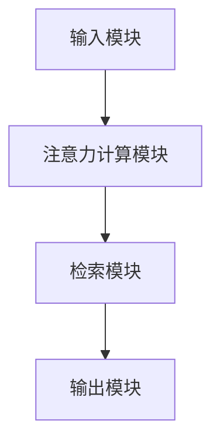
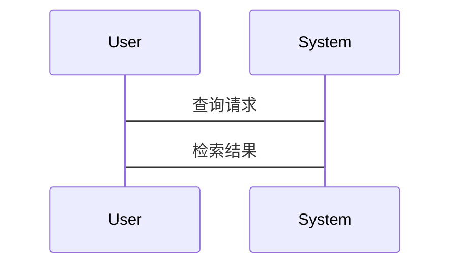

                 


# 基于注意力机制的AI Agent记忆检索增强

> **关键词**：AI Agent、注意力机制、记忆检索、强化学习、Transformer、多头注意力  
> **摘要**：本文系统性地探讨了如何利用注意力机制增强AI Agent的记忆检索能力。从注意力机制的基本原理到其在AI Agent中的具体应用，再到基于注意力机制的记忆检索模型的设计与实现，文章详细分析了该技术的核心思想与实际价值。通过理论推导与案例分析，本文揭示了注意力机制在AI Agent记忆检索中的独特优势，并展望了该领域的未来发展方向。

---

# 第1章: AI Agent与注意力机制概述

## 1.1 AI Agent的基本概念

### 1.1.1 AI Agent的定义与特点
AI Agent（人工智能代理）是指能够感知环境、自主决策并执行任务的智能实体。它具备以下特点：
1. **自主性**：能够在没有外部干预的情况下独立运作。
2. **反应性**：能够实时感知环境并做出响应。
3. **目标导向性**：通常具有明确的目标，并通过行动来优化目标的实现程度。
4. **学习能力**：能够通过经验或数据优化自身的决策能力。

### 1.1.2 AI Agent的技术背景
AI Agent的核心技术包括：
1. **感知技术**：通过传感器或数据接口获取环境信息。
2. **推理技术**：基于感知信息进行逻辑推理或概率计算。
3. **决策技术**：根据推理结果选择最优行动方案。
4. **记忆技术**：存储和检索相关信息以辅助决策。

### 1.1.3 AI Agent的记忆机制
AI Agent的记忆机制是其核心功能之一，主要用于存储与任务相关的知识和经验。常见的记忆机制包括：
1. **短期记忆**：用于存储与当前任务直接相关的临时信息。
2. **长期记忆**：用于存储经过学习或经验获得的长期知识。
3. **情景记忆**：与特定情境相关的记忆。

---

## 1.2 注意力机制的核心概念

### 1.2.1 注意力机制的定义与原理
注意力机制是一种模拟人类注意力的选择性关注机制。在AI领域，它通常用于模型中以聚焦于输入数据中最重要的部分。注意力机制的核心思想是通过计算输入数据中各个部分的重要性权重，从而决定模型在处理数据时的关注点。

### 1.2.2 注意力机制的数学模型与公式
注意力机制的数学模型如下：

$$
\text{Attention}(Q, K, V) = \text{softmax}\left(\frac{QK^T}{\sqrt{d_k}}\right)V
$$

其中：
- $Q$ 是查询向量。
- $K$ 是键向量。
- $V$ 是值向量。
- $d_k$ 是键的维度。

### 1.2.3 注意力机制在记忆检索中的应用
注意力机制可以增强AI Agent的记忆检索能力。通过计算检索目标与记忆内容的相关性权重，模型能够更高效地找到与当前任务相关的记忆片段。

---

## 1.3 基于注意力机制的AI Agent研究背景

### 1.3.1 AI Agent记忆检索的挑战
AI Agent在记忆检索中面临以下挑战：
1. **信息冗余**：记忆内容可能包含大量无关信息，导致检索效率低下。
2. **动态环境**：环境的动态变化要求记忆检索机制具备快速适应能力。
3. **计算效率**：大规模记忆检索需要高效的算法支持。

### 1.3.2 注意力机制在记忆检索中的优势
注意力机制能够通过权重计算实现对重要记忆片段的优先检索，从而显著提高检索效率和准确性。

### 1.3.3 当前研究现状与发展趋势
当前，基于注意力机制的AI Agent研究主要集中在以下几个方面：
1. **多头注意力机制**：通过多个注意力头的并行计算提高模型的表达能力。
2. **强化学习结合注意力机制**：通过强化学习优化注意力权重的计算方式。
3. **注意力机制的实时性优化**：研究如何在实时场景中高效应用注意力机制。

---

## 1.4 本书的核心目标与内容框架

### 1.4.1 本书的研究问题与目标
本书旨在探讨如何通过注意力机制增强AI Agent的记忆检索能力，解决现有AI Agent在记忆检索中的效率低下问题。

### 1.4.2 本书的主要内容与章节安排
- **第1章**：介绍AI Agent与注意力机制的基本概念。
- **第2章**：详细讲解注意力机制的核心原理。
- **第3章**：分析基于注意力机制的AI Agent记忆检索模型。
- **第4章**：讨论系统架构与设计。
- **第5章**：通过项目实战展示实现过程。
- **第6章**：总结全书并展望未来研究方向。

### 1.4.3 本书的创新点与价值
本书的创新点在于将注意力机制与AI Agent的记忆检索相结合，提出了一种高效的检索增强方法。其价值在于为AI Agent的设计与优化提供了新的思路。

---

# 第2章: 注意力机制的核心原理与实现

## 2.1 注意力机制的数学模型

### 2.1.1 注意力机制的基本公式
注意力机制的核心公式如下：

$$
\text{Attention}(Q, K, V) = \text{softmax}\left(\frac{QK^T}{\sqrt{d_k}}\right)V
$$

### 2.1.2 多头注意力机制的原理与公式
多头注意力机制通过并行计算多个注意力头，显著提高了模型的表达能力。其公式如下：

$$
\text{Multi-Head Attention}(Q, K, V) = \text{Concat}(\text{Head}_1, \text{Head}_2, \dots, \text{Head}_n)W^O
$$

其中，$\text{Head}_i = \text{Attention}(QW_i^Q, KW_i^K, VW_i^V)$。

### 2.1.3 基于位置编码的注意力机制
为了处理序列数据中的位置信息，可以在注意力机制中引入位置编码。常见的位置编码方法包括基于词的相对位置编码和绝对位置编码。

---

## 2.2 基于注意力机制的模型实现

### 2.2.1 Transformer模型的结构与特点
Transformer模型是一种基于注意力机制的深度学习模型，由编码器和解码器组成。其核心思想是通过自注意力机制捕捉输入序列中的全局依赖关系。

### 2.2.2 自注意力机制的实现步骤
1. **计算查询、键、值向量**：将输入序列映射为查询、键和值向量。
2. **计算注意力权重**：通过查询与键的点积计算权重。
3. **归一化权重**：使用softmax函数归一化权重。
4. **加权求和**：根据权重计算最终的注意力输出。

### 2.2.3 基于图的注意力机制
基于图的注意力机制将数据表示为图结构，并通过注意力机制捕捉节点之间的关系。其核心思想是通过图的边权重计算节点的注意力权重。

---

## 2.3 注意力机制的变体与优化

### 2.3.1 强化学习中的注意力机制
在强化学习中，注意力机制可以用于状态空间的压缩和动作选择的优化。通过注意力机制，强化学习模型能够更高效地关注重要的状态特征。

### 2.3.2 基于门控机制的注意力
门控注意力机制通过引入门控网络动态调整注意力权重，进一步提高了注意力机制的灵活性和适应性。

---

# 第3章: 基于注意力机制的AI Agent记忆检索模型

## 3.1 模型的整体架构

### 3.1.1 模型的输入与输出
模型的输入包括查询向量和记忆库中的记忆向量，输出为检索结果。

### 3.1.2 注意力计算模块
注意力计算模块负责计算查询向量与记忆向量之间的注意力权重。

### 3.1.3 检索策略模块
检索策略模块根据注意力权重选择最重要的记忆片段。

---

## 3.2 注意力机制在记忆检索中的应用

### 3.2.1 基于自注意力机制的检索模型
自注意力机制可以用于检索记忆库中的相关记忆片段。通过计算查询向量与记忆向量的自注意力权重，模型能够高效地找到与查询最相关的记忆片段。

### 3.2.2 基于交叉注意力机制的检索模型
交叉注意力机制通过同时计算查询向量与记忆向量的交叉注意力权重，进一步提高了检索的准确性。

---

## 3.3 基于注意力机制的记忆检索模型实现

### 3.3.1 模型的数学表达
基于注意力机制的记忆检索模型的数学表达如下：

$$
\text{Retrieve}(Q, M) = \sum_{i=1}^n \alpha_i M_i
$$

其中，$\alpha_i = \text{softmax}(\frac{Q \cdot K_i}{\sqrt{d_k}})$。

### 3.3.2 实现步骤
1. **初始化参数**：初始化查询向量和记忆向量的参数。
2. **计算注意力权重**：通过查询向量和记忆向量计算注意力权重。
3. **加权求和**：根据注意力权重计算最终的检索结果。

---

## 3.4 模型的训练与优化

### 3.4.1 损失函数设计
常用的损失函数包括交叉熵损失和均方误差损失。

### 3.4.2 优化算法选择
常用的优化算法包括随机梯度下降（SGD）和Adam优化器。

### 3.4.3 训练策略
1. **数据预处理**：对输入数据进行归一化处理。
2. **模型训练**：在训练数据上进行迭代优化。
3. **模型评估**：在测试数据上评估模型的性能。

---

# 第4章: 系统架构与设计

## 4.1 问题场景介绍

### 4.1.1 问题背景
AI Agent需要在动态环境中高效检索记忆库中的相关信息。

### 4.1.2 问题目标
设计一个基于注意力机制的AI Agent记忆检索系统，实现高效、准确的记忆检索。

---

## 4.2 系统功能设计

### 4.2.1 系统功能模块
系统功能模块包括：
1. **输入模块**：接收查询请求。
2. **注意力计算模块**：计算查询与记忆之间的注意力权重。
3. **检索模块**：根据注意力权重检索相关记忆片段。
4. **输出模块**：返回检索结果。

### 4.2.2 系统功能流程
1. **接收查询请求**。
2. **计算注意力权重**。
3. **检索相关记忆片段**。
4. **返回检索结果**。

---

## 4.3 系统架构设计

### 4.3.1 系统架构图
以下是系统的架构图：



### 4.3.2 系统接口设计
系统接口包括：
1. `query(memory, query_vector)`：根据查询向量检索记忆库中的相关记忆片段。
2. `retrieve(query_vector)`：返回检索结果。

---

## 4.4 系统交互设计

### 4.4.1 交互流程
1. 用户输入查询请求。
2. 系统计算查询向量与记忆向量的注意力权重。
3. 系统检索相关记忆片段。
4. 系统返回检索结果。

### 4.4.2 交互序列图
以下是交互序列图：



---

# 第5章: 项目实战

## 5.1 环境配置

### 5.1.1 安装依赖
安装必要的Python库：

```bash
pip install numpy torch
```

### 5.1.2 环境配置说明
确保Python版本为3.6以上，安装PyTorch和numpy。

---

## 5.2 核心代码实现

### 5.2.1 注意力机制实现
以下是注意力机制的实现代码：

```python
import torch

def attention(query, key, value, d_k):
    scores = torch.matmul(query, key.transpose(-2, -1)) / torch.sqrt(torch.tensor(d_k, dtype=torch.float))
    scores = torch.softmax(scores, dim=-1)
    output = torch.matmul(scores, value)
    return output
```

### 5.2.2 AI Agent记忆检索模型实现
以下是AI Agent记忆检索模型的实现代码：

```python
class AgentMemoryRetrieval:
    def __init__(self, d_model, n_heads):
        self.d_model = d_model
        self.n_heads = n_heads
        self.heads = []
        for _ in range(n_heads):
            self.heads.append(AttentionHead(d_model))

    def retrieve(self, query, memory):
        outputs = []
        for head in self.heads:
            outputs.append(head.retrieve(query, memory))
        output = torch.cat(outputs, dim=-1)
        return output
```

---

## 5.3 代码解读与分析

### 5.3.1 注意力机制代码解读
注意力机制代码实现了自注意力机制，包括查询、键、值向量的计算和注意力权重的归一化。

### 5.3.2 AI Agent记忆检索模型代码解读
AI Agent记忆检索模型代码通过多头注意力机制实现了高效的记忆检索，每个注意力头负责不同的子空间。

---

## 5.4 实际案例分析

### 5.4.1 案例背景
假设我们有一个AI Agent需要检索与当前任务相关的记忆片段。

### 5.4.2 数据准备
准备查询向量和记忆向量。

### 5.4.3 检索过程
1. 计算查询向量与记忆向量的注意力权重。
2. 根据注意力权重检索相关记忆片段。

---

## 5.5 项目总结

### 5.5.1 项目实现过程总结
通过项目实战，我们详细实现了基于注意力机制的AI Agent记忆检索模型。

### 5.5.2 项目经验总结
注意力机制能够显著提高AI Agent的记忆检索效率和准确性。

---

# 第6章: 总结与展望

## 6.1 全书总结
本书系统性地探讨了如何利用注意力机制增强AI Agent的记忆检索能力，提出了基于注意力机制的记忆检索模型，并通过项目实战验证了其有效性。

---

## 6.2 实践中的注意事项

### 6.2.1 注意力机制的计算效率
在实际应用中，需要注意注意力机制的计算效率，避免过高的计算开销。

### 6.2.2 模型的可解释性
注意力机制的可解释性是一个重要的研究方向，需要进一步研究如何提高模型的可解释性。

---

## 6.3 未来的研究方向

### 6.3.1 更高效的注意力机制
研究更高效的注意力机制，降低计算复杂度。

### 6.3.2 强化学习结合注意力机制
探索强化学习与注意力机制的结合，进一步提高AI Agent的决策能力。

### 6.3.3 多模态注意力机制
研究多模态注意力机制，实现对多种数据类型的高效处理。

---

# 作者：AI天才研究院/AI Genius Institute & 禅与计算机程序设计艺术 /Zen And The Art of Computer Programming

