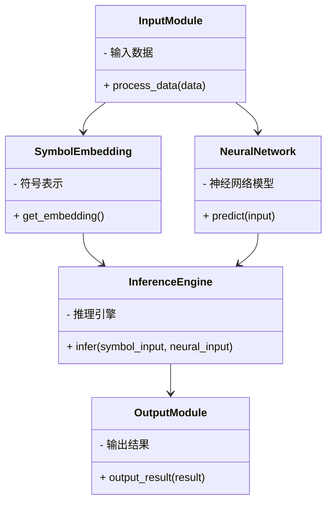
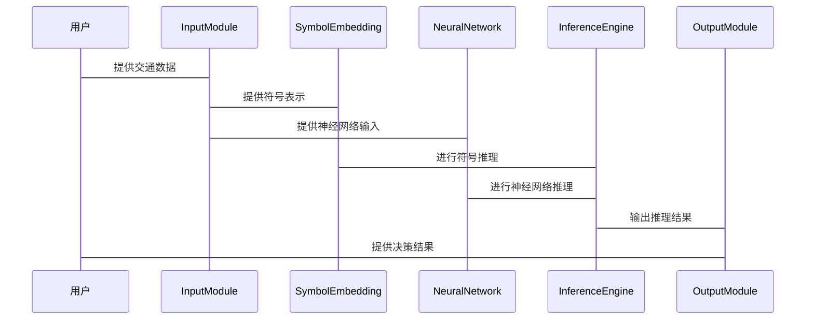

                 


# 基于神经符号AI的AI Agent可解释性决策

> 关键词：神经符号AI，AI Agent，可解释性决策，符号推理，神经网络结合

> 摘要：本文探讨了基于神经符号AI的AI Agent在可解释性决策中的应用。首先介绍了神经符号AI的基本概念和核心原理，接着分析了可解释性决策的重要性及其在实际场景中的应用。随后，详细讲解了神经符号AI的算法实现、系统架构设计以及项目实战。最后，总结了神经符号AI的优势和未来发展方向。

---

# 第一部分: 神经符号AI与AI Agent概述

## 第1章: 神经符号AI的背景与概念

### 1.1 神经符号AI的定义与特点

#### 1.1.1 神经符号AI的基本概念
神经符号AI（Neural-Symbolic AI）是一种结合了符号推理和神经网络的人工智能方法。它通过符号表示和神经网络的感知能力，实现了对复杂问题的推理和决策。神经符号AI的优势在于其可解释性和灵活性，能够处理涉及知识和逻辑推理的任务。

#### 1.1.2 神经符号AI的核心特点
- **可解释性**：神经符号AI结合了符号推理，使得决策过程更加透明和可解释。
- **灵活性**：能够处理结构化和非结构化的数据，适应多种应用场景。
- **知识表示**：通过符号表示，可以更好地利用先验知识和逻辑推理。

#### 1.1.3 神经符号AI与传统符号AI的区别
神经符号AI结合了符号推理和神经网络，弥补了传统符号AI在处理感知任务中的不足，同时保持了符号推理的可解释性。

| 特性 | 神经符号AI | 传统符号AI |
|------|------------|------------|
| 数据处理 | 结构化与非结构化数据 | 主要处理结构化数据 |
| 可解释性 | 高 | 高 |
| 知识表示 | 符号与神经网络结合 | 单纯符号表示 |
| 任务类型 | 多领域，包括感知任务 | 主要处理逻辑推理任务 |

### 1.2 AI Agent的基本概念与分类

#### 1.2.1 AI Agent的定义
AI Agent（智能体）是指能够感知环境、做出决策并采取行动以实现目标的智能系统。它可以是一个软件程序或物理设备，通过与环境交互来完成特定任务。

#### 1.2.2 AI Agent的分类
AI Agent可以根据智能水平、决策方式和应用场景进行分类：

1. **按智能水平**：
   - **反应式AI Agent**：基于当前感知做出反应，无内部状态。
   - **认知式AI Agent**：具备复杂推理和规划能力，有内部状态和目标。
   
2. **按决策方式**：
   - **基于规则的AI Agent**：根据预定义规则进行决策。
   - **基于学习的AI Agent**：通过机器学习模型进行决策。
   - **混合式AI Agent**：结合规则和学习方法。

3. **按应用场景**：
   - **服务机器人**：用于客户服务、智能家居等。
   - **自动驾驶**：用于车辆控制和导航。
   - **推荐系统**：用于个性化推荐。

#### 1.2.3 神经符号AI在AI Agent中的作用
神经符号AI为AI Agent提供了强大的知识表示和推理能力，使其在复杂环境中能够做出可解释的决策。神经符号AI结合了神经网络的感知能力和符号推理的逻辑能力，适用于需要透明性和可信度的场景。

---

## 第2章: 可解释性决策的重要性

### 2.1 可解释性决策的定义
可解释性决策是指决策过程和结果能够被人类理解和解释。在AI Agent中，可解释性决策意味着用户能够理解AI的决策依据和推理过程，从而增强对系统的信任和接受度。

### 2.2 神经符号AI在可解释性决策中的优势
神经符号AI通过符号推理提供了决策过程的可解释性，同时神经网络的感知能力使其能够处理复杂的感知任务。

#### 2.2.1 符号推理的优势
- **透明性**：符号推理的决策过程是可解释的，用户可以理解AI的推理逻辑。
- **可验证性**：符号推理的决策可以通过逻辑规则进行验证，确保决策的正确性。
- **知识可编程性**：符号推理的知识可以被编程和修改，适应不同的应用场景。

#### 2.2.2 神经符号AI在AI Agent中的应用
神经符号AI在AI Agent中的应用主要体现在以下几个方面：
- **知识表示**：通过符号表示，AI Agent能够理解和处理知识。
- **推理与决策**：结合符号推理和神经网络，AI Agent能够做出复杂决策。
- **人机交互**：可解释性决策使得AI Agent与人类用户的交互更加自然和可信。

### 2.3 可解释性决策的实际应用案例

#### 2.3.1 医疗领域
在医疗领域，可解释性决策可以帮助医生理解AI诊断系统的推理过程，从而提高诊断的准确性和可靠性。例如，基于神经符号AI的诊断系统可以通过符号推理展示诊断依据，帮助医生进行决策。

#### 2.3.2 金融领域
在金融领域，可解释性决策可以帮助分析师理解AI的交易策略和风险评估过程。神经符号AI可以通过符号推理展示交易决策的逻辑，提高交易的透明性和可信度。

#### 2.3.3 智能交通系统
在智能交通系统中，可解释性决策可以帮助交通管理部门理解AI的交通流量预测和优化策略。神经符号AI可以通过符号推理展示预测依据，提高交通管理的效率和透明性。

---

# 第二部分: 神经符号AI的核心原理

## 第3章: 神经符号AI的核心概念与原理

### 3.1 符号表示与推理

#### 3.1.1 符号表示的基本概念
符号表示是神经符号AI的核心基础，通过符号表示，AI能够理解和处理知识。符号表示可以是逻辑符号、概念、规则等形式。

#### 3.1.2 推理机制
推理机制是基于符号表示的逻辑推理过程。神经符号AI支持多种推理方式，如逻辑推理、演绎推理和归纳推理。

#### 3.1.3 知识表示的层次化结构
知识表示的层次化结构使得符号推理更加高效和灵活。层次化结构包括概念层、规则层和实例层，分别表示知识的不同层次。

### 3.2 神经网络与符号推理的结合

#### 3.2.1 神经网络的基本原理
神经网络通过多层感知器对输入数据进行特征提取和分类。神经符号AI结合神经网络的特征提取能力，提升符号推理的感知能力。

#### 3.2.2 神经符号AI的结合方式
神经符号AI可以通过以下方式结合符号推理和神经网络：
- **符号嵌入**：将符号表示嵌入到神经网络中，增强神经网络的语义理解能力。
- **符号规则嵌入**：将符号规则嵌入到神经网络中，指导神经网络的特征提取过程。
- **符号增强的神经网络**：通过符号推理对神经网络的输出进行增强，提升决策的可解释性。

#### 3.2.3 神经符号AI的数学模型
神经符号AI的数学模型结合了符号推理和神经网络的特征提取能力。模型的输入是符号表示和感知数据，输出是推理结果和决策。

$$
\text{决策} = f_{\text{符号}}(f_{\text{神经}}(\text{输入}))
$$

### 3.3 神经符号AI的核心算法

#### 3.3.1 符号化表示的实现
符号化表示的实现过程如下：
1. **知识表示**：将知识表示为符号形式，如逻辑规则、概念层次。
2. **符号嵌入**：将符号表示嵌入到向量空间中，形成符号向量。
3. **特征提取**：通过神经网络提取输入数据的特征向量。
4. **符号推理**：基于符号向量和特征向量，进行逻辑推理，生成决策结果。

#### 3.3.2 神经符号AI的推理算法
神经符号AI的推理算法可以通过以下步骤实现：
1. **输入处理**：将输入数据进行预处理，提取特征向量。
2. **符号嵌入**：将符号表示嵌入到向量空间中，形成符号向量。
3. **符号推理**：基于符号向量和特征向量，进行逻辑推理，生成推理结果。
4. **决策输出**：将推理结果输出为决策结果。

#### 3.3.3 神经符号AI的优化算法
神经符号AI的优化算法可以通过以下步骤实现：
1. **损失函数设计**：设计损失函数，将符号推理的正确性作为优化目标。
2. **模型训练**：通过反向传播优化模型参数，提升符号推理的准确性。
3. **推理优化**：通过优化符号推理算法，提升推理速度和准确性。

---

## 第4章: 神经符号AI的核心算法实现

### 4.1 符号化表示的实现

#### 4.1.1 符号化表示的数学模型
符号化表示的数学模型如下：
$$
f_{\text{符号}}(x) = \text{符号推理}(x)
$$

#### 4.1.2 符号化表示的实现步骤
符号化表示的实现步骤如下：
1. **知识表示**：将知识表示为符号形式，如逻辑规则、概念层次。
2. **符号嵌入**：将符号表示嵌入到向量空间中，形成符号向量。
3. **符号推理**：基于符号向量进行逻辑推理，生成推理结果。

#### 4.1.3 符号化表示的代码实现
以下是符号化表示的Python代码实现示例：
```python
class SymbolEmbedding:
    def __init__(self, symbols):
        self.symbols = symbols
        self.embedding = self._create_embedding()
    
    def _create_embedding(self):
        # 创建符号嵌入向量
        return {symbol: np.random.rand(10) for symbol in self.symbols}
```

### 4.2 神经符号AI的推理算法

#### 4.2.1 推理算法的数学模型
推理算法的数学模型如下：
$$
f_{\text{推理}}(x, y) = \text{逻辑推理}(x, y)
$$

#### 4.2.2 推理算法的实现步骤
推理算法的实现步骤如下：
1. **输入处理**：接收输入数据，进行预处理。
2. **符号嵌入**：将符号表示嵌入到向量空间中，形成符号向量。
3. **符号推理**：基于符号向量和输入数据，进行逻辑推理，生成推理结果。

#### 4.2.3 推理算法的代码实现
以下是推理算法的Python代码实现示例：
```python
class NeuralSymbolicInference:
    def __init__(self, symbols):
        self.symbols = symbols
        self.neural_network = self._build_neural_network()
    
    def _build_neural_network(self):
        # 构建神经网络模型
        model = tf.keras.Sequential([
            tf.keras.layers.Dense(128, activation='relu'),
            tf.keras.layers.Dense(len(self.symbols), activation='softmax')
        ])
        return model
```

### 4.3 神经符号AI的优化算法

#### 4.3.1 优化算法的数学模型
优化算法的数学模型如下：
$$
L = \sum_{i=1}^{n} (y_i - \hat{y}_i)^2
$$

#### 4.3.2 优化算法的实现步骤
优化算法的实现步骤如下：
1. **损失函数设计**：设计损失函数，将符号推理的正确性作为优化目标。
2. **模型训练**：通过反向传播优化模型参数，提升符号推理的准确性。
3. **推理优化**：通过优化符号推理算法，提升推理速度和准确性。

#### 4.3.3 优化算法的代码实现
以下是优化算法的Python代码实现示例：
```python
def train_model(model, X_train, y_train, X_val, y_val):
    model.compile(optimizer='adam', loss='categorical_crossentropy', metrics=['accuracy'])
    history = model.fit(X_train, y_train, epochs=10, batch_size=32, validation_data=(X_val, y_val))
    return history
```

---

# 第三部分: 神经符号AI的系统分析与架构设计

## 第5章: 系统分析与架构设计

### 5.1 问题场景介绍
在智能交通系统中，AI Agent需要根据实时交通数据和历史知识进行交通流量预测和路径规划。为了提高决策的透明性和可信度，需要设计一个基于神经符号AI的AI Agent系统。

### 5.2 系统功能设计

#### 5.2.1 领域模型
领域模型通过Mermaid类图展示系统的组成部分和交互关系。



### 5.3 系统架构设计

#### 5.3.1 系统架构图
系统架构图通过Mermaid架构图展示系统的组成部分和交互关系。


### 5.4 系统接口设计

#### 5.4.1 输入接口
系统输入接口主要接收交通数据和用户请求，包括实时交通数据和历史知识。

#### 5.4.2 输出接口
系统输出接口主要输出推理结果和决策结果，包括交通流量预测和路径规划。

### 5.5 系统交互流程

#### 5.5.1 交互流程图
系统交互流程图通过Mermaid序列图展示系统的交互过程。



---

# 第四部分: 项目实战

## 第6章: 项目实战

### 6.1 环境安装

#### 6.1.1 环境要求
- Python 3.7+
- TensorFlow 2.0+
- Mermaid 1.0+

#### 6.1.2 安装依赖
```bash
pip install tensorflow pandas numpy mermaid
```

### 6.2 系统核心实现

#### 6.2.1 符号化表示的实现
以下是符号化表示的Python代码实现示例：

```python
class SymbolEmbedding:
    def __init__(self, symbols):
        self.symbols = symbols
        self.embedding = self._create_embedding()
    
    def _create_embedding(self):
        # 创建符号嵌入向量
        return {symbol: np.random.rand(10) for symbol in self.symbols}
```

#### 6.2.2 推理算法的实现
以下是推理算法的Python代码实现示例：

```python
class NeuralSymbolicInference:
    def __init__(self, symbols):
        self.symbols = symbols
        self.neural_network = self._build_neural_network()
    
    def _build_neural_network(self):
        # 构建神经网络模型
        model = tf.keras.Sequential([
            tf.keras.layers.Dense(128, activation='relu'),
            tf.keras.layers.Dense(len(self.symbols), activation='softmax')
        ])
        return model
```

### 6.3 代码应用解读与分析

#### 6.3.1 代码解读
- **SymbolEmbedding类**：负责符号表示的嵌入。
- **NeuralSymbolicInference类**：负责神经符号AI的推理过程。

#### 6.3.2 代码实现的数学模型
- **符号嵌入**：将符号表示嵌入到向量空间中，形成符号向量。
- **神经网络**：通过神经网络模型进行特征提取和分类。

### 6.4 实际案例分析

#### 6.4.1 案例分析
在智能交通系统中，基于神经符号AI的AI Agent可以通过符号推理和神经网络的结合，实现交通流量预测和路径规划的可解释性决策。

#### 6.4.2 代码实现与分析
通过代码实现和分析，可以验证神经符号AI在交通系统中的实际应用效果和可解释性。

### 6.5 项目小结
项目实战部分通过具体的实现案例，展示了神经符号AI在AI Agent中的实际应用，验证了其在可解释性决策中的优势。

---

# 第五部分: 最佳实践与总结

## 第7章: 最佳实践与总结

### 7.1 小结
神经符号AI通过结合符号推理和神经网络，实现了AI Agent的可解释性决策。本文详细介绍了神经符号AI的核心概念、算法实现和系统架构，并通过项目实战展示了其实际应用。

### 7.2 注意事项
- 神经符号AI的实现需要结合符号推理和神经网络的优化。
- 在实际应用中，需要根据具体场景选择合适的符号表示和推理方法。

### 7.3 拓展阅读
建议读者进一步阅读神经符号AI的相关文献，了解其在不同领域的应用和发展趋势。

---

# 结语

神经符号AI为AI Agent的可解释性决策提供了强大的理论和实践基础。通过结合符号推理和神经网络，神经符号AI能够在保持高准确性的同时，提供透明和可信的决策过程。未来，随着神经符号AI技术的不断发展，其在更多领域的应用将展现出更大的潜力。

---

作者：AI天才研究院/AI Genius Institute & 禅与计算机程序设计艺术 /Zen And The Art of Computer Programming

