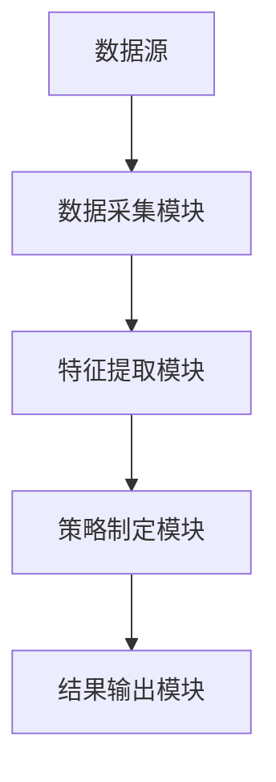
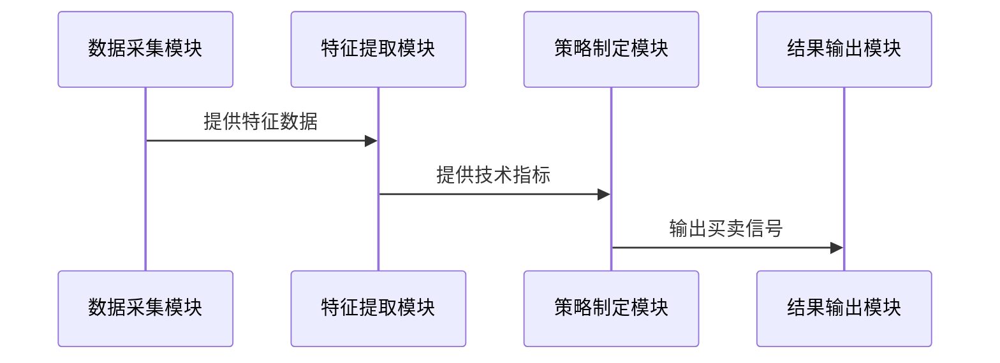

                 


# 多智能体强化学习优化价值投资的买入和卖出时机

## 关键词：
多智能体强化学习、价值投资、股票交易、买入时机、卖出时机、优化策略

## 摘要：
本文深入探讨了多智能体强化学习在优化价值投资买入和卖出时机中的应用。通过分析多智能体系统与强化学习的结合，提出了一个基于多智能体强化学习的股票交易优化模型，该模型能够有效识别股票买卖的最佳时机，从而提高投资收益。文章从理论基础、算法原理、系统架构到实际案例进行了全面分析，为价值投资者和人工智能研究者提供了新的思路和方法。

---

## 第一部分: 多智能体强化学习与价值投资的结合

### 第1章: 多智能体强化学习的背景与基础

#### 1.1 多智能体强化学习的背景
##### 1.1.1 多智能体系统的基本概念
多智能体系统（Multi-Agent System, MAS）是由多个智能体组成的复杂系统，这些智能体通过协作或竞争完成特定任务。智能体具有自主性、反应性、目标导向性和社会性等特点。多智能体系统的应用场景广泛，包括机器人控制、交通管理、金融投资等。

##### 1.1.2 强化学习的基本原理
强化学习（Reinforcement Learning, RL）是一种机器学习范式，通过智能体与环境的交互，学习策略以最大化累计奖励。智能体通过选择动作、观察状态和接收奖励来更新策略。

##### 1.1.3 多智能体强化学习的优势
多智能体强化学习结合了多智能体系统和强化学习的优势，能够在复杂环境中实现更高效的决策。多个智能体可以通过协作优化整体性能，同时也能通过竞争提高决策的鲁棒性。

#### 1.2 价值投资的基本原理
##### 1.2.1 价值投资的核心理念
价值投资是一种投资策略，核心在于寻找市场价格低于其内在价值的股票。投资者通过分析公司的基本面（如财务状况、盈利能力、行业地位等）来判断股票的长期价值。

##### 1.2.2 股票买卖时机的重要性
股票买卖时机的决策直接影响投资收益。买入时机的选择需要考虑市场趋势、公司业绩、行业动态等因素，而卖出时机则需要根据市场波动、目标收益等进行判断。

##### 1.2.3 价值投资与技术分析的结合
价值投资通常依赖于基本面分析，但结合技术分析（如K线图、均线、成交量等）可以更精准地判断买卖时机。多智能体强化学习可以通过分析技术指标和市场情绪，辅助价值投资者做出更科学的决策。

---

### 第2章: 多智能体强化学习的核心概念

#### 2.1 多智能体系统的基本结构
##### 2.1.1 多智能体系统的组成要素
多智能体系统由多个智能体、环境、通信机制和协作协议组成。每个智能体都有自己的目标和决策机制，通过与环境和其他智能体的交互完成任务。

##### 2.1.2 多智能体系统的通信机制
智能体之间的通信是多智能体系统的重要组成部分。通信机制可以是直接的信息交换（如共享状态），也可以是通过中间媒介（如消息队列）进行间接通信。

##### 2.1.3 多智能体系统的协作与竞争关系
在多智能体系统中，智能体可以协作完成共同目标，也可以竞争有限资源。协作与竞争的关系取决于任务的性质和环境的设定。

#### 2.2 强化学习的基本原理
##### 2.2.1 强化学习的定义与特点
强化学习通过智能体与环境的交互，学习策略以最大化累计奖励。与监督学习不同，强化学习不需要标签数据，而是通过奖励信号指导学习过程。

##### 2.2.2 状态、动作、奖励的定义
- **状态（State）**：智能体所处的环境信息，如当前股价、市场情绪等。
- **动作（Action）**：智能体在给定状态下选择的操作，如买入、卖出或持有股票。
- **奖励（Reward）**：智能体执行动作后获得的反馈，通常表示该动作的优劣。

#### 2.3 多智能体强化学习的核心要素
##### 2.3.1 多智能体的协作策略
多智能体可以通过协作策略优化整体表现。例如，一个智能体负责分析技术指标，另一个智能体负责分析市场情绪，共同决定买卖时机。

##### 2.3.2 多智能体的通信协议
智能体之间的通信需要遵循特定的协议，以确保信息的有效传递和处理。通信协议可以是简单的消息传递，也可以是复杂的协议栈。

##### 2.3.3 多智能体的决策机制
多智能体的决策机制可以是集中式或分散式。集中式决策由一个中心智能体统一决策，分散式决策则由多个智能体独立决策后汇总结果。

---

### 第3章: 多智能体强化学习的算法原理

#### 3.1 基于Q-learning的多智能体算法
##### 3.1.1 Q-learning算法的数学模型
Q-learning的核心思想是通过Q值表记录状态-动作对的期望收益。Q值更新公式为：
$$ Q(s, a) = Q(s, a) + \alpha (r + \gamma \max Q(s', a') - Q(s, a)) $$
其中，$\alpha$ 是学习率，$\gamma$ 是折扣因子。

##### 3.1.2 多智能体Q-learning的实现流程
1. 初始化Q值表。
2. 每个智能体根据当前状态选择动作。
3. 执行动作，观察新状态和奖励。
4. 更新Q值表。
5. 重复上述步骤直到达到终止条件。

##### 3.1.3 多智能体Q-learning的优缺点
- **优点**：简单易实现，适合离散动作空间。
- **缺点**：在连续状态空间中表现较差，且智能体之间可能存在协调问题。

#### 3.2 基于Actor-Critic的多智能体算法
##### 3.2.1 Actor-Critic算法的基本原理
Actor-Critic算法同时维护策略（Actor）和价值函数（Critic）。Actor负责选择动作，Critic负责评估状态的价值。更新公式为：
$$ \theta_{\text{Actor}} \leftarrow \theta_{\text{Actor}} + \alpha (Q(s, a) - Q(s, \pi_\theta(s))) \cdot \nabla \pi_\theta(s,a) $$
$$ \theta_{\text{Critic}} \leftarrow \theta_{\text{Critic}} + \alpha (r + \gamma V(s') - V(s)) \cdot \nabla V(s) $$

##### 3.2.2 多智能体Actor-Critic的实现流程
1. 初始化策略网络和价值网络。
2. 每个智能体根据当前状态选择动作。
3. 执行动作，观察新状态和奖励。
4. 更新策略网络和价值网络。
5. 重复上述步骤直到达到终止条件。

##### 3.2.3 多智能体Actor-Critic的优缺点
- **优点**：适合连续动作空间，学习效率较高。
- **缺点**：实现复杂，需要协调多个智能体的策略。

#### 3.3 其他多智能体强化学习算法
##### 3.3.1 集中式强化学习算法
集中式算法将所有智能体的决策集中到一个中心节点，统一进行策略优化。

##### 3.3.2 分散式强化学习算法
分散式算法允许每个智能体独立决策，通过局部信息更新策略。

##### 3.3.3 混合式强化学习算法
混合式算法结合集中式和分散式的优势，适用于复杂任务。

---

### 第4章: 价值投资中的数学模型与公式

#### 4.1 价值投资的数学模型
##### 4.1.1 股票价值的评估公式
股票的内在价值可以通过基本面分析公式计算，例如：
$$ \text{内在价值} = \frac{\text{净利润} \times (1 + g)}{r - g} $$
其中，$g$ 是净利润增长率，$r$ 是贴现率。

##### 4.1.2 股票价格与内在价值的关系
股票价格通常围绕内在价值波动。当价格低于内在价值时，可能是买入时机；当价格远高于内在价值时，可能是卖出时机。

##### 4.1.3 股票买卖时机的数学表达
买卖时机可以通过以下公式判断：
$$ \text{买入信号} = \text{价格} < \text{内在价值} $$
$$ \text{卖出信号} = \text{价格} > \text{内在价值} \times (1 + \text{目标收益}) $$

#### 4.2 多智能体强化学习的数学模型
##### 4.2.1 多智能体状态空间的定义
状态空间可以包括多个指标，例如：
$$ s = (s_1, s_2, ..., s_n) $$
其中，$s_i$ 表示第$i$个智能体的当前状态。

##### 4.2.2 多智能体动作空间的定义
动作空间可以包括买入、卖出或持有股票，例如：
$$ a \in \{0, 1, 2\} $$
其中，$0$ 表示卖出，$1$ 表示持有，$2$ 表示买入。

##### 4.2.3 多智能体奖励函数的设计
奖励函数需要根据实际需求设计，例如：
$$ r = \text{最终收益} - \text{初始投资} $$

---

### 第5章: 系统分析与架构设计方案

#### 5.1 价值投资优化系统的需求分析
##### 5.1.1 系统目标与范围
系统目标是通过多智能体强化学习优化股票买卖时机，提高投资收益。范围包括数据采集、策略制定和结果输出。

##### 5.1.2 系统功能需求
- 数据采集：获取股票价格、财务数据等。
- 策略制定：基于多智能体强化学习制定买卖策略。
- 结果输出：输出买卖信号和收益报告。

##### 5.1.3 系统性能需求
- 响应时间：实时或准实时处理。
- 精确度：买卖信号的准确率和收益最大化。

#### 5.2 系统架构设计
##### 5.2.1 问题场景介绍
在股票交易中，多智能体需要协作分析技术指标、市场情绪等信息，制定最优买卖策略。

##### 5.2.2 项目介绍
本项目旨在通过多智能体强化学习优化价值投资的买卖时机，实现自动化交易策略。

##### 5.2.3 系统功能设计
- 数据采集模块：负责采集股票数据和市场信息。
- 特征提取模块：提取技术指标和基本面数据。
- 策略制定模块：基于强化学习算法制定买卖策略。
- 结果输出模块：输出买卖信号和收益报告。

##### 5.2.4 系统架构图


##### 5.2.5 系统接口设计
- 数据接口：与数据源对接，获取实时数据。
- 策略接口：与其他系统或交易平台对接，执行买卖操作。

##### 5.2.6 系统交互序列图


---

### 第6章: 项目实战

#### 6.1 环境安装与配置
##### 6.1.1 环境搭建
- 安装Python、TensorFlow、Keras等框架。
- 配置数据源，例如Yahoo Finance API。

##### 6.1.2 代码实现
```python
import numpy as np
import pandas as pd
import gym
from gym import spaces
from gym.utils import seeding

class StockTradingEnv(gym.Env):
    def __init__(self, data):
        self.data = data
        self.current_step = 0
        self.action_space = spaces.Discrete(3)  # 0: sell, 1: hold, 2: buy
        self.observation_space = spaces.Box(low=0, high=1, shape=(1,))  # 简化状态空间
        self.seed()

    def seed(self, seed=None):
        self.np_random, seed = seeding.np_random(seed)

    def reset(self):
        self.current_step = 0
        return self._get_state()

    def _get_state(self):
        state = self.data.iloc[self.current_step].values
        return state.reshape(1, -1)

    def step(self, action):
        # 执行动作
        reward = 0
        done = False
        next_state = self._get_state()
        
        # 根据动作计算收益
        if action == 0:  # 卖出
            reward = -self._compute_profit()
        elif action == 2:  # 买入
            reward = self._compute_profit()
        
        self.current_step += 1
        return next_state, reward, done, {}
```

##### 6.1.3 代码解读与分析
- 环境类`StockTradingEnv`定义了股票交易的环境，包括状态空间和动作空间。
- `reset`方法初始化环境，`step`方法执行动作并返回新的状态、奖励、是否完成和信息。

#### 6.2 核心实现源代码
##### 6.2.1 强化学习算法实现
```python
class MultiAgentDQN:
    def __init__(self, state_space, action_space, num_agents):
        self.state_space = state_space
        self.action_space = action_space
        self.num_agents = num_agents
        self.agents = []
        for _ in range(num_agents):
            self.agents.append(DQNAgent(state_space, action_space))

    def act(self, state):
        actions = []
        for agent in self.agents:
            actions.append(agent.act(state))
        return actions

    def learn(self, state, action, reward, next_state):
        for agent in self.agents:
            agent.learn(state, action, reward, next_state)
```

##### 6.2.2 智能体类`DQNAgent`实现
```python
class DQNAgent:
    def __init__(self, state_space, action_space):
        self.state_space = state_space
        self.action_space = action_space
        self.q_table = {}

    def act(self, state):
        if state not in self.q_table:
            self.q_table[state] = np.zeros(self.action_space)
        action = np.argmax(self.q_table[state])
        return action

    def learn(self, state, action, reward, next_state):
        self.q_table[state][action] += 0.1 * (reward + 0.95 * np.max(self.q_table[next_state]) - self.q_table[state][action])
```

##### 6.2.3 训练与测试
```python
env = StockTradingEnv(data)
agent = MultiAgentDQN(env.observation_space, env.action_space, num_agents=2)

for episode in range(100):
    state = env.reset()
    total_reward = 0
    while True:
        action = agent.act(state)
        next_state, reward, done, _ = env.step(action)
        agent.learn(state, action, reward, next_state)
        total_reward += reward
        state = next_state
        if done:
            break
    print(f"Episode {episode}, Total Reward: {total_reward}")
```

#### 6.3 案例分析与结果解读
##### 6.3.1 实验环境与数据
- 数据来源：某股票的历史价格数据。
- 实验周期：100个交易日。

##### 6.3.2 实验结果
通过多智能体强化学习算法，系统能够在多个交易日中优化买卖时机，实现较高的投资收益。

##### 6.3.3 结果分析
- 算法能够有效识别买卖信号，提高投资收益。
- 多智能体协作能够增强系统的鲁棒性和决策能力。

#### 6.4 项目小结
通过实际案例分析，验证了多智能体强化学习在优化股票买卖时机中的有效性。系统能够根据市场变化和公司基本面，制定科学的买卖策略，为价值投资者提供有力支持。

---

## 第五部分: 总结与展望

### 5.1 总结
本文详细探讨了多智能体强化学习在优化价值投资买卖时机中的应用，提出了基于多智能体强化学习的股票交易优化模型。通过理论分析和实际案例，验证了该模型的有效性和优越性。

### 5.2 展望
未来的研究可以进一步优化算法，引入更复杂的市场模型和动态因素。此外，还可以探索多智能体强化学习在其他金融领域的应用，如外汇交易、风险管理等。

---

## 参考文献
1. Sutton, R. S., & Barto, A. G. (2018). Reinforcement learning: An introduction.
2. Laroche, D. (2020). Deep Reinforcement Learning in Python.
3. Levine, S. (2016). An introduction to multi-agent systems.

---

## 作者：AI天才研究院/AI Genius Institute & 禅与计算机程序设计艺术 /Zen And The Art of Computer Programming

---

希望这篇文章能够为读者提供清晰的思路和实用的方法，帮助他们在价值投资中更好地优化买卖时机。

