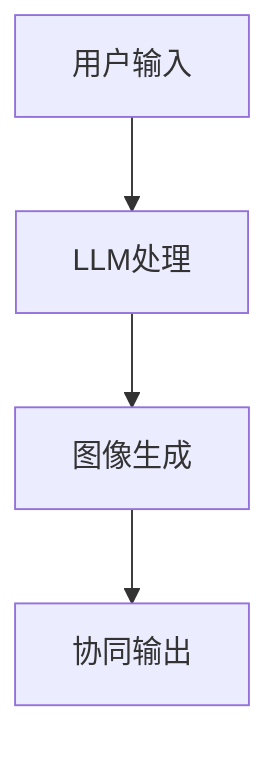
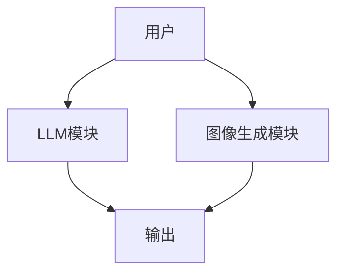
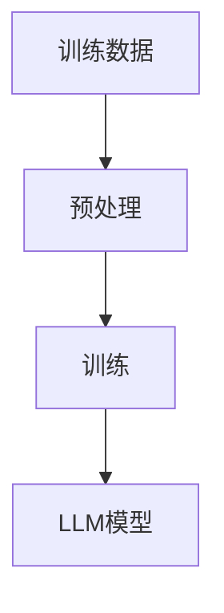
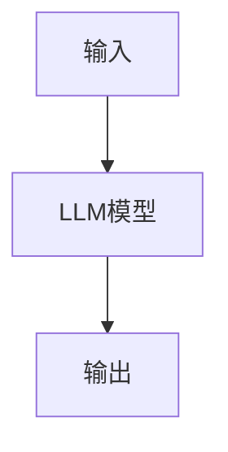
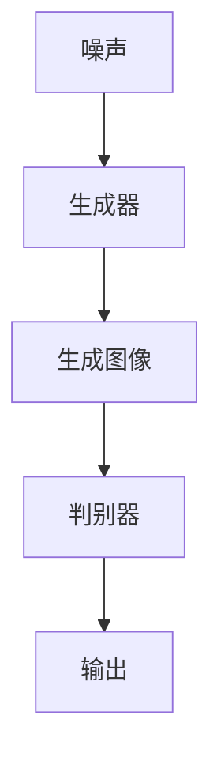
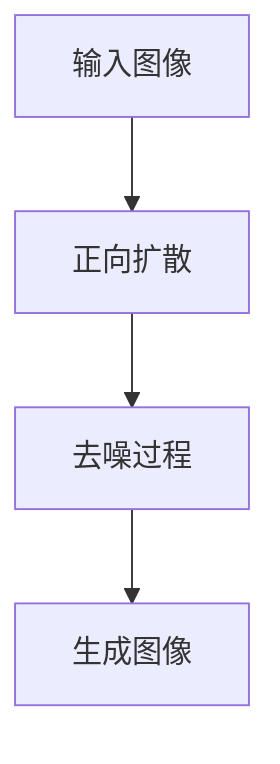
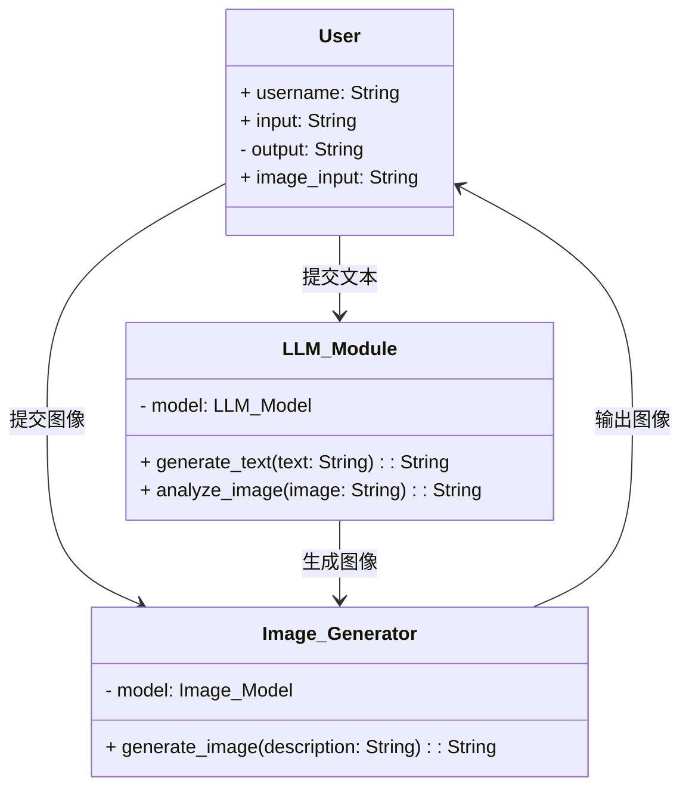
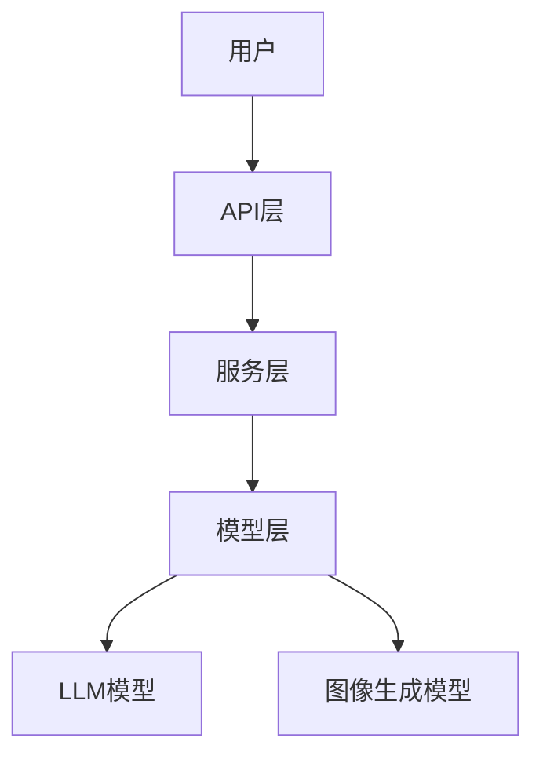
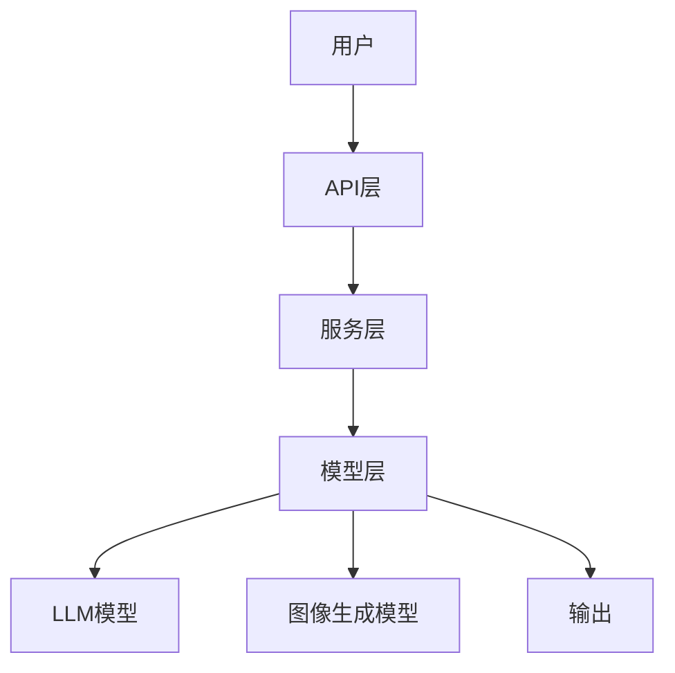

                 


# 多模态创作AI Agent：整合LLM与图像生成技术

## 关键词：多模态AI，LLM，图像生成，AI代理，深度学习

## 摘要：本文深入探讨了多模态创作AI Agent的构建，整合了大型语言模型（LLM）与图像生成技术，分析了其核心概念、算法原理、系统架构，并通过实际案例展示了其应用。本文旨在为技术开发者和研究人员提供全面的指导，帮助他们理解并应用这一前沿技术。

---

## 第一部分: 多模态创作AI Agent的背景与概述

## 第1章: 多模态创作AI Agent的背景与意义

### 1.1 多模态AI的背景与发展

#### 1.1.1 多模态AI的定义与特点
多模态AI是指能够处理和整合多种数据类型（如文本、图像、语音、视频等）的智能系统。其核心特点包括跨模态理解和协同处理能力。

| 数据类型 | 特性 | 应用场景 |
|----------|------|----------|
| 文本      | 高维、结构化 | NLP任务 |
| 图像      | 高维、非结构化 | 计算机视觉 |
| 语音      | 高维、时序 | 语音识别 |
| 视频      | 多模态融合 | 视频分析 |

#### 1.1.2 多模态AI的发展历程
- **早期阶段**：基于规则的多模态处理（20世纪90年代）。
- **发展阶段**：基于机器学习的多模态融合（2010年至今）。
- **前沿阶段**：基于深度学习的多模态协同（2020年至今）。

#### 1.1.3 多模态AI在创作领域的应用前景
- **内容生成**：多模态创作AI可生成文本、图像等多种形式的内容。
- **交互体验**：提升人机交互的沉浸感和自然性。
- **跨领域应用**：在教育、娱乐、设计等领域具有广泛潜力。

### 1.2 大型语言模型（LLM）的概述

#### 1.2.1 LLM的定义与核心特点
- **定义**：LLM是指经过大量文本数据训练的深度神经网络模型，如GPT系列。
- **特点**：大规模参数、预训练、上下文理解能力。

#### 1.2.2 LLM在自然语言处理中的应用
- **文本生成**：内容创作、对话系统。
- **问答系统**：知识检索、信息提取。
- **机器翻译**：跨语言通信。

#### 1.2.3 LLM的局限性与改进方向
- **局限性**：生成内容的质量不稳定，推理能力有限。
- **改进方向**：结合多模态数据、增强推理能力。

### 1.3 图像生成技术的发展

#### 1.3.1 图像生成技术的演进
- **传统方法**：基于规则的图像生成。
- **深度学习方法**：基于GAN和Diffusion的图像生成。

#### 1.3.2 基于GAN的图像生成
- **生成器**：学习数据分布，生成逼真图像。
- **判别器**：区分真实图像和生成图像。
- **挑战**：模式坍缩、生成图像多样性不足。

#### 1.3.3 图像生成技术的优缺点
- **优点**：生成高质量图像。
- **缺点**：计算资源消耗大，生成过程耗时。

### 1.4 多模态创作AI Agent的整合意义

#### 1.4.1 多模态整合的必要性
- **单一模态的局限性**：文本生成和图像生成各自存在局限性。
- **协同优势**：多模态整合可提升生成内容的多样性和交互性。

#### 1.4.2 LLM与图像生成技术的协同优势
- **内容丰富性**：生成文本和图像的结合。
- **交互性增强**：用户可以通过文本和图像与AI交互。

#### 1.4.3 多模态创作AI Agent的应用场景
- **创意设计**：辅助设计师生成图像和文本。
- **教育辅助**：提供多模态的学习资源。
- **娱乐应用**：生成互动故事、游戏内容。

### 1.5 本章小结
本章介绍了多模态AI的背景与发展，详细探讨了LLM和图像生成技术的特点及其在创作领域的应用前景。整合LLM和图像生成技术的多模态创作AI Agent具有重要的理论意义和应用价值。

---

## 第二部分: 多模态创作AI Agent的核心概念与联系

## 第2章: 多模态创作AI Agent的核心概念

### 2.1 多模态创作AI Agent的定义与组成

#### 2.1.1 多模态创作AI Agent的定义
- **定义**：一个多模态AI代理，能够理解和生成多种数据类型的内容，如文本、图像。

#### 2.1.2 多模态创作AI Agent的核心组成
- **LLM模块**：负责文本的理解和生成。
- **图像生成模块**：负责图像的生成。
- **协同模块**：整合LLM和图像生成模块，实现多模态协同。

### 2.2 大型语言模型（LLM）与图像生成技术的协同关系

#### 2.2.1 LLM在多模态创作中的角色
- **文本生成**：生成创意文案、对话。
- **图像描述**：根据文本生成图像描述。

#### 2.2.2 图像生成技术在多模态创作中的角色
- **图像生成**：根据输入生成图像。
- **图像理解**：分析图像内容，生成描述文本。

#### 2.2.3 LLM与图像生成技术的协同机制
- **输入协同**：用户输入文本，生成图像。
- **输出协同**：生成图像后，AI根据图像生成描述文本。

### 2.3 多模态创作AI Agent的协同流程

#### 2.3.1 协同流程的阶段划分
1. **用户输入**：用户输入文本或图像。
2. **LLM处理**：LLM理解输入，生成文本或图像描述。
3. **图像生成**：根据描述生成图像。
4. **协同输出**：输出最终的多模态内容。

#### 2.3.2 协同流程的Mermaid图



### 2.4 多模态创作AI Agent的实体关系

#### 2.4.1 实体关系的Mermaid图



---

## 第三部分: 多模态创作AI Agent的算法原理

## 第3章: 多模态创作AI Agent的算法原理

### 3.1 大型语言模型（LLM）的算法流程

#### 3.1.1 LLM的训练流程



#### 3.1.2 LLM的生成流程



#### 3.1.3 LLM的数学模型

- **损失函数**：交叉熵损失。
  $$ \mathcal{L} = -\sum_{i=1}^{n} \log p(x_i) $$
- **优化目标**：最小化损失函数。

### 3.2 图像生成算法的实现

#### 3.2.1 基于GAN的图像生成流程



#### 3.2.2 基于Diffusion的图像生成流程



---

## 第四部分: 多模态创作AI Agent的系统架构设计

## 第4章: 多模态创作AI Agent的系统架构设计

### 4.1 问题场景介绍

#### 4.1.1 问题场景描述
- **目标**：构建一个多模态创作AI Agent，整合LLM和图像生成技术。
- **用户需求**：用户可以通过文本生成图像，或通过图像生成文本描述。

### 4.2 系统功能设计

#### 4.2.1 系统功能模块



### 4.3 系统架构设计

#### 4.3.1 系统架构图



### 4.4 系统接口设计

#### 4.4.1 系统接口

- **输入接口**：
  - 提交文本：`POST /api/generate_image`
  - 提交图像：`POST /api/generate_text`
- **输出接口**：
  - 返回图像：`GET /api/image`
  - 返回文本：`GET /api/text`

#### 4.4.2 交互流程图



---

## 第五部分: 多模态创作AI Agent的项目实战

## 第5章: 多模态创作AI Agent的项目实战

### 5.1 环境安装

#### 5.1.1 环境要求
- **Python**：3.8及以上版本
- **框架**：TensorFlow/PyTorch
- **依赖**：安装必要的Python库，如`transformers`、`tensorflow`、`numpy`。

### 5.2 核心代码实现

#### 5.2.1 LLM模块实现

```python
from transformers import GPT2LMHeadModel, GPT2Tokenizer

class LLM_Module:
    def __init__(self):
        self.tokenizer = GPT2Tokenizer.from_pretrained('gpt2')
        self.model = GPT2LMHeadModel.from_pretrained('gpt2')
    
    def generate_text(self, text):
        inputs = self.tokenizer.encode(text, return_tensors='pt')
        outputs = self.model.generate(inputs, max_length=50)
        return self.tokenizer.decode(outputs[0], skip_special_tokens=True)
```

#### 5.2.2 图像生成模块实现

```python
import tensorflow as tf
from tensorflow.keras import layers

class Image_Generator:
    def __init__(self):
        self.model = self.build_model()
    
    def build_model(self):
        model = tf.keras.Sequential()
        model.add(layers.Dense(256, activation='relu', input_shape=(100,)))
        model.add(layers.Dense(256, activation='relu'))
        model.add(layers.Dense(128, activation='sigmoid'))
        return model
    
    def generate_image(self, description):
        # 假设description经过处理后生成100维的向量
        input_vector = self.preprocess(description)
        output = self.model.predict(input_vector)
        return output
```

### 5.3 代码解读与分析

#### 5.3.1 LLM模块解读
- **初始化**：加载预训练的GPT-2模型和分词器。
- **文本生成**：将输入文本编码，生成输出文本。

#### 5.3.2 图像生成模块解读
- **模型构建**：构建一个简单的生成器网络。
- **图像生成**：将输入描述处理为向量，生成图像。

### 5.4 实际案例分析

#### 5.4.1 案例1：文本生成图像
- **输入**：用户输入“一只猫在树上”。
- **过程**：LLM模块生成图像描述，图像生成模块生成图像。
- **输出**：生成一张猫在树上的图像。

#### 5.4.2 案例2：图像生成文本
- **输入**：用户上传一张图像。
- **过程**：LLM模块分析图像，生成描述文本。
- **输出**：生成“一只猫在树上”。

### 5.5 项目小结
本章通过具体实现，展示了如何整合LLM和图像生成技术，构建一个多模态创作AI Agent。通过实际案例，验证了系统的可行性和实用性。

---

## 第六部分: 多模态创作AI Agent的最佳实践

## 第6章: 多模态创作AI Agent的最佳实践

### 6.1 最佳实践 tips

#### 6.1.1 系统优化
- **模型优化**：使用更先进的模型结构，如视觉语言模型。
- **性能优化**：优化模型训练和推理的效率。

#### 6.1.2 交互设计
- **用户友好性**：设计直观的用户界面。
- **反馈机制**：提供实时反馈，提升用户体验。

#### 6.1.3 安全性
- **数据安全**：保护用户数据隐私。
- **内容审核**：防止生成有害内容。

### 6.2 小结
整合LLM和图像生成技术的多模态创作AI Agent具有广阔的应用前景。通过不断优化系统和提升用户体验，可以进一步推动其在各个领域的广泛应用。

### 6.3 注意事项

#### 6.3.1 系统性能
- **计算资源**：确保足够的计算资源。
- **模型选择**：选择适合任务的模型。

#### 6.3.2 数据质量
- **数据多样性**：确保训练数据的多样性。
- **数据质量**：保证数据的高质量。

#### 6.3.3 用户体验
- **界面设计**：设计直观的用户界面。
- **交互反馈**：提供及时的用户反馈。

### 6.4 拓展阅读

#### 6.4.1 推荐书籍
- 《Deep Learning》
- 《Effective Python》

#### 6.4.2 推荐博客
- [Awesome AI](https://awesome.ai)
- [Medium上的AI专栏](https://medium.com/ai)

---

## 作者：AI天才研究院/AI Genius Institute & 禅与计算机程序设计艺术 /Zen And The Art of Computer Programming

---

以上为《多模态创作AI Agent：整合LLM与图像生成技术》的技术博客文章的完整大纲和内容。如需进一步调整或扩展，请随时告知。

