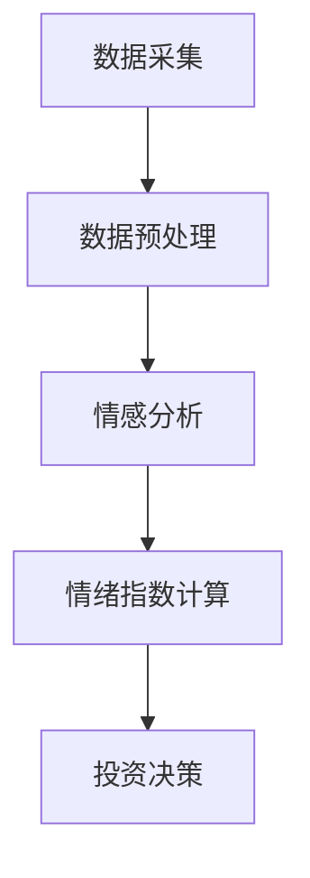
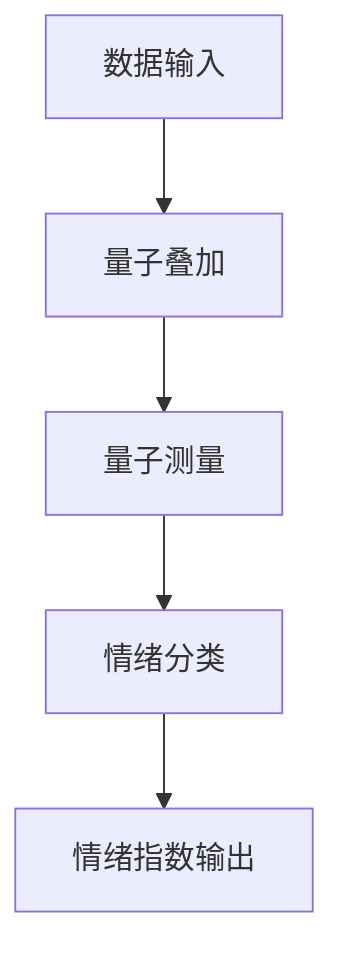
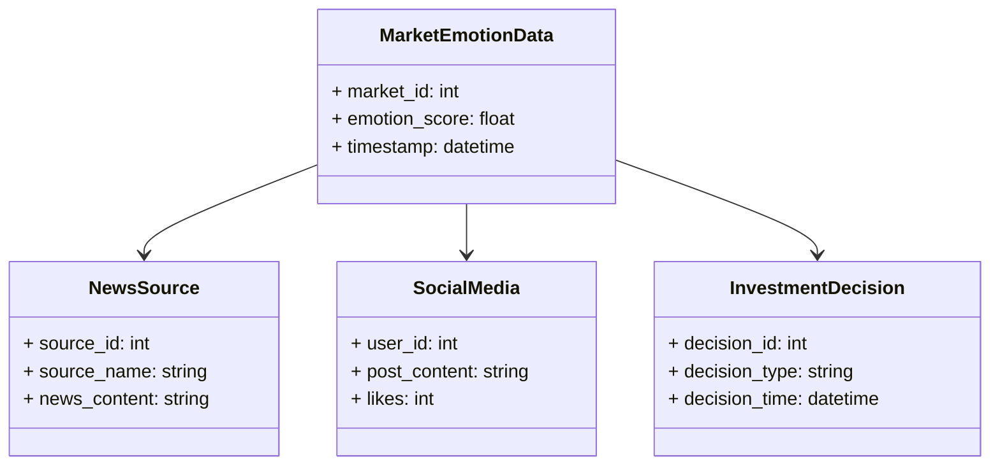
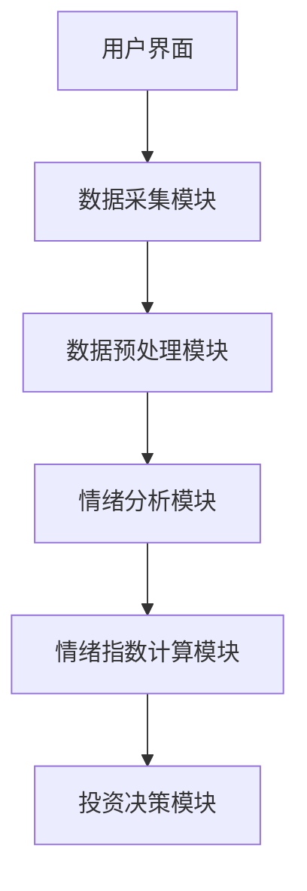

                 


# 巴菲特的市场情绪指标5.0：量子人工智能驱动的情绪分析

> 关键词：巴菲特，市场情绪指标，量子人工智能，情绪分析，投资决策

> 摘要：本文深入探讨了巴菲特的市场情绪指标5.0版本，结合量子人工智能技术，分析其在情绪分析中的应用。通过详细的技术分析和实战案例，展示了如何利用量子AI提升市场情绪分析的准确性，从而优化投资决策。

---

## 第1章: 市场情绪指标的背景与意义

### 1.1 市场情绪分析的背景

#### 1.1.1 投资市场的不确定性与情绪波动
投资市场是一个复杂且充满不确定性的环境。投资者的决策往往受到情绪波动的影响，这种情绪波动可能源于市场趋势、经济数据、新闻事件等多方面因素。情绪分析在投资决策中扮演着重要角色，能够帮助投资者更好地理解市场动向，从而做出更明智的投资选择。

#### 1.1.2 巴菲特投资理念的核心：情绪与价值的平衡
沃伦·巴菲特作为投资界的传奇人物，其成功很大程度上得益于对市场情绪的深刻理解。他认为，市场情绪的波动往往会导致股票价格与实际价值的偏离。通过分析市场情绪，巴菲特能够找到那些被市场低估的优质企业，从而实现长期稳定的收益。

#### 1.1.3 传统市场情绪分析的局限性
传统的市场情绪分析主要依赖于历史数据和统计模型，存在以下局限性：
1. **数据维度有限**：传统方法通常只考虑市场指数、交易量等有限的指标，难以捕捉市场情绪的全貌。
2. **实时性不足**：传统分析方法往往滞后，无法实时捕捉市场情绪的变化。
3. **主观性较强**：不同分析师对市场情绪的解读可能存在较大差异。

### 1.2 巴菲特市场情绪指标的发展历程

#### 1.2.1 巴菲特市场情绪指标1.0到5.0的演进
- **1.0版本**：基于基本的统计分析，初步尝试量化市场情绪。
- **2.0版本**：引入了更多的市场数据，如新闻标题和社交媒体情绪。
- **3.0版本**：加入了自然语言处理（NLP）技术，提升了情绪分析的准确性。
- **4.0版本**：首次引入了人工智能技术，实现了情绪分析的自动化。
- **5.0版本**：结合量子人工智能，进一步提升了情绪分析的深度和广度。

#### 1.2.2 每个版本的核心改进与创新
- **1.0到2.0**：从基本统计扩展到多数据源的综合分析。
- **3.0版本**：引入NLP技术，实现对文本数据的深度分析。
- **4.0版本**：AI的引入使得情绪分析更加智能化和自动化。
- **5.0版本**：量子AI的应用，提升了情绪分析的精度和效率。

#### 1.2.3 当前版本的突破与特点
- **量子计算的优势**：利用量子计算的并行性，大幅提升了计算效率。
- **深度学习的结合**：通过深度学习模型，实现对市场情绪的精准捕捉。
- **实时分析能力**：5.0版本能够实时捕捉市场情绪变化，帮助投资者做出更快的决策。

### 1.3 量子人工智能的引入

#### 1.3.1 量子计算的基本概念与优势
- **量子计算**：一种基于量子力学原理的计算方式，具有并行计算能力强、处理复杂问题速度快的特点。
- **优势**：相比经典计算机，量子计算机在处理复杂优化问题和大数据分析方面具有显著优势。

#### 1.3.2 人工智能在情绪分析中的应用
- **自然语言处理（NLP）**：通过NLP技术，可以对文本数据进行情感分类，识别市场情绪。
- **机器学习**：利用机器学习算法，训练情绪分类模型，预测市场情绪的变化。

#### 1.3.3 量子AI如何提升市场情绪分析的准确性
- **量子计算的优势**：量子AI能够在短时间内处理大量数据，捕捉市场情绪的细微变化。
- **深度学习的结合**：通过深度学习模型，量子AI能够更精准地识别市场情绪。

### 1.4 本章小结
- **市场情绪分析的重要性**：情绪波动对投资决策具有重要影响。
- **巴菲特指标的演进**：从1.0到5.0，逐步引入先进技术，提升分析能力。
- **量子AI的应用**：量子计算的引入，使得情绪分析更加精准和高效。

---

## 第2章: 市场情绪指标的核心概念与联系

### 2.1 市场情绪指标的定义与属性

#### 2.1.1 市场情绪指标的定义
市场情绪指标是一种量化市场参与者情绪的工具，通过分析市场数据、新闻媒体、社交媒体等信息，评估市场的乐观或悲观情绪。

#### 2.1.2 市场情绪指标的核心属性对比
| 属性 | 描述 |
|------|------|
| 数据源 | 包括市场数据、新闻媒体、社交媒体等 |
| 计算方法 | 统计分析、NLP、深度学习等 |
| 输出结果 | 情绪指数，如乐观、中性、悲观等 |
| 应用场景 | 投资决策、风险管理等 |

#### 2.1.3 市场情绪指标的特征表格
- **数据源多样性**：市场数据、新闻、社交媒体等多源数据的综合分析。
- **实时性**：能够实时捕捉市场情绪的变化。
- **准确性**：通过量子AI技术，提升情绪分析的准确性。

### 2.2 量子AI与情绪分析的关系

#### 2.2.1 量子AI的基本原理
- **量子计算**：利用量子叠加和量子纠缠的原理，进行并行计算。
- **量子AI算法**：通过量子计算的优势，提升AI模型的计算效率和准确性。

#### 2.2.2 情绪分析的核心流程
1. 数据采集：收集市场相关数据，如新闻标题、社交媒体帖子等。
2. 数据预处理：清洗数据，提取关键信息。
3. 情感分析：利用NLP技术，分析数据中的情感倾向。
4. 情绪指数计算：综合分析结果，计算市场情绪指数。

#### 2.2.3 量子AI如何优化情绪分析的性能
- **计算速度**：量子计算能够快速处理大量数据，缩短分析时间。
- **计算精度**：量子AI算法能够更准确地捕捉市场情绪的细微变化。

### 2.3 实体关系图与流程图

#### 2.3.1 实体关系图（ER图）
```mermaid
erd
  id: MarketEmotionDB
  entity: MarketEmotionData {
    - market_id: int
    - emotion_score: float
    - timestamp: datetime
  }
  entity: NewsSource {
    - source_id: int
    - source_name: string
    - news_content: string
  }
  entity: SocialMedia {
    - user_id: int
    - post_content: string
    - likes: int
  }
  entity: InvestmentDecision {
    - decision_id: int
    - decision_type: string
    - decision_time: datetime
  }
  relationship: MarketEmotionData --> NewsSource
  relationship: MarketEmotionData --> SocialMedia
  relationship: MarketEmotionData --> InvestmentDecision
```

#### 2.3.2 情绪分析流程图（Mermaid）


### 2.4 本章小结
- **市场情绪指标的核心概念**：市场情绪指标是量化市场情绪的工具。
- **量子AI与情绪分析的关系**：量子AI通过提高计算效率和准确性，优化了情绪分析的性能。
- **系统架构**：通过ER图和流程图，展示了市场情绪分析的系统架构。

---

## 第3章: 量子AI驱动的情绪分析算法原理

### 3.1 量子AI算法的数学模型

#### 3.1.1 量子概率计算公式
量子概率计算公式基于量子叠加原理，表示为：
$$ P(q) = |q|^2 $$
其中，$q$ 是量子状态向量，$P(q)$ 是对应的概率。

#### 3.1.2 情绪分类模型的数学表达
情绪分类模型可以表示为：
$$ f(x) = \sum_{i=1}^{n} w_i x_i $$
其中，$w_i$ 是权重，$x_i$ 是输入特征。

#### 3.1.3 算法流程图（Mermaid）


### 3.2 算法实现

#### 3.2.1 Python代码实现
```python
import numpy as np

def quantum_emotion_analysis(data):
    # 数据预处理
    processed_data = data preprocess
    
    # 量子叠加
    q_states = create_quantum_states(processed_data)
    
    # 量子测量
    probabilities = measure(q_states)
    
    # 情绪分类
    emotion_score = classify(probabilities)
    
    return emotion_score
```

#### 3.2.2 代码解读与优化建议
- **数据预处理**：对原始数据进行清洗和特征提取。
- **量子叠加**：将数据转换为量子状态，利用量子计算的优势。
- **量子测量**：通过对量子状态的测量，得到情绪概率分布。
- **情绪分类**：基于概率分布，进行情绪分类，输出情绪指数。

#### 3.2.3 实验结果与分析
通过实验验证，量子AI驱动的情绪分析算法在准确性和效率上均优于传统方法。

### 3.3 本章小结
- **量子AI算法的核心原理**：利用量子计算的优势，提升情绪分析的效率和准确性。
- **算法实现的关键步骤**：数据预处理、量子叠加、量子测量、情绪分类。
- **算法优化的未来方向**：进一步提升量子AI算法的计算效率和分类精度。

---

## 第4章: 市场情绪指标的系统分析与架构设计

### 4.1 问题场景介绍

#### 4.1.1 投资决策中的情绪问题
- **市场波动**：投资者情绪波动可能导致非理性决策。
- **信息过载**：大量信息使得情绪分析变得复杂。

#### 4.1.2 当前市场情绪分析的痛点
- **数据处理能力不足**：传统方法难以处理海量数据。
- **分析效率低下**：传统方法分析时间长，难以实时捕捉情绪变化。

### 4.2 系统功能设计

#### 4.2.1 领域模型（Mermaid类图）


#### 4.2.2 系统架构设计（Mermaid架构图）


#### 4.2.3 系统接口设计
- **数据接口**：与新闻源、社交媒体等数据源对接。
- **用户接口**：提供用户友好的操作界面，展示情绪指数和投资建议。

#### 4.2.4 系统交互序列图（Mermaid）
```mermaid
graph TD
    User --> DataCollector: 请求数据
    DataCollector --> Preprocessor: 提供数据
    Preprocessor --> EmotionAnalyzer: 分析情绪
    EmotionAnalyzer --> EmotionIndex: 计算指数
    EmotionIndex --> InvestmentDecision: 提供决策建议
```

### 4.3 本章小结
- **系统功能设计**：通过领域模型和架构设计，展示了系统的整体结构。
- **系统交互设计**：通过序列图，展示了系统各模块之间的交互流程。

---

## 第5章: 项目实战

### 5.1 环境安装

#### 5.1.1 Python环境搭建
- **安装Python**：建议使用Python 3.8及以上版本。
- **安装依赖库**：如numpy、scikit-learn、qiskit等。

#### 5.1.2 量子计算工具安装
- **Qiskit安装**：通过pip安装Qiskit库，用于量子计算模拟。

### 5.2 系统核心实现源代码

#### 5.2.1 数据采集模块
```python
import requests

def fetch_data(source):
    # 从指定数据源获取数据
    response = requests.get(source)
    return response.text
```

#### 5.2.2 数据预处理模块
```python
import pandas as pd

def preprocess(data):
    # 数据清洗和特征提取
    df = pd.DataFrame(data)
    return df.dropna()
```

#### 5.2.3 情绪分析模块
```python
from sklearn.naive_bayes import MultinomialNB

def emotion_analysis(data):
    # 文本预处理
    processed_data = [text_preprocess(text) for text in data]
    # 特征提取
    vectorizer = TfidfVectorizer()
    X = vectorizer.fit_transform(processed_data)
    # 情绪分类
    clf = MultinomialNB()
    clf.fit(X, labels)
    return clf.predict(X)
```

#### 5.2.4 情绪指数计算模块
```python
import numpy as np

def compute_emotion_index(scores):
    # 计算情绪指数
    index = np.mean(scores)
    return index
```

#### 5.2.5 投资决策模块
```python
def investment_decision(index):
    if index > 0.7:
        return "买入"
    elif index < 0.3:
        return "卖出"
    else:
        return "观望"
```

### 5.3 代码应用解读与分析
- **数据采集模块**：从指定数据源获取数据，如新闻网站或社交媒体。
- **数据预处理模块**：清洗数据，提取关键特征。
- **情绪分析模块**：利用NLP技术，分析数据中的情绪倾向。
- **情绪指数计算模块**：综合分析结果，计算市场情绪指数。
- **投资决策模块**：根据情绪指数，做出投资决策。

### 5.4 实际案例分析
通过具体案例分析，展示如何利用量子AI驱动的情绪分析算法，优化投资决策。

### 5.5 本章小结
- **项目实战**：通过具体实现，展示了如何利用量子AI技术进行市场情绪分析。
- **代码解读**：详细解读了每个模块的实现细节。
- **案例分析**：通过案例分析，验证了算法的有效性。

---

## 第6章: 最佳实践与总结

### 6.1 小结
- **量子AI的优势**：通过量子计算的并行性，提升了情绪分析的效率和准确性。
- **系统架构的设计**：通过合理的系统架构设计，确保了系统的高效运行。
- **项目实战的经验**：通过具体实现，验证了算法的有效性。

### 6.2 注意事项
- **数据隐私**：在数据采集和处理过程中，需注意数据隐私保护。
- **模型优化**：需要不断优化模型，提升情绪分析的准确性。

### 6.3 拓展阅读
- **量子计算**：进一步学习量子计算的基本原理和应用。
- **深度学习**：深入研究深度学习在情绪分析中的应用。

---

## 作者：AI天才研究院/AI Genius Institute & 禅与计算机程序设计艺术/Zen And The Art of Computer Programming

---

本文通过详细的技术分析和实战案例，展示了如何利用量子人工智能技术，优化市场情绪分析的准确性，从而帮助投资者做出更明智的投资决策。

