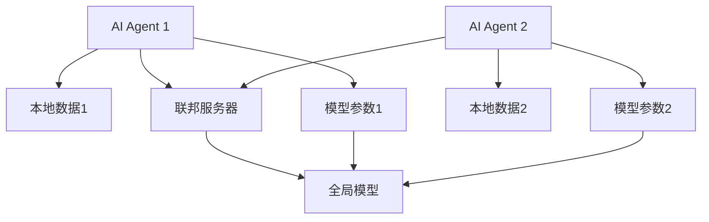
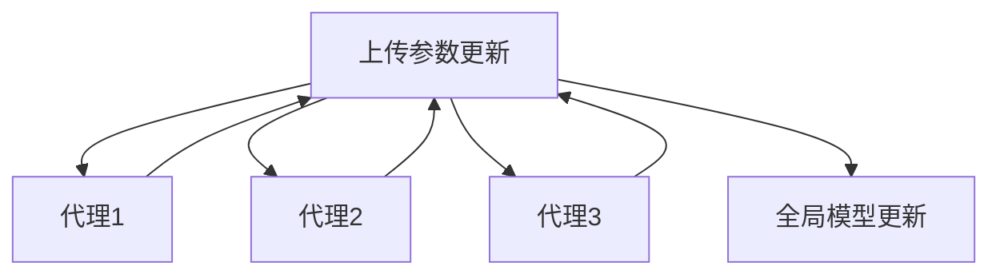
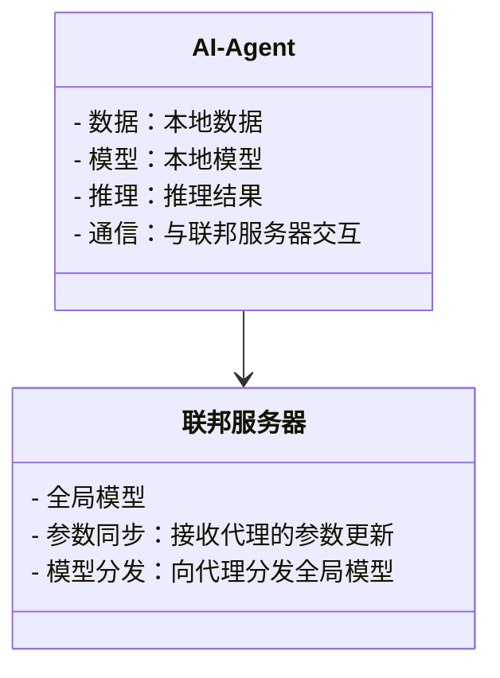
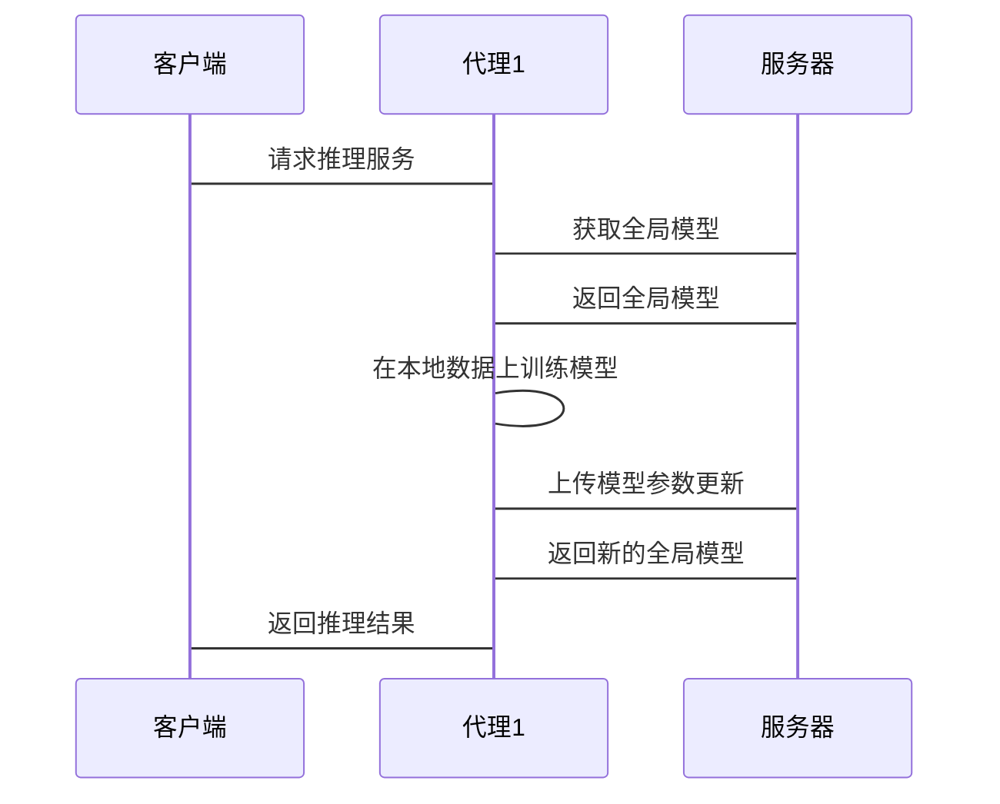

                 


# 联邦学习在AI Agent隐私保护推理中的应用

## 关键词
联邦学习，AI Agent，隐私保护，分布式计算，数据安全

## 摘要
随着人工智能技术的快速发展，AI Agent（智能代理）在各个领域的应用越来越广泛。然而，AI Agent在提供智能化服务的同时，也面临着数据隐私保护的挑战。联邦学习作为一种分布式机器学习技术，能够有效地保护数据隐私，同时实现模型的联合训练与推理。本文将深入探讨联邦学习在AI Agent隐私保护推理中的应用，从背景介绍、核心概念、算法原理到系统架构设计和项目实战，全面分析如何利用联邦学习技术解决AI Agent中的隐私保护问题。

---

## 第一部分：背景介绍

### 第1章：联邦学习与AI Agent概述

#### 1.1 联邦学习的基本概念
- 联邦学习（Federated Learning）是一种分布式机器学习技术，允许多个参与方在不共享原始数据的情况下，共同训练一个全局模型。其核心思想是“数据不动，模型动”，通过交换模型参数而不是数据本身，实现模型的联合优化。
- 联邦学习与传统数据集中训练的主要区别在于数据隐私保护。在联邦学习中，数据仍然保留在各个参与方的本地，只有模型参数在不同节点之间传输，从而有效避免了数据泄露的风险。

#### 1.2 AI Agent的基本概念
- AI Agent（人工智能代理）是一种能够感知环境并采取行动以实现目标的智能实体。它可以是一个软件程序、机器人或其他智能系统，通过与环境交互来完成特定任务。
- AI Agent的核心功能包括感知、推理、决策和执行。在实际应用中，AI Agent广泛应用于推荐系统、自动驾驶、智能助手等领域。
- AI Agent在隐私保护中的作用主要体现在数据的安全传输与处理。由于AI Agent通常需要处理敏感数据（如用户的地理位置、行为习惯等），如何在保护数据隐私的前提下完成推理和决策是其面临的重要挑战。

#### 1.3 联邦学习在AI Agent中的应用背景
- 随着AI Agent的广泛应用，数据隐私保护的重要性日益凸显。传统的数据集中训练方法容易导致用户数据泄露，尤其是在涉及敏感信息的场景中，用户隐私可能受到威胁。
- 联邦学习作为一种分布式技术，能够有效解决AI Agent中的数据隐私问题。通过联邦学习，AI Agent可以在不共享原始数据的情况下，与其他代理或服务器协同训练模型，从而实现联合推理和决策。
- 联邦学习在AI Agent推理中的潜在价值主要体现在以下几点：
  - 保护用户隐私，避免数据泄露。
  - 提高模型的泛化能力，通过多代理的数据协作，提升模型的性能。
  - 支持去中心化的AI架构，增强系统的灵活性和可扩展性。

---

## 第二部分：核心概念与联系

### 第2章：联邦学习与AI Agent的核心概念与联系

#### 2.1 联邦学习的核心原理
- 联邦学习的核心原理是通过模型参数的交换实现全局模型的优化，而不是直接传输数据。每个参与方（联邦成员）在本地数据上训练模型，并将更新后的模型参数上传到协调服务器或直接在成员之间进行同步。
- 联邦学习的主要流程包括以下步骤：
  1. 初始化全局模型。
  2. 每个联邦成员在本地数据上训练模型，更新模型参数。
  3. 将更新后的模型参数上传到协调服务器。
  4. 协调服务器将所有成员的模型参数进行汇总，生成新的全局模型。
  5. 将新的全局模型分发给各联邦成员，供其继续训练。

#### 2.2 AI Agent的核心功能
- AI Agent的核心功能包括感知、推理、决策和执行。其中，推理是AI Agent完成任务的关键步骤，通常涉及对环境数据的分析和处理。
- AI Agent的推理过程需要依赖模型的支持。传统的推理方法依赖于集中式数据训练的模型，而这种方法容易导致数据隐私泄露的问题。

#### 2.3 联邦学习与AI Agent的关系
- 联邦学习为AI Agent提供了分布式模型训练的可能，使得多个AI Agent可以在不共享数据的情况下协同训练模型，从而实现联合推理。
- AI Agent通过联邦学习可以增强其推理能力，同时保护数据隐私。多个AI Agent可以通过联邦学习共同优化模型，提升推理的准确性和效率。

#### 2.4 联邦学习与AI Agent的属性对比
以下是联邦学习与AI Agent在核心属性上的对比：

| 属性          | 联邦学习                              | AI Agent                                |
|---------------|--------------------------------------|----------------------------------------|
| 数据处理方式  | 分布式模型训练，不共享数据            | 本地数据处理，不共享原始数据          |
| 模型更新方式  | 参数更新，模型在服务器端汇总          | 参数更新，模型在本地更新              |
| 隐私保护      | 高，通过参数交换保护数据隐私        | 高，通过本地推理保护数据隐私          |
| 应用场景       | 联合训练、推荐系统、个性化服务        | 智能助手、自动驾驶、推荐系统等          |

#### 2.5 联邦学习在AI Agent推理中的实体关系
以下是联邦学习在AI Agent推理中的实体关系图：



---

## 第三部分：算法原理

### 第3章：联邦学习的算法原理

#### 3.1 联邦学习的算法流程
以下是联邦学习的算法流程：



#### 3.2 联邦学习的核心算法
联邦学习的核心算法包括以下几种：

1. **联邦平均（Federated Averaging，FedAvg）**：
   - 每个代理在本地数据上训练模型，更新模型参数。
   - 将更新后的模型参数上传到服务器。
   - 服务器将所有代理的模型参数进行平均，生成新的全局模型。

2. **联邦同步（Federated Synchronization）**：
   - 代理之间通过同步机制交换模型参数，实现模型的联合优化。
   - 适用于去中心化的联邦学习场景，无需服务器协调。

#### 3.3 联邦学习的数学模型
以下是联邦学习的数学模型示例：

- 每个代理$i$在本地数据集$D_i$上优化模型参数$\theta_i$：
  $$\theta_i^{(t+1)} = \theta_i^{(t)} - \eta \sum_{j=1}^{n} \nabla L(\theta_i^{(t)}, (x_j, y_j))$$
  
- 服务器将所有代理的模型参数进行平均，生成新的全局模型：
  $$\theta^{(t+1)} = \frac{1}{n} \sum_{i=1}^{n} \theta_i^{(t+1)}$$

#### 3.4 联邦学习在AI Agent中的应用
以下是联邦学习在AI Agent中的应用示例：

- 多个智能助手（AI Agent）通过联邦学习技术，联合训练一个全局推荐模型，提升推荐的准确性和个性化。
- 自动驾驶系统中的多个车辆代理通过联邦学习技术，共同优化路径规划模型，提高系统的整体性能。

---

## 第四部分：系统分析与架构设计

### 第4章：联邦学习在AI Agent中的系统架构设计

#### 4.1 系统应用场景
- 联邦学习在AI Agent中的应用场景包括：
  - 智能助手：多个智能助手通过联邦学习技术，联合训练一个全局模型，提升推荐系统的准确性。
  - 自动驾驶：多个车辆代理通过联邦学习技术，共同优化自动驾驶模型，提高系统的整体性能。
  - 医疗健康：多个医疗机构通过联邦学习技术，联合训练一个全局医疗诊断模型，保护患者隐私。

#### 4.2 系统功能设计
以下是系统功能设计的领域模型类图：



#### 4.3 系统架构设计
以下是系统架构设计的mermaid架构图：


#### 4.4 系统交互设计
以下是系统交互设计的mermaid序列图：



---

## 第五部分：项目实战

### 第5章：联邦学习在AI Agent中的项目实战

#### 5.1 环境搭建
- 系统环境：Ubuntu 20.04
- 软件环境：Python 3.8，TensorFlow 2.5，Flask 2.0

#### 5.2 核心代码实现
以下是联邦学习在AI Agent中的核心代码实现：

```python
import numpy as np
import tensorflow as tf
from tensorflow.keras import layers

# 定义本地模型
class LocalModel:
    def __init__(self):
        self.model = self.build_model()
    
    def build_model(self):
        model = tf.keras.Sequential([
            layers.Dense(64, activation='relu'),
            layers.Dense(10, activation='softmax')
        ])
        return model

# 定义联邦学习服务器
class FederatedServer:
    def __init__(self):
        self.global_model = LocalModel().model.get_weights()
    
    def aggregate_models(self, updated_models):
        average_model = []
        for i in range(len(self.global_model)):
            weights = np.array([model[i] for model in updated_models])
            average_weights = np.mean(weights, axis=0)
            average_model.append(average_weights)
        return average_model

# 定义AI Agent
class AIAgent:
    def __init__(self, server):
        self.server = server
        self.local_model = LocalModel()
    
    def train(self, data, epochs=1):
        # 在本地数据上训练模型
        self.local_model.model.compile(optimizer='sgd', loss='sparse_categorical_crossentropy', metrics=['accuracy'])
        self.local_model.model.fit(data, epochs=epochs, verbose=0)
        return self.local_model.model.get_weights()
    
    def update_model(self, new_weights):
        # 更新本地模型参数
        self.local_model.model.set_weights(new_weights)
    
    def infer(self, input_data):
        # 使用本地模型进行推理
        return self.local_model.model.predict(input_data)
```

#### 5.3 项目实战案例分析
以下是联邦学习在AI Agent中的项目实战案例：

- **案例背景**：假设我们有三个智能助手代理，分别收集了用户的本地数据，希望在不共享数据的情况下，共同训练一个全局推荐模型。
- **实现步骤**：
  1. 初始化全局模型。
  2. 每个代理在本地数据上训练模型，更新模型参数。
  3. 将更新后的模型参数上传到服务器。
  4. 服务器将所有代理的模型参数进行平均，生成新的全局模型。
  5. 将新的全局模型分发给所有代理，供其继续训练。
- **代码实现**：
  ```python
  # 初始化服务器和代理
  server = FederatedServer()
  agent1 = AIAgent(server)
  agent2 = AIAgent(server)
  agent3 = AIAgent(server)

  # 初始化数据
  data1 = np.random.rand(100, 64)
  data2 = np.random.rand(100, 64)
  data3 = np.random.rand(100, 64)

  # 代理1训练模型
  weights1 = agent1.train(data1)
  # 代理2训练模型
  weights2 = agent2.train(data2)
  # 代理3训练模型
  weights3 = agent3.train(data3)

  # 上传模型参数到服务器
  server.aggregate_models([weights1, weights2, weights3])

  # 更新代理模型
  new_weights = server.global_model
  agent1.update_model(new_weights)
  agent2.update_model(new_weights)
  agent3.update_model(new_weights)
  ```

---

## 第六部分：最佳实践与注意事项

### 第6章：总结与展望

#### 6.1 最佳实践
- **数据预处理**：在联邦学习中，数据预处理是至关重要的一步。确保所有代理的数据格式一致，并进行标准化或归一化处理。
- **模型选择**：根据具体应用场景选择合适的模型架构。对于大规模数据，可以采用深度学习模型；对于小规模数据，可以采用简单的线性模型。
- **通信协议**：在代理与服务器之间的通信中，建议采用加密的通信协议，确保数据传输的安全性。
- **模型评估**：在联邦学习中，模型的评估需要考虑各个代理的贡献。可以采用加权评估的方法，根据代理的数据量或模型性能进行加权。

#### 6.2 小结
- 联邦学习在AI Agent中的应用为数据隐私保护提供了新的思路。通过联邦学习技术，AI Agent可以在不共享数据的情况下，实现模型的联合训练与推理。
- 联邦学习的核心思想是“数据不动，模型动”，这使得其在保护数据隐私的同时，能够提升模型的性能和泛化能力。

#### 6.3 注意事项
- 在实际应用中，需要考虑联邦学习的通信开销和计算效率。对于大规模数据和大量代理的情况，可能需要优化通信协议和模型更新策略。
- 联邦学习的模型更新频率需要根据具体场景进行调整。频繁的模型更新可能会增加通信开销，而过低的更新频率可能导致模型性能下降。

#### 6.4 拓展阅读
- 如果想深入了解联邦学习的理论基础，可以阅读《Federated Learning: Challenges, Methods, and Future Directions》。
- 如果想了解联邦学习在具体领域的应用，可以参考Google的《Federated Learning for MobileAI》。

---

## 作者：AI天才研究院/AI Genius Institute & 禅与计算机程序设计艺术/Zen And The Art of Computer Programming

---

以上是《联邦学习在AI Agent隐私保护推理中的应用》的文章大纲和详细内容。希望本文能够为读者提供关于联邦学习在AI Agent隐私保护中的深入理解，并为实际应用提供有价值的参考。

