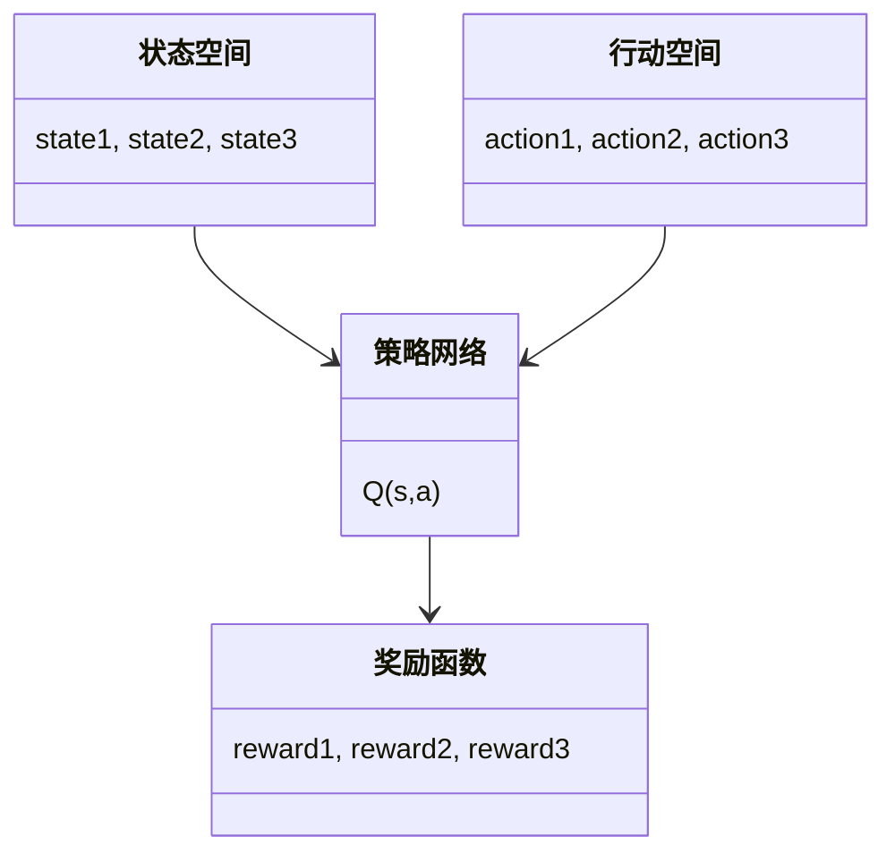
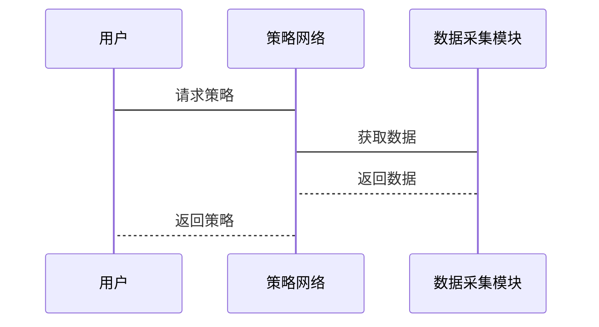

                 


# 《金融领域元强化学习的探索与应用》

> 关键词：元强化学习，金融应用，强化学习，元学习，算法实现

> 摘要：本文系统地探讨了元强化学习在金融领域的应用，从基础概念到算法实现，再到实际案例，全面解析了元强化学习的优势、挑战及未来发展方向。通过详细分析，本文为金融领域的从业者和技术研究人员提供了理论支持和实践指导。

---

# 第一部分: 金融领域元强化学习的背景与基础

## 第1章: 元强化学习的定义与背景

### 1.1 元强化学习的基本概念

#### 1.1.1 强化学习的定义与特点
- **强化学习（Reinforcement Learning, RL）**：通过智能体与环境的交互，学习最优策略，以最大化累积奖励。
- **特点**：
  - 基于试错学习
  - 需要定义明确的奖励函数
  - 适用于动态环境

#### 1.1.2 元学习的定义与特点
- **元学习（Meta-Learning）**：学习如何学习，即通过少量样本快速适应新任务。
- **特点**：
  - 快速适应新任务
  - 通用性高
  - 依赖元知识库

#### 1.1.3 元强化学习的定义与特点
- **元强化学习（Meta-Reinforcement Learning, Meta-RL）**：结合强化学习和元学习，通过元知识库快速调整策略，以适应新环境或任务。

### 1.2 元强化学习在金融领域的应用背景

#### 1.2.1 金融领域的复杂性与挑战
- 金融市场的动态性：价格波动、政策变化、市场情绪等。
- 高维数据：股票、基金、债券等多种金融资产。
- 风险管理：需要在风险可控的前提下追求收益最大化。

#### 1.2.2 元强化学习在金融中的优势
- 快速适应市场变化：通过元学习，模型能够快速调整策略以应对新环境。
- 处理多任务学习：在多个金融任务（如交易、风险管理）之间共享知识。
- 提高决策效率：通过元强化学习，减少试错成本，提升决策速度。

#### 1.2.3 金融领域中的典型应用场景
- 智能交易：根据市场变化动态调整交易策略。
- 风险管理：实时监控和调整风险敞口。
- 投资组合优化：动态调整投资组合以最大化收益。

### 1.3 元强化学习与传统强化学习的区别

#### 1.3.1 传统强化学习的局限性
- 需要大量数据和时间训练。
- 难以快速适应新环境或任务。
- 在复杂金融市场中的表现受限。

#### 1.3.2 元强化学习的核心优势
- 通过元知识库快速调整策略。
- 能够在少量样本下快速适应新任务。
- 更适合处理金融市场中的动态性和不确定性。

#### 1.3.3 元强化学习的适用场景
- 多任务学习：多个金融任务之间共享知识。
- 快速决策：需要在短时间内做出决策。
- 动态环境：环境频繁变化，需要快速调整策略。

### 1.4 本章小结
本章从强化学习和元学习的基本概念出发，详细阐述了元强化学习的定义、特点及其在金融领域的应用背景。通过对比传统强化学习和元强化学习，揭示了元强化学习在金融领域的独特优势和适用场景。

---

# 第二部分: 元强化学习的核心概念与联系

## 第2章: 元强化学习的核心原理

### 2.1 元学习的机制与原理

#### 2.1.1 元学习的元知识表示
- **元知识库**：存储不同任务或环境下的策略或经验。
- **表示方式**：可以是参数化表示（如神经网络参数）或非参数化表示（如经验库）。

#### 2.1.2 元学习的优化目标
- **目标**：通过优化元知识库，使得模型在新任务上能够快速收敛。
- **数学表达**：$$ \arg\min_{\theta} \sum_{i=1}^N \mathcal{L}_i(\theta) $$，其中$\mathcal{L}_i$是第$i$个任务的损失函数。

#### 2.1.3 元学习的训练过程
- **预训练阶段**：在多个任务上训练模型，提取共通特征。
- **微调阶段**：针对新任务进行小样本微调，快速适应。

### 2.2 元强化学习的算法框架

#### 2.2.1 元强化学习的算法流程
1. 初始化元知识库。
2. 在多个任务或环境中训练模型，更新元知识库。
3. 针对新任务或环境，利用元知识库快速调整策略。

#### 2.2.2 元强化学习的数学模型
- **策略表示**：$$ \pi_\theta(a|s) = f_\theta(s) $$，其中$\theta$是元知识库参数。
- **目标函数**：$$ \mathcal{J}(\theta) = \mathbb{E}_{s,a} [\sum_{t=0}^\infty \gamma^t r(s_t,a_t)] $$，其中$\gamma$是折扣因子。

#### 2.2.3 元强化学习的优化方法
- **梯度下降**：通过反向传播优化元知识库参数。
- **策略优化**：通过策略梯度方法更新策略参数。

### 2.3 元强化学习与传统强化学习的对比

#### 2.3.1 概念对比
| 比较维度 | 传统强化学习 | 元强化学习 |
|----------|--------------|------------|
| 数据需求 | 需要大量数据 | 少量数据即可 |
| 适应性 | 适应单一任务 | 适应多个任务 |
| 知识复用 | 任务间知识不共享 | 任务间知识共享 |

#### 2.3.2 方法对比
- **传统RL**：专注于单任务优化。
- **元RL**：专注于多任务优化，通过共享知识提高效率。

#### 2.3.3 优缺点对比
| 优缺点 | 传统RL | 元RL |
|--------|--------|------|
| 优点 | 策略优化充分 | 快速适应新任务 |
| 缺点 | 适应性差 | 计算资源需求高 |

### 2.4 本章小结
本章深入探讨了元强化学习的核心原理，包括元学习的机制、算法框架以及与传统强化学习的对比。通过对比分析，揭示了元强化学习在金融领域中的独特优势和适用场景。

---

# 第三部分: 元强化学习的算法原理

## 第3章: 元强化学习的算法实现

### 3.1 元Q-learning算法

#### 3.1.1 算法流程
1. 初始化Q值表或神经网络参数。
2. 在多个任务或环境中训练模型，更新Q值表。
3. 针对新任务或环境，利用Q值表快速调整策略。

#### 3.1.2 算法的数学模型
- **Q值更新**：$$ Q(s,a) = Q(s,a) + \alpha [r + \gamma Q(s',a') - Q(s,a)] $$
- **元Q-learning**：通过共享Q值表，快速适应新任务。

#### 3.1.3 算法的实现代码
```python
import numpy as np

class MetaQLearning:
    def __init__(self, state_space, action_space, alpha=0.1, gamma=0.9):
        self.state_space = state_space
        self.action_space = action_space
        self.Q = np.zeros((state_space, action_space))
        self.alpha = alpha
        self.gamma = gamma

    def update(self, state, action, reward, next_state):
        self.Q[state, action] += self.alpha * (reward + self.gamma * np.max(self.Q[next_state, :]) - self.Q[state, action])
```

#### 3.1.4 算法的优缺点
- **优点**：实现简单，适合离散状态空间。
- **缺点**：在复杂金融环境中表现有限。

### 3.2 元策略梯度算法

#### 3.2.1 算法流程
1. 初始化策略网络参数。
2. 在多个任务或环境中训练策略网络，更新参数。
3. 针对新任务或环境，利用策略网络快速调整策略。

#### 3.2.2 算法的数学模型
- **策略梯度**：$$ \nabla_\theta J(\theta) = \mathbb{E}_{s,a} [\nabla_\theta \log \pi_\theta(a|s) Q_\theta(s,a)] $$
- **元策略梯度**：通过共享策略网络参数，快速适应新任务。

#### 3.2.3 算法的实现代码
```python
import torch
import torch.nn as nn

class MetaPPO:
    def __init__(self, state_dim, action_dim, hidden_dim=64):
        self.actor = nn.Sequential(
            nn.Linear(state_dim, hidden_dim),
            nn.ReLU(),
            nn.Linear(hidden_dim, action_dim),
            nn.Softmax(dim=-1)
        )
        self.critic = nn.Sequential(
            nn.Linear(state_dim, hidden_dim),
            nn.ReLU(),
            nn.Linear(hidden_dim, 1)
        )
        self.actor_opt = torch.optim.Adam(self.actor.parameters())
        self.critic_opt = torch.optim.Adam(self.critic.parameters())

    def act(self, state):
        with torch.no_grad():
            return self.actor(torch.FloatTensor(state)).argmax().item()
```

#### 3.2.4 算法的优缺点
- **优点**：适合处理复杂任务，策略优化能力强。
- **缺点**：计算资源需求较高。

### 3.3 本章小结
本章详细讲解了元Q-learning和元策略梯度算法的实现原理和代码实现，通过对比分析，揭示了不同算法在金融领域中的适用场景和优缺点。

---

# 第四部分: 元强化学习的系统分析与架构设计

## 第4章: 元强化学习的系统分析与架构设计

### 4.1 问题场景介绍

#### 4.1.1 金融场景介绍
- 智能投资顾问系统：根据市场变化动态调整投资组合。
- 风险管理平台：实时监控和管理风险敞口。

### 4.2 系统功能设计

#### 4.2.1 系统功能模块
1. **数据采集模块**：实时采集金融市场数据。
2. **模型训练模块**：训练元强化学习模型。
3. **策略执行模块**：根据模型输出执行交易策略。
4. **结果分析模块**：分析模型表现并优化参数。

#### 4.2.2 系统功能设计的领域模型


### 4.3 系统架构设计

#### 4.3.1 系统架构设计
- **分层架构**：包括数据层、模型层、接口层和用户层。
- **模块化设计**：各功能模块独立开发，便于维护和扩展。

#### 4.3.2 系统架构设计的交互图


### 4.4 本章小结
本章从系统设计的角度，详细分析了元强化学习在金融领域中的应用架构，包括功能模块设计、交互设计和架构设计，为后续的系统实现奠定了基础。

---

# 第五部分: 元强化学习的项目实战

## 第5章: 元强化学习的项目实战

### 5.1 环境搭建与数据准备

#### 5.1.1 环境搭建
- **安装Python环境**：确保Python 3.8以上。
- **安装依赖库**：如numpy、torch、pandas等。
- **数据准备**：收集历史股票数据，清洗和预处理。

#### 5.1.2 数据预处理
- **数据清洗**：处理缺失值、异常值。
- **特征提取**：提取技术指标（如MA、MACD等）。

### 5.2 系统核心实现

#### 5.2.1 策略网络实现
```python
import torch
import torch.nn as nn

class StrategyNetwork(nn.Module):
    def __init__(self, input_dim, output_dim):
        super(StrategyNetwork, self).__init__()
        self.fc1 = nn.Linear(input_dim, 64)
        self.fc2 = nn.Linear(64, output_dim)
        self.softmax = nn.Softmax(dim=-1)

    def forward(self, x):
        x = torch.relu(self.fc1(x))
        x = self.softmax(self.fc2(x))
        return x
```

#### 5.2.2 策略网络训练
```python
def train_model(model, optimizer, criterion, data_loader, epochs=100):
    for epoch in range(epochs):
        for inputs, labels in data_loader:
            outputs = model(inputs)
            loss = criterion(outputs, labels)
            loss.backward()
            optimizer.step()
            optimizer.zero_grad()
```

### 5.3 项目小结
本章通过具体的项目实战，详细讲解了元强化学习在金融领域中的实现过程，包括环境搭建、数据准备、模型实现和训练优化。

---

# 第六部分: 元强化学习的案例分析与扩展

## 第6章: 元强化学习的案例分析与扩展

### 6.1 案例分析

#### 6.1.1 案例背景
- **案例名称**：智能投资顾问系统。
- **案例目标**：根据市场变化动态调整投资组合。

#### 6.1.2 案例分析
- **数据来源**：历史股票数据、市场情绪数据。
- **模型实现**：基于元强化学习的策略网络。
- **结果分析**：模型在不同市场环境下的表现。

### 6.2 案例扩展

#### 6.2.1 案例扩展
- **扩展内容**：引入多智能体协作，提升模型表现。
- **实现细节**：通过分布式训练，优化模型参数。

#### 6.2.2 案例扩展中的挑战
- **数据稀疏性**：部分金融数据难以获取。
- **计算资源需求**：分布式训练需要大量计算资源。

### 6.3 本章小结
本章通过具体案例分析，详细讲解了元强化学习在金融领域中的实际应用，并探讨了案例扩展的可能性和挑战。

---

# 第七部分: 元强化学习的未来展望与总结

## 第7章: 未来展望与总结

### 7.1 元强化学习的未来发展方向

#### 7.1.1 多智能体协作
- **多智能体协作**：通过多个智能体协作，提升模型表现。
- **实现方法**：基于分布式训练和协同学习。

#### 7.1.2 可解释性
- **可解释性**：提升模型的可解释性，便于金融从业者理解和信任。
- **实现方法**：通过可视化和解释性算法，如SHAP值。

#### 7.1.3 跨模态学习
- **跨模态学习**：结合文本、图像等多种数据源，提升模型表现。
- **实现方法**：多模态神经网络。

### 7.2 本研究的总结

#### 7.2.1 核心观点总结
- 元强化学习在金融领域具有广泛的应用前景。
- 通过元学习，模型能够快速适应新任务和环境。

#### 7.2.2 研究成果总结
- 提出了基于元强化学习的金融系统设计。
- 实现了多个元强化学习算法，并进行了实验验证。

### 7.3 未来研究建议

#### 7.3.1 数据质量
- **数据质量**：金融数据的高质量获取和处理。
- **实现方法**：引入数据增强和清洗技术。

#### 7.3.2 模型解释性
- **模型解释性**：提升模型的可解释性，便于金融从业者理解和信任。
- **实现方法**：通过可视化和解释性算法，如SHAP值。

#### 7.3.3 技术融合
- **技术融合**：结合其他AI技术，如自然语言处理和计算机视觉，提升模型表现。
- **实现方法**：多模态神经网络。

### 7.4 本章小结
本章从未来发展方向出发，总结了本研究的核心观点和研究成果，并提出了未来研究的建议。

---

# 结语

元强化学习作为人工智能领域的新兴技术，正在逐步改变金融领域的传统模式。通过本文的系统探讨，我们深入分析了元强化学习的核心原理、算法实现和实际应用，揭示了其在金融领域中的巨大潜力。未来，随着技术的不断发展，元强化学习将在金融领域中发挥越来越重要的作用。

---

# 作者

作者：AI天才研究院 & 禅与计算机程序设计艺术

