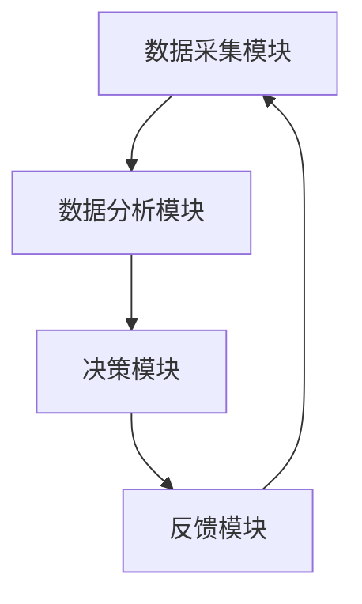
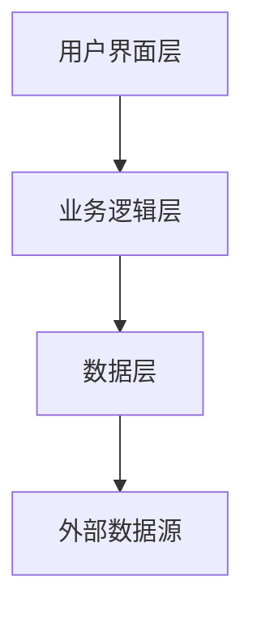

                 


---

# AI智能体在评估公司研发效率中的作用

> 关键词：AI智能体、研发效率、自然语言处理、机器学习、知识图谱、文本相似度

> 摘要：随着人工智能技术的快速发展，AI智能体在企业研发效率评估中的作用日益重要。本文从AI智能体的基本概念出发，详细探讨了其在研发效率评估中的应用背景、核心原理、技术基础、算法实现、系统架构以及实际项目中的应用案例。通过分析AI智能体在研发效率评估中的优势与挑战，本文旨在为企业提供一种高效、智能的评估方法，从而提升企业的研发效率和竞争力。

---

# 第1章: AI智能体与研发效率评估的背景

## 1.1 AI智能体的基本概念

### 1.1.1 AI智能体的定义

AI智能体（Artificial Intelligence Agent）是指能够感知环境并采取行动以实现目标的智能系统。它具备自主性、反应性和目标导向性，能够通过传感器获取信息，并根据预设的目标和策略做出决策。

### 1.1.2 AI智能体的核心特征

- **自主性**：AI智能体能够在没有外部干预的情况下自主运行。
- **反应性**：能够实时感知环境变化并做出相应的反应。
- **目标导向性**：具备明确的目标，并采取行动以实现这些目标。
- **学习能力**：能够通过数据和经验不断优化自身的性能。

### 1.1.3 研发效率评估的定义与重要性

研发效率评估是指通过一定的方法和工具，对研发团队或项目的效率进行量化分析和评价。其重要性体现在以下几个方面：

1. **优化资源配置**：通过评估研发效率，企业可以更好地分配资源，避免浪费。
2. **提升生产力**：通过识别低效环节，企业可以采取改进措施，提升整体生产力。
3. **促进创新**：高效的研发效率能够为企业提供更多的时间和资源去进行创新和探索。

## 1.2 研发效率评估的现状与挑战

### 1.2.1 研发效率评估的传统方法

传统上，研发效率评估主要依赖于以下几种方法：

1. **人工评估**：通过人工记录和分析研发过程中的各项指标，如开发周期、缺陷率等。
2. **指标评估**：通过设定一些量化指标，如代码提交频率、任务完成时间等，来衡量研发效率。
3. **经验评估**：依赖于研发团队的经验和主观判断。

### 1.2.2 传统方法的局限性

尽管传统方法在一定程度上能够评估研发效率，但其存在以下局限性：

1. **主观性**：人工评估和经验评估容易受到主观因素的影响，结果不够客观。
2. **低效性**：人工评估需要大量的人力和时间，效率低下。
3. **缺乏动态性**：传统方法难以实时跟踪和评估研发过程中的动态变化。

### 1.2.3 AI智能体在研发效率评估中的作用

AI智能体的引入，为研发效率评估带来了新的可能性。它能够通过自动化数据采集、分析和决策，克服传统方法的局限性。具体表现为：

1. **实时监控**：AI智能体可以实时采集研发过程中的各项数据，并进行动态评估。
2. **自动化分析**：通过机器学习和自然语言处理技术，AI智能体能够自动分析研发团队的行为模式和效率问题。
3. **智能决策**：AI智能体可以根据分析结果，提供优化建议和改进措施。

## 1.3 AI智能体在企业中的应用前景

### 1.3.1 AI智能体的潜在应用场景

AI智能体在研发效率评估中的潜在应用场景包括：

1. **项目管理**：通过实时监控项目进展，识别潜在风险并提供解决方案。
2. **团队协作**：优化团队协作流程，提升团队效率。
3. **资源分配**：根据评估结果，合理分配研发资源。

### 1.3.2 企业采用AI智能体的优势

1. **提升效率**：AI智能体能够快速分析大量数据，显著提升评估效率。
2. **降低成本**：通过自动化评估，减少人工成本。
3. **增强决策能力**：AI智能体能够提供基于数据的决策支持，提高决策的科学性。

### 1.3.3 应用中的挑战与机遇

- **挑战**：数据隐私问题、模型准确性问题、技术实现难度等。
- **机遇**：通过技术创新，提升企业竞争力，推动行业进步。

## 1.4 本章小结

本章主要介绍了AI智能体的基本概念及其在研发效率评估中的背景。通过分析传统评估方法的局限性，我们看到了AI智能体在研发效率评估中的巨大潜力。然而，其应用也面临着诸多挑战，需要企业在实践中不断探索和优化。

---

# 第2章: AI智能体的核心概念与原理

## 2.1 AI智能体的定义与分类

### 2.1.1 AI智能体的定义

AI智能体是一种能够感知环境、采取行动以实现目标的智能系统。它具备自主性、反应性和目标导向性。

### 2.1.2 AI智能体的分类

AI智能体可以根据不同的标准进行分类，常见的分类方式包括：

1. **按智能水平**：
   - **反应式智能体**：仅根据当前感知做出反应，不考虑过去的状态。
   - **认知式智能体**：具备复杂的问题解决能力，能够推理和规划。

2. **按应用场景**：
   - **服务机器人**：用于提供服务，如客服机器人。
   - **工业机器人**：用于工业自动化，如生产线上的机器人。

### 2.1.3 各类AI智能体的特点

| 类型             | 描述                                                                 |
|------------------|----------------------------------------------------------------------|
| 反应式智能体     | 基于当前感知做出反应，不依赖于历史数据。                                   |
| 认知式智能体     | 具备推理和规划能力，能够处理复杂问题。                                     |
| 服务机器人       | 用于提供服务，如客服、导购等。                                           |
| 工业机器人       | 用于工业生产，如组装、搬运等。                                           |

## 2.2 AI智能体的工作原理

### 2.2.1 数据采集与处理

AI智能体通过传感器、API接口等方式采集环境中的数据，并对这些数据进行清洗、预处理和特征提取。

### 2.2.2 智能体的决策机制

AI智能体通过机器学习模型对数据进行分析，生成决策建议。常见的决策机制包括：

1. **基于规则的决策**：根据预设的规则进行决策。
2. **基于模型的决策**：通过训练好的模型进行预测和决策。

### 2.2.3 智能体的反馈机制

AI智能体会根据执行结果和反馈信息，不断优化自身的决策模型和策略。

## 2.3 AI智能体与传统评估方法的对比

### 2.3.1 评估指标的对比

| 指标             | 传统评估方法 | AI智能体评估方法 |
|------------------|--------------|------------------|
| 数据采集         | 人工采集     | 自动采集         |
| 数据分析         | 手工分析     | 自动分析         |
| 评估结果         | 主观性高     | 客观性高         |

### 2.3.2 评估过程的对比

| 过程             | 传统方法     | AI智能体方法     |
|------------------|--------------|------------------|
| 数据采集         | 低效         | 高效             |
| 数据分析         | 低效         | 高效             |
| 结果输出         | 主观         | 客观             |

### 2.3.3 评估结果的对比

| 结果             | 传统方法     | AI智能体方法     |
|------------------|--------------|------------------|
| 准确性           | 低           | 高               |
| 及时性           | 低           | 高               |
| 可靠性           | 低           | 高               |

## 2.4 本章小结

本章详细介绍了AI智能体的定义、分类及其工作原理，并通过对比分析，展示了AI智能体在研发效率评估中的优势。理解这些概念对于后续章节的技术实现和应用分析具有重要意义。

---

# 第3章: AI智能体在研发效率评估中的技术基础

## 3.1 自然语言处理技术

### 3.1.1 NLP的基本概念

自然语言处理（NLP）是人工智能的一个分支，旨在使计算机能够理解、处理和生成人类语言。NLP的核心任务包括文本分类、信息抽取、情感分析等。

### 3.1.2 NLP在研发效率评估中的应用

在研发效率评估中，NLP技术可以用于：

1. **代码分析**：通过分析代码文本，识别代码质量、复杂度等指标。
2. **文档理解**：理解研发团队的文档，如需求文档、设计文档等。
3. **缺陷预测**：通过分析历史缺陷数据，预测未来可能的缺陷。

### 3.1.3 常用的NLP模型

目前常用的NLP模型包括：

- **词袋模型（Bag of Words）**
- **TF-IDF（Term Frequency-Inverse Document Frequency）**
- **词嵌入模型（如Word2Vec、GloVe）**
- **Transformer模型（如BERT、GPT）**

## 3.2 机器学习技术

### 3.2.1 机器学习的基本概念

机器学习是一种人工智能技术，通过数据训练模型，使其能够从数据中学习规律，并用于预测或分类任务。

### 3.2.2 机器学习在研发效率评估中的应用

在研发效率评估中，机器学习可以用于：

1. **效率预测**：通过历史数据，预测未来研发效率。
2. **异常检测**：识别研发过程中的异常行为或低效环节。
3. **分类任务**：将研发项目分为高效率和低效率两类。

### 3.2.3 常用的机器学习算法

常用的机器学习算法包括：

- **监督学习**：如线性回归、支持向量机（SVM）、随机森林。
- **无监督学习**：如聚类算法（K-means）、主题模型（LDA）。
- **深度学习**：如神经网络、卷积神经网络（CNN）、循环神经网络（RNN）。

## 3.3 知识图谱与数据挖掘

### 3.3.1 知识图谱的基本概念

知识图谱是一种将结构化数据和非结构化数据结合起来，形成语义网络的技术。它能够表示实体之间的关系，帮助计算机更好地理解数据。

### 3.3.2 数据挖掘的基本概念

数据挖掘是从大量数据中提取有价值信息的过程。它通过模式识别、关联规则挖掘等技术，发现数据中的隐藏规律。

### 3.3.3 知识图谱与数据挖掘在研发效率评估中的应用

在研发效率评估中，知识图谱和数据挖掘可以用于：

1. **知识关联**：通过知识图谱，识别研发项目之间的关联性。
2. **模式挖掘**：通过数据挖掘技术，发现研发过程中的模式和规律。
3. **知识推理**：通过知识图谱推理，预测研发效率的变化趋势。

## 3.4 本章小结

本章详细介绍了AI智能体在研发效率评估中的技术基础，包括自然语言处理、机器学习和知识图谱。这些技术的结合，为AI智能体的实现提供了坚实的技术支持。

---

# 第4章: AI智能体在研发效率评估中的算法原理

## 4.1 文本相似度计算

### 4.1.1 文本相似度计算的基本概念

文本相似度计算是指通过一定的算法，衡量两段文本之间的相似程度。常用的相似度计算方法包括余弦相似度、Jaccard相似度、欧式距离等。

### 4.1.2 基于向量的文本相似度计算

#### 4.1.2.1 余弦相似度

余弦相似度是衡量两个向量之间的夹角余弦值，公式如下：

$$ \cos\theta = \frac{\vec{A} \cdot \vec{B}}{|\vec{A}| |\vec{B}|} $$

其中，$\vec{A}$和$\vec{B}$分别是两个文本的向量表示。

#### 4.1.2.2 Jaccard相似度

Jaccard相似度是衡量两个集合的相似程度，公式如下：

$$ J(A, B) = \frac{|A \cap B|}{|A \cup B|} $$

其中，$A$和$B$分别是两个文本的词集合。

### 4.1.3 文本相似度计算在研发效率评估中的应用

在研发效率评估中，文本相似度计算可以用于：

1. **代码相似性分析**：通过比较不同代码段的相似度，识别重复代码或潜在风险。
2. **需求文档分析**：通过分析需求文档的相似性，识别重复需求或需求变更。
3. **缺陷预测**：通过分析缺陷描述的相似性，预测潜在缺陷。

## 4.2 异常检测

### 4.2.1 异常检测的基本概念

异常检测是指通过分析数据，识别出与正常数据模式不符的异常数据点。

### 4.2.2 基于聚类的异常检测

聚类是一种无监督学习技术，通过将数据点聚成簇，识别异常点。常用算法包括K-means、DBSCAN等。

### 4.2.3 基于机器学习的异常检测

通过训练模型，识别数据中的异常模式。常用算法包括孤立森林、One-Class SVM等。

### 4.2.4 异常检测在研发效率评估中的应用

在研发效率评估中，异常检测可以用于：

1. **识别低效团队**：通过分析团队的效率数据，识别低效团队或成员。
2. **识别异常项目**：通过分析项目的进度数据，识别可能失败的项目。
3. **识别异常行为**：通过分析研发人员的行为数据，识别潜在的违规行为。

## 4.3 优化算法

### 4.3.1 优化算法的基本概念

优化算法是一种通过迭代改进，寻找最优解的方法。常用优化算法包括遗传算法、模拟退火、粒子群优化等。

### 4.3.2 基于机器学习的优化算法

通过训练模型，优化研发过程中的各项参数，提升效率。

### 4.3.3 优化算法在研发效率评估中的应用

在研发效率评估中，优化算法可以用于：

1. **资源分配优化**：通过优化算法，合理分配研发资源。
2. **流程优化**：通过优化算法，优化研发流程，减少浪费。
3. **模型优化**：通过优化算法，提升AI智能体的性能和准确性。

## 4.4 本章小结

本章详细介绍了AI智能体在研发效率评估中的算法原理，包括文本相似度计算、异常检测和优化算法。这些算法的实现，为AI智能体的高效运行提供了技术支持。

---

# 第5章: AI智能体在研发效率评估中的系统架构

## 5.1 系统架构设计

### 5.1.1 系统功能模块

AI智能体系统通常包括以下几个功能模块：

1. **数据采集模块**：负责采集研发过程中的各项数据。
2. **数据分析模块**：对采集的数据进行处理和分析。
3. **决策模块**：根据分析结果，生成决策建议。
4. **反馈模块**：根据执行结果，优化系统性能。

### 5.1.2 系统功能模块的交互关系

下图展示了系统功能模块的交互关系：



### 5.1.3 系统功能模块的实现

1. **数据采集模块**：
   - 数据来源：数据库、日志文件、API接口等。
   - 数据类型：文本数据、数值数据、时间戳数据等。
   - 数据预处理：清洗、去重、标准化等。

2. **数据分析模块**：
   - 数据分析方法：文本分析、统计分析、机器学习模型训练等。
   - 数据可视化：通过图表展示分析结果，帮助用户直观理解。

3. **决策模块**：
   - 决策模型：基于机器学习的分类模型、回归模型等。
   - 决策规则：根据预设的规则和模型输出，生成决策建议。

4. **反馈模块**：
   - 反馈机制：根据执行结果，调整决策模型和参数。
   - 性能优化：通过反馈信息，优化系统性能和准确性。

## 5.2 系统架构设计

### 5.2.1 系统架构的分层设计

AI智能体系统的架构通常分为以下几个层次：

1. **数据层**：存储原始数据和中间数据。
2. **业务逻辑层**：处理业务逻辑，如数据采集、分析等。
3. **用户界面层**：提供用户交互界面，展示系统运行状态和分析结果。

### 5.2.2 系统架构的实现

下图展示了系统架构的分层设计：



### 5.2.3 系统架构的优化

1. **数据层优化**：通过数据库优化、分布式存储等技术，提升数据访问效率。
2. **业务逻辑层优化**：通过并行计算、缓存技术等，提升业务逻辑处理效率。
3. **用户界面层优化**：通过响应式设计、异步加载等技术，提升用户体验。

## 5.3 本章小结

本章详细介绍了AI智能体在研发效率评估中的系统架构设计，包括功能模块的设计、系统架构的分层设计以及系统优化策略。合理的系统架构是AI智能体高效运行的基础。

---

# 第6章: AI智能体在研发效率评估中的项目实战

## 6.1 项目背景

### 6.1.1 项目目标

本项目旨在通过AI智能体，评估某软件开发公司的研发效率，识别低效环节，并提出改进建议。

### 6.1.2 项目需求

1. 实时监控研发过程中的各项数据。
2. 自动生成研发效率报告。
3. 提供优化建议和解决方案。

## 6.2 系统实现

### 6.2.1 环境配置

1. **操作系统**：Linux/Windows/MacOS。
2. **编程语言**：Python。
3. **框架与库**：
   - 数据采集：requests、BeautifulSoup。
   - 数据分析：pandas、numpy。
   - 机器学习：scikit-learn、xgboost。
   - 数据可视化：matplotlib、seaborn。

### 6.2.2 核心实现

#### 1. 数据采集模块

```python
import requests
from bs4 import BeautifulSoup

def fetch_data(url):
    response = requests.get(url)
    soup = BeautifulSoup(response.text, 'html.parser')
    return soup
```

#### 2. 数据分析模块

```python
import pandas as pd
from sklearn.feature_extraction.text import TfidfVectorizer

def compute_tfidf(texts):
    vectorizer = TfidfVectorizer()
    tfidf_matrix = vectorizer.fit_transform(texts)
    return tfidf_matrix
```

#### 3. 决策模块

```python
from sklearn.ensemble import RandomForestClassifier

def train_model(X, y):
    model = RandomForestClassifier()
    model.fit(X, y)
    return model
```

## 6.3 项目总结

### 6.3.1 项目成果

通过本项目，我们成功实现了AI智能体在研发效率评估中的应用，具体成果包括：

1. 实现了研发效率的实时监控。
2. 自动生成了研发效率报告。
3. 提供了优化建议和解决方案。

### 6.3.2 项目经验

1. **数据质量**：数据的质量直接影响评估结果的准确性，需加强数据清洗和预处理。
2. **模型优化**：通过不断优化模型参数和结构，提升评估结果的准确性。
3. **系统维护**：定期更新模型和优化系统架构，确保系统的稳定性和高效性。

## 6.4 本章小结

本章通过一个实际项目，详细展示了AI智能体在研发效率评估中的应用。从环境配置到系统实现，再到项目总结，为我们提供了宝贵的经验和启示。

---

# 第7章: AI智能体在研发效率评估中的最佳实践

## 7.1 最佳实践

### 7.1.1 数据采集

- **数据来源多样化**：尽可能采集多源数据，提高评估结果的全面性。
- **数据清洗**：通过数据清洗，确保数据的准确性和完整性。
- **数据安全**：确保数据的安全性，避免数据泄露和滥用。

### 7.1.2 系统设计

- **模块化设计**：将系统划分为多个功能模块，便于维护和扩展。
- **可扩展性设计**：系统应具备良好的可扩展性，适应未来的需求变化。
- **容错设计**：通过冗余设计和错误处理机制，提升系统的容错能力。

### 7.1.3 模型优化

- **模型选择**：根据具体问题选择合适的模型和算法。
- **参数调优**：通过网格搜索等方法，优化模型参数。
- **模型评估**：通过交叉验证等方法，评估模型的性能。

## 7.2 小结

本章总结了AI智能体在研发效率评估中的最佳实践，包括数据采集、系统设计和模型优化等方面。这些实践经验和建议，将有助于企业在实际应用中更好地利用AI智能体，提升研发效率。

---

# 附录: 相关工具与资源

## 附录A: 开源工具

1. **机器学习库**：
   - scikit-learn：https://scikit-learn.org/
   - TensorFlow：https://tensorflow.org/
2. **自然语言处理库**：
   - NLTK：https://www.nltk.org/
   - SpaCy：https://spacy.io/

## 附录B: 数据源

1. **公开数据集**：
   - Kaggle：https://www.kaggle.com/
   - UCI Machine Learning Repository：https://archive.ics.uci.edu/ml/index.php

## 附录C: 开发环境配置

1. **安装Python**：
   - 下载地址：https://www.python.org/
2. **安装常用库**：
   ```bash
   pip install numpy pandas scikit-learn
   ```

---

# 作者：AI天才研究院 & 禅与计算机程序设计艺术

