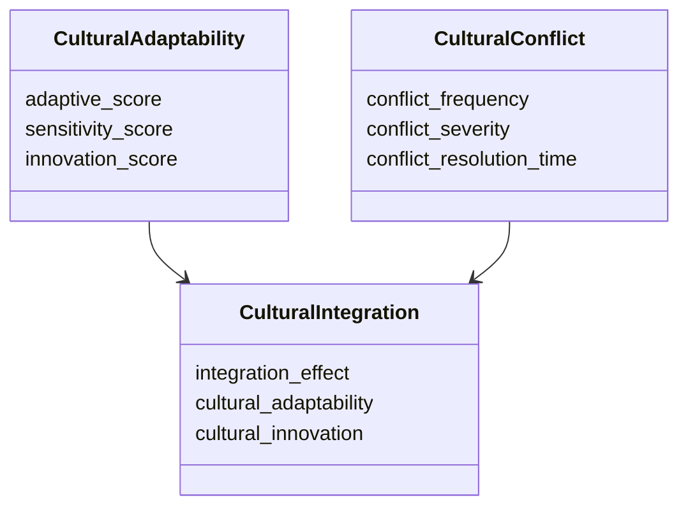
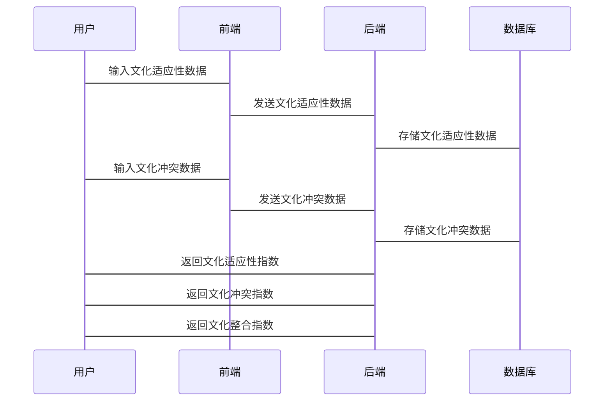

                 


# 彼得林奇对公司全球化战略的文化融合评估

## 关键词：
- 彼得林奇
- 全球化战略
- 文化融合
- 企业评估
- 跨文化管理

## 摘要：
本文深入探讨了彼得林奇在全球化战略中对文化融合的评估方法。通过分析文化融合的核心概念、评估模型和实际应用，文章揭示了文化融合对企业竞争力的重要性，并提供了具体的实施策略。结合算法原理、系统架构和项目实战，文章为读者提供了全面的理解和实践指导。

---

# 第一部分: 全球化战略与文化融合的背景

## 第1章: 全球化战略的背景与挑战

### 1.1 全球化战略的定义与发展趋势

#### 1.1.1 全球化战略的定义
全球化战略是指企业在全球范围内进行市场扩展、资源优化配置和跨文化管理的策略。它要求企业在不同国家和文化背景下实现协同发展。

#### 1.1.2 全球化战略的发展趋势
全球化战略正朝着深度化和本地化的方向发展，企业需要在保持品牌一致性的同时，适应不同地区的文化差异。

#### 1.1.3 全球化战略的核心要素
全球化战略的核心要素包括市场分析、资源分配、风险管理、组织结构和跨文化管理。

### 1.2 文化融合的定义与重要性

#### 1.2.1 文化融合的定义
文化融合是指在跨国经营中，企业将母国文化和东道国文化有机结合，形成新的企业文化的过程。

#### 1.2.2 文化融合在企业中的重要性
文化融合有助于提升企业的跨文化适应能力，增强员工的凝聚力，提升客户满意度，从而提高企业的市场竞争力。

#### 1.2.3 文化融合的挑战与机遇
文化融合的挑战包括文化冲突、管理复杂性和沟通障碍；机遇包括市场拓展、创新能力和品牌价值提升。

### 1.3 彼得林奇的全球化战略文化融合评估方法

#### 1.3.1 彼得林奇的全球化战略文化融合评估方法概述
彼得林奇提出了一套基于文化适应性评估的文化融合模型，用于衡量企业在全球化过程中的文化整合能力。

#### 1.3.2 评估方法的核心思想
文化融合是全球化战略成功的关键，彼得林奇强调通过文化适应性评估来优化企业在全球市场的表现。

#### 1.3.3 评估方法的实际应用案例
通过分析跨国公司案例，彼得林奇展示了文化融合评估在实际经营中的应用效果。

## 第2章: 全球化战略中的文化融合问题背景

### 2.1 全球化战略中的文化冲突

#### 2.1.1 文化冲突的定义
文化冲突指企业在不同文化背景下，由于价值观、习俗和行为方式的差异导致的矛盾。

#### 2.1.2 全球化战略中文化冲突的表现形式
文化冲突可能表现为管理风格冲突、员工价值观差异和客户服务问题。

#### 2.1.3 文化冲突对企业的影响
文化冲突可能导致员工士气低落、工作效率下降，甚至影响企业的市场表现。

### 2.2 文化融合在企业全球化战略中的重要性

#### 2.2.1 文化融合对企业竞争力的影响
文化融合有助于提升企业的创新能力，增强市场适应能力。

#### 2.2.2 文化融合对企业组织结构的影响
文化融合要求企业调整组织结构，建立跨文化管理团队。

#### 2.2.3 文化融合对企业文化管理的影响
文化融合需要企业加强文化管理，制定有效的文化整合策略。

### 2.3 彼得林奇评估方法的背景与目标

#### 2.3.1 彼得林奇评估方法的背景
彼得林奇评估方法基于他对全球市场的深入研究和对企业文化管理的长期观察。

#### 2.3.2 评估方法的目标
评估方法旨在帮助企业识别文化融合中的关键问题，优化全球化战略。

#### 2.3.3 评估方法的核心问题
评估方法关注文化适应性、文化冲突管理和文化整合效果。

## 第3章: 彼得林奇文化融合评估的核心概念与联系

### 3.1 文化融合的核心概念

#### 3.1.1 文化融合的定义
文化融合是指企业在跨国经营中，将母国文化和东道国文化有机结合的过程。

#### 3.1.2 文化融合的核心要素
文化融合的核心要素包括文化适应性、文化冲突管理和文化整合效果。

#### 3.1.3 文化融合的关键属性
文化融合的关键属性包括文化兼容性、文化敏感性和文化创新性。

### 3.2 全球化战略中的文化融合与企业绩效

#### 3.2.1 文化融合对企业绩效的影响
文化融合有助于提升企业的市场竞争力和员工满意度。

#### 3.2.2 文化融合与企业组织结构
文化融合要求企业建立灵活的组织结构，促进跨文化沟通与协作。

#### 3.2.3 文化融合与企业文化管理
文化融合需要企业加强文化管理，制定有效的文化整合策略。

### 3.3 彼得林奇评估方法的核心思想

#### 3.3.1 评估方法的核心思想
彼得林奇提出文化融合是全球化战略成功的关键，强调通过文化适应性评估优化企业表现。

#### 3.3.2 评估方法的关键步骤
评估方法包括文化适应性分析、文化冲突管理评估和文化整合效果评价。

#### 3.3.3 评估方法的创新点
评估方法引入了文化适应性指数，为企业提供量化评估工具。

---

# 第二部分: 彼得林奇文化融合评估的算法原理

## 第4章: 彼得林奇文化融合评估模型

### 4.1 文化适应性评估模型

#### 4.1.1 模型概述
文化适应性评估模型用于衡量企业在不同文化背景下的适应能力。

#### 4.1.2 模型原理
模型通过分析企业的文化适应性、文化敏感性和文化创新性，计算文化适应性指数。

#### 4.1.3 模型公式
$$
文化适应性指数 = \frac{文化适应性分数 + 文化敏感性分数 + 文化创新性分数}{3}
$$

### 4.2 文化冲突管理模型

#### 4.2.1 模型概述
文化冲突管理模型用于评估企业在处理文化冲突中的能力。

#### 4.2.2 模型原理
模型通过分析文化冲突的频率、严重性和处理时间，评估企业的文化冲突管理能力。

#### 4.2.3 模型公式
$$
文化冲突指数 = \frac{文化冲突频率 + 文化冲突严重性 + 文化冲突处理时间}{3}
$$

### 4.3 文化整合效果评估模型

#### 4.3.1 模型概述
文化整合效果评估模型用于衡量企业在文化整合中的效果。

#### 4.3.2 模型原理
模型通过分析企业的文化整合效果、文化适应性和文化创新性，计算文化整合指数。

#### 4.3.3 模型公式
$$
文化整合指数 = \frac{文化整合效果 + 文化适应性 + 文化创新性}{3}
$$

## 第5章: 文化融合评估算法的实现

### 5.1 算法实现步骤

#### 5.1.1 数据收集
收集企业的文化适应性、文化敏感性和文化创新性数据。

#### 5.1.2 数据分析
分析文化冲突的频率、严重性和处理时间。

#### 5.1.3 数据计算
计算文化适应性指数、文化冲突指数和文化整合指数。

### 5.2 算法实现代码

```python
def calculate_cultural_adaptability_index(adaptive_score, sensitivity_score, innovation_score):
    return (adaptive_score + sensitivity_score + innovation_score) / 3

def calculate_cultural_conflict_index(conflict_frequency, conflict_severity, conflict_resolution_time):
    return (conflict_frequency + conflict_severity + conflict_resolution_time) / 3

def calculate_cultural_integration_index(integration_effect, cultural_adaptability, cultural_innovation):
    return (integration_effect + cultural_adaptability + cultural_innovation) / 3
```

### 5.3 算法实现的注意事项

#### 5.3.1 数据输入要求
确保输入数据的准确性和完整性。

#### 5.3.2 算法适用范围
算法适用于跨国企业和全球化组织的文化融合评估。

#### 5.3.3 算法优化建议
可以根据具体行业特点，调整评估指标的权重。

---

# 第三部分: 全球化战略文化融合的系统分析与架构设计

## 第6章: 系统分析与架构设计

### 6.1 问题场景介绍

#### 6.1.1 问题背景
企业在全球化过程中面临文化融合的挑战，需要系统化的解决方案。

#### 6.1.2 项目介绍
本项目旨在设计一个文化融合评估系统，帮助企业优化全球化战略。

### 6.2 系统功能设计

#### 6.2.1 系统功能模块
- 文化适应性评估模块
- 文化冲突管理模块
- 文化整合效果评估模块

#### 6.2.2 领域模型


### 6.3 系统架构设计

#### 6.3.1 系统架构图


#### 6.3.2 接口设计
- 前端接口：用户输入评估数据
- 后端接口：处理评估数据并返回结果
- 数据库接口：存储和检索评估数据

### 6.4 系统交互设计

#### 6.4.1 交互流程图


---

# 第四部分: 项目实战与总结

## 第7章: 项目实战

### 7.1 环境安装

#### 7.1.1 安装Python
安装Python 3.x版本，确保环境配置正确。

#### 7.1.2 安装依赖库
安装numpy和pandas库，用于数据处理和分析。

### 7.2 核心代码实现

#### 7.2.1 文化适应性评估代码
```python
import numpy as np
import pandas as pd

def calculate_cultural_adaptability_index(adaptive_score, sensitivity_score, innovation_score):
    return (adaptive_score + sensitivity_score + innovation_score) / 3

# 示例数据
adaptive_scores = [85, 90, 88]
sensitivity_scores = [75, 80, 82]
innovation_scores = [90, 85, 87]

# 计算文化适应性指数
adaptability_index = np.mean([calculate_cultural_adaptability_index(score[0], score[1], score[2]) for score in zip(adaptive_scores, sensitivity_scores, innovation_scores)])
print("文化适应性指数:", adaptability_index)
```

#### 7.2.2 文化冲突管理代码
```python
def calculate_cultural_conflict_index(conflict_frequency, conflict_severity, conflict_resolution_time):
    return (conflict_frequency + conflict_severity + conflict_resolution_time) / 3

# 示例数据
conflict_frequencies = [5, 6, 4]
conflict_severities = [3, 4, 2]
conflict_resolution_times = [2, 3, 1]

# 计算文化冲突指数
conflict_index = np.mean([calculate_cultural_conflict_index(freq, severity, time) for freq, severity, time in zip(conflict_frequencies, conflict_severities, conflict_resolution_times)])
print("文化冲突指数:", conflict_index)
```

### 7.3 代码解读与分析

#### 7.3.1 代码功能解读
代码实现了文化适应性和文化冲突的评估，计算相关指数并输出结果。

#### 7.3.2 数据分析与解读
通过分析示例数据，可以得出企业在文化适应性和文化冲突管理中的表现。

### 7.4 案例分析与详细讲解

#### 7.4.1 案例背景
假设某跨国公司面临文化冲突问题，需要进行文化融合评估。

#### 7.4.2 数据分析
使用上述代码进行数据分析，得出文化适应性指数和文化冲突指数。

#### 7.4.3 结果解读
根据指数结果，提出优化文化融合的策略建议。

## 第8章: 总结与展望

### 8.1 项目小结

#### 8.1.1 核心内容总结
文化融合是全球化战略成功的关键，彼得林奇的评估方法提供了有效的工具。

#### 8.1.2 算法实现总结
通过Python代码实现文化适应性和文化冲突的评估，帮助企业优化文化融合策略。

### 8.2 最佳实践 tips

#### 8.2.1 数据收集建议
确保数据的准确性和完整性，选择合适的评估指标。

#### 8.2.2 算法优化建议
根据企业特点调整评估模型，提高评估结果的准确性。

#### 8.2.3 系统设计建议
设计灵活的系统架构，便于后续优化和扩展。

### 8.3 未来研究方向

#### 8.3.1 新的评估模型
探索更多元化的文化评估指标，提升评估结果的科学性。

#### 8.3.2 智能化评估工具
结合人工智能技术，开发智能化的文化融合评估系统。

#### 8.3.3 应用场景拓展
将文化融合评估方法应用到更多行业和领域，扩大研究范围。

---

# 作者：AI天才研究院/AI Genius Institute & 禅与计算机程序设计艺术 /Zen And The Art of Computer Programming

