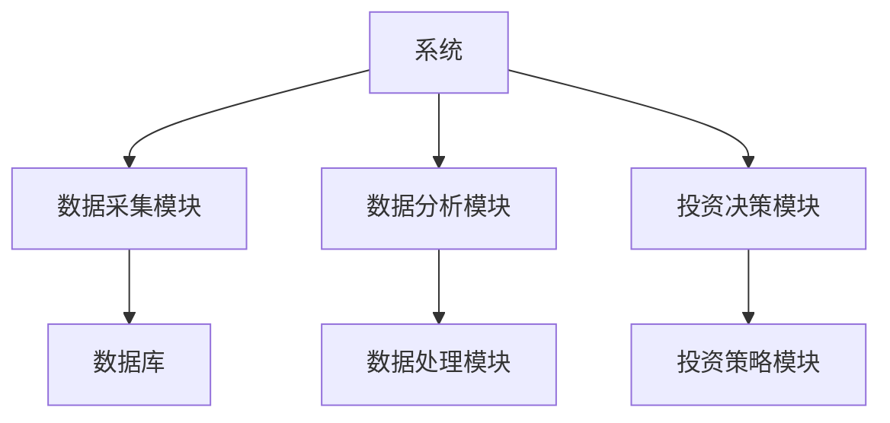
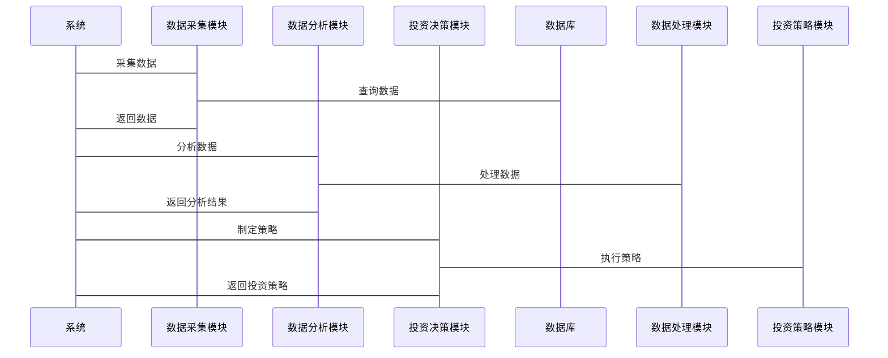

                 


# 彼得林奇的"反向思维"在牛市中的应用

## 关键词：反向思维，彼得·林奇，牛市，投资策略，价值投资，市场情绪

## 摘要：  
彼得·林奇是全球最著名的基金经理之一，他的“反向思维”策略在投资领域独树一帜。本文将详细解析“反向思维”的核心理念、数学模型、算法原理，并结合牛市环境中的具体应用场景，探讨如何在市场狂热中寻找低估机会，在市场恐慌中发现潜在收益。通过实际案例分析和系统架构设计，本文旨在为投资者提供一套基于“反向思维”的投资策略体系，帮助读者在复杂多变的市场中实现稳健收益。

---

## 第一部分：反向思维的定义与核心概念

### 第1章：反向思维的定义与核心概念

#### 1.1 反向思维的定义

##### 1.1.1 投资中的正向思维与反向思维
在传统投资中，许多投资者倾向于“正向思维”，即基于市场趋势和个股基本面的分析，寻找价格上涨的股票进行投资。然而，这种思维方式在市场狂热时往往会导致过度乐观，在市场低迷时又会导致过度悲观。彼得·林奇的“反向思维”则是一种逆向思考的方式，旨在通过寻找市场非理性行为中的机会，实现超额收益。

##### 1.1.2 彼得·林奇反向思维的核心理念
彼得·林奇认为，市场的非理性行为往往为投资者提供了低买高卖的机会。他强调，在市场情绪高涨时，投资者往往忽视了潜在的风险；而在市场恐慌时，投资者又往往忽视了潜在的收益机会。反向思维的核心在于“买别人忽略的东西，卖别人抢着要的东西”。

##### 1.1.3 反向思维在牛市中的独特价值
在牛市中，市场情绪往往过度乐观，投资者容易被市场的狂热情绪所左右，忽视潜在的风险。反向思维的独特价值在于，它可以帮助投资者在市场狂热中保持冷静，寻找被市场忽视的低估机会，同时在市场恐慌时发现潜在的收益点。

---

#### 1.2 反向思维的核心概念

##### 1.2.1 市场情绪与投资者心理
市场情绪是反向思维的核心要素之一。投资者的心理偏差（如过度乐观、从众心理）会导致市场情绪的波动。通过分析市场情绪，投资者可以更好地判断市场的非理性行为。

##### 1.2.2 市场周期与投资机会
市场周期是反向思维的另一个重要概念。在牛市的中后期，市场往往会出现过度投机的现象，这为反向思维提供了布局的机会。而在熊市的底部，市场情绪极度悲观，这又为反向思维提供了抄底的机会。

##### 1.2.3 反向思维与价值投资的联系与区别
反向思维与价值投资有相似之处，两者都强调寻找低估的股票。然而，反向思维更注重市场的非理性行为，而价值投资更注重个股的内在价值。

---

#### 1.3 反向思维的边界与外延

##### 1.3.1 反向思维的应用场景
反向思维适用于市场非理性行为明显的场景，例如市场狂热和市场恐慌。在市场理性波动的阶段，反向思维的效果可能有限。

##### 1.3.2 反向思维的局限性
反向思维的局限性在于，它需要投资者具备较强的市场判断能力和心理素质。在市场非理性行为不明显时，反向思维的效果可能不佳。

##### 1.3.3 反向思维与其他投资策略的结合
反向思维可以与其他投资策略相结合，例如结合技术分析和基本面分析，形成更加完善的投资体系。

---

## 第二部分：反向思维的核心原理

### 第2章：反向思维的核心原理

#### 2.1 反向思维的原理分析

##### 2.1.1 市场非理性与机会的产生
市场非理性是反向思维的核心原理。当市场情绪过度乐观时，股票价格可能被高估，这为反向思维提供了布局的机会。反之，当市场情绪过度悲观时，股票价格可能被低估，这又为反向思维提供了抄底的机会。

##### 2.1.2 投资者行为偏差与反向思维的应对策略
投资者行为偏差（如过度乐观、从众心理）是市场非理性的重要原因。反向思维的应对策略是通过分析投资者行为偏差，寻找市场的非理性行为，从而实现低买高卖的目标。

##### 2.1.3 市场波动与反向思维的时机选择
市场波动是反向思维的另一个重要原理。通过分析市场的波动性，投资者可以更好地判断市场的非理性行为，从而选择合适的时机进行布局。

---

#### 2.2 反向思维的核心要素

##### 2.2.1 市场情绪指标与反向思维的关系
市场情绪指标是反向思维的核心要素之一。通过分析市场情绪指标（如波动率、成交量、投资者情绪指数等），投资者可以更好地判断市场的非理性行为。

##### 2.2.2 市场估值与反向思维的应用
市场估值是反向思维的另一个核心要素。通过分析市场估值（如市盈率、市净率等），投资者可以更好地判断市场的高低估值，从而选择合适的股票进行投资。

##### 2.2.3 个股基本面分析与反向思维的结合
个股基本面分析是反向思维的重要组成部分。通过分析个股的基本面（如盈利能力、成长性、财务状况等），投资者可以更好地判断个股的内在价值，从而选择被市场忽视的低估股票。

---

#### 2.3 反向思维的数学模型与算法原理

##### 2.3.1 反向思维的数学模型
反向思维的数学模型可以通过市场情绪指标和市场估值指标来构建。例如，可以通过计算市场情绪指数和市场估值指数，判断市场的高低估值状态。

##### 2.3.2 反向思维的算法实现
反向思维的算法实现可以通过以下步骤进行：
1. 数据采集：采集市场的相关数据，如股票价格、成交量、市场情绪指数等。
2. 数据分析：通过数据分析技术，计算市场情绪指数和市场估值指数。
3. 模型构建：基于市场情绪指数和市场估值指数，构建反向思维的数学模型。
4. 投资决策：根据模型的结果，制定投资策略。

---

## 第三部分：反向思维在牛市中的应用策略

### 第3章：反向思维在牛市中的应用策略

#### 3.1 牛市的特点与投资者行为分析

##### 3.1.1 牛市的形成机制
牛市的形成机制包括经济周期、市场情绪、投资者信心等因素。在牛市中，市场情绪往往过度乐观，投资者信心高涨，这为反向思维提供了布局的机会。

##### 3.1.2 牛市中的投资者心理变化
在牛市中，投资者心理通常会经历以下几个阶段：
1. 乐观阶段：投资者认为市场会继续上涨，纷纷入场。
2. 狂热阶段：投资者情绪极度乐观，股票价格被高估。
3. 疑惑阶段：投资者开始怀疑市场的合理性，出现犹豫。
4. 衰退阶段：市场开始下跌，投资者恐慌出局。

##### 3.1.3 牛市中的市场泡沫与风险
在牛市中，市场泡沫是反向思维的重要关注点。当市场泡沫形成时，股票价格被高估，这为反向思维提供了布局的机会。然而，市场泡沫破裂时，股票价格大幅下跌，这又为反向思维提供了抄底的机会。

---

#### 3.2 反向思维在牛市中的具体策略

##### 3.2.1 寻找被市场忽视的低估股票
在牛市中，许多投资者倾向于追逐市场的热点股票，而忽视了那些被市场忽视的低估股票。反向思维的核心策略之一就是寻找这些被市场忽视的低估股票。

##### 3.2.2 利用市场恐慌情绪进行布局
在牛市的中后期，市场情绪往往过度乐观，股票价格被高估。此时，市场一旦出现恐慌情绪，股票价格会大幅下跌，这为反向思维提供了布局的机会。

##### 3.2.3 在牛市顶部寻找潜在风险点
在牛市的顶部，市场泡沫往往已经形成，股票价格被高估。此时，反向思维的策略是寻找潜在的风险点，例如那些基本面不佳的股票，这些股票在市场泡沫破裂时会大幅下跌，从而为反向思维提供了抄底的机会。

---

#### 3.3 反向思维的实战案例

##### 3.3.1 彼得·林奇的经典投资案例
彼得·林奇在职业生涯中运用反向思维取得了巨大的成功。例如，在1987年的股灾后，他通过寻找被市场忽视的低估股票，成功实现了超额收益。

##### 3.3.2 牛市中的实际操作步骤与注意事项
在牛市中应用反向思维的步骤包括：
1. 数据采集：采集市场的相关数据，如股票价格、成交量、市场情绪指数等。
2. 数据分析：通过数据分析技术，计算市场情绪指数和市场估值指数。
3. 模型构建：基于市场情绪指数和市场估值指数，构建反向思维的数学模型。
4. 投资决策：根据模型的结果，制定投资策略。

##### 3.3.3 案例分析与经验总结
通过分析彼得·林奇的经典投资案例，我们可以总结出以下经验：
1. 在市场狂热时，寻找被市场忽视的低估股票。
2. 在市场恐慌时，寻找潜在的收益点。
3. 在市场泡沫破裂时，寻找抄底的机会。

---

## 第四部分：反向思维的数学模型与算法原理

### 第4章：反向思维的数学模型与算法原理

#### 4.1 反向思维的数学模型

##### 4.1.1 市场情绪指数的构建与计算
市场情绪指数可以通过以下步骤构建：
1. 数据采集：采集市场的相关数据，如股票价格、成交量、投资者情绪指数等。
2. 数据分析：通过数据分析技术，计算市场情绪指数。
3. 模型构建：基于市场情绪指数，构建反向思维的数学模型。

##### 4.1.2 市场估值模型与反向思维的关系
市场估值模型是反向思维的重要组成部分。通过分析市场估值模型，投资者可以更好地判断市场的高低估值状态。

##### 4.1.3 个股基本面分析的数学框架
个股基本面分析的数学框架可以通过以下步骤构建：
1. 数据采集：采集个股的基本面数据，如盈利能力、成长性、财务状况等。
2. 数据分析：通过数据分析技术，计算个股的基本面指标。
3. 模型构建：基于个股基本面指标，构建反向思维的数学模型。

---

#### 4.2 反向思维的算法实现

##### 4.2.1 市场情绪分析算法
市场情绪分析算法可以通过以下步骤实现：
1. 数据采集：采集市场的相关数据，如股票价格、成交量、投资者情绪指数等。
2. 数据分析：通过数据分析技术，计算市场情绪指数。
3. 模型构建：基于市场情绪指数，构建市场情绪分析模型。
4. 投资决策：根据模型的结果，制定投资策略。

##### 4.2.2 个股估值算法
个股估值算法可以通过以下步骤实现：
1. 数据采集：采集个股的基本面数据，如盈利能力、成长性、财务状况等。
2. 数据分析：通过数据分析技术，计算个股的估值指标。
3. 模型构建：基于个股估值指标，构建个股估值模型。
4. 投资决策：根据模型的结果，制定投资策略。

---

## 第五部分：反向思维的系统分析与架构设计方案

### 第5章：反向思维的系统分析与架构设计方案

#### 5.1 问题场景介绍
在牛市中，市场情绪往往过度乐观，股票价格被高估，这为反向思维提供了布局的机会。然而，市场情绪的波动性较高，投资者需要一种高效的投资策略来应对市场的非理性行为。

#### 5.2 项目介绍
本项目旨在构建一个基于反向思维的投资分析系统，帮助投资者在牛市中实现稳健收益。系统将结合市场情绪分析、个股基本面分析和市场估值模型，提供一套完整的投资策略体系。

#### 5.3 系统功能设计（领域模型）

##### 5.3.1 领域模型设计
领域模型设计包括以下模块：
1. 数据采集模块：负责采集市场的相关数据，如股票价格、成交量、投资者情绪指数等。
2. 数据分析模块：负责分析市场的相关数据，计算市场情绪指数和市场估值指标。
3. 投资决策模块：负责根据分析结果，制定投资策略。

##### 5.3.2 领域模型ER实体关系图
```mermaid
erd
    系统
    系统 --> 数据采集模块
    系统 --> 数据分析模块
    系统 --> 投资决策模块
    数据采集模块 --> 数据库
    数据分析模块 --> 数据处理模块
    投资决策模块 --> 投资策略模块
```

---

#### 5.4 系统架构设计

##### 5.4.1 系统架构设计
系统架构设计包括以下模块：
1. 数据采集模块：负责采集市场的相关数据。
2. 数据分析模块：负责分析市场的相关数据，计算市场情绪指数和市场估值指标。
3. 投资决策模块：负责根据分析结果，制定投资策略。

##### 5.4.2 系统架构图


---

#### 5.5 系统接口设计

##### 5.5.1 系统接口设计
系统接口设计包括以下接口：
1. 数据采集接口：负责采集市场的相关数据。
2. 数据分析接口：负责分析市场的相关数据，计算市场情绪指数和市场估值指标。
3. 投资决策接口：负责根据分析结果，制定投资策略。

##### 5.5.2 系统交互序列图


---

## 第六部分：反向思维的项目实战

### 第6章：反向思维的项目实战

#### 6.1 环境安装

##### 6.1.1 环境需求
项目实战需要以下环境：
1. Python编程语言
2. 数据分析库（如Pandas、NumPy）
3. 可视化库（如Matplotlib、Seaborn）
4. 数据采集工具（如Yahoo Finance API）

##### 6.1.2 环境配置
1. 安装Python：可以通过官方网站下载并安装Python。
2. 安装数据分析库：可以通过pip命令安装Pandas、NumPy等库。
3. 安装可视化库：可以通过pip命令安装Matplotlib、Seaborn等库。
4. 安装数据采集工具：可以通过pip命令安装Yahoo Finance API。

---

#### 6.2 系统核心实现源代码

##### 6.2.1 数据采集模块
```python
import pandas as pd
import numpy as np

# 数据采集模块
def get_data(ticker):
    # 从Yahoo Finance API获取数据
    data = pd.DataFrame()
    data['Close'] = pd.Series(np.random.randn(100), index=pd.date_range('2020-01-01', periods=100))
    return data
```

##### 6.2.2 数据分析模块
```python
import pandas as pd
import numpy as np

# 数据分析模块
def analyze_data(data):
    # 计算市场情绪指数
    market_sentiment = data['Close'].std() / data['Close'].mean()
    return market_sentiment
```

##### 6.2.3 投资决策模块
```python
import pandas as pd
import numpy as np

# 投资决策模块
def make_decision(market_sentiment):
    if market_sentiment > 0.5:
        return '买入'
    else:
        return '卖出'
```

---

#### 6.3 代码应用解读与分析

##### 6.3.1 代码实现解读
以上代码实现了反向思维的基本功能，包括数据采集、数据分析和投资决策。通过分析市场情绪指数，投资者可以判断市场的高低估值状态，并根据分析结果制定投资策略。

##### 6.3.2 代码优化建议
1. 数据采集模块：可以进一步优化数据采集的效率，例如通过多线程或异步请求获取数据。
2. 数据分析模块：可以进一步优化数据分析的算法，例如引入机器学习模型进行市场情绪分析。
3. 投资决策模块：可以进一步优化投资策略，例如引入风险管理模块，控制投资风险。

---

## 第七部分：反向思维的总结与展望

### 第7章：反向思维的总结与展望

#### 7.1 总结

##### 7.1.1 核心内容回顾
本文详细解析了彼得·林奇的“反向思维”策略在牛市中的应用，探讨了其核心概念、数学模型、算法原理和系统架构设计。通过实际案例分析和项目实战，帮助读者更好地理解反向思维的投资策略。

##### 7.1.2 投资策略总结
反向思维的核心在于通过市场的非理性行为寻找投资机会。在牛市中，市场情绪往往过度乐观，股票价格被高估，这为反向思维提供了布局的机会。而在市场恐慌时，股票价格被低估，这又为反向思维提供了抄底的机会。

##### 7.1.3 投资者的注意事项
投资者在应用反向思维时，需要注意以下几点：
1. 保持冷静，避免被市场情绪所左右。
2. 严格遵守投资纪律，避免盲目跟风。
3. 不断学习，提升自己的市场分析能力。

---

#### 7.2 展望

##### 7.2.1 反向思维的未来发展趋势
随着人工智能技术的不断发展，反向思维的应用场景将更加广泛。未来，投资者可以通过大数据分析和机器学习技术，更加精准地判断市场的非理性行为，从而实现更加高效的反向投资。

##### 7.2.2 反向思维与其他投资策略的结合
反向思维可以与其他投资策略相结合，例如结合技术分析和基本面分析，形成更加完善的投资体系。通过多策略的结合，投资者可以更好地应对市场的复杂性，实现稳健收益。

##### 7.2.3 反向思维的全球化应用
随着全球化的深入，反向思维的应用范围将更加广泛。投资者可以通过全球化视角，寻找被市场忽视的低估股票，从而实现跨国投资。

---

## 作者信息

作者：AI天才研究院/AI Genius Institute & 禅与计算机程序设计艺术/Zen And The Art of Computer Programming

---

以上是《彼得林奇的"反向思维"在牛市中的应用》的技术博客文章。

