                 


```markdown
# 智能代码生成 AI Agent：LLM 辅助软件开发

> 关键词：智能代码生成，AI Agent，LLM，大语言模型，软件开发

> 摘要：本文深入探讨了智能代码生成 AI Agent 的核心概念、算法原理和系统架构设计，展示了如何利用大语言模型（LLM）辅助软件开发，从问题背景到系统实现，逐步解析其实现原理和应用价值。

---

## 第一部分: 背景与概念基础

### 第1章: 问题背景与描述

#### 1.1 问题背景

##### 1.1.1 软件开发的挑战
在现代软件开发中，开发者面临着日益复杂的挑战：需求的快速变化、代码的可维护性、开发效率的提升以及代码质量的保障。传统手动编码方式效率低下，难以应对快速迭代的开发需求。

##### 1.1.2 代码生成的现状与痛点
尽管代码生成技术在一定程度上缓解了开发者的部分压力，但现有工具仍存在诸多痛点，如生成代码的质量参差不齐、难以处理复杂逻辑、缺乏智能化的上下文理解等。

##### 1.1.3 AI技术在代码生成中的潜力
人工智能技术，特别是大语言模型（LLM），以其强大的自然语言理解和生成能力，为代码生成带来了新的可能性。通过LLM辅助的AI Agent，开发者可以更高效、更智能地生成高质量代码。

#### 1.2 问题描述

##### 1.2.1 代码生成的需求分析
代码生成不仅仅是简单地输出代码片段，而是需要结合上下文理解、意图识别以及对业务逻辑的深入理解，生成符合特定场景需求的代码。

##### 1.2.2 LLM与AI Agent的结合
LLM提供了强大的文本生成能力，而AI Agent则负责理解和执行用户的意图，两者结合可以实现智能化的代码生成。

##### 1.2.3 智能代码生成的目标与范围
智能代码生成的目标是通过AI技术辅助开发者快速生成高质量代码，减少重复劳动，提高开发效率。其范围涵盖从简单的API调用到复杂的业务逻辑生成。

#### 1.3 问题解决与边界

##### 1.3.1 AI Agent在代码生成中的角色
AI Agent作为代码生成的智能中枢，负责接收用户的请求，分析需求，调用LLM生成代码，并对生成结果进行验证和优化。

##### 1.3.2 LLM辅助开发的边界与限制
尽管LLM在代码生成中表现优异，但其能力也有边界。例如，LLM无法执行实际的程序运行，无法处理实时数据，且生成代码的质量依赖于训练数据的质量和数量。

##### 1.3.3 智能代码生成的适用场景
智能代码生成适用于快速原型开发、API接口生成、业务逻辑生成等场景，尤其在处理复杂业务逻辑和需要高度定制化的代码时表现突出。

### 第2章: 核心概念与联系

#### 2.1 LLM与AI Agent的基本原理

##### 2.1.1 大语言模型的定义与特点
大语言模型（LLM）是一种基于深度学习的自然语言处理模型，具有参数量大、上下文理解能力强、生成能力强等特点。

##### 2.1.2 AI Agent的概念与功能
AI Agent是一种智能体，能够理解用户意图，并通过调用各种工具（如LLM）来完成任务。在代码生成中，AI Agent负责接收请求、分析需求、调用LLM生成代码，并进行结果验证。

##### 2.1.3 LLM与AI Agent的关系
LLM为AI Agent提供了强大的生成能力，而AI Agent则为LLM提供了应用场景和目标，两者相辅相成，共同实现智能代码生成。

#### 2.2 核心概念对比

##### 2.2.1 LLM与传统NLP模型的对比
| 特性                | LLM                          | 传统NLP模型                  |
|---------------------|------------------------------|------------------------------|
| 参数规模            | 大规模（如10亿+参数）        | 较小规模（如 millions）        |
| 上下文理解能力      | 强大，支持长上下文             | 较弱，通常支持短文本           |
| 多任务处理能力      | 强大，可以通过微调处理多种任务 | 较弱，通常针对特定任务设计    |

##### 2.2.2 AI Agent与传统脚本工具的对比
| 特性                | AI Agent                      | 传统脚本工具                  |
|---------------------|-------------------------------|------------------------------|
| 智能性               | 高，具备理解和推理能力         | 低，通常仅执行预定义脚本       |
| 适应性               | 高，能够根据上下文调整行为     | 低，行为固定，难以应对变化     |
| 交互方式             | 自然语言交互为主              | 命令行或图形界面交互为主       |

##### 2.2.3 智能代码生成与其他代码生成方式的对比
| 特性                | 智能代码生成                  | 传统代码生成                  |
|---------------------|------------------------------|------------------------------|
| 生成方式             | 基于LLM生成，智能化            | 基于模板或规则生成，自动化     |
| 生成质量             | 高，代码符合上下文逻辑        | 中，依赖模板设计的质量         |
| 适应性               | 高，能够处理复杂场景           | 低，难以处理复杂逻辑           |

#### 2.3 实体关系图

##### 2.3.1 LLM与AI Agent的实体关系
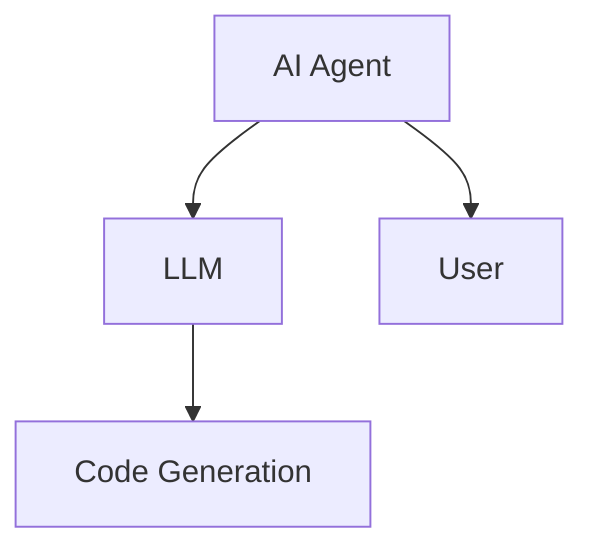

##### 2.3.2 用户与智能代码生成系统的交互关系
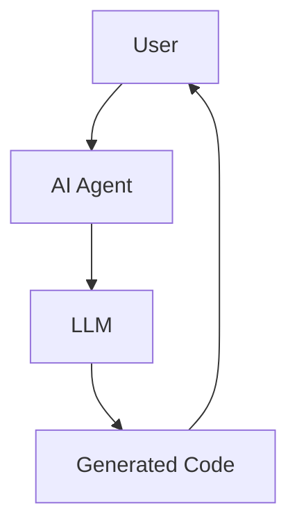

##### 2.3.3 代码生成过程中的数据流关系
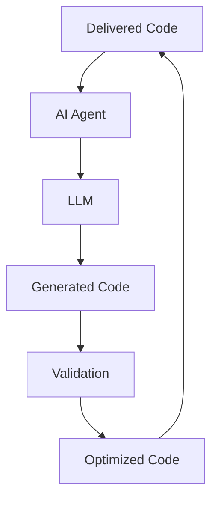

---

## 第二部分: 算法原理与数学模型

### 第3章: LLM与AI Agent的算法原理

#### 3.1 LLM的训练与推理过程

##### 3.1.1 LLM的训练流程
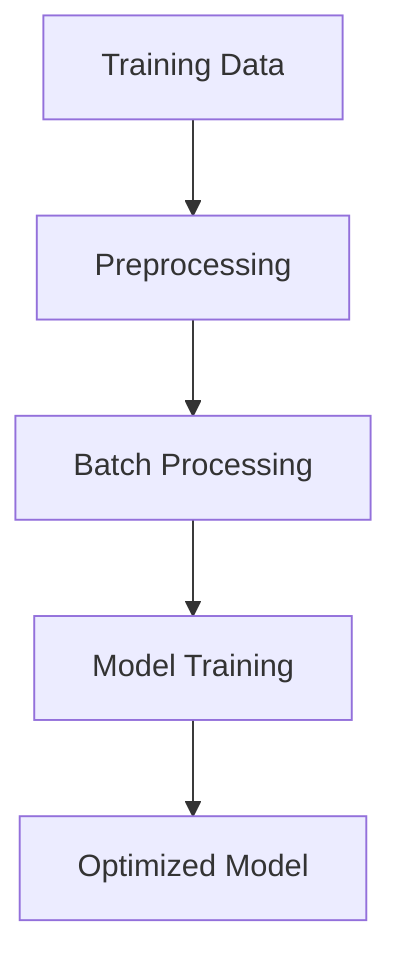

##### 3.1.2 基于LLM的生成算法
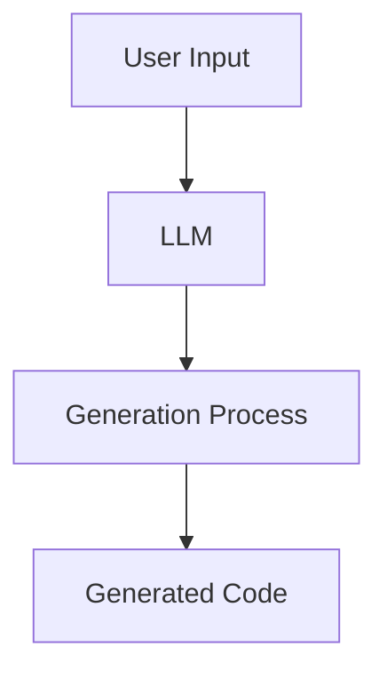

##### 3.1.3 AI Agent的决策机制
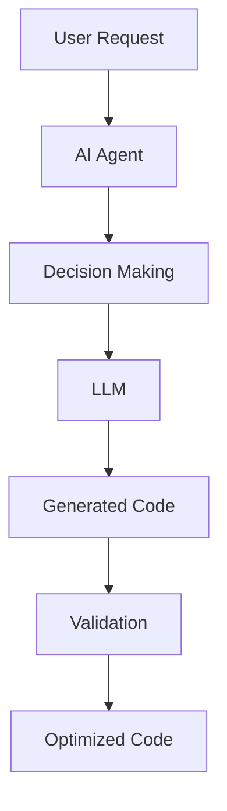

#### 3.2 智能代码生成的算法流程

##### 3.2.1 需求分析与意图识别
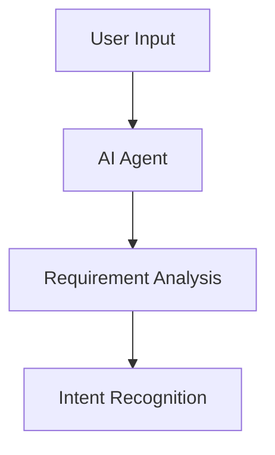

##### 3.2.2 代码生成策略的选择
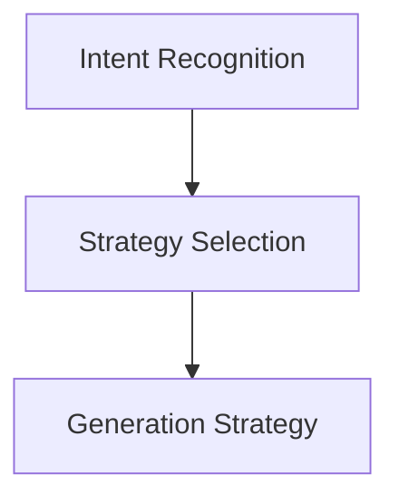

##### 3.2.3 生成代码的验证与优化
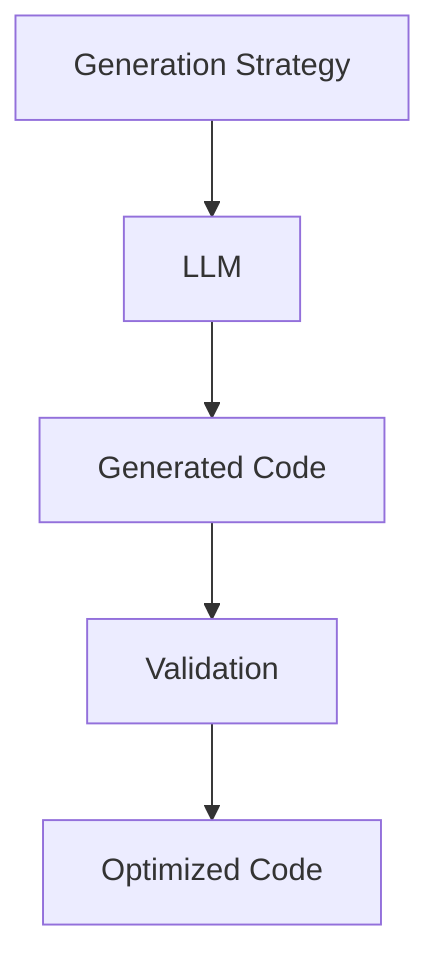

#### 3.3 算法流程图

##### 3.3.1 LLM训练流程的mermaid图


##### 3.3.2 AI Agent决策流程的mermaid图


##### 3.3.3 代码生成算法的mermaid图
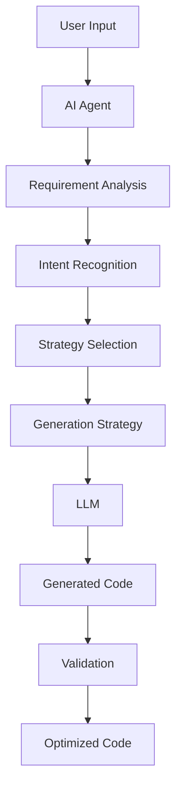

#### 3.4 数学模型与公式

##### 3.4.1 LLM的核心数学模型
- Transformer模型的结构：
  - 输入序列：\( x_1, x_2, \ldots, x_n \)
  - 输出序列：\( y_1, y_2, \ldots, y_m \)
  - 注意力机制：
    $$ \text{Attention}(Q, K, V) = \text{softmax}\left(\frac{QK^T}{\sqrt{d_k}}\right)V $$

##### 3.4.2 注意力机制的数学表达
- 查询（Q）、键（K）、值（V）的计算：
  $$ Q = W_q x, K = W_k x, V = W_v x $$

##### 3.4.3 激活函数的作用与选择
- 常见激活函数：ReLU、Sigmoid、Tanh
- 选择依据：任务需求和模型深度

##### 3.4.4 决策模型的优化目标
- 最大化生成代码的准确性：
  $$ \arg \max_{\theta} \sum_{i=1}^n \log p_\theta(y_i|x_{<i}) $$

---

## 第三部分: 系统分析与架构设计

### 第5章: 系统架构设计方案

#### 5.1 系统功能设计

##### 5.1.1 需求分析与功能模块划分
- 功能模块：用户交互、需求分析、代码生成、结果验证
- 领域模型：用户输入 → 需求分析 → 生成代码 → 验证优化

##### 5.1.2 系统功能的领域模型
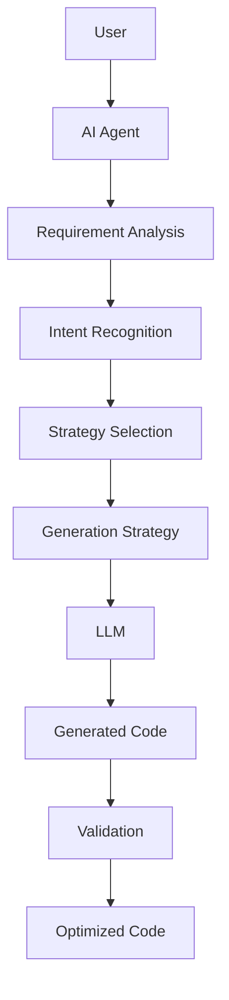

##### 5.1.3 系统功能的类图
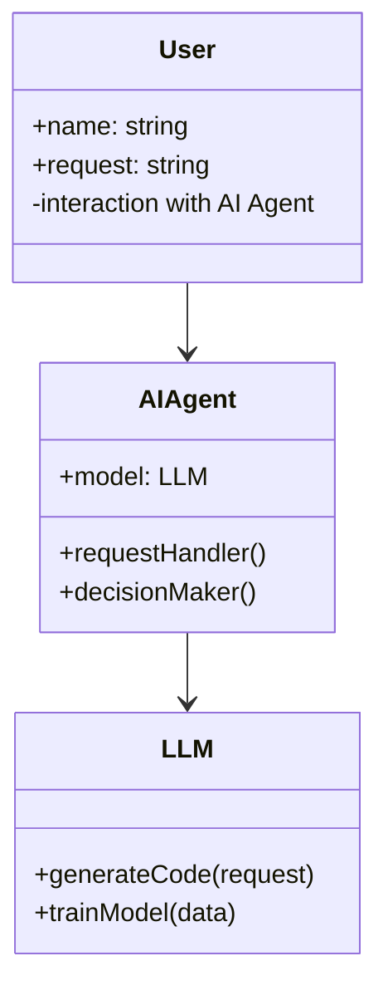

#### 5.2 系统架构设计

##### 5.2.1 系统架构的总体设计
- 分层架构：用户层、业务逻辑层、数据层
- 模块化设计：独立的代码生成模块和验证优化模块

##### 5.2.2 系统架构的详细设计


##### 5.2.3 系统架构的优化
- 并行处理：减少生成时间
- 模型优化：提升生成质量

#### 5.3 系统接口设计

##### 5.3.1 API接口设计
- 输入接口：用户请求
- 输出接口：生成代码
- 接口协议：RESTful API

##### 5.3.2 接口交互流程


#### 5.4 系统交互设计

##### 5.4.1 交互流程的优化
- 用户输入 → AI Agent分析 → LLM生成 → 验证优化 → 输出代码

##### 5.4.2 交互过程的序列图


---

## 第四部分: 项目实战

### 第6章: 项目实战

#### 6.1 环境安装与配置

##### 6.1.1 环境需求
- Python 3.8+
- PyTorch或TensorFlow
- Hugging Face Transformers库

##### 6.1.2 安装依赖
```bash
pip install torch transformers
```

#### 6.2 核心实现

##### 6.2.1 AI Agent的实现
```python
class AI-Agent:
    def __init__(self, model):
        self.model = model

    def process_request(self, request):
        # 分析需求
        analysis = self.analyze_request(request)
        # 生成代码
        code = self.generate_code(analysis)
        # 验证代码
        validated_code = self.validate_code(code)
        return validated_code
```

##### 6.2.2 LLM的实现
```python
class LLM:
    def __init__(self, model_name):
        self.model_name = model_name
        self.model = AutoModelForCausalLM.from_pretrained(model_name)

    def generate(self, prompt):
        inputs = self.tokenizer(prompt, return_tensors="pt")
        outputs = self.model.generate(**inputs, max_length=500)
        return self.tokenizer.decode(outputs[0], skip_special_tokens=True)
```

#### 6.3 代码解读与分析

##### 6.3.1 AI Agent的核心逻辑
```python
def analyze_request(self, request):
    # 这里实现需求分析和意图识别
    pass

def generate_code(self, analysis):
    # 调用LLM生成代码
    return self.model.generate_code(analysis)
```

##### 6.3.2 LLM的生成过程
```python
def generate(self, prompt):
    inputs = self.tokenizer(prompt, return_tensors="pt")
    outputs = self.model.generate(**inputs, max_length=500)
    return self.tokenizer.decode(outputs[0], skip_special_tokens=True)
```

#### 6.4 案例分析与详细讲解

##### 6.4.1 实际案例分析
案例：生成一个登录页面的后端代码
```python
request = "生成一个登录页面的后端代码"
agent = AI-Agent(model)
code = agent.process_request(request)
```

##### 6.4.2 解析与优化
- 分析请求：理解用户需要生成登录页面的后端代码
- 生成代码：调用LLM生成Python代码
- 验证优化：检查代码逻辑，优化代码结构

#### 6.5 项目小结

##### 6.5.1 小结
通过AI Agent和LLM的结合，实现了智能化的代码生成，显著提高了开发效率。

##### 6.5.2 注意事项
- 确保LLM模型的训练数据质量
- 定期更新模型以适应新需求
- 注意生成代码的可维护性和可测试性

##### 6.5.3 拓展阅读
- 大语言模型的微调与优化
- AI Agent在其他领域的应用
- 代码生成的质量评估与改进

---

## 第五部分: 总结与最佳实践

### 第7章: 总结与最佳实践

#### 7.1 总结

##### 7.1.1 核心要点回顾
- AI Agent在代码生成中的角色
- LLM的训练与生成原理
- 系统架构设计与实现

##### 7.1.2 经验总结
- 结合实际需求选择合适的模型
- 注重生成代码的质量和可维护性
- 定期优化系统架构以适应变化

#### 7.2 最佳实践

##### 7.2.1 小结
智能代码生成AI Agent通过结合LLM的强大生成能力和AI Agent的智能决策，为软件开发提供了新的可能性。

##### 7.2.2 注意事项
- 确保数据安全与隐私保护
- 定期更新模型以保持生成能力
- 提供清晰的错误处理机制

##### 7.2.3 拓展阅读
- 深度学习模型的优化技巧
- 自然语言处理在软件工程中的应用
- AI在软件开发中的其他创新应用

---

## 作者信息

作者：AI天才研究院/AI Genius Institute & 禅与计算机程序设计艺术 /Zen And The Art of Computer Programming

---

本文通过系统地分析智能代码生成AI Agent的背景、算法原理、系统架构设计以及实际项目案例，全面展示了如何利用大语言模型辅助软件开发，为开发者提供了新的思路和工具。
```

