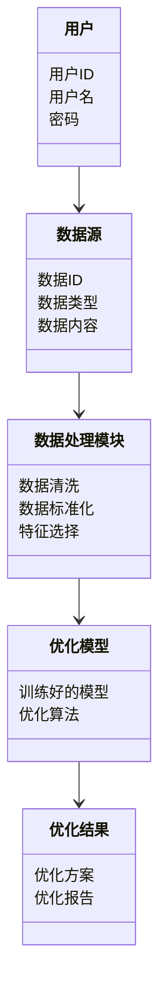
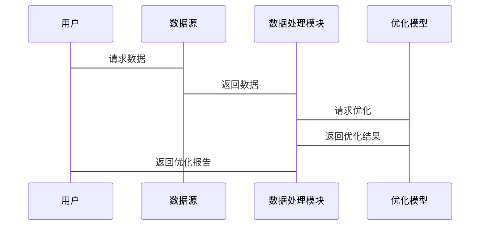

                 


# 构建智能化的企业资本结构优化平台

> 关键词：企业资本结构优化、人工智能、机器学习、数学建模、系统架构

> 摘要：本文将详细介绍如何构建智能化的企业资本结构优化平台。通过结合数学建模、机器学习和系统架构设计，我们能够更高效地优化企业的资本结构，降低资本成本，提升企业价值。文章内容涵盖从问题背景到系统实现的全过程，包括背景介绍、核心概念、算法原理、系统架构设计、项目实战等部分。

---

## 第一部分：背景介绍与核心概念

### 第1章：企业资本结构优化的背景与问题

#### 1.1 企业资本结构优化的背景

- **1.1.1 企业资本结构的基本概念**
  - 资本结构是指企业各种长期资本的构成及其比例，主要包括债务资本和股权资本。
  - 资本结构优化的目标是实现企业价值最大化，同时降低资本成本。

- **1.1.2 资本结构优化的重要性**
  - 优化资本结构可以降低企业的加权平均资本成本（WACC）。
  - 优化资本结构有助于企业应对不同的经济环境和市场变化。

- **1.1.3 当前企业资本结构优化的挑战**
  - 数据量大且复杂，传统方法难以处理。
  - 市场环境变化快，需要动态优化。
  - 传统优化方法缺乏智能化，难以应对复杂场景。

#### 1.2 问题背景与问题描述

- **1.2.1 资本结构优化中的主要问题**
  - 数据不足或数据质量差，难以构建准确的模型。
  - 优化过程中约束条件多，难以找到全局最优解。
  - 传统优化方法计算复杂，难以实时优化。

- **1.2.2 传统资本结构优化方法的局限性**
  - 基于假设的静态模型（如Modigliani-Miller模型）难以应对动态市场。
  - 传统线性规划方法计算效率低，难以处理大规模数据。

- **1.2.3 智能化优化的需求与目标**
  - 引入人工智能和机器学习技术，提高优化效率。
  - 实现动态优化，适应市场变化。
  - 提供个性化优化方案，满足不同企业的需求。

#### 1.3 问题解决思路

- **1.3.1 数据驱动的优化方法**
  - 利用历史数据和实时数据，构建数据驱动的优化模型。
  - 通过数据挖掘和特征工程，提取关键特征，提高模型准确性。

- **1.3.2 人工智能在资本结构优化中的应用**
  - 使用机器学习算法（如支持向量机、随机森林）进行预测和优化。
  - 引入深度学习技术，处理非结构化数据和复杂场景。

- **1.3.3 智能化平台的构建思路**
  - 整合多种优化算法，构建智能化优化平台。
  - 提供用户友好的界面，方便企业用户使用。

### 第2章：资本结构优化的核心概念与联系

#### 2.1 资本结构优化的核心要素

- **2.1.1 资本结构的组成**
  - 债务资本（D）：包括短期债务和长期债务。
  - 股权资本（E）：包括普通股和优先股。
  - 总资本（D + E）：企业的总资本规模。

- **2.1.2 资本成本的计算**
  - 债务成本（$r_d$）：债务的利率。
  - 股权成本（$r_e$）：股权的预期回报率。
  - 加权平均资本成本（WACC）：$ WACC = \frac{D}{D+E} \times r_d \times (1 - T) + \frac{E}{D+E} \times r_e $，其中 $T$ 是企业所得税率。

- **2.1.3 资本结构优化的目标函数**
  - 最大化企业价值（V）：$ V = \frac{FCF}{WACC} $。
  - 最小化加权平均资本成本（WACC）。

#### 2.2 核心概念的属性对比

- **2.2.1 不同资本工具的属性对比**
  | 资本工具 | 融资成本 | 税盾效应 | 股权稀释 |
  |----------|----------|----------|----------|
  | 债务     | 较低     | 存在     | 无       |
  | 股权     | 较高     | 无       | 有       |

- **2.2.2 优化目标与约束条件的对比**
  | 优化目标           | 约束条件                 |
  |--------------------|--------------------------|
  | 最大化企业价值       | 资本规模限制             |
  | 最小化资本成本       | 偿债能力限制             |
  | 适应市场变化         | 监管要求                 |

- **2.2.3 数据特征与模型选择的对比**
  | 数据特征             | 线性模型适用 | 非线性模型适用 |
  |----------------------|--------------|--------------|
  | 线性关系              | 是          | 否          |
  | 非线性关系            | 否          | 是          |
  | 高维数据              | 否          | 是          |

#### 2.3 实体关系图（ER图）架构

```mermaid
erd
  entity 资本结构 {
    D_id int PK
    D_type varchar
    D_amount numeric
    D_interest_rate decimal
    D_maturity_date date
    E_id int PK
    E_type varchar
    E_shares numeric
    E_dividend_rate decimal
    E_floatation_cost decimal
  }
  entity 企业 {
    Enterprise_id int PK
    Name varchar
    Industry varchar
    Country varchar
    Revenue numeric
    Profit numeric
  }
  entity 优化结果 {
    Result_id int PK
    Optimal_D_E_ratio decimal
    Optimal_WACC decimal
    Optimal_Enterprise_value decimal
  }
  -- 关系
  资本结构 -->> 企业
  资本结构 -->> 优化结果
```

#### 2.4 本章小结

通过本章的介绍，我们了解了资本结构优化的核心要素，包括资本结构的组成、资本成本的计算以及优化的目标函数。同时，我们还对比了不同资本工具的属性、优化目标与约束条件，以及数据特征与模型选择的关系。最后，我们通过ER图展示了资本结构优化的实体关系。

---

## 第二部分：算法原理与数学模型

### 第3章：机器学习与优化算法在资本结构优化中的应用

#### 3.1 机器学习在资本结构优化中的作用

- **3.1.1 机器学习的基本概念**
  - 机器学习是一种人工智能技术，通过数据训练模型，实现预测和决策。
  - 监督学习、无监督学习和强化学习在资本结构优化中的应用。

- **3.1.2 机器学习在资本结构优化中的应用场景**
  - 数据特征提取与降维。
  - 资本成本预测。
  - 优化结果的预测与验证。

- **3.1.3 机器学习的优势与局限性**
  - 优势：高效、动态适应性强。
  - 局限性：需要大量数据，计算复杂。

#### 3.2 常用优化算法简介

- **3.2.1 线性规划与非线性规划**
  - 线性规划：目标函数和约束条件均为线性。
  - 非线性规划：目标函数或约束条件为非线性。

- **3.2.2 遗传算法与模拟退火**
  - 遗传算法：模拟生物进化，通过选择、交叉和变异生成新解。
  - 模拟退火：通过随机扰动和接受准则找到全局最优解。

- **3.2.3 支持向量机与决策树**
  - 支持向量机：用于分类和回归，适合高维数据。
  - 决策树：用于分类和回归，适合特征工程。

#### 3.3 算法原理与流程图

- **3.3.1 算法选择与流程设计**
  - 根据问题特点选择算法。
  - 流程包括数据预处理、模型训练、优化计算和结果验证。

- **3.3.2 算法实现的步骤分解**
  1. 数据预处理：清洗、标准化、特征选择。
  2. 模型训练：选择合适的算法，训练模型。
  3. 优化计算：基于训练好的模型，进行资本结构优化。
  4. 结果验证：验证优化结果的准确性和有效性。

- **3.3.3 算法的收敛性与稳定性分析**
  - 算法是否收敛到全局最优解。
  - 算法在不同数据集上的稳定性。

#### 3.4 本章小结

通过本章的介绍，我们了解了机器学习在资本结构优化中的作用，以及常用优化算法的基本原理和应用场景。同时，我们还讨论了算法选择和流程设计的注意事项，以及算法的收敛性和稳定性。

---

### 第4章：资本结构优化的数学模型与公式

#### 4.1 资本结构优化的基本数学模型

- **4.1.1 加权平均资本成本（WACC）公式**
  $$ WACC = \frac{D}{D+E} \times r_d \times (1 - T) + \frac{E}{D+E} \times r_e $$

- **4.1.2 净现值（NPV）公式**
  $$ NPV = \sum_{t=0}^{n} \frac{CF_t}{(1 + r)^t} $$

#### 4.2 数据预处理与特征工程

- **4.2.1 数据清洗与标准化**
  - 删除缺失值和异常值。
  - 标准化数据，使其具有相同的尺度。

- **4.2.2 特征选择与降维**
  - 使用主成分分析（PCA）进行降维。
  - 选择对目标函数影响最大的特征。

- **4.2.3 时间序列数据的处理**
  - 使用滑动窗口方法处理时间序列数据。
  - 引入滞后变量，捕捉数据的时序特征。

#### 4.3 优化模型的数学表达

- **4.3.1 线性规划模型**
  $$ \text{minimize } \sum_{i=1}^{n} c_i x_i $$
  $$ \text{subject to } \sum_{i=1}^{n} a_i x_i \geq b $$

- **4.3.2 非线性规划模型**
  $$ \text{minimize } f(x) $$
  $$ \text{subject to } g(x) \leq 0 $$

#### 4.4 本章小结

通过本章的介绍，我们了解了资本结构优化的基本数学模型，包括WACC和NPV公式。同时，我们还讨论了数据预处理与特征工程的方法，以及线性规划和非线性规划模型的数学表达。

---

## 第三部分：系统分析与架构设计方案

### 第5章：系统分析与架构设计方案

#### 5.1 问题场景介绍

- **5.1.1 企业资本结构优化的场景**
  - 企业需要优化资本结构，降低资本成本。
  - 企业需要动态调整资本结构，适应市场变化。

- **5.1.2 智能化平台的目标**
  - 提供智能化的资本结构优化服务。
  - 提供动态优化和个性化推荐。

#### 5.2 项目介绍

- **5.2.1 项目目标**
  - 构建智能化的企业资本结构优化平台。
  - 提供高效、准确的资本结构优化方案。

- **5.2.2 项目范围**
  - 数据采集与处理。
  - 模型训练与优化。
  - 平台开发与部署。

#### 5.3 系统功能设计

- **5.3.1 领域模型（Mermaid类图）**


- **5.3.2 系统架构设计（Mermaid架构图）**


- **5.3.3 系统接口设计**
  - 用户接口：网页或API。
  - 数据接口：数据源接口。
  - 模型接口：优化模型接口。

- **5.3.4 系统交互流程（Mermaid序列图）**


#### 5.4 本章小结

通过本章的介绍，我们了解了智能化企业资本结构优化平台的系统架构设计，包括领域模型、系统架构图和系统交互流程图。这些设计为后续的系统开发奠定了基础。

---

## 第四部分：项目实战

### 第6章：项目实战

#### 6.1 环境安装与配置

- **6.1.1 安装Python**
  - 安装Python 3.8或更高版本。
  - 安装Jupyter Notebook用于数据处理和模型训练。

- **6.1.2 安装依赖库**
  - 安装Pandas、NumPy、Scikit-learn、XGBoost等库。
  - 使用以下命令安装：
    ```bash
    pip install pandas numpy scikit-learn xgboost
    ```

#### 6.2 系统核心实现源代码

- **6.2.1 数据预处理代码**
```python
import pandas as pd
import numpy as np

# 数据加载
data = pd.read_csv('capital_structure.csv')

# 数据清洗
data.dropna(inplace=True)

# 标准化
from sklearn.preprocessing import StandardScaler
scaler = StandardScaler()
scaled_data = scaler.fit_transform(data)

# 特征选择
from sklearn.decomposition import PCA
pca = PCA(n_components=10)
reduced_data = pca.fit_transform(scaled_data)
```

- **6.2.2 优化模型代码**
```python
from sklearn.ensemble import RandomForestRegressor
from sklearn.model_selection import train_test_split

# 训练模型
X_train, X_test, y_train, y_test = train_test_split(reduced_data, data['WACC'], test_size=0.2)
model = RandomForestRegressor(n_estimators=100)
model.fit(X_train, y_train)

# 预测与优化
import numpy as np

def optimize_capital_structure(target_WACC, model, data):
    # 定义目标函数
    def objective(x, data, model):
        return np.mean((model.predict(x) - target_WACC) ** 2)

    # 使用遗传算法优化
    from scipy.optimize import minimize
    result = minimize(objective, x0=np.mean(data, axis=0), bounds=None)
    return result.x

# 示例优化
optimal_structure = optimize_capital_structure(0.05, model, data)
print(optimal_structure)
```

#### 6.3 代码应用解读与分析

- **6.3.1 数据预处理代码解读**
  - 使用Pandas加载数据，并进行清洗和标准化。
  - 使用PCA进行降维，减少特征数量。

- **6.3.2 优化模型代码解读**
  - 使用随机森林回归模型进行训练。
  - 定义目标函数，使用遗传算法进行优化。

- **6.3.3 优化结果分析**
  - 输出优化后的资本结构，包括债务与股权的比例。
  - 验证优化结果的有效性，确保资本成本最低。

#### 6.4 实际案例分析与详细解读

- **6.4.1 案例背景**
  - 某企业需要优化资本结构，降低资本成本。
  - 使用上述代码进行优化，得到最优资本结构。

- **6.4.2 案例分析**
  - 输入企业数据，运行优化代码，得到最优资本结构。
  - 验证优化结果，确保资本成本最低，企业价值最大化。

- **6.4.3 优化结果解读**
  - 输出优化后的债务与股权比例。
  - 计算优化后的WACC，确保低于目标值。

#### 6.5 本章小结

通过本章的项目实战，我们了解了如何安装环境、实现数据预处理和优化模型，以及如何通过实际案例分析优化结果。这些内容为我们提供了从理论到实践的完整流程。

---

## 第五部分：总结与展望

### 第7章：总结与展望

#### 7.1 总结

- 本文详细介绍了如何构建智能化的企业资本结构优化平台，包括背景介绍、核心概念、算法原理、系统架构设计和项目实战。
- 通过机器学习和优化算法，我们能够更高效地优化企业的资本结构，降低资本成本，提升企业价值。

#### 7.2 展望

- 未来，随着人工智能和大数据技术的发展，资本结构优化将更加智能化和动态化。
- 可能的研究方向包括：
  - 更高效的优化算法。
  - 更准确的数据特征提取方法。
  - 更个性化的优化方案。

#### 7.3 最佳实践Tips

- 数据预处理是优化的关键，确保数据质量。
- 选择合适的算法，结合问题特点。
- 定期更新模型，适应市场变化。

#### 7.4 注意事项

- 注意数据隐私和安全问题。
- 确保算法的收敛性和稳定性。
- 定期验证优化结果的有效性。

#### 7.5 拓展阅读

- 《机器学习实战》。
- 《资本结构优化的数学模型与应用》。

---

## 作者：AI天才研究院/AI Genius Institute & 禅与计算机程序设计艺术/Zen And The Art of Computer Programming

---

**本文完**

