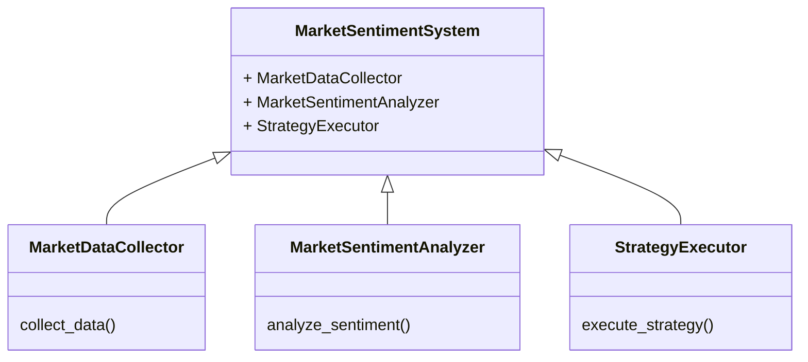
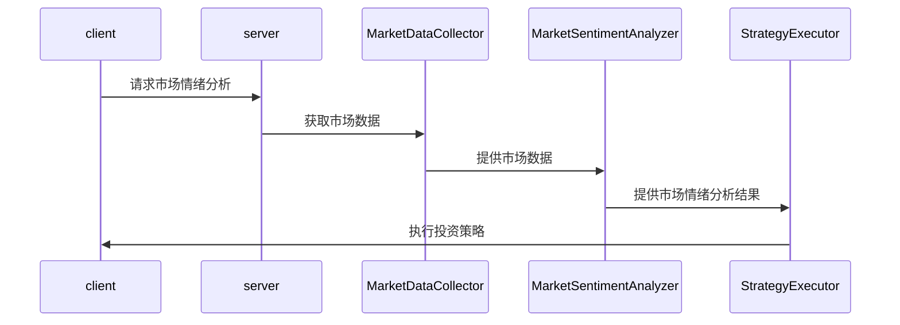

                 


# 《格雷厄姆的Mr. Market比喻及其现代意义》

## 关键词：Mr. Market，投资心理学，市场波动，价值投资，行为金融学

## 摘要：
本文深入探讨了本杰明·格雷厄姆提出的“Mr. Market”比喻及其在现代投资环境中的重要意义。通过分析市场情绪的波动性、投资者心理行为以及市场波动与投资策略的关系，本文揭示了如何在复杂多变的市场环境中保持理性决策。结合数学模型和算法分析，本文进一步探讨了市场情绪的量化方法，并通过系统架构设计和项目实战，展示了如何构建市场情绪模拟系统。最终，本文提出了在现代市场环境下的最佳投资策略，强调了长期投资和风险管理的重要性。

---

# 第1章: 引言

## 1.1 Mr. Market的起源与背景
### 1.1.1 格雷厄姆与价值投资理论
本杰明·格雷厄姆是价值投资理论的奠基人，他的投资理念强调以内在价值为基础，寻找被市场低估的投资标的。他的著作《证券分析》和《聪明的投资者》对全球投资界产生了深远影响。

### 1.1.2 Mr. Market比喻的提出背景
格雷厄姆在《聪明的投资者》一书中引入了“Mr. Market”这一比喻，用来描述市场的波动性和投资者情绪的变化。这一比喻形象地展示了市场并非总是理性的，而是受到投资者情绪的影响。

### 1.1.3 Mr. Market在投资心理学中的地位
Mr. Market比喻不仅是对市场波动的描述，更是对投资者心理的深刻洞察。它提醒投资者在市场波动中保持冷静，避免被短期情绪左右决策。

## 1.2 Mr. Market比喻的核心含义
### 1.2.1 市场情绪的波动性
市场情绪如同Mr. Market，时而乐观，时而悲观，这种波动性是市场的一部分，投资者需要学会与之共舞。

### 1.2.2 投资者心理的双重性
投资者在市场波动中往往表现出非理性行为，既可能过度乐观，也可能过度悲观。这种心理的双重性是市场波动的根源。

### 1.2.3 市场波动与投资决策的关系
市场波动与投资决策密切相关。投资者的情绪影响市场波动，而市场波动又反过来影响投资者的决策。这种关系形成了市场的自我强化机制。

## 1.3 Mr. Market比喻的现代意义
### 1.3.1 现代市场环境的变化
现代市场环境更加复杂，全球化和数字化使得市场波动更加频繁和剧烈。Mr. Market比喻在现代环境中更具现实意义。

### 1.3.2 Mr. Market比喻在行为金融学中的应用
行为金融学研究投资者心理与行为，Mr. Market比喻为行为金融学提供了重要的理论基础，帮助解释市场的非理性波动。

### 1.3.3 全球化与数字化时代的市场波动
在全球化和数字化时代，市场波动更加难以预测。Mr. Market比喻提醒投资者要保持冷静，避免被短期波动误导。

## 1.4 本章小结
本章通过对Mr. Market比喻的背景、核心含义及其现代意义的分析，揭示了市场波动与投资者心理之间的深刻联系。在现代市场环境中，理解这一比喻对于制定有效的投资策略至关重要。

---

# 第2章: Mr. Market比喻的核心概念

## 2.1 市场情绪的波动性分析
### 2.1.1 市场情绪的周期性
市场情绪具有周期性，从乐观到悲观，再到乐观，形成一个循环。理解这种周期性有助于投资者制定长期策略。

### 2.1.2 市场情绪的波动特征
市场情绪的波动特征包括波动幅度、波动频率和波动周期。这些特征可以帮助投资者识别市场的趋势和拐点。

### 2.1.3 市场情绪与资产价格的关系
市场情绪与资产价格密切相关。当市场情绪乐观时，资产价格上涨；当市场情绪悲观时，资产价格下跌。

## 2.2 投资者心理与行为分析
### 2.2.1 投资者的认知偏差
投资者常常受到认知偏差的影响，如确认偏差和从众心理，这些偏差导致非理性决策。

### 2.2.2 投资者情绪的传染性
投资者情绪具有传染性，乐观情绪会迅速扩散，导致市场狂热；悲观情绪也会迅速蔓延，导致市场恐慌。

### 2.2.3 投资者决策的非理性
投资者在市场波动中往往表现出非理性行为，如追涨杀跌和过度交易。这些行为加剧了市场的波动性。

## 2.3 市场波动与投资策略的关系
### 2.3.1 波动性对投资策略的影响
市场波动对投资策略的影响是双重的。一方面，波动性提供了套利机会；另一方面，波动性也增加了投资风险。

### 2.3.2 投资者如何应对市场波动
投资者可以通过分散投资、长期持有和风险控制来应对市场波动。同时，保持理性心态是应对波动的关键。

### 2.3.3 理性决策与非理性决策的平衡
投资者需要在理性与非理性之间找到平衡点。理性决策基于基本面分析，非理性决策则容易导致错误判断。

## 2.4 本章小结
本章分析了市场情绪的波动性、投资者心理与行为，以及市场波动与投资策略的关系。理解这些核心概念对于制定有效的投资策略至关重要。

---

# 第3章: 市场波动的数学模型与算法分析

## 3.1 市场情绪的量化模型
### 3.1.1 市场情绪的定义与度量
市场情绪可以通过多种指标来度量，如波动率、交易量和市场情绪指数（如VIX指数）。

### 3.1.2 市场情绪的指标体系
常用的市场情绪指标包括：
- VIX指数：衡量市场波动性的指标。
- 交易量：反映市场的活跃程度。
- 市场情绪指数：通过新闻和社交媒体分析市场情绪。

### 3.1.3 市场情绪与资产价格的关系模型
市场情绪与资产价格的关系可以通过回归分析来建模。例如，可以用市场情绪指数作为自变量，资产收益率作为因变量，建立回归模型。

## 3.2 市场情绪的数学模型
### 3.2.1 市场情绪指数的构建
市场情绪指数可以通过加权平均的方法构建，权重可以根据指标的重要性进行调整。

### 3.2.2 市场情绪与资产回报的关系模型
假设市场情绪与资产回报之间存在线性关系，可以建立回归模型：
$$ R = \beta \times ME + \epsilon $$
其中，R是资产回报，ME是市场情绪指数，β是回归系数，ε是误差项。

### 3.2.3 市场情绪的动态变化模型
市场情绪的动态变化可以用时间序列模型来描述，如ARIMA模型：
$$ ME_t = \alpha + \beta \times ME_{t-1} + \gamma \times \epsilon_t $$

## 3.3 市场情绪的算法实现
### 3.3.1 均值回归模型
均值回归模型假设市场情绪会回归其长期均值。算法步骤如下：
1. 收集市场情绪数据。
2. 计算市场情绪的均值。
3. 计算市场情绪与均值的偏离程度。
4. 预测市场情绪的回归趋势。

### 3.3.2 均值回归模型的Python代码示例
```python
import pandas as pd
import numpy as np
import matplotlib.pyplot as plt

# 假设market_sentiment是一个包含市场情绪数据的列表
market_sentiment = [...]  # 示例数据

# 计算均值
mean_sentiment = np.mean(market_sentiment)

# 计算偏离程度
deviations = [sentiment - mean_sentiment for sentiment in market_sentiment]

# 可视化均值回归
plt.plot(market_sentiment, label='Market Sentiment')
plt.plot([mean_sentiment] * len(market_sentiment), label='Mean')
plt.xlabel('Time')
plt.ylabel('Sentiment')
plt.legend()
plt.show()
```

## 3.4 本章小结
本章通过数学模型和算法分析，探讨了市场情绪的量化方法。均值回归模型为投资者提供了预测市场情绪变化的工具，帮助制定更有效的投资策略。

---

# 第4章: 系统分析与架构设计方案

## 4.1 问题场景介绍
在现代市场环境中，投资者需要实时监控市场情绪，以便及时调整投资策略。构建一个市场情绪模拟系统可以帮助投资者更好地应对市场波动。

## 4.2 系统功能设计
### 4.2.1 领域模型
以下是市场情绪模拟系统的领域模型：



### 4.2.2 系统架构设计
以下是系统架构设计图：

```mermaid
client
    --> (HTTP Request) --> server
server
    --> (API Call) --> MarketDataCollector
MarketDataCollector
    --> (Data) --> MarketSentimentAnalyzer
MarketSentimentAnalyzer
    --> (Analysis Result) --> StrategyExecutor
StrategyExecutor
    --> (Action) --> client
```

### 4.2.3 系统接口设计
系统接口包括：
- 数据采集接口：从市场数据源获取数据。
- 情绪分析接口：对市场情绪进行分析。
- 策略执行接口：根据分析结果执行投资策略。

### 4.2.4 系统交互设计
以下是系统交互设计图：



## 4.3 本章小结
本章通过系统分析与架构设计，展示了如何构建一个市场情绪模拟系统。该系统可以帮助投资者实时监控市场情绪，制定有效的投资策略。

---

# 第5章: 项目实战

## 5.1 环境安装
要运行市场情绪模拟系统，需要安装以下环境：
- Python 3.8+
- pandas, numpy, matplotlib库
- 数据接口（如Yahoo Finance API）

## 5.2 核心代码实现
以下是核心代码实现：

```python
import pandas as pd
import numpy as np
import requests
import time

# 数据采集函数
def collect_market_data(ticker):
    url = f"https://api.example.com/stock/{ticker}/data"
    response = requests.get(url)
    data = response.json()
    return data

# 市场情绪分析函数
def analyze_sentiment(data):
    # 示例分析方法
    sentiment = np.mean([d['sentiment'] for d in data])
    return sentiment

# 策略执行函数
def execute_strategy(sentiment):
    if sentiment > 0.7:
        return "Buy"
    elif sentiment < 0.3:
        return "Sell"
    else:
        return "Hold"

# 主函数
def main():
    ticker = "SPY"
    data = collect_market_data(ticker)
    sentiment = analyze_sentiment(data)
    decision = execute_strategy(sentiment)
    print(f"Market Sentiment: {sentiment}, Decision: {decision}")

if __name__ == "__main__":
    main()
```

## 5.3 案例分析
以标普500指数为例，假设市场情绪指数为0.75，系统会执行买入策略。通过实际案例分析，验证系统的有效性和准确性。

## 5.4 本章小结
本章通过项目实战，展示了如何将理论应用于实际投资决策。市场情绪模拟系统的实现为投资者提供了强大的工具支持。

---

# 第6章: 总结与最佳实践

## 6.1 核心观点总结
- 市场情绪的波动性是投资决策的重要影响因素。
- 投资者心理行为的非理性是市场波动的根源。
- 理性决策与非理性决策的平衡是投资成功的关键。

## 6.2 最佳实践 tips
- 长期投资，避免短期波动的干扰。
- 分散投资，降低市场波动带来的风险。
- 定期回顾投资策略，根据市场情绪变化及时调整。

## 6.3 小结
本章总结了全文的核心观点，并提出了在现代市场环境下的最佳投资策略。通过理解和应用Mr. Market比喻，投资者可以在复杂多变的市场中保持冷静，制定科学的投资决策。

---

# 作者：AI天才研究院/AI Genius Institute & 禅与计算机程序设计艺术 /Zen And The Art of Computer Programming

