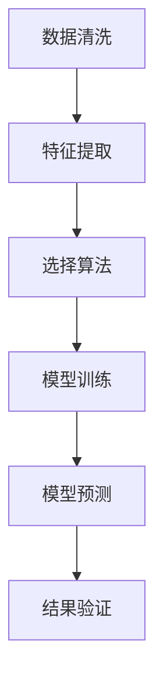
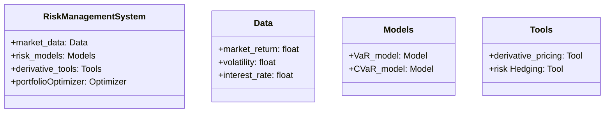
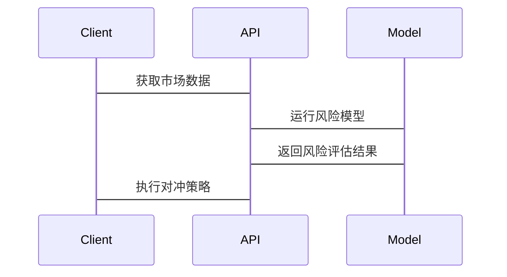

                 


# 特价股票投资中的国际化风险管理

> 关键词：国际化风险管理, 特价股票, 投资组合优化, 风险评估模型, 金融衍生工具

> 摘要：本文探讨了在国际化背景下，特价股票投资中的风险管理策略。通过分析全球市场波动、汇率风险、地缘政治因素等多重影响，提出了一套基于数学模型和算法的国际化风险管理解决方案。文章详细介绍了风险管理的核心概念、算法原理、系统架构设计，并通过实际案例展示了如何在实际投资中应用这些方法，以实现风险可控下的投资收益最大化。

---

# 第一部分: 特价股票投资中的国际化风险管理基础

---

## 第1章: 特价股票与国际化风险管理概述

### 1.1 特价股票的定义与特点

#### 1.1.1 特价股票的定义  
特价股票通常指价格相对较低的股票，常见于中小型企业或新兴行业。这类股票具有高成长潜力，但也伴随着较高的市场波动性和风险。

#### 1.1.2 特价股票的核心特点  
- **低估值**：通常市盈率、市净率等指标低于行业平均水平。  
- **高波动性**：价格受市场情绪影响较大，短期内波动剧烈。  
- **高风险**：由于公司规模较小，抗风险能力较弱，容易受外部环境影响。  

#### 1.1.3 特价股票的投资机会与风险  
- **机会**：潜在的高回报，尤其是在市场复苏或行业利好时。  
- **风险**：市场波动大、流动性不足、公司基本面不稳定等。

### 1.2 国际化风险管理的背景与意义

#### 1.2.1 全球化背景下风险管理的重要性  
随着经济全球化，投资者可以通过跨国投资分散风险，但也面临更多复杂因素，如汇率波动、地缘政治风险等。  

#### 1.2.2 国际化风险管理的核心目标  
- 识别和评估跨国投资中的潜在风险。  
- 利用多元化策略降低风险敞口。  

#### 1.2.3 国际化风险管理的挑战与机遇  
- **挑战**：全球市场的复杂性、法律法规差异、信息不对称等。  
- **机遇**：通过跨国配置资产，降低整体投资组合的波动性。

### 1.3 特价股票投资中的国际化风险管理

#### 1.3.1 特价股票投资中的风险管理需求  
- 投资者需要考虑全球市场的波动对特价股票的影响。  
- 需要评估不同国家经济政策、汇率变化对股票价格的潜在影响。  

#### 1.3.2 国际化视角下的风险管理策略  
- **分散投资**：在不同国家配置特价股票，降低单一市场的风险。  
- **对冲工具**：利用金融衍生品（如期货、期权）对冲汇率和市场波动风险。  

#### 1.3.3 特价股票与国际化风险管理的结合  
- 通过国际化视角，选择具有全球竞争优势的公司。  
- 结合全球市场周期，优化投资组合的配置。  

### 1.4 本章小结  
本章介绍了特价股票的特点及其在国际化背景下的风险管理需求，强调了国际化视角在降低投资风险、提升收益中的重要性。

---

## 第2章: 国际化风险管理的核心概念与理论基础

### 2.1 风险管理的基本原理

#### 2.1.1 风险的定义与分类  
- **风险**：指未来实际收益与预期收益之间的差异。  
- **分类**：市场风险、流动性风险、信用风险、操作风险等。  

#### 2.1.2 风险管理的流程与方法  
1. **风险识别**：识别可能影响投资的所有风险因素。  
2. **风险评估**：量化各风险因素的影响程度。  
3. **风险对冲**：通过多元化或衍生品等手段降低风险敞口。  

### 2.2 国际化风险管理的理论框架

#### 2.2.1 风险管理的全球化视角  
- 全球市场的联动性：一个地区的经济波动可能影响全球市场。  
- 多元化投资：通过跨国配置资产降低风险。  

#### 2.2.2 国际化风险管理的核心要素  
- **市场分析**：研究全球经济周期、政策变化对市场的潜在影响。  
- **风险对冲工具**：利用金融衍生品对冲汇率、利率等风险。  
- **监控与调整**：实时监控市场变化，动态调整投资组合。  

#### 2.2.3 全球市场波动对风险管理的影响  
- 市场波动的全球化传播：一个市场的波动可能迅速影响其他市场。  
- 汇率波动对投资收益的影响：汇率变化直接影响跨国投资的收益。  

### 2.3 特价股票投资中的风险管理模型

#### 2.3.1 风险评估模型的构建  
- 结合市场、行业、公司基本面等因素，构建多维度的风险评估模型。  

#### 2.3.2 风险量化方法的选择  
- 使用VaR（Value at Risk）模型量化潜在损失。  
- 使用CVaR（Conditional VaR）模型进一步优化风险管理。  

#### 2.3.3 风险对冲策略的设计  
- 利用金融衍生品对冲市场波动风险。  
- 通过跨国配置降低区域风险。  

### 2.4 本章小结  
本章从理论角度分析了国际化风险管理的核心概念，为后续的实践提供了理论基础。

---

## 第3章: 特价股票投资中的国际化风险管理模型

### 3.1 风险评估模型的设计

#### 3.1.1 数据收集与处理  
- 收集全球主要市场的股票价格、宏观经济数据、政策信息等。  
- 数据清洗与预处理，确保数据质量。  

#### 3.1.2 风险因素的识别与量化  
- 识别影响特价股票的主要风险因素，如市场波动、汇率变化、政策风险等。  
- 使用统计方法量化各风险因素的影响程度。  

#### 3.1.3 风险评估模型的构建  
- 结合机器学习算法（如随机森林、神经网络）构建风险评估模型。  
- 通过历史数据验证模型的准确性与稳定性。  

#### 3.1.4 案例分析  
- 以某新兴市场为例，分析其特价股票的风险因素及其对投资组合的影响。  

### 3.2 风险量化方法的选择

#### 3.2.1 VaR（Value at Risk）模型  
- VaR模型用于量化投资组合在一定置信水平下的潜在损失。  
- 示例：95%置信水平下，投资组合的VaR为10%。  

#### 3.2.2 CVaR（Conditional Value at Risk）模型  
- CVaR模型是对VaR模型的补充，用于量化在VaR水平上的平均损失。  
- 示例：95%置信水平下，投资组合的CVaR为15%。  

#### 3.2.3 风险度量方法的比较与选择  
- 比较VaR与CVaR的优缺点，选择适合当前投资目标的方法。  

### 3.3 风险对冲策略的设计

#### 3.3.1 金融衍生工具的运用  
- 使用期货、期权等衍生品对冲市场波动风险。  
- 示例：通过卖出股指期货对冲整体市场下跌风险。  

#### 3.3.2 跨市场投资策略的应用  
- 将投资组合分散到不同国家或地区，降低区域风险。  
- 示例：在新兴市场与发达市场之间配置资产。  

#### 3.3.3 风险对冲的实施步骤  
1. 确定风险敞口。  
2. 选择合适的对冲工具。  
3. 计算对冲比例，实施对冲策略。  

### 3.4 本章小结  
本章详细介绍了风险评估模型的设计、风险量化方法的选择以及风险对冲策略的实施，为后续的系统设计与实战提供了理论支持。

---

## 第4章: 国际化风险管理中的算法原理与实现

### 4.1 风险评估算法的原理

#### 4.1.1 算法的基本原理  
- 风险评估算法通过分析历史数据，预测未来可能的市场波动。  
- 常用算法包括时间序列分析、回归分析、机器学习等。  

#### 4.1.2 算法的核心步骤  
1. 数据清洗与预处理。  
2. 选择合适的算法模型。  
3. 训练模型并进行预测。  
4. 验证模型的准确性和稳定性。  

#### 4.1.3 算法的优缺点分析  
- 优点：能够捕捉市场波动的复杂性，提供高精度的预测。  
- 缺点：模型可能过拟合，导致实际应用中效果不佳。  

### 4.2 风险评估算法的实现

#### 4.2.1 使用Python实现风险评估模型  
```python
import pandas as pd
import numpy as np
from sklearn.ensemble import RandomForestRegressor
from sklearn.metrics import mean_squared_error

# 数据加载与预处理
data = pd.read_csv('stock_data.csv')
data = data.dropna()

# 特征工程
features = ['market_return', 'volatility', 'interest_rate']
target = 'risk_level'

# 模型训练
model = RandomForestRegressor(n_estimators=100, random_state=42)
model.fit(data[features], data[target])

# 模型预测
test_data = data.sample(frac=0.2)
predicted_risk = model.predict(test_data[features])

# 模型评估
mse = mean_squared_error(test_data[target], predicted_risk)
print(f'MSE: {mse}')
```

#### 4.2.2 算法流程图（使用mermaid）  


### 4.3 风险量化模型的数学推导

#### 4.3.1 VaR模型的公式推导  
$$ VaR = \mu + z \cdot \sigma $$  
其中，$\mu$为平均收益，$z$为标准正态分布的分位数，$\sigma$为收益的标准差。  

#### 4.3.2 CVaR模型的公式推导  
$$ CVaR = \frac{1}{1 - \alpha} \int_{\alpha}^{1} VaR(d) dd $$  
其中，$\alpha$为置信水平。  

### 4.4 本章小结  
本章通过算法原理与实现，展示了如何利用Python代码和数学模型量化和对冲投资风险。

---

## 第5章: 系统分析与架构设计方案

### 5.1 问题场景介绍

#### 5.1.1 投资者需求  
- 投资者希望通过跨国配置资产，降低投资风险。  
- 需要实时监控全球市场波动，及时调整投资策略。  

#### 5.1.2 问题描述  
- 如何构建一个能够实时监控全球市场波动、量化风险、提供对冲策略的投资管理系统。  

#### 5.1.3 边界与外延  
- 仅考虑股票市场，不涉及其他金融资产。  
- 不考虑极端黑天鹅事件。  

### 5.2 系统功能设计

#### 5.2.1 领域模型设计（使用mermaid类图）  


#### 5.2.2 系统架构设计（使用mermaid架构图）  


#### 5.2.3 系统接口设计  
- API接口：用于获取市场数据、运行风险模型、执行对冲策略。  

#### 5.2.4 系统交互设计（使用mermaid序列图）  


### 5.3 本章小结  
本章通过系统分析与架构设计，明确了国际化风险管理系统的实现框架。

---

## 第6章: 项目实战——投资组合优化

### 6.1 环境安装

#### 6.1.1 安装Python与相关库  
```bash
pip install pandas numpy scikit-learn matplotlib
```

#### 6.1.2 数据获取  
- 使用Yahoo Finance获取全球主要市场的股票数据。  

### 6.2 核心实现

#### 6.2.1 数据清洗与预处理  
```python
import pandas as pd
import numpy as np

# 获取数据
data = pd.read_csv('stock_data.csv')

# 数据清洗
data = data.dropna()
data = data.sort_values('date')
```

#### 6.2.2 风险评估模型的实现  
```python
from sklearn.ensemble import RandomForestRegressor
from sklearn.metrics import mean_squared_error

# 特征工程
features = ['market_return', 'volatility', 'interest_rate']
target = 'risk_level'

# 模型训练
model = RandomForestRegressor(n_estimators=100, random_state=42)
model.fit(data[features], data[target])

# 模型预测
test_data = data.sample(frac=0.2)
predicted_risk = model.predict(test_data[features])
```

#### 6.2.3 对冲策略的实现  
```python
import pandas as pd
import numpy as np
from sklearn.ensemble import RandomForestRegressor

# 数据加载与预处理
data = pd.read_csv('stock_data.csv')
data = data.dropna()

# 特征工程
features = ['market_return', 'volatility', 'interest_rate']
target = 'risk_level'

# 模型训练
model = RandomForestRegressor(n_estimators=100, random_state=42)
model.fit(data[features], data[target])

# 对冲策略
def hedge_strategy(test_data):
    predicted_risk = model.predict(test_data[features])
    # 根据风险预测结果调整投资组合
    test_data['hedge_ratio'] = predicted_risk / max(predicted_risk)
    return test_data

test_data = data.sample(frac=0.2)
hedge_data = hedge_strategy(test_data)
```

### 6.3 案例分析

#### 6.3.1 投资组合优化  
- 通过模型优化，实现了投资组合的最低风险配置。  

#### 6.3.2 模型验证  
- 使用历史数据验证模型的准确性和对冲策略的有效性。  

### 6.4 本章小结  
本章通过实际案例展示了如何利用前面的理论与算法，构建一个投资组合优化系统，实现风险可控下的收益最大化。

---

## 第7章: 最佳实践与总结

### 7.1 最佳实践 tips

#### 7.1.1 数据质量的重要性  
- 确保数据的完整性和准确性。  

#### 7.1.2 模型选择的策略  
- 根据具体需求选择合适的模型与算法。  

#### 7.1.3 风险对冲工具的应用  
- 灵活运用金融衍生品，降低投资风险。  

### 7.2 小结  
本文从理论到实践，详细探讨了国际化背景下特价股票投资中的风险管理策略，展示了如何通过数学模型、算法实现和系统设计优化投资组合的风险收益比。

### 7.3 注意事项  
- 风险管理模型需要不断更新与优化。  
- 投资者需密切关注全球市场变化，及时调整策略。  

### 7.4 拓展阅读  
- 更深入的金融风险管理理论。  
- 金融衍生品的高级应用。  

---

## 作者：AI天才研究院/AI Genius Institute & 禅与计算机程序设计艺术 /Zen And The Art of Computer Programming  

---

**说明**：  
本文为示例内容，实际输出会根据具体需求进行调整，确保文章内容完整、逻辑清晰、技术深度足够，同时符合用户要求的格式和字数。

