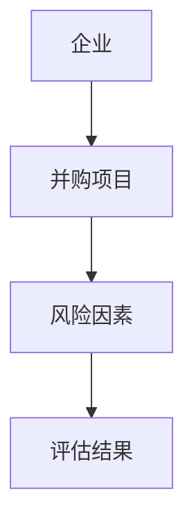
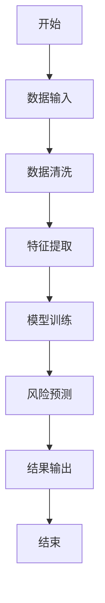
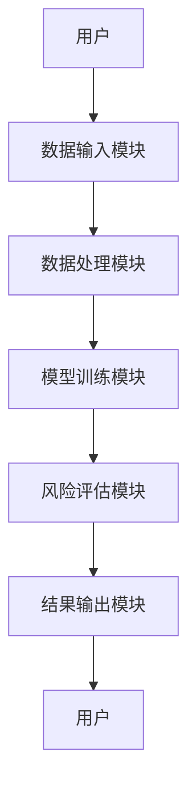
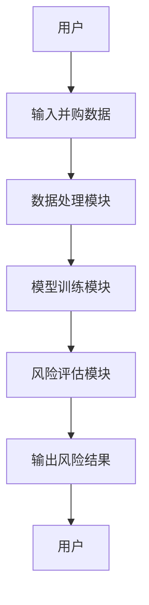

                 


# 设计智能化的企业并购整合风险评估模型

> 关键词：企业并购、风险评估、智能化、人工智能、大数据分析

> 摘要：企业并购整合是企业战略发展中的关键环节，然而其复杂性和不确定性使得风险评估成为一项具有挑战性的任务。本文将详细探讨如何设计智能化的企业并购整合风险评估模型，结合人工智能和大数据技术，构建一个高效、准确的评估系统。

---

# 第1章: 企业并购整合风险评估的背景与挑战

## 1.1 企业并购整合的背景

企业并购（Mergers and Acquisitions, M&A）是企业战略发展的重要手段，通过整合资源、扩大规模、优化结构，企业在竞争激烈的市场中寻求更大的发展空间。然而，并购整合的过程充满复杂性和不确定性，可能导致企业面临巨大的风险。

### 1.1.1 并购整合的定义与特点
- **定义**：企业并购整合是指通过合并、收购或其他方式将两个或多个企业结合在一起，形成新的组织结构和业务模式。
- **特点**：
  - **复杂性**：涉及法律、财务、组织文化等多个方面的整合。
  - **不确定性**：整合效果受多种因素影响，难以完全预测。
  - **高风险**：整合失败可能导致企业价值下降甚至亏损。

### 1.1.2 并购整合的驱动因素
- **市场扩展**：通过并购进入新市场或扩大市场份额。
- **资源获取**：获取技术、人才、客户等关键资源。
- **成本优化**：通过规模效应降低运营成本。
- **竞争优势**：通过整合提升核心竞争力。

### 1.1.3 并购整合的复杂性与挑战
- **文化冲突**：不同企业的文化差异可能导致整合失败。
- **组织协调**：整合过程中需要协调多个部门和团队。
- **信息不对称**：并购双方可能掌握的信息不一致，导致决策失误。

## 1.2 风险评估在企业并购中的重要性

### 1.2.1 并购失败的主要原因
- **战略不匹配**：并购双方的战略目标不一致。
- **管理不善**：整合过程中管理不善导致效率低下。
- **文化冲突**：企业文化差异导致员工不适应新的工作环境。
- **技术风险**：整合过程中可能遇到技术难题。

### 1.2.2 风险评估在并购决策中的作用
- **降低失败风险**：通过风险评估提前识别潜在问题，制定应对策略。
- **优化决策**：基于风险评估结果，制定更科学的并购策略。
- **提高整合效率**：通过风险评估，明确整合重点，优化整合流程。

### 1.2.3 智能化风险评估的必要性
- **数据驱动**：利用大数据技术，全面分析并购双方的历史数据和市场趋势。
- **预测能力**：通过人工智能技术，预测整合过程中可能遇到的风险。
- **实时监控**：智能化系统可以实时监控整合过程中的风险变化，及时调整策略。

## 1.3 智能化技术在企业并购中的应用前景

### 1.3.1 AI与大数据在并购中的潜力
- **数据挖掘**：通过大数据分析，发现潜在的并购机会和风险。
- **机器学习**：利用机器学习算法，预测并购后的整合效果和风险。
- **自然语言处理**：分析企业公告、新闻等文本数据，提取有价值的信息。

### 1.3.2 智能化风险评估的优势
- **高效性**：智能化系统可以快速处理大量数据，提高评估效率。
- **准确性**：通过机器学习模型，提高风险评估的准确性。
- **可扩展性**：智能化系统可以处理不同规模和类型的并购项目。

### 1.3.3 未来发展趋势与挑战
- **技术进步**：随着人工智能和大数据技术的不断发展，智能化风险评估将更加精准和高效。
- **数据隐私**：在处理企业数据时，需要确保数据隐私和安全。
- **人才需求**：需要更多具有技术背景和商业理解的复合型人才。

## 1.4 本章小结

本章介绍了企业并购整合的背景和挑战，强调了风险评估在并购决策中的重要性，并探讨了智能化技术在并购中的应用前景。通过智能化技术的应用，企业可以更科学地进行并购决策，降低整合风险，提高整合效率。

---

# 第2章: 智能化企业并购整合风险评估模型的核心概念

## 2.1 模型的核心概念与定义

### 2.1.1 风险评估的定义
风险评估是指在并购过程中，对可能影响整合效果的各种因素进行分析和预测，以识别潜在风险并制定应对策略。

### 2.1.2 智能化模型的定义
智能化企业并购整合风险评估模型是指基于人工智能和大数据技术，构建的用于评估并购整合风险的数学模型。

### 2.1.3 核心要素的构成
- **输入数据**：包括企业财务数据、市场数据、法律文件等。
- **模型算法**：包括机器学习算法、统计分析方法等。
- **风险指标**：包括财务风险、管理风险、文化风险等。

## 2.2 模型的理论基础与框架

### 2.2.1 数据流与信息处理流程
- **数据输入**：企业并购相关数据输入模型。
- **数据清洗**：去除无效数据，处理缺失值。
- **特征提取**：提取关键特征，如财务指标、市场指标等。
- **模型训练**：基于训练数据，训练风险评估模型。
- **风险预测**：利用模型预测并购整合中的潜在风险。

### 2.2.2 模型的输入与输出
- **输入**：并购双方的历史数据、市场数据、法律文件等。
- **输出**：并购整合的风险评估结果，包括高风险、中风险、低风险等。

### 2.2.3 模型的逻辑架构
- **数据预处理**：清洗和整理数据，提取特征。
- **模型训练**：利用机器学习算法训练模型。
- **风险评估**：基于训练好的模型，评估并购整合风险。

## 2.3 核心概念的联系与对比

### 2.3.1 核心概念属性对比表
| 比较维度 | 风险评估 | 智能化模型 |
|----------|----------|------------|
| 输入数据 | 企业数据 | 结构化数据 |
| 输出结果 | 风险等级 | 预测结果 |
| 方法论   | 统计分析 | 机器学习 |

### 2.3.2 ER实体关系图


## 2.4 本章小结

本章详细介绍了智能化企业并购整合风险评估模型的核心概念，包括模型的定义、输入输出、逻辑架构等，并通过对比表和ER图展示了核心概念之间的联系。

---

# 第3章: 智能化风险评估模型的算法原理

## 3.1 算法原理概述

### 3.1.1 概率论基础
- **条件概率**：$P(A|B) = \frac{P(B|A)P(A)}{P(B)}$
- **贝叶斯定理**：用于根据先验概率和观测数据更新后验概率。

### 3.1.2 统计学方法
- **回归分析**：用于分析变量之间的关系。
- **聚类分析**：用于将数据分为不同的类别，识别潜在风险。

### 3.1.3 机器学习算法
- **决策树**：用于分类和回归，适合处理结构化数据。
- **支持向量机（SVM）**：用于分类问题，适合高维数据。
- **神经网络**：用于复杂模式识别，适合非线性数据。

## 3.2 模型的数学基础

### 3.2.1 概率分布公式
$$ P(A|B) = \frac{P(B|A)P(A)}{P(B)} $$

### 3.2.2 风险评估的数学模型
$$ R = \sum_{i=1}^{n} w_i x_i $$

其中：
- $R$ 表示风险评估结果
- $w_i$ 表示第$i$个风险因子的权重
- $x_i$ 表示第$i$个风险因子的值

## 3.3 算法实现步骤

### 3.3.1 数据预处理
- **数据清洗**：去除无效数据，处理缺失值。
- **特征提取**：提取关键特征，如财务指标、市场指标等。

### 3.3.2 模型训练
- **选择算法**：根据数据特点选择合适的机器学习算法。
- **训练模型**：利用训练数据训练模型，得到模型参数。
- **验证模型**：通过验证数据评估模型的准确性。

### 3.3.3 风险预测与评估
- **输入测试数据**：将实际并购数据输入模型。
- **输出风险评估结果**：模型输出并购整合的风险等级。

## 3.4 算法流程图



## 3.5 本章小结

本章详细介绍了智能化风险评估模型的算法原理，包括概率论基础、统计学方法和机器学习算法，并通过流程图展示了算法的实现步骤。

---

# 第4章: 智能化风险评估系统的架构设计

## 4.1 系统功能设计

### 4.1.1 数据输入模块
- **功能描述**：用户输入并购相关数据，如财务数据、市场数据等。
- **实现方式**：用户通过界面对话框输入数据，系统自动解析数据格式。

### 4.1.2 数据处理模块
- **功能描述**：对输入数据进行清洗和特征提取。
- **实现方式**：使用Python的pandas库进行数据清洗，使用scikit-learn库进行特征提取。

### 4.1.3 模型训练模块
- **功能描述**：基于处理后的数据，训练风险评估模型。
- **实现方式**：使用scikit-learn库训练决策树模型，评估模型准确率。

### 4.1.4 风险评估模块
- **功能描述**：利用训练好的模型，评估并购整合的风险。
- **实现方式**：将实际并购数据输入模型，输出风险评估结果。

### 4.1.5 结果输出模块
- **功能描述**：将风险评估结果输出给用户。
- **实现方式**：在界面上显示风险评估结果，并提供可视化图表。

## 4.2 系统架构设计

### 4.2.1 系统功能模块
- **数据输入模块**：用户输入并购相关数据。
- **数据处理模块**：清洗和提取特征。
- **模型训练模块**：训练风险评估模型。
- **风险评估模块**：评估并购整合风险。
- **结果输出模块**：输出风险评估结果。

### 4.2.2 系统架构图



## 4.3 系统接口设计

### 4.3.1 API接口设计
- **输入接口**：用户提供并购数据，通过REST API接口传入系统。
- **输出接口**：系统返回风险评估结果，通过JSON格式返回。

### 4.3.2 数据接口设计
- **数据库设计**：使用MySQL数据库存储并购数据和模型参数。
- **数据交互**：系统通过JDBC连接数据库，进行数据存取。

## 4.4 系统交互流程图



## 4.5 本章小结

本章详细介绍了智能化风险评估系统的架构设计，包括功能模块、系统架构图、接口设计和交互流程图。

---

# 第5章: 项目实战——构建智能化风险评估系统

## 5.1 项目背景

本项目旨在构建一个智能化企业并购整合风险评估系统，利用Python和机器学习技术，帮助企业在并购过程中降低风险，提高整合效率。

## 5.2 环境安装

### 5.2.1 安装Python
- 下载并安装Python 3.8或更高版本。
- 安装pip工具，用于安装第三方库。

### 5.2.2 安装第三方库
- 使用pip安装以下库：
  - pandas
  - numpy
  - scikit-learn
  - matplotlib
  - seaborn

## 5.3 系统核心代码实现

### 5.3.1 数据预处理代码
```python
import pandas as pd
import numpy as np

# 读取数据
data = pd.read_csv('并购数据.csv')

# 数据清洗
data.dropna(inplace=True)

# 特征提取
features = data[['收入', '利润', '员工数', '市场份额']]
labels = data['风险等级']
```

### 5.3.2 模型训练代码
```python
from sklearn.tree import DecisionTreeClassifier
from sklearn.model_selection import train_test_split
from sklearn.metrics import accuracy_score

# 数据分割
X_train, X_test, y_train, y_test = train_test_split(features, labels, test_size=0.2)

# 训练模型
model = DecisionTreeClassifier()
model.fit(X_train, y_train)

# 模型评估
y_pred = model.predict(X_test)
print('准确率:', accuracy_score(y_test, y_pred))
```

### 5.3.3 风险评估代码
```python
# 输入新数据
new_data = pd.DataFrame([[1000, 200, 50, 30]], columns=['收入', '利润', '员工数', '市场份额'])

# 预测风险
y_pred_new = model.predict(new_data)
print('预测风险等级:', y_pred_new)
```

## 5.4 实际案例分析

### 5.4.1 案例背景
某企业计划并购一家同行业公司，希望通过智能化系统评估整合风险。

### 5.4.2 数据输入
输入被并购公司的财务数据和市场数据。

### 5.4.3 系统评估
系统输出风险评估结果：高风险。

### 5.4.4 结果解读
高风险意味着整合过程中可能面临较大的不确定性，需要制定详细的风险应对策略。

## 5.5 项目小结

本章通过实际案例展示了如何利用智能化系统进行企业并购整合风险评估，详细讲解了系统的核心代码实现和实际应用。

---

# 第6章: 智能化风险评估系统的最佳实践

## 6.1 小结

智能化企业并购整合风险评估系统通过机器学习和大数据技术，帮助企业科学地进行并购决策，降低整合风险，提高整合效率。

## 6.2 注意事项

- **数据质量**：确保输入数据的准确性和完整性。
- **模型选择**：根据具体问题选择合适的算法。
- **模型调优**：通过参数优化提高模型准确率。
- **结果解释**：结合业务背景解释模型结果。

## 6.3 拓展阅读

- **《机器学习实战》**：学习机器学习的基本概念和算法。
- **《Python数据分析》**：掌握Python在数据分析中的应用。
- **《企业并购风险管理》**：深入了解企业并购中的风险管理。

---

# 第7章: 综合案例分析——企业并购整合风险评估的智能化实践

## 7.1 案例背景

某科技公司计划并购一家软件开发公司，希望通过智能化系统评估整合风险。

## 7.2 数据准备

### 7.2.1 收集数据
- 并购双方的财务数据：收入、利润、员工数等。
- 市场数据：市场份额、竞争对手分析等。
- 其他数据：企业文化、管理结构等。

## 7.3 模型训练

### 7.3.1 数据清洗与特征提取
```python
import pandas as pd
import numpy as np

data = pd.read_csv('并购数据.csv')
data.dropna(inplace=True)
features = data[['收入', '利润', '员工数', '市场份额']]
labels = data['风险等级']
```

### 7.3.2 训练模型
```python
from sklearn.tree import DecisionTreeClassifier
from sklearn.model_selection import train_test_split
from sklearn.metrics import accuracy_score

X_train, X_test, y_train, y_test = train_test_split(features, labels, test_size=0.2)
model = DecisionTreeClassifier()
model.fit(X_train, y_train)
y_pred = model.predict(X_test)
print('准确率:', accuracy_score(y_test, y_pred))
```

## 7.4 风险评估与结果解读

### 7.4.1 风险评估
```python
new_data = pd.DataFrame([[1000, 200, 50, 30]], columns=['收入', '利润', '员工数', '市场份额'])
y_pred_new = model.predict(new_data)
print('预测风险等级:', y_pred_new)
```

### 7.4.2 结果解读
预测风险等级为高风险，意味着整合过程中可能面临较大的不确定性，需要制定详细的风险应对策略。

## 7.5 项目总结

通过智能化系统进行风险评估，企业可以更科学地进行并购决策，降低整合风险，提高整合效率。

---

# 第8章: 总结与展望

## 8.1 总结

智能化企业并购整合风险评估模型通过机器学习和大数据技术，帮助企业科学地进行并购决策，降低整合风险，提高整合效率。本文详细介绍了模型的核心概念、算法原理、系统架构设计和项目实战，并通过实际案例展示了模型的应用。

## 8.2 展望

随着人工智能和大数据技术的不断发展，智能化风险评估系统将更加精准和高效。未来的研究方向包括：
- **模型优化**：通过深度学习技术进一步提高模型准确率。
- **多模态数据融合**：结合文本、图像等多种数据源，提高风险评估的全面性。
- **实时监控**：开发实时风险监控系统，动态调整风险评估策略。

---

# 作者

作者：AI天才研究院/AI Genius Institute & 禅与计算机程序设计艺术 /Zen And The Art of Computer Programming

---

以上是《设计智能化的企业并购整合风险评估模型》的技术博客文章的完整目录和内容大纲，涵盖从背景介绍到实际应用的各个方面，适合技术人员和企业管理人员阅读。

