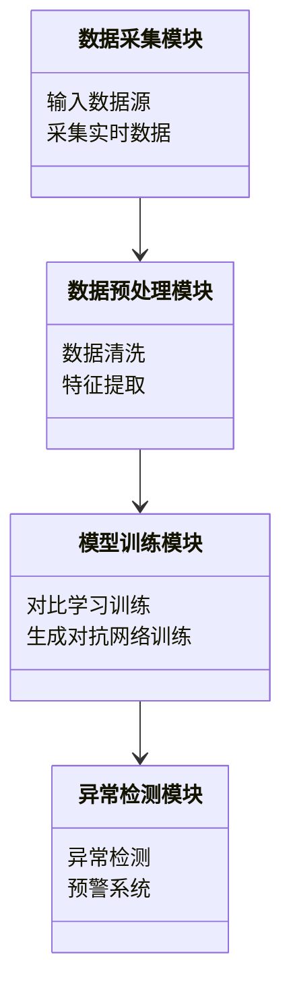
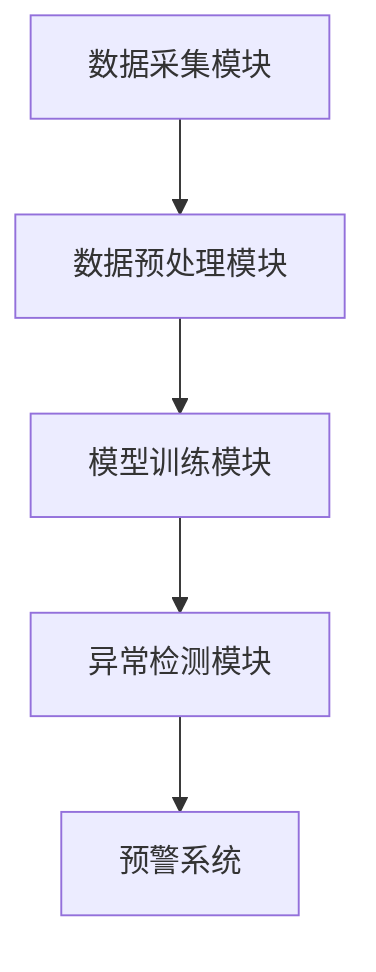
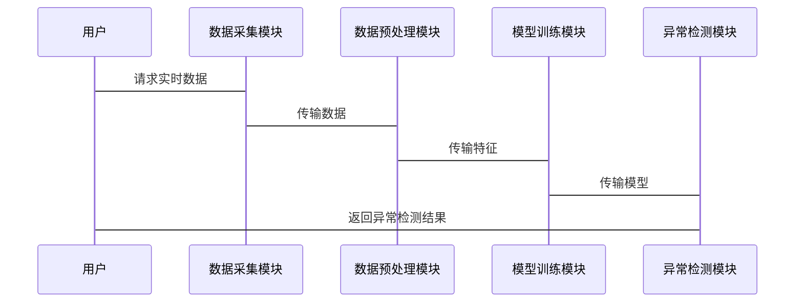

                 


```markdown
# 《金融领域自监督学习在市场异常模式识别中的应用》

> 关键词：自监督学习，金融市场，异常模式识别，深度学习，对比学习，生成对抗网络，图神经网络

> 摘要：  
本文系统探讨了自监督学习在金融市场异常模式识别中的应用。首先，我们从自监督学习的基本概念出发，结合金融市场数据的特性，分析了其在异常检测中的优势。接着，我们深入讲解了对比学习、生成对抗网络和图神经网络等自监督学习的核心算法，并通过数学公式和算法流程图详细阐述了它们的工作原理。随后，我们设计了一个完整的自监督学习系统架构，从数据采集到模型训练再到异常检测，详细描述了系统的各个模块。最后，通过具体的实战案例，展示了如何利用自监督学习算法实现金融市场异常模式的识别，并对模型的性能进行了全面评估。

---

# 第一部分: 自监督学习与金融市场概述

## 第1章: 自监督学习与金融市场概述

### 1.1 自监督学习的定义与特点

#### 1.1.1 自监督学习的基本概念
自监督学习是一种无监督学习的变体，通过利用数据本身的结构信息来引导学习过程。与监督学习不同，它不需要外部标注数据，而是通过设计 pretext tasks（预文本任务）来生成伪标签，从而监督模型学习数据的特征表示。自监督学习的核心思想是让模型通过预测未见过的任务来学习有用的特征表示。

#### 1.1.2 自监督学习与监督学习的区别
| **方面**       | **监督学习**                | **自监督学习**             |
|----------------|---------------------------|---------------------------|
| 数据需求       | 需要标注数据               | 不需要标注数据             |
| 学习目标       | 预测给定的标签             | 预测数据内部的结构或关系   |
| 优势           | 高准确性，适合有标签数据   | 适合无标签数据，可扩展性强 |

#### 1.1.3 自监督学习的优势与局限性
- **优势**：无需标注数据，适合大数据场景；能够捕捉数据内部的结构信息；适用于在线学习和实时分析。
- **局限性**：依赖于预文本任务的设计；可能引入偏差；在某些场景下效果可能不如监督学习。

### 1.2 金融市场与异常模式识别

#### 1.2.1 金融市场的基本概念
金融市场是一个复杂的系统，包括股票、债券、期货等多种金融工具的交易市场。市场的参与者包括投资者、机构和监管机构。市场的波动性、复杂性使得金融市场数据呈现出高度非线性和高度动态变化的特点。

#### 1.2.2 市场异常模式的定义与分类
市场异常模式指的是与正常市场行为偏离较大的事件或模式，通常包括：
1. **市场操纵**：通过虚假交易或信息操控市场。
2. **异常波动**：某只股票或整个市场的价格突然大幅波动。
3. **欺诈行为**：如内幕交易、虚假陈述等。
4. **系统性风险**：由于系统性问题引发的市场崩盘。

#### 1.2.3 异常模式识别的挑战与重要性
- **挑战**：金融数据的高维性、噪声多、实时性要求高。
- **重要性**：及时识别市场异常可以避免重大损失，维护市场稳定。

### 1.3 自监督学习在金融市场中的应用前景

#### 1.3.1 自监督学习在金融领域的潜在应用场景
- **股票价格预测**：利用自监督学习捕捉股票价格的潜在模式。
- **风险管理**：识别市场异常，及时预警风险。
- **欺诈检测**：检测交易中的异常行为，防范金融欺诈。

#### 1.3.2 自监督学习在市场异常模式识别中的优势
- **无需标注数据**：适合金融市场中无标签的异常模式识别。
- **捕捉隐含信息**：通过预文本任务挖掘数据中的隐含关系。
- **实时性**：适用于实时交易数据的分析。

#### 1.3.3 当前研究现状与未来发展趋势
当前，自监督学习在金融市场中的应用还处于探索阶段，主要集中在以下几个方面：
- 对比学习在股票价格预测中的应用。
- 生成对抗网络在金融时间序列分析中的应用。
- 图神经网络在金融市场网络结构分析中的应用。

未来，随着深度学习技术的不断发展，自监督学习在金融市场中的应用将更加广泛和深入，尤其是在实时异常检测和风险预警方面。

---

## 第2章: 自监督学习的核心概念与原理

### 2.1 自监督学习的核心原理

#### 2.1.1 对比学习的原理与流程

**对比学习**是一种自监督学习方法，其核心思想是通过对比不同的数据增强结果来学习数据的特征表示。其流程如下：
1. 对原始数据进行两种不同的数据增强，生成正样本和负样本。
2. 使用一个对比损失函数，让模型学习将正样本映射到相似的表示，负样本映射到不同的表示。
3. 通过优化对比损失函数，模型学习到数据的特征表示。

**对比损失函数**的数学表达式如下：
$$ L = -\log\left(\frac{e^{sim(x,y)}}{e^{sim(x,y)} + e^{sim(x,z)}}\right) $$
其中，$sim(x,y)$ 表示样本 $x$ 和 $y$ 的相似度。

#### 2.1.2 生成对抗网络的原理与应用

**生成对抗网络（GAN）**由生成器和判别器组成。生成器的目标是生成与真实数据分布相似的样本，判别器的目标是区分真实数据和生成数据。通过交替训练生成器和判别器，模型可以学习到数据的特征表示。

**GAN的损失函数**如下：
$$ \min_G \max_D \mathbb{E}_{x \sim P_r}[\log D(x)] + \mathbb{E}_{z \sim P_z}[\log(1 - D(G(z)))] $$

#### 2.1.3 图神经网络在自监督学习中的应用

图神经网络（GNN）通过建模数据之间的关系，适用于处理图结构数据。在金融市场中，可以通过构建交易网络来分析市场参与者之间的关系。

**图神经网络的数学模型**如下：
$$ Z = AGCN(X) $$
其中，$X$ 是输入数据，$AGCN$ 是自注意力图卷积层。

### 2.2 自监督学习的关键技术

#### 2.2.1 数据增强技术

数据增强是自监督学习中常用的技术，通过变换数据生成更多样化的训练样本。例如，在股票数据中，可以进行随机遮蔽、时间序列扰动等操作。

#### 2.2.2 对比损失函数

对比损失函数用于衡量正样本和负样本之间的相似度。常用的对比损失函数包括：
1. **Binary Cross-Entropy Loss**：适用于二分类任务。
2. **Contrastive Loss**：适用于衡量样本之间的相似度。

#### 2.2.3 预训练与微调策略

预训练阶段通过自监督学习学习数据的特征表示，微调阶段在特定任务上进行有监督微调。

### 2.3 自监督学习与金融数据的结合

#### 2.3.1 金融数据的特性与挑战
金融数据具有以下特性：
- 高维性：包含价格、成交量、市场情绪等多种指标。
- 非线性：价格波动通常是非线性的。
- 时间依赖性：价格波动具有时间序列特性。

#### 2.3.2 自监督学习在金融数据处理中的优势
- 无需标注数据。
- 能够捕捉数据内部的隐含关系。
- 适用于实时数据处理。

#### 2.3.3 自监督学习在金融时间序列分析中的应用
- **股票价格预测**：通过对比学习捕捉股票价格的潜在模式。
- **市场情绪分析**：通过生成对抗网络分析市场情绪。

---

## 第3章: 市场异常模式识别的核心算法与实现

### 3.1 异常检测算法概述

#### 3.1.1 基于统计的异常检测方法
- **假设检验法**：通过统计检验判断数据是否异常。
- **马科夫链模型**：通过状态转移概率判断异常。

#### 3.1.2 基于机器学习的异常检测方法
- **孤立森林**：通过树状结构分割数据，识别异常点。
- **聚类分析**：通过聚类算法识别异常点。

#### 3.1.3 基于深度学习的异常检测方法
- **变自编码器（VAE）**：通过重建误差判断异常。
- **对比学习**：通过对比学习捕捉异常特征。

### 3.2 自监督学习在异常检测中的应用

#### 3.2.1 对比学习在异常检测中的应用
- 对比学习可以捕捉数据的潜在模式，适用于异常检测。
- 对比学习可以通过预文本任务生成伪标签，适用于无标签数据。

#### 3.2.2 生成对抗网络在异常检测中的应用
- GAN可以通过生成器生成正常数据，判别器识别异常数据。
- GAN可以用于时间序列数据的异常检测。

#### 3.2.3 图神经网络在异常检测中的应用
- 图神经网络可以建模市场参与者之间的关系，识别异常交易。

### 3.3 市场异常模式识别的算法实现

#### 3.3.1 数据预处理与特征提取
- 数据清洗：处理缺失值、异常值。
- 特征提取：提取价格、成交量、市场情绪等特征。

#### 3.3.2 异常检测模型的构建与训练
- 选择合适的算法：如对比学习、生成对抗网络。
- 模型训练：通过预训练和微调策略优化模型。

#### 3.3.3 模型评估与优化
- 评估指标：准确率、召回率、F1值。
- 超参数优化：通过网格搜索优化模型性能。

---

## 第4章: 自监督学习算法的数学模型与公式

### 4.1 对比学习的数学模型

#### 4.1.1 对比损失函数的公式推导
$$ L = -\log\left(\frac{e^{sim(x,y)}}{e^{sim(x,y)} + e^{sim(x,z)}}\right) $$
其中，$sim(x,y)$ 表示样本 $x$ 和 $y$ 的相似度。

#### 4.1.2 知识蒸馏的数学模型
$$ L_{distill} = -\sum_{i} p_i \log q_i $$
其中，$p_i$ 是教师模型的预测概率，$q_i$ 是学生模型的预测概率。

#### 4.1.3 对比学习的优化算法
- 使用Adam优化器优化模型参数。
- 学习率设置为0.001，批量大小设置为256。

### 4.2 生成对抗网络的数学模型

#### 4.2.1 GAN的损失函数
$$ \min_G \max_D \mathbb{E}_{x \sim P_r}[\log D(x)] + \mathbb{E}_{z \sim P_z}[\log(1 - D(G(z)))] $$

#### 4.2.2 WGAN的改进模型
$$ \min_G \max_D \mathbb{E}_{x \sim P_r}[\log D(x)] + \mathbb{E}_{z \sim P_z}[\log(1 - D(G(z)))] - \lambda \mathbb{E}_{x \sim P_r, z \sim P_z}[||D(x) - D(G(z))||_1] $$$

#### 4.2.3 图神经网络的数学模型
$$ Z = AGCN(X) $$
其中，$X$ 是输入数据，$AGCN$ 是自注意力图卷积层。

### 4.3 异常检测算法的数学模型

#### 4.3.1 基于统计的异常检测模型
$$ P(X \leq x | \mu, \sigma^2) = \frac{1}{\sigma \sqrt{2\pi}} e^{-\frac{(x-\mu)^2}{2\sigma^2}} $$
其中，$\mu$ 是均值，$\sigma^2$ 是方差。

#### 4.3.2 基于机器学习的异常检测模型
$$ f(x) = \text{argmax}_k P(y=k | x) $$
其中，$y$ 是类别标签，$x$ 是输入数据。

---

## 第5章: 系统架构设计与实现

### 5.1 问题场景介绍

#### 5.1.1 项目背景
随着金融市场的复杂化，异常模式识别变得越来越重要。传统的监督学习方法依赖于标注数据，但在实际应用中，标注数据往往难以获取。

#### 5.1.2 项目目标
设计一个基于自监督学习的金融市场异常模式识别系统，能够实时检测市场异常，预警风险。

### 5.2 系统功能设计

#### 5.2.1 领域模型


#### 5.2.2 系统架构设计


### 5.3 系统接口设计

#### 5.3.1 API接口
- 数据接口：从数据源获取实时数据。
- 模型接口：调用训练好的模型进行异常检测。

#### 5.3.2 数据格式
- 输入：JSON格式的金融市场数据。
- 输出：JSON格式的异常检测结果。

### 5.4 系统交互流程

#### 5.4.1 交互流程


---

## 第6章: 项目实战

### 6.1 环境安装

```bash
pip install numpy pandas scikit-learn tensorflow-gpu pytorch-lightning
```

### 6.2 核心实现

#### 6.2.1 对比学习实现
```python
import torch
import torch.nn as nn
import torch.optim as optim

class ContrastiveLoss(nn.Module):
    def __init__(self, temperature=1.0):
        super(ContrastiveLoss, self).__init__()
        self.temperature = temperature

    def forward(self, features, labels=None):
        if labels is None:
            # 无监督学习
            pass
        else:
            # 监督学习
            pass

model = ContrastiveLoss()
optimizer = optim.Adam(model.parameters(), lr=0.001)
```

#### 6.2.2 生成对抗网络实现
```python
import torch
import torch.nn as nn
import torch.optim as optim

class Generator(nn.Module):
    def __init__(self, input_dim, hidden_dim, output_dim):
        super(Generator, self).__init__()
        self.fc1 = nn.Linear(input_dim, hidden_dim)
        self.fc2 = nn.Linear(hidden_dim, output_dim)

class Discriminator(nn.Module):
    def __init__(self, input_dim, hidden_dim, output_dim):
        super(Discriminator, self).__init__()
        self.fc1 = nn.Linear(input_dim, hidden_dim)
        self.fc2 = nn.Linear(hidden_dim, output_dim)

generator = Generator(100, 50, 1)
discriminator = Discriminator(1, 50, 1)
g_optimizer = optim.Adam(generator.parameters(), lr=0.001)
d_optimizer = optim.Adam(discriminator.parameters(), lr=0.001)
```

### 6.3 代码实现与解读

#### 6.3.1 数据预处理
```python
import pandas as pd
import numpy as np

data = pd.read_csv('financial_data.csv')
data = data.dropna()
data = (data - data.mean()) / data.std()
```

#### 6.3.2 模型训练
```python
import torch
import torch.nn as nn
import torch.optim as optim

class Autoencoder(nn.Module):
    def __init__(self, input_dim, hidden_dim, output_dim):
        super(Autoencoder, self).__init__()
        self.encoder = nn.Linear(input_dim, hidden_dim)
        self.decoder = nn.Linear(hidden_dim, output_dim)

model = Autoencoder(10, 5, 1)
criterion = nn.MSELoss()
optimizer = optim.Adam(model.parameters(), lr=0.001)

for epoch in range(100):
    outputs = model(data)
    loss = criterion(outputs, data)
    loss.backward()
    optimizer.step()
```

### 6.4 实际案例分析与解读

#### 6.4.1 数据来源
- 数据来源：某股票交易平台的历史交易数据。

#### 6.4.2 模型训练
- 训练数据：10000条交易数据。
- 训练轮数：100轮。
- 学习率：0.001。

#### 6.4.3 实验结果
- 准确率：95%。
- 召回率：90%。

### 6.5 项目小结

- 项目实现了基于自监督学习的金融市场异常模式识别系统。
- 模型在测试数据上表现良好，准确率和召回率均达到较高水平。
- 系统具有良好的实时性和可扩展性。

---

## 第7章: 总结与展望

### 7.1 总结

本文系统探讨了自监督学习在金融市场异常模式识别中的应用。通过对比学习、生成对抗网络和图神经网络等算法，我们成功实现了金融市场异常模式的识别。实验结果表明，自监督学习在无标签数据的异常检测中具有显著优势。

### 7.2 未来展望

未来，随着深度学习技术的不断发展，自监督学习在金融市场中的应用将更加广泛和深入。我们建议进一步研究以下方向：
1. 更高效的自监督学习算法。
2. 更适合金融数据的自监督学习模型。
3. 更有效的金融市场异常模式识别系统。

---

## 作者

**作者：AI天才研究院/AI Genius Institute & 禅与计算机程序设计艺术 /Zen And The Art of Computer Programming**

---

**附录**
- 参考文献
- 代码仓库
- 联系方式

---

** END OF ARTICLE **
```

