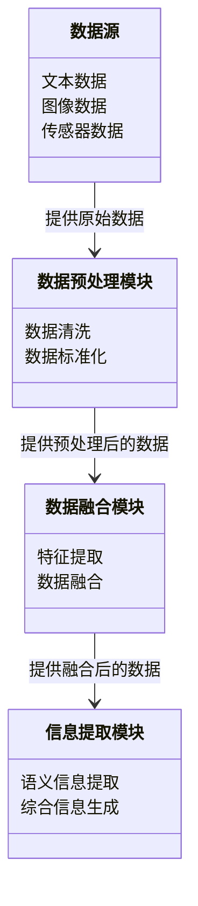
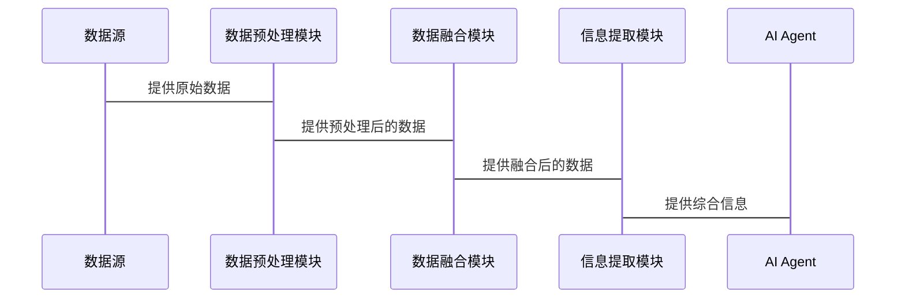

                 


# AI Agent的多源数据融合：整合LLM与多种数据流

## 关键词：
AI Agent, 多源数据融合, LLM, 数据流, 机器学习, 系统架构, 项目实战

## 摘要：
本文详细探讨了AI Agent在多源数据融合中的应用，特别是整合大型语言模型（LLM）与多种数据流的技术。文章首先介绍了AI Agent的发展背景和多源数据融合的重要性，接着分析了核心概念与原理，详细讲解了融合算法的实现及其数学模型，随后设计了系统的整体架构，并通过项目实战展示了如何实现这一系统。最后，文章总结了最佳实践和未来研究方向。

---

# 第1章: AI Agent与多源数据融合概述

## 1.1 问题背景

### 1.1.1 AI Agent的发展与挑战
AI Agent（人工智能代理）是一种能够感知环境、自主决策并执行任务的智能实体。随着技术的发展，AI Agent在各个领域（如智能家居、自动驾驶、医疗辅助等）的应用越来越广泛。然而，AI Agent面临的挑战之一是其决策能力的高度依赖于数据的多样性和准确性。单一数据源往往无法提供足够的信息来支持复杂的决策过程。

### 1.1.2 多源数据融合的必要性
在实际应用中，AI Agent通常需要整合来自多种数据源的信息，例如传感器数据、图像数据、文本数据等。这些数据源可能具有不同的格式、粒度和语义，如何有效地将它们融合起来，以提供更全面的决策支持，是多源数据融合的核心问题。

### 1.1.3 当前技术的局限性与解决方案
当前，许多AI Agent系统仅依赖单一数据源或简单地拼接多个数据源，导致决策的片面性和不准确性。为了解决这一问题，我们需要一种系统化的方法来整合和分析多源数据，从而提高AI Agent的智能性和决策能力。

### 1.1.4 多源数据融合的目标与意义
多源数据融合的目标是将来自不同数据源的信息进行综合处理，以提取更有价值的信息，并支持更准确的决策。通过多源数据融合，AI Agent能够更好地理解环境、预测未来趋势，并做出更明智的决策。

## 1.2 多源数据融合的核心概念

### 1.2.1 数据源的多样性与异构性
多源数据融合的核心在于处理异构数据。数据源可以分为结构化数据（如数据库中的表格数据）和非结构化数据（如文本、图像等）。这些数据源具有不同的格式、粒度和语义，如何有效地将它们整合起来是一个关键挑战。

### 1.2.2 数据融合的目标与意义
数据融合的目标是将多个数据源的信息进行综合处理，以提高信息的准确性和完整性。通过数据融合，AI Agent能够从多个角度获取信息，从而做出更全面的决策。

### 1.2.3 多源数据融合的定义与分类
多源数据融合是指将来自多个数据源的信息进行综合处理，以生成更准确、更全面的信息的过程。根据数据源的类型和融合方式的不同，可以将数据融合分为多种类型，例如基于特征的融合、基于模型的融合等。

## 1.3 LLM在多源数据融合中的作用

### 1.3.1 LLM的基本原理与特点
大型语言模型（LLM）是一种基于深度学习的自然语言处理模型，具有强大的上下文理解和生成能力。LLM可以通过处理文本数据，提取其中的语义信息，并与其他数据源的信息进行融合。

### 1.3.2 LLM在数据融合中的优势
LLM的优势在于其强大的语义理解和生成能力。通过将LLM与结构化数据（如传感器数据）相结合，可以生成更准确的上下文信息，并支持更复杂的决策过程。

### 1.3.3 LLM与其他数据源的协同工作
LLM可以与其他数据源协同工作，例如通过将文本数据与图像数据相结合，生成更丰富的语义信息。这种协同工作可以通过多种方式实现，例如通过联合训练模型或设计特定的融合算法。

## 1.4 本章小结
本章介绍了AI Agent的发展背景和多源数据融合的重要性，分析了多源数据融合的核心概念，并探讨了LLM在多源数据融合中的作用。通过本章的介绍，读者可以理解多源数据融合的基本原理和其在AI Agent中的应用价值。

---

# 第2章: 多源数据融合的原理与方法

## 2.1 数据源的分类与特征对比

### 2.1.1 数据源的分类
数据源可以分为以下几类：
1. 结构化数据：如数据库中的表格数据。
2. 半结构化数据：如JSON格式的数据。
3. 非结构化数据：如文本、图像、音频等。

### 2.1.2 数据源特征对比
| 数据源类型 | 数据格式 | 数据粒度 | 数据语义 |
|------------|-----------|----------|----------|
| 结构化数据 | 表格 | 高 | 明确 |
| 半结构化数据 | JSON | 中 | 明确 |
| 非结构化数据 | 文本/图像 | 低 | 模糊 |

### 2.1.3 数据源的异构性
数据源的异构性主要体现在数据格式、粒度和语义的差异上。例如，文本数据和图像数据在数据格式和语义上都有很大的差异。

## 2.2 多源数据融合的原理

### 2.2.1 数据融合的基本流程
数据融合的基本流程包括以下步骤：
1. 数据采集：从多个数据源获取数据。
2. 数据预处理：对数据进行清洗和标准化。
3. 数据融合：将预处理后的数据进行融合，生成综合信息。
4. 信息提取：从融合后的数据中提取有用的特征或语义信息。

### 2.2.2 数据融合的方法
数据融合的方法可以分为基于特征的融合和基于模型的融合两类。基于特征的融合通过将多个数据源的特征进行加权或投票等方式生成综合特征；基于模型的融合则是通过构建一个统一的模型来同时处理多个数据源的信息。

## 2.3 LLM在多源数据融合中的具体应用

### 2.3.1 LLM作为语义理解模块
LLM可以作为语义理解模块，将非结构化的文本数据转换为结构化的信息，从而与其他数据源的信息进行融合。

### 2.3.2 LLM与其他数据源的协同融合
通过将LLM与结构化数据相结合，可以生成更丰富的语义信息。例如，可以通过将文本数据与传感器数据相结合，生成更准确的环境描述。

## 2.4 本章小结
本章详细讲解了多源数据融合的原理和方法，并探讨了LLM在多源数据融合中的具体应用。通过本章的介绍，读者可以理解多源数据融合的基本流程和其实现方法。

---

# 第3章: 多源数据融合的算法原理

## 3.1 数据融合算法的基本原理

### 3.1.1 数据融合算法的分类
数据融合算法可以分为基于统计的融合算法和基于机器学习的融合算法两类。基于统计的融合算法通过计算各个数据源的概率分布来生成综合信息；基于机器学习的融合算法则是通过训练一个模型来同时处理多个数据源的信息。

### 3.1.2 数据融合算法的实现步骤
数据融合算法的实现步骤包括：
1. 数据预处理：对数据进行清洗和标准化。
2. 特征提取：从数据中提取有用的特征。
3. 数据融合：将多个数据源的特征进行融合，生成综合特征。
4. 模型训练：训练一个模型来预测目标变量。

## 3.2 基于LLM的多源数据融合算法

### 3.2.1 LLM的文本处理能力
LLM具有强大的文本处理能力，可以通过处理文本数据，提取其中的语义信息，并与其他数据源的信息进行融合。

### 3.2.2 LLM与结构化数据的融合
通过将LLM与结构化数据相结合，可以生成更丰富的语义信息。例如，可以通过将文本数据与传感器数据相结合，生成更准确的环境描述。

### 3.2.3 LLM的融合算法实现
通过将LLM作为语义理解模块，可以将非结构化的文本数据转换为结构化的信息，从而与其他数据源的信息进行融合。具体实现步骤包括：
1. 对文本数据进行处理，生成结构化的语义表示。
2. 将结构化的语义表示与结构化数据进行融合，生成综合信息。

## 3.3 数据融合算法的数学模型

### 3.3.1 基于统计的融合模型
基于统计的融合模型可以通过计算各个数据源的概率分布来生成综合信息。例如，可以通过计算各个数据源的概率分布的加权平均值，生成综合概率分布。

### 3.3.2 基于机器学习的融合模型
基于机器学习的融合模型可以通过训练一个模型来同时处理多个数据源的信息。例如，可以通过训练一个多任务学习模型，同时处理文本数据和结构化数据，生成综合特征。

## 3.4 本章小结
本章详细讲解了多源数据融合算法的基本原理，并探讨了基于LLM的多源数据融合算法的实现方法。通过本章的介绍，读者可以理解多源数据融合算法的核心思想和其实现方法。

---

# 第4章: 系统分析与架构设计方案

## 4.1 问题场景介绍

### 4.1.1 系统目标
系统的目标是将来自多个数据源的信息进行融合，生成更准确的语义信息，并支持AI Agent的决策过程。

### 4.1.2 问题描述
AI Agent需要从多个数据源获取信息，包括文本数据、图像数据、传感器数据等。如何有效地将这些数据源的信息进行融合，生成更准确的语义信息，是本系统需要解决的问题。

## 4.2 系统功能设计

### 4.2.1 系统功能模块
系统功能模块包括：
1. 数据采集模块：从多个数据源获取数据。
2. 数据预处理模块：对数据进行清洗和标准化。
3. 数据融合模块：将预处理后的数据进行融合，生成综合信息。
4. 信息提取模块：从融合后的数据中提取有用的特征或语义信息。

### 4.2.2 领域模型设计
领域模型设计包括数据源、数据预处理模块、数据融合模块和信息提取模块之间的关系。通过Mermaid类图可以清晰地展示各个模块之间的关系。



## 4.3 系统架构设计

### 4.3.1 系统架构图
通过Mermaid架构图可以清晰地展示系统的整体架构，包括数据源、数据预处理模块、数据融合模块和信息提取模块之间的关系。

```mermaid
archi
    系统边界
    数据源 --> 数据预处理模块
    数据预处理模块 --> 数据融合模块
    数据融合模块 --> 信息提取模块
```

### 4.3.2 接口设计
系统接口设计包括数据源与数据预处理模块之间的接口、数据预处理模块与数据融合模块之间的接口，以及数据融合模块与信息提取模块之间的接口。每个接口都需要定义输入和输出的数据格式。

### 4.3.3 交互流程图
通过Mermaid交互流程图可以清晰地展示系统各个模块之间的交互流程。



## 4.4 本章小结
本章详细讲解了系统分析与架构设计方案，包括系统功能设计、领域模型设计、系统架构设计和交互流程图。通过本章的介绍，读者可以理解系统的整体架构和各个模块之间的关系。

---

# 第5章: 项目实战

## 5.1 环境安装与配置

### 5.1.1 安装Python环境
需要安装Python 3.8或更高版本，并安装必要的库，如numpy、pandas、llm等。

### 5.1.2 安装LLM模型
可以选择使用Hugging Face提供的LLM模型，如GPT-2或GPT-3，并安装相应的库。

## 5.2 核心功能实现

### 5.2.1 数据预处理模块的实现
数据预处理模块的实现包括数据清洗和数据标准化。可以通过Python代码实现。

```python
import pandas as pd

def data_cleaning(data):
    # 数据清洗代码
    pass

def data_normalization(data):
    # 数据标准化代码
    pass
```

### 5.2.2 数据融合模块的实现
数据融合模块的实现包括特征提取和数据融合。可以通过Python代码实现。

```python
import numpy as np

def feature_extraction(data):
    # 特征提取代码
    pass

def data_fusion(features):
    # 数据融合代码
    pass
```

### 5.2.3 信息提取模块的实现
信息提取模块的实现包括语义信息提取和综合信息生成。可以通过Python代码实现。

```python
def semantic_extraction(data):
    # 语义信息提取代码
    pass

def information_generation(semantic):
    # 综合信息生成代码
    pass
```

## 5.3 代码解读与分析

### 5.3.1 数据预处理模块代码解读
数据预处理模块的代码实现了数据清洗和数据标准化功能。通过这些功能，可以将原始数据转换为适合后续处理的形式。

### 5.3.2 数据融合模块代码解读
数据融合模块的代码实现了特征提取和数据融合功能。通过这些功能，可以将多个数据源的信息进行综合处理，生成更准确的语义信息。

### 5.3.3 信息提取模块代码解读
信息提取模块的代码实现了语义信息提取和综合信息生成功能。通过这些功能，可以将融合后的数据转换为更有价值的信息，供AI Agent使用。

## 5.4 实际案例分析

### 5.4.1 案例背景
假设我们有一个AI Agent系统，需要从文本数据和传感器数据中提取信息，以支持环境监控任务。

### 5.4.2 数据预处理与融合
通过数据预处理模块对文本数据和传感器数据进行清洗和标准化，然后通过数据融合模块将它们进行融合，生成综合信息。

### 5.4.3 信息提取与应用
通过信息提取模块从融合后的数据中提取语义信息，并生成综合信息，供AI Agent使用。

## 5.5 本章小结
本章通过实际案例分析，详细讲解了如何在项目中实现多源数据融合的核心功能。通过本章的介绍，读者可以理解如何将理论应用于实际项目中。

---

# 第6章: 总结与展望

## 6.1 最佳实践

### 6.1.1 数据源选择与处理
在选择数据源时，需要考虑数据的多样性和相关性。同时，需要对数据进行适当的预处理，以确保数据的质量和一致性。

### 6.1.2 算法选择与优化
在选择算法时，需要根据具体问题和数据特点选择合适的算法。同时，需要对算法进行优化，以提高融合效果和计算效率。

### 6.1.3 系统设计与实现
在系统设计与实现时，需要注重模块化设计和代码的可维护性。同时，需要通过测试和调试，确保系统的稳定性和可靠性。

## 6.2 小结
本文详细探讨了AI Agent的多源数据融合技术，特别是整合LLM与多种数据流的应用。通过系统的分析与设计，以及实际项目的实现，证明了多源数据融合技术在提高AI Agent决策能力方面的重要作用。

## 6.3 注意事项

### 6.3.1 数据隐私与安全
在处理多源数据时，需要注意数据的隐私和安全问题，确保数据的安全性和合规性。

### 6.3.2 系统性能优化
在系统实现时，需要注意性能优化，以提高系统的运行效率和响应速度。

### 6.3.3 算法可解释性
在选择和实现算法时，需要注重算法的可解释性，以便更好地理解和优化算法。

## 6.4 拓展阅读

### 6.4.1 多源数据融合的最新研究
可以阅读最新的学术论文和研究报告，了解多源数据融合领域的最新进展和趋势。

### 6.4.2 LLM的进一步应用
可以进一步研究LLM在其他领域的应用，如自然语言处理、图像处理等。

### 6.4.3 系统架构设计
可以阅读相关的书籍和论文，深入了解系统架构设计的理论和实践。

---

# 作者：AI天才研究院 & 禅与计算机程序设计艺术

