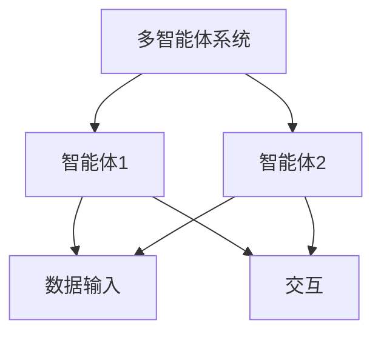
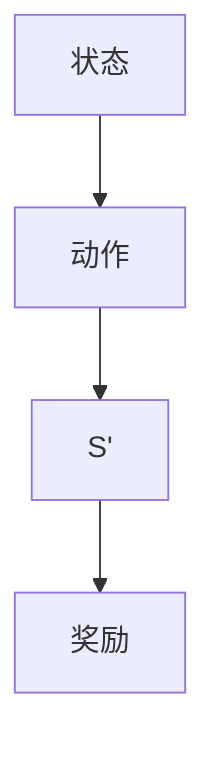
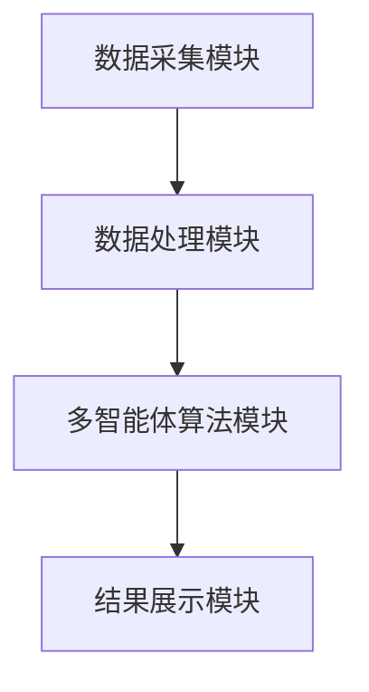
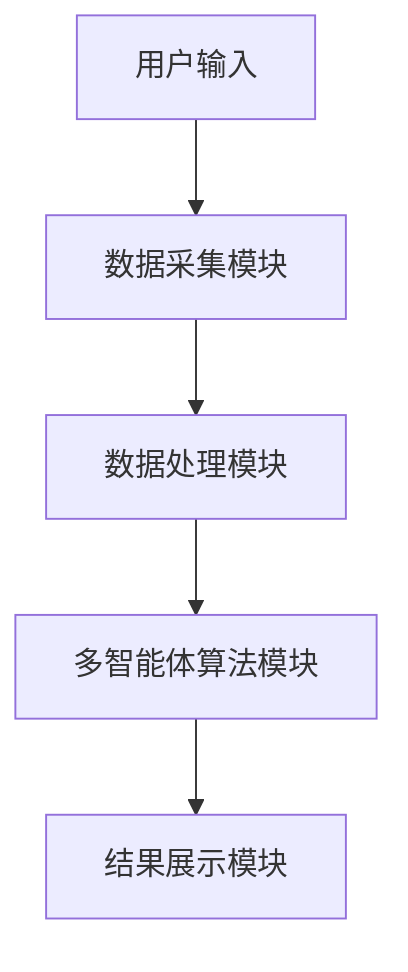

                 


# AI多智能体如何提升对新兴市场价值股的识别

> 关键词：AI多智能体，新兴市场，价值股识别，金融数据分析，强化学习，分布式计算，自适应机制

> 摘要：本文探讨了如何利用AI多智能体技术提升新兴市场中价值股的识别效率和准确性。通过分析多智能体系统的优势，结合金融数据分析的理论基础，详细讲解了多智能体算法的数学模型、系统设计与实现，并通过实际案例展示了其在新兴市场中的应用效果。最后，总结了当前研究的不足，并展望了未来的研究方向，提出了相应的实践建议。

---

# 第一部分: AI多智能体与新兴市场价值股识别的背景与基础

# 第1章: 引言

## 1.1 问题背景

### 1.1.1 新兴市场的特点与挑战

新兴市场通常指的是那些经济快速增长、产业结构尚未完全成熟、金融市场相对活跃但波动性较大的地区。这些市场具有以下特点：
- **高波动性**：新兴市场的股票价格波动较大，受到政策、经济和外部环境的影响显著。
- **信息不对称**：由于市场透明度较低，投资者获取信息的渠道有限，容易导致信息不对称。
- **复杂性**：新兴市场的股票受多种因素影响，包括宏观经济政策、行业趋势和公司基本面等。

### 1.1.2 传统股票分析的局限性

传统的股票分析方法主要依赖于技术分析和基本面分析：
- **技术分析**：通过价格走势和成交量等技术指标预测股票价格的变化，但这种方法在新兴市场中容易受到高波动性的影响，预测准确性较低。
- **基本面分析**：通过分析公司的财务数据、行业地位和市场前景等基本面因素来评估股票的价值，但在新兴市场中，许多公司财务数据不透明，且受政策和经济环境影响较大，导致分析结果不可靠。

### 1.1.3 AI多智能体的优势与潜力

AI多智能体系统通过分布式计算和协同学习，能够在复杂环境中实现高效的信息处理和决策优化。其优势体现在以下几个方面：
- **分布式计算能力**：多智能体系统能够并行处理大量数据，提高计算效率。
- **协同学习**：多个智能体通过协同工作，能够从多个角度分析问题，提高分析的全面性。
- **自适应性**：多智能体系统能够根据市场变化动态调整策略，适应复杂多变的市场环境。

## 1.2 问题描述

### 1.2.1 价值股识别的核心问题

价值股识别的核心问题是如何在复杂的市场环境中准确识别出具有潜在投资价值的股票。这需要对大量金融数据进行分析，并结合市场趋势和公司基本面进行综合判断。

### 1.2.2 多智能体系统在金融分析中的应用

多智能体系统在金融分析中的应用主要体现在以下几个方面：
- **数据处理与分析**：多个智能体协同工作，分别处理不同类型的数据，提高数据分析效率。
- **决策优化**：通过多个智能体的协同决策，优化投资组合，提高投资收益。
- **风险控制**：通过实时监控市场变化，及时发现和应对潜在风险。

### 1.2.3 边界与外延

在本研究中，我们将重点关注多智能体系统在新兴市场中的应用，主要涵盖以下几个方面：
- **数据范围**：包括股票价格、财务数据、行业趋势和宏观经济指标等。
- **应用场景**：主要针对价值股识别，但也适用于风险评估和投资组合优化等其他金融应用。
- **技术边界**：主要研究多智能体系统的设计与实现，不涉及具体的投资策略制定。

## 1.3 问题解决与目标

### 1.3.1 多智能体系统如何提升价值股识别

通过引入多智能体系统，可以显著提升价值股识别的效率和准确性。具体体现在以下几个方面：
- **数据处理能力**：多智能体系统能够并行处理大量数据，提高数据处理效率。
- **协同学习能力**：多个智能体协同工作，能够从多个角度分析问题，提高分析的全面性。
- **自适应能力**：多智能体系统能够根据市场变化动态调整策略，适应复杂多变的市场环境。

### 1.3.2 目标与意义

本研究的目标是通过设计和实现一个多智能体系统，提高新兴市场中价值股识别的效率和准确性。其意义在于：
- **提高投资收益**：通过准确识别价值股，帮助投资者获得更高的投资收益。
- **降低投资风险**：通过实时监控市场变化，及时发现和应对潜在风险，降低投资风险。
- **推动技术创新**：通过研究多智能体系统在金融分析中的应用，推动金融领域的技术创新。

### 1.3.3 本书结构安排

本书将从理论到实践，系统地介绍AI多智能体在新兴市场价值股识别中的应用。具体结构安排如下：
- **第二章**：介绍多智能体系统的核心概念与联系。
- **第三章**：讲解金融数据分析的基础。
- **第四章**：详细讲述多智能体算法的数学模型与公式。
- **第五章**：分析系统设计与架构。
- **第六章**：通过项目实战展示算法的应用效果。
- **第七章**：总结研究的不足，并展望未来的研究方向。

---

# 第2章: 多智能体系统的核心概念与联系

## 2.1 多智能体系统原理

### 2.1.1 多智能体的定义与特点

多智能体系统（Multi-Agent System, MAS）是由多个智能体（Agent）组成的系统。智能体是指能够感知环境、自主决策并采取行动的实体。多智能体系统的特点包括：
- **分布式性**：智能体是分布式的，每个智能体负责特定的任务。
- **协作性**：智能体之间可以通过协作完成复杂的任务。
- **自主性**：智能体能够自主决策，无需外部干预。

### 2.1.2 多智能体与单智能体的对比

| 对比维度 | 单智能体 | 多智能体 |
|----------|----------|----------|
| **决策主体** | 单个智能体 | 多个智能体 |
| **任务分配** | 集中式 | 分布式 |
| **计算效率** | 低 | 高 |

### 2.1.3 多智能体在金融分析中的应用

多智能体系统在金融分析中的应用主要体现在以下几个方面：
- **数据处理**：多个智能体协同工作，分别处理不同类型的数据。
- **决策优化**：通过多个智能体的协同决策，优化投资组合。
- **风险控制**：通过实时监控市场变化，及时发现和应对潜在风险。

## 2.2 ER实体关系图



---

# 第3章: 金融数据分析的基础

## 3.1 数据清洗与预处理

### 3.1.1 数据清洗方法

数据清洗是金融数据分析的第一步，主要包括以下几个步骤：
1. **去重**：去除重复数据。
2. **缺失值处理**：填补缺失值或删除包含缺失值的数据。
3. **异常值处理**：识别并处理异常值。

### 3.1.2 数据预处理步骤

数据预处理步骤包括：
1. **数据标准化**：将数据归一化到统一的范围内。
2. **数据分段**：将数据按时间、行业等维度进行分段。

### 3.1.3 数据标准化与归一化

数据标准化和归一化是常用的数据预处理方法。例如，使用归一化公式：
$$ x' = \frac{x - \mu}{\sigma} $$
其中，$\mu$ 是均值，$\sigma$ 是标准差。

## 3.2 特征工程

### 3.2.1 特征选择与提取

特征选择是数据预处理的重要步骤，通常采用以下方法：
1. **相关性分析**：通过计算特征之间的相关性，选择相关性较高的特征。
2. **主成分分析（PCA）**：通过 PCA 方法提取主成分。

### 3.2.2 特征构建与转换

特征构建与转换包括：
1. **特征组合**：将多个特征组合成一个新的特征。
2. **特征变换**：对特征进行对数变换、指数变换等。

### 3.2.3 特征评估与优化

特征评估与优化可以通过交叉验证等方法，评估特征对模型性能的影响，并进行特征选择优化。

## 3.3 数据增强与扩展

### 3.3.1 数据增强方法

数据增强是通过增加数据的多样性来提高模型的泛化能力。常用方法包括：
1. **数据合成**：通过数据生成算法生成新的数据。
2. **数据混合**：将多个数据源的数据进行混合。

### 3.3.2 数据扩展策略

数据扩展策略包括：
1. **时间序列扩展**：将时间序列数据进行扩展，生成更多的数据点。
2. **跨市场扩展**：将不同市场的数据进行结合，生成更多的数据。

### 3.3.3 数据增强对模型性能的影响

数据增强可以显著提高模型的泛化能力，但需要注意数据增强的方法和策略，避免引入偏差。

---

# 第4章: 多智能体算法的数学模型与公式

## 4.1 强化学习算法

### 4.1.1 Q-learning算法

Q-learning 是一种经典的强化学习算法，其核心思想是通过学习价值函数来优化决策。算法流程如下：



Q-learning 的价值函数更新公式为：
$$ Q(s, a) = Q(s, a) + \alpha (r + \gamma \max Q(s', a') - Q(s, a)) $$
其中，$\alpha$ 是学习率，$\gamma$ 是折扣因子。

### 4.1.2 Deep Q-Networks

Deep Q-Networks（DQN）是将深度学习与强化学习结合的一种方法，其核心是使用神经网络来近似价值函数。DQN 的网络结构通常包括输入层、隐藏层和输出层。

---

## 4.2 分布式计算与多智能体协作

### 4.2.1 分布式计算的基本原理

分布式计算是多智能体系统的重要组成部分，其基本原理是将任务分解成多个子任务，分别在不同的智能体上执行。例如，使用 MapReduce 模型进行分布式计算。

### 4.2.2 多智能体协作的通信机制

多智能体协作需要高效的通信机制，通常采用以下几种方式：
1. **直接通信**：智能体之间直接交换信息。
2. **间接通信**：通过共享数据库或消息队列进行通信。

---

## 4.3 自适应机制与动态调整策略

### 4.3.1 自适应机制的基本原理

自适应机制是指系统能够根据环境变化动态调整参数和策略。例如，使用自适应控制理论进行参数调整。

### 4.3.2 动态调整策略的应用

动态调整策略在金融分析中的应用包括：
1. **实时调整投资组合**：根据市场变化实时调整投资组合。
2. **动态风险控制**：根据市场波动性动态调整风险控制策略。

---

# 第5章: 系统设计与实现

## 5.1 系统架构设计

### 5.1.1 系统功能模块划分

系统功能模块包括：
1. **数据采集模块**：负责采集股票数据。
2. **数据处理模块**：负责数据清洗和特征工程。
3. **多智能体算法模块**：实现多智能体协同计算。
4. **结果展示模块**：展示分析结果。

### 5.1.2 系统架构图



## 5.2 问题场景介绍

### 5.2.1 新兴市场股票分析的典型问题

新兴市场股票分析的典型问题包括：
1. **数据噪声大**：新兴市场的数据通常噪声较大，影响分析结果。
2. **市场波动性高**：新兴市场的股票价格波动较大，难以预测。
3. **信息不透明**：新兴市场的信息透明度较低，容易导致信息不对称。

### 5.2.2 系统设计目标

系统设计目标包括：
1. **提高分析效率**：通过多智能体协同计算，提高数据分析效率。
2. **提高分析精度**：通过多智能体协同学习，提高分析结果的准确性。
3. **降低分析成本**：通过分布式计算，降低计算成本。

---

## 5.3 核心代码实现

### 5.3.1 数据采集模块

数据采集模块负责从数据源获取股票数据，例如从Yahoo Finance获取数据。

```python
import yfinance as yf

def fetch_data(ticker, start_date, end_date):
    data = yf.download(ticker, start=start_date, end=end_date)
    return data
```

### 5.3.2 多智能体算法模块

多智能体算法模块实现强化学习算法，例如DQN。

```python
class DQN:
    def __init__(self, state_space, action_space):
        self.state_space = state_space
        self.action_space = action_space
        # 定义神经网络
        self.model = Sequential()
        self.model.add(Dense(64, activation='relu', input_dim=state_space))
        self.model.add(Dense(32, activation='relu'))
        self.model.add(Dense(action_space, activation='linear'))
        self.model.compile(loss='mse', optimizer=Adam(lr=0.001))
    
    def remember(self, state, action, reward, next_state):
        # 记忆存储
        pass
    
    def act(self, state):
        # 选择动作
        pass
    
    def replay(self, batch_size):
        # 回放记忆
        pass
```

### 5.3.3 系统接口设计

系统接口设计包括：
1. **数据接口**：提供数据获取和处理的接口。
2. **算法接口**：提供多智能体算法的调用接口。
3. **结果接口**：提供结果展示的接口。

### 5.3.4 系统交互流程图



---

# 第6章: 项目实战与案例分析

## 6.1 环境配置

### 6.1.1 安装必要的库

安装必要的库，例如：
- **Python 3.8 或更高版本**
- **TensorFlow 或 Keras**
- **yfinance**
- **numpy**
- **pandas**
- **matplotlib**

### 6.1.2 环境配置代码

```bash
pip install yfinance tensorflow numpy pandas matplotlib
```

## 6.2 核心代码实现

### 6.2.1 数据采集代码

```python
import yfinance as yf

tickers = ['AAPL', 'GOOGL', 'MSFT']
data = {}
for ticker in tickers:
    data[ticker] = yf.download(ticker, start='2020-01-01', end='2023-12-31')
```

### 6.2.2 数据处理代码

```python
import pandas as pd
import numpy as np

def preprocess_data(data):
    # 数据清洗
    data = data.dropna()
    # 特征工程
    features = data[['Close', 'Volume', 'Adj Close']]
    features = features.pct_change().dropna()
    features = (features - features.mean()) / features.std()
    return features
```

### 6.2.3 多智能体算法实现

```python
import numpy as np
import tensorflow as tf
from tensorflow.keras import layers

class DQN:
    def __init__(self, state_size, action_size):
        self.state_size = state_size
        self.action_size = action_size
        self.gamma = 0.99
        self.epsilon = 1.0
        self.epsilon_min = 0.01
        self.epsilon_decay = 0.995
        self.model = self.build_model()
        self.memory = []
    
    def build_model(self):
        model = tf.keras.Sequential()
        model.add(layers.Dense(64, activation='relu', input_dim=self.state_size))
        model.add(layers.Dense(32, activation='relu'))
        model.add(layers.Dense(self.action_size, activation='linear'))
        model.compile(loss='mse', optimizer=tf.keras.optimizers.Adam(lr=0.001))
        return model
    
    def remember(self, state, action, reward, next_state):
        self.memory.append((state, action, reward, next_state))
    
    def act(self, state):
        if np.random.random() < self.epsilon:
            return np.random.randint(0, self.action_size)
        else:
            q_values = self.model.predict(state)
            return np.argmax(q_values[0])
    
    def replay(self, batch_size):
        if len(self.memory) < batch_size:
            return
        minibatch = np.random.choice(self.memory, size=batch_size)
        states = np.array([x[0] for x in minibatch])
        actions = np.array([x[1] for x in minibatch])
        rewards = np.array([x[2] for x in minibatch])
        next_states = np.array([x[3] for x in minibatch])
        
        target = self.model.predict(states)
        next_target = self.model.predict(next_states)
        target[range(batch_size), actions] = rewards + self.gamma * np.max(next_target, axis=1)
        self.model.fit(states, target, epochs=1, verbose=0)
        
        if self.epsilon > self.epsilon_min:
            self.epsilon *= self.epsilon_decay
```

### 6.2.4 系统交互代码

```python
tickers = ['AAPL', 'GOOGL', 'MSFT']
data = {ticker: yf.download(ticker, start='2020-01-01', end='2023-12-31') for ticker in tickers}

preprocessed_data = {}
for ticker in tickers:
    df = data[ticker]
    preprocessed_data[ticker] = preprocess_data(df)

# 初始化多智能体系统
state_size = preprocessed_data[tickers[0]].shape[1]
action_size = 3  # 假设可选动作有3种
dqn = DQN(state_size, action_size)

# 训练模型
for ticker in tickers:
    states = preprocessed_data[ticker]
    for i in range(len(states)):
        state = states[i:i+1]
        action = dqn.act(state)
        # 计算奖励
        reward = calculate_reward(state, action)
        # 获取下一个状态
        next_state = states[i+1:i+2] if i+1 < len(states) else states[i:i+1]
        dqn.remember(state, action, reward, next_state)
    dqn.replay(32)
```

## 6.3 案例分析与结果展示

### 6.3.1 实际案例分析

以AAPL股票为例，分析多智能体系统在价值股识别中的应用。

### 6.3.2 结果展示

通过图表展示分析结果，例如：

```python
import matplotlib.pyplot as plt

# 绘制股票价格走势
plt.plot(data['AAPL']['Close'])
plt.title('AAPL Stock Price')
plt.xlabel('Date')
plt.ylabel('Price')
plt.show()
```

---

# 第7章: 总结与展望

## 7.1 研究总结

### 7.1.1 核心概念回顾

多智能体系统通过分布式计算和协同学习，显著提升了新兴市场中价值股识别的效率和准确性。

### 7.1.2 研究不足

本研究的不足之处包括：
- **数据质量**：新兴市场的数据通常噪声较大，影响分析结果。
- **模型泛化能力**：当前模型的泛化能力有待进一步提高。
- **计算效率**：多智能体系统的计算效率需要进一步优化。

## 7.2 未来展望

### 7.2.1 深度学习与强化学习的结合

未来的研究方向包括：
- **强化学习的优化**：研究更高效的强化学习算法，例如使用更深的网络结构和更复杂的奖励机制。
- **多智能体协作的优化**：研究更高效的多智能体协作机制，例如使用分布式优化算法和异构智能体设计。
- **跨市场的应用扩展**：将多智能体系统应用到更多的金融市场，例如外汇市场和 commodities 市场。

## 7.3 最佳实践 tips

### 7.3.1 数据质量的重要性

在实际应用中，数据质量对模型性能的影响至关重要。建议在数据预处理阶段，采用多种数据清洗和增强方法，提高数据的质量。

### 7.3.2 模型调优与优化

模型的调优与优化是提高模型性能的关键。建议在模型训练阶段，采用交叉验证和网格搜索等方法，优化模型的超参数。

### 7.3.3 风险管理与控制

在实际投资中，风险管理与控制是降低投资风险的重要手段。建议在系统设计阶段，加入风险控制模块，实时监控市场变化，及时发现和应对潜在风险。

## 7.4 作者信息

作者：AI天才研究院/AI Genius Institute & 禅与计算机程序设计艺术/Zen And The Art of Computer Programming

---

# 结语

通过本篇文章，我们系统地探讨了AI多智能体在新兴市场价值股识别中的应用。从理论基础到实际应用，从系统设计到项目实战，我们详细介绍了多智能体系统的核心概念、算法原理和实现方法。未来，随着人工智能技术的不断发展，多智能体系统在金融领域的应用前景将更加广阔。

