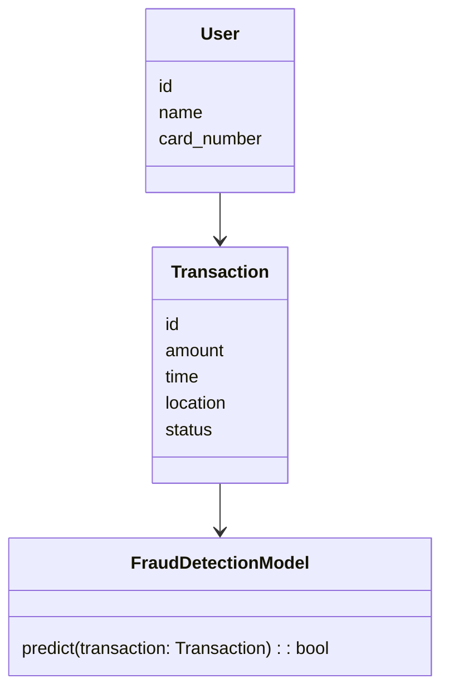
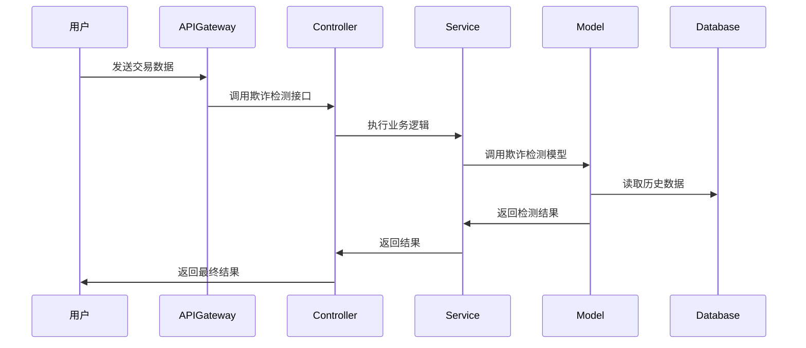

                 


# AI驱动的信用卡fraud检测模型

> 关键词：信用卡欺诈检测，人工智能，随机森林，XGBoost，LSTM，金融安全

> 摘要：随着信用卡的普及，欺诈检测成为金融安全的重要组成部分。传统的欺诈检测方法存在诸多局限性，而基于AI的欺诈检测模型通过深度学习和先进算法，能够显著提升检测准确性和效率。本文将从背景介绍、核心概念、算法原理、系统架构设计、项目实战等多方面，详细探讨AI驱动的信用卡欺诈检测模型的构建与应用。

---

# 第一部分: 信用卡欺诈检测的背景与挑战

## 第1章: 信用卡欺诈检测概述

### 1.1 信用卡欺诈检测的背景与意义
欺诈检测是金融安全的核心问题之一。随着信用卡的普及，欺诈交易的数量和复杂性逐年增加。传统的基于规则的欺诈检测方法逐渐暴露出效率低、误报率高、难以应对新型攻击手段等问题。AI技术的引入为欺诈检测提供了新的解决方案。

### 1.2 欺诈检测的核心概念与问题描述
#### 1.2.1 欺诈交易的定义与分类
欺诈交易是指通过非法手段获取他人信用卡信息并进行未经授权的消费或转账的行为。根据交易特征，欺诈交易可以分为“手法型”（如虚假交易）和“技术型”（如伪卡交易）两类。

#### 1.2.2 欺诈检测的典型场景与边界
典型场景包括在线支付、ATM交易、电话授权交易等。欺诈检测的边界包括交易时间、金额、地理位置、交易频率等多个维度。

#### 1.2.3 欺诈检测的核心目标与挑战
核心目标是通过分析交易数据，识别潜在的欺诈行为。主要挑战包括数据稀疏性、类别不平衡、模型泛化能力等问题。

### 1.3 传统欺诈检测方法的局限性
#### 1.3.1 基于规则的检测方法
基于规则的方法依赖人工定义的交易特征（如交易金额、时间间隔等），难以应对复杂多变的欺诈手段。

#### 1.3.2 统计模型的局限性
统计模型（如逻辑回归）对非线性关系的捕捉能力较弱，难以处理高维数据。

#### 1.3.3 传统方法的不足与改进方向
传统方法误报率高、漏报率高，且难以应对新型欺诈手段。改进方向包括引入机器学习和深度学习技术。

### 1.4 本章小结
本章通过介绍信用卡欺诈检测的背景、核心概念和传统方法的局限性，为后续AI驱动的模型构建奠定了基础。

---

# 第二部分: AI驱动的欺诈检测模型核心概念

## 第2章: AI驱动的欺诈检测模型核心概念

### 2.1 模型的核心要素与组成
#### 2.1.1 数据特征与处理
欺诈检测模型的核心在于数据特征的提取与处理。常见的特征包括交易金额、时间间隔、地理位置、交易类型等。

#### 2.1.2 模型算法与选择
选择合适的算法是模型构建的关键。常见的算法包括随机森林、XGBoost、LSTM等。

#### 2.1.3 模型评估与优化
通过准确率、召回率、F1分数等指标对模型进行评估，并通过网格搜索等方法进行优化。

### 2.2 欺诈检测模型的实体关系分析
#### 2.2.1 实体关系图（ER图）
以下是欺诈检测系统的实体关系图：

```mermaid
erDiagram
    user {
        id : integer
        name : string
        card_number : string
        transaction_id : integer
    }
    transaction {
        id : integer
        amount : float
        time : datetime
        location : string
        status : boolean
    }
    fraud_detection_system {
        model : string
        accuracy : float
        recall : float
    }
    user --|> transaction
    transaction --|> fraud_detection_system
```

#### 2.2.2 数据流分析
以下是数据流分析图：

```mermaid
graph TD
    User -> Transaction: 产生交易数据
    Transaction -> FraudDetectionSystem: 数据输入
    FraudDetectionSystem -> ModelTraining: 训练模型
    ModelTraining -> Predict: 模型预测
    Predict -> Result: 输出结果
```

#### 2.2.3 模型与数据的关联关系
模型与数据的关联关系可以通过以下表格展示：

| 数据特征       | 模型输入       | 模型输出       |
|----------------|----------------|----------------|
| 交易金额       | 高维特征向量   | 欺诈概率       |
| 时间间隔       |                |                |
| 地理位置       |                |                |
| 交易类型       |                |                |

### 2.3 模型的核心原理与流程
#### 2.3.1 数据预处理流程
以下是数据预处理流程图：

```mermaid
graph TD
    RawData --> Cleaning: 数据清洗
    Cleaning --> FeatureEngineering: 特征工程
    FeatureEngineering --> ModelTraining: 模型训练
```

#### 2.3.2 特征提取与选择
特征提取是欺诈检测的关键步骤。以下是特征选择的对比表格：

| 特征类型       | 是否重要       | 示例值           |
|----------------|----------------|------------------|
| 交易金额       | 是            | 1000元          |
| 时间间隔       | 是            | 1小时            |
| 地理位置       | 是            | 北京市           |
| 交易类型       | 是            | 在线支付         |

#### 2.3.3 模型训练与优化
以下是模型训练流程图：

```mermaid
graph TD
    Data --> ModelTraining: 输入数据
    ModelTraining --> HyperparameterTuning: 调参
    HyperparameterTuning --> ModelEvaluation: 模型评估
    ModelEvaluation --> OptimizedModel: 优化后的模型
```

### 2.4 本章小结
本章详细介绍了AI驱动的欺诈检测模型的核心要素、实体关系和数据处理流程，为后续算法实现奠定了基础。

---

# 第三部分: AI驱动的欺诈检测模型算法原理

## 第3章: 模型算法原理

### 3.1 常见的欺诈检测算法
#### 3.1.1 随机森林算法
随机森林是一种基于树的集成学习算法，通过随机选择特征和样本进行建树，最终通过投票机制得出结果。

#### 3.1.2 XGBoost算法
XGBoost是一种基于树的优化算法，通过正则化和剪枝技术提升模型的泛化能力。

#### 3.1.3 LSTM网络
LSTM（长短期记忆网络）是一种基于循环神经网络的深度学习算法，适合处理时间序列数据。

#### 3.1.4 深度学习模型
深度学习模型（如CNN、Transformer）在处理高维特征和非结构化数据方面具有优势。

### 3.2 算法原理与流程图
#### 3.2.1 随机森林算法流程图
以下是随机森林算法流程图：

```mermaid
graph TD
    Start --> SelectSamples: 随机选择样本
    SelectSamples --> SelectFeatures: 随机选择特征
    SelectFeatures --> BuildTree: 建立决策树
    BuildTree --> End
```

#### 3.2.2 XGBoost算法流程图
以下是XGBoost算法流程图：

```mermaid
graph TD
    Start --> LoadData: 加载数据
    LoadData --> InitializeParameters: 初始化参数
    InitializeParameters --> TrainModel: 训练模型
    TrainModel --> OutputResult: 输出结果
    OutputResult --> End
```

#### 3.2.3 LSTM网络结构图
以下是LSTM网络结构图：

```mermaid
graph TD
    Input --> LSTMCell: 输入层
    LSTMCell --> Output: 输出层
    LSTMCell --> HiddenState: 隐含层
```

### 3.3 算法实现与代码示例
#### 3.3.1 随机森林代码示例
以下是随机森林的Python代码示例：

```python
from sklearn.ensemble import RandomForestClassifier
from sklearn.metrics import accuracy_score

# 数据准备
X_train, y_train = prepare_data()

# 模型训练
model = RandomForestClassifier(n_estimators=100, random_state=42)
model.fit(X_train, y_train)

# 模型预测
y_pred = model.predict(X_test)

# 模型评估
print("Accuracy:", accuracy_score(y_test, y_pred))
```

#### 3.3.2 XGBoost代码示例
以下是XGBoost的Python代码示例：

```python
import xgboost as xgb

# 数据准备
dtrain = xgb.DMatrix(X_train, label=y_train)
dtest = xgb.DMatrix(X_test, label=y_test)

# 模型训练
params = {'n_estimators': 100, 'learning_rate': 0.1, 'max_depth': 6}
model = xgb.XGBClassifier(**params)
model.fit(dtrain)

# 模型预测
y_pred = model.predict(dtest)

# 模型评估
print("Accuracy:", accuracy_score(y_test, y_pred))
```

#### 3.3.3 LSTM网络代码示例
以下是LSTM网络的Python代码示例：

```python
from keras.layers import LSTM, Dense
from keras.models import Sequential

# 模型构建
model = Sequential()
model.add(LSTM(64, input_shape=(timesteps, features)))
model.add(Dense(1, activation='sigmoid'))

# 模型编译
model.compile(loss='binary_crossentropy', optimizer='adam', metrics=['accuracy'])

# 模型训练
model.fit(X_train, y_train, epochs=10, batch_size=32)
```

### 3.4 算法优缺点分析
| 算法名称   | 优点               | 缺点               |
|------------|--------------------|--------------------|
| 随机森林   | 鲁棒性强，易于实现   | 对特征工程依赖较高   |
| XGBoost    | 高效，支持正则化     | 易过拟合           |
| LSTM       | 适合时间序列数据     | 训练时间较长       |

### 3.5 本章小结
本章详细讲解了随机森林、XGBoost和LSTM三种算法的原理、流程和代码实现，帮助读者选择合适的算法进行欺诈检测。

---

# 第四部分: 系统分析与架构设计

## 第4章: 系统分析与架构设计

### 4.1 欺诈检测系统的功能需求
#### 4.1.1 数据采集与处理
系统需要采集信用卡交易数据，并进行清洗和特征工程。

#### 4.1.2 模型训练与部署
系统需要支持模型的训练、保存和部署。

#### 4.1.3 实时检测与反馈
系统需要实时处理交易数据，并快速反馈检测结果。

### 4.2 系统架构设计
#### 4.2.1 分层架构设计
以下是分层架构设计图：

```mermaid
graph TD
    User --> WebInterface: 用户请求
    WebInterface --> Controller: 控制层
    Controller --> Service: 业务逻辑层
    Service --> Model: 模型层
    Model --> Database: 数据库
```

#### 4.2.2 微服务架构设计
以下是微服务架构设计图：

```mermaid
graph TD
    APIGateway --> UserService: 用户服务
    UserService --> TransactionService: 交易服务
    TransactionService --> FraudDetectionService: 欺诈检测服务
    FraudDetectionService --> Database: 数据库
```

### 4.3 系统功能设计
#### 4.3.1 领域模型mermaid类图
以下是领域模型类图：



#### 4.3.2 系统架构图
以下是系统架构图：

```mermaid
graph TD
    APIGateway --> Controller: 接收请求
    Controller --> Service: 调用服务
    Service --> Model: 调用模型
    Model --> Database: 读取数据
```

### 4.4 系统接口设计
系统接口设计包括API接口和数据库接口。以下是API接口设计示例：

```python
from flask import Flask
from flask_restful import Resource, Api

app = Flask(__name__)
api = Api(app)

class FraudDetection(Resource):
    def post(self):
        data = request.get_json()
        # 处理数据并返回结果
        return {'status': 'success', 'result': 'not_fraud'}

api.add_resource(FraudDetection, '/detect_fraud')
```

### 4.5 系统交互mermaid序列图
以下是系统交互序列图：



### 4.6 本章小结
本章通过系统架构设计和接口设计，展示了AI驱动的欺诈检测系统的整体框架和实现流程。

---

# 第五部分: 项目实战

## 第5章: 项目实战

### 5.1 环境安装与配置
#### 5.1.1 安装Python环境
使用Anaconda或虚拟环境管理工具安装Python 3.8以上版本。

#### 5.1.2 安装依赖库
安装必要的库，如scikit-learn、xgboost、keras等。

### 5.2 系统核心实现
#### 5.2.1 数据预处理
以下是数据预处理代码示例：

```python
import pandas as pd
from sklearn.impute import SimpleImputer
from sklearn.preprocessing import StandardScaler

# 数据加载
df = pd.read_csv('transactions.csv')

# 数据清洗
imputer = SimpleImputer(strategy='mean')
df_imputed = imputer.fit_transform(df)

# 特征标准化
scaler = StandardScaler()
X_scaled = scaler.fit_transform(df_imputed)
```

#### 5.2.2 模型实现
以下是模型实现代码示例：

```python
from sklearn.ensemble import RandomForestClassifier
from sklearn.metrics import classification_report

# 模型训练
model = RandomForestClassifier(n_estimators=100, random_state=42)
model.fit(X_train, y_train)

# 模型预测
y_pred = model.predict(X_test)

# 模型评估
print(classification_report(y_test, y_pred))
```

### 5.3 代码应用解读与分析
代码实现了数据预处理、模型训练和评估功能。通过分类报告可以评估模型的准确率、召回率等指标。

### 5.4 实际案例分析
以下是实际案例分析：

```python
# 假设输入一笔交易数据
transaction = {
    'amount': 1000,
    'time': '2023-10-01 12:00:00',
    'location': 'Beijing'
}

# 数据转换为特征向量
X_test = pd.DataFrame([transaction])

# 模型预测
y_pred = model.predict(X_test)

# 输出结果
print('Prediction:', y_pred[0])
```

### 5.5 项目小结
本章通过实际案例展示了AI驱动的欺诈检测模型的实现过程，包括数据预处理、模型训练和评估。

---

# 第六部分: 总结与展望

## 第6章: 总结与展望

### 6.1 核心知识点总结
- 数据特征提取与处理
- 随机森林、XGBoost、LSTM算法实现
- 系统架构设计与接口设计

### 6.2 最佳实践 tips
- 数据清洗和特征工程是模型性能的关键
- 选择合适的算法可以显著提升检测效果
- 实时检测需要高效的系统架构设计

### 6.3 未来展望
- 结合图神经网络进行欺诈检测
- 引入强化学习提升检测效率
- 实现多模态数据融合检测

### 6.4 本章小结
本章总结了AI驱动的欺诈检测模型的核心知识点，并展望了未来的发展方向。

---

# 作者：AI天才研究院/AI Genius Institute & 禅与计算机程序设计艺术 /Zen And The Art of Computer Programming

---

通过以上目录和内容，您可以开始撰写完整的博客文章。每个章节和部分都详细展开了相关的技术内容，并结合了实际案例和代码示例，帮助读者深入理解和掌握AI驱动的信用卡fraud检测模型的构建与应用。

