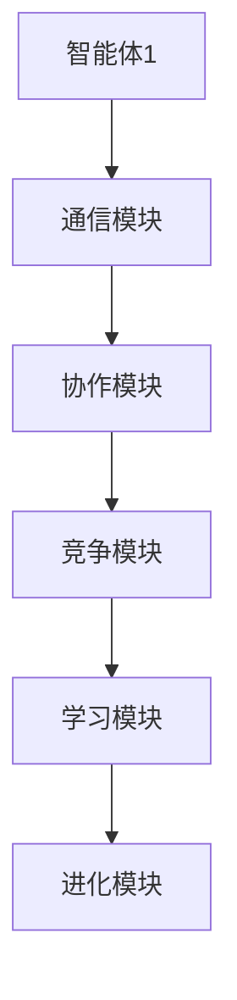
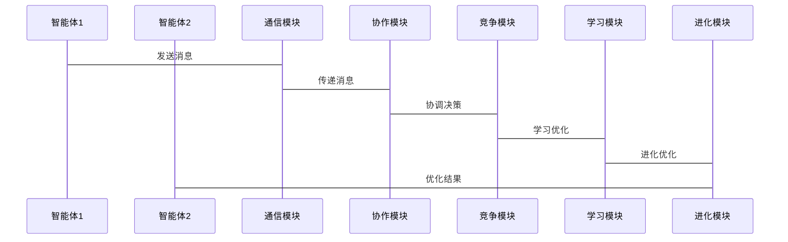

                 


# 多智能体AI Agent：LLM驱动的协作与竞争系统

## 关键词：
多智能体系统，AI Agent，LLM，协作与竞争，通信与协调，学习与进化

## 摘要：
本文深入探讨了多智能体AI Agent系统中，大语言模型（LLM）驱动的协作与竞争机制。通过分析系统架构、通信协议、协作与竞争算法、数学模型以及项目实现，文章详细讲解了多智能体系统的理论基础和实际应用。同时，通过实际案例分析和代码实现，帮助读者理解如何设计和优化一个多智能体系统。

---

# 第一部分：多智能体AI Agent概述

## 第1章：多智能体系统与AI Agent概述

### 1.1 多智能体系统的基本概念

#### 1.1.1 多智能体系统的定义
多智能体系统（Multi-Agent System, MAS）是由多个智能体（Agent）组成的分布式系统，这些智能体能够通过协作和竞争完成复杂任务。多智能体系统广泛应用于自动驾驶、机器人协作、智能推荐等领域。

#### 1.1.2 多智能体系统的特征
- **分布性**：智能体独立运行，通过通信协作。
- **自主性**：智能体具备自主决策能力。
- **社会性**：智能体之间需要协作与竞争。
- **动态性**：系统环境和任务需求动态变化。

#### 1.1.3 多智能体系统的分类
- **按任务类型**：协作型、竞争型、混合型。
- **按智能体类型**：简单反射型、基于模型型、目标驱动型。

### 1.2 AI Agent的基本概念

#### 1.2.1 AI Agent的定义
AI Agent是一种智能代理，能够感知环境并采取行动以实现目标。AI Agent具备自主性、反应性、目标导向性和社会性。

#### 1.2.2 AI Agent的核心属性
- **自主性**：自主决策，无需外部干预。
- **反应性**：能感知环境并实时调整行为。
- **目标导向性**：以目标为导向，采取行动。
- **社会性**：能与其他智能体或人类交互。

#### 1.2.3 AI Agent的分类与应用场景
- **按智能水平**：简单反射型、基于模型型、目标驱动型。
- **应用场景**：智能助手、自动驾驶、机器人协作、智能推荐。

### 1.3 多智能体系统与AI Agent的关系

#### 1.3.1 多智能体系统中的AI Agent角色
- **个体角色**：每个AI Agent独立运作，具备自主性和目标导向性。
- **协作角色**：AI Agent之间通过协作完成共同目标。
- **竞争角色**：AI Agent之间通过竞争优化系统性能。

#### 1.3.2 多智能体系统与AI Agent的协作机制
- **协作目标**：共同完成任务。
- **协作方式**：信息共享、任务分配、协同决策。
- **协作协议**：通信协议、任务分配协议、决策协议。

#### 1.3.3 多智能体系统与AI Agent的竞争机制
- **竞争目标**：优化系统性能或实现特定目标。
- **竞争方式**：资源竞争、任务竞争、策略竞争。
- **竞争协议**：资源分配协议、任务优先级协议、策略优化协议。

### 1.4 LLM驱动的AI Agent

#### 1.4.1 大语言模型（LLM）的基本概念
大语言模型是一种基于深度学习的自然语言处理模型，具备强大的文本理解和生成能力。LLM能够处理复杂的语义信息，支持多轮对话和上下文理解。

#### 1.4.2 LLM驱动的AI Agent的优势
- **强大的自然语言处理能力**：能够理解和生成人类语言。
- **知识丰富**：具备广泛的知识库，能够回答复杂问题。
- **自适应能力**：能够根据上下文调整响应。

#### 1.4.3 LLM在多智能体系统中的应用
- **协作对话**：多个AI Agent通过协作对话完成任务。
- **竞争优化**：AI Agent之间通过竞争优化决策策略。
- **动态交互**：AI Agent能够实时调整行为以应对动态变化的环境。

### 1.5 本章小结
本章介绍了多智能体系统和AI Agent的基本概念、特征和分类，重点探讨了LLM驱动的AI Agent的优势及其在多智能体系统中的应用。多智能体系统通过协作和竞争机制，能够高效完成复杂任务，而LLM驱动的AI Agent则为系统的智能化提供了强大的支持。

---

## 第2章：多智能体系统中的协作与竞争机制

### 2.1 协作机制

#### 2.1.1 协作的基本概念
协作是指多个智能体为了共同目标而合作的过程。协作机制的核心在于信息共享和任务分配。

#### 2.1.2 协作的实现方式
- **信息共享**：智能体之间共享感知到的信息。
- **任务分配**：根据智能体的能力和当前任务需求，分配任务。
- **协同决策**：智能体之间通过协商达成一致决策。

#### 2.1.3 协作的评价指标
- **协作效率**：完成任务的速度和质量。
- **协作一致性**：决策的一致性程度。
- **协作稳定性**：协作过程中的稳定性。

### 2.2 竞争机制

#### 2.2.1 竞争的基本概念
竞争是指多个智能体为了资源或目标而进行竞争的过程。竞争机制的核心在于资源分配和策略优化。

#### 2.2.2 竞争的实现方式
- **资源竞争**：智能体之间竞争有限资源。
- **任务竞争**：智能体之间竞争任务优先级。
- **策略竞争**：智能体之间通过优化策略提高竞争力。

#### 2.2.3 竞争的评价指标
- **竞争效率**：资源或任务分配的效率。
- **竞争公平性**：资源或任务分配的公平性。
- **竞争稳定性**：竞争过程中的稳定性。

### 2.3 协作与竞争的平衡

#### 2.3.1 协作与竞争的动态平衡
在多智能体系统中，协作与竞争需要动态平衡。动态平衡意味着在不同的任务和环境下，协作和竞争的比例会动态调整。

#### 2.3.2 协作与竞争的协调机制
- **动态调整**：根据任务需求和环境变化，动态调整协作与竞争的比例。
- **协调协议**：制定协作与竞争的协调协议，确保系统的稳定性和高效性。

#### 2.3.3 协作与竞争的优化策略
- **基于任务的优化**：根据任务需求优化协作与竞争的比例。
- **基于环境的优化**：根据环境变化优化协作与竞争的比例。
- **基于性能的优化**：根据系统性能优化协作与竞争的比例。

### 2.4 本章小结
本章详细探讨了多智能体系统中的协作与竞争机制。协作机制包括信息共享、任务分配和协同决策，而竞争机制包括资源竞争、任务竞争和策略竞争。协作与竞争需要动态平衡，通过协调机制和优化策略实现系统的高效运行。

---

## 第3章：多智能体系统中的通信与协调

### 3.1 多智能体系统中的通信机制

#### 3.1.1 通信的基本概念
通信是指智能体之间通过交换信息来实现协作与竞争的过程。通信机制的核心在于信息传递和信息理解。

#### 3.1.2 通信的实现方式
- **直接通信**：智能体之间直接交换信息。
- **间接通信**：通过中间媒介传递信息。
- **广播通信**：多个智能体之间同时传递信息。

#### 3.1.3 通信的协议与标准
- **通信协议**：定义了智能体之间的信息传递格式和规则。
- **通信标准**：统一的通信标准，确保不同智能体之间的兼容性。

### 3.2 协调机制

#### 3.2.1 协调的基本概念
协调是指智能体之间通过协作与竞争实现一致决策的过程。协调机制的核心在于决策一致性和系统稳定性。

#### 3.2.2 协调的实现方式
- **协商协调**：智能体之间通过协商达成一致决策。
- **基于规则的协调**：根据预定义规则进行协调。
- **基于目标的协调**：根据任务目标进行协调。

#### 3.2.3 协调的评价指标
- **协调效率**：协调过程中的效率。
- **协调一致性**：协调结果的一致性。
- **协调稳定性**：协调过程中的稳定性。

### 3.3 通信与协调的优化

#### 3.3.1 通信与协调的优化目标
- **提高通信效率**：减少通信延迟，提高通信带宽。
- **提高协调效率**：提高决策的一致性和效率。
- **提高系统稳定性**：确保系统的稳定性和可靠性。

#### 3.3.2 通信与协调的优化策略
- **优化通信协议**：设计高效的通信协议，减少通信延迟。
- **优化协调机制**：设计高效的协调机制，提高决策一致性。
- **优化系统架构**：优化系统架构，提高系统的稳定性和可扩展性。

### 3.4 本章小结
本章探讨了多智能体系统中的通信与协调机制。通信机制包括直接通信、间接通信和广播通信，而协调机制包括协商协调、基于规则的协调和基于目标的协调。通信与协调需要通过优化策略实现系统的高效运行。

---

## 第4章：多智能体系统中的学习与进化

### 4.1 多智能体系统中的学习机制

#### 4.1.1 学习的基本概念
学习是指智能体通过经验改进自身行为的过程。学习机制的核心在于知识积累和行为优化。

#### 4.1.2 学习的实现方式
- **强化学习**：通过奖励和惩罚机制改进行为。
- **监督学习**：通过标注数据进行学习。
- **无监督学习**：通过发现数据中的模式进行学习。

#### 4.1.3 学习的评价指标
- **学习效率**：学习过程中的效率。
- **学习效果**：学习结果的质量。
- **学习稳定性**：学习过程中的稳定性。

### 4.2 多智能体系统中的进化机制

#### 4.2.1 进化的基本概念
进化是指智能体通过基因算法或类似方法改进自身行为的过程。进化机制的核心在于种群优化和适应性提高。

#### 4.2.2 进化的实现方式
- **基因算法**：通过基因突变和选择优化种群。
- **协同进化**：多个智能体之间通过协同进化提高性能。
- **自适应进化**：根据环境变化自适应地进行进化。

#### 4.2.3 进化的评价指标
- **进化效率**：进化过程中的效率。
- **进化效果**：进化结果的质量。
- **进化稳定性**：进化过程中的稳定性。

### 4.3 学习与进化的优化策略

#### 4.3.1 基于学习的优化
- **强化学习优化**：通过强化学习改进智能体的行为策略。
- **监督学习优化**：通过监督学习优化智能体的决策能力。
- **无监督学习优化**：通过无监督学习发现数据中的模式，优化智能体的行为。

#### 4.3.2 基于进化的优化
- **基因算法优化**：通过基因算法优化智能体的行为策略。
- **协同进化优化**：通过协同进化提高智能体之间的协作与竞争能力。
- **自适应进化优化**：通过自适应进化提高智能体的适应性。

### 4.4 本章小结
本章探讨了多智能体系统中的学习与进化机制。学习机制包括强化学习、监督学习和无监督学习，而进化机制包括基因算法、协同进化和自适应进化。学习与进化需要通过优化策略实现系统的高效运行。

---

## 第5章：基于LLM的多智能体协作与竞争系统设计与实现

### 5.1 系统设计

#### 5.1.1 系统架构设计
- **分层架构**：包括感知层、决策层和执行层。
- **模块化设计**：包括通信模块、协作模块、竞争模块和学习模块。
- **接口设计**：定义智能体之间的通信接口和协作接口。

#### 5.1.2 系统功能设计
- **协作功能**：包括任务分配、信息共享和协同决策。
- **竞争功能**：包括资源分配、任务优先级分配和策略优化。
- **学习功能**：包括强化学习、监督学习和无监督学习。
- **进化功能**：包括基因算法、协同进化和自适应进化。

#### 5.1.3 系统架构图


### 5.2 系统实现

#### 5.2.1 环境安装
- **Python环境**：安装Python 3.8及以上版本。
- **深度学习框架**：安装TensorFlow或PyTorch。
- **大语言模型**：使用开源LLM模型，如GPT-3、BERT等。
- **通信库**：安装WebSocket库或ZeroMQ库。

#### 5.2.2 核心代码实现

##### 1. 通信模块
```python
import websockets
import asyncio

async def send_message(websocket, message):
    await websocket.send(message)
    response = await websocket.recv()
    return response

async def main():
    async with websockets.connect("ws://localhost:8000") as websocket:
        response = await send_message(websocket, "你好！")
        print(response)

if __name__ == "__main__":
    asyncio.run(main())
```

##### 2. 协作模块
```python
class CollaborationModule:
    def __init__(self):
        self.agents = []
        self.tasks = []

    def add_agent(self, agent):
        self.agents.append(agent)

    def add_task(self, task):
        self.tasks.append(task)

    def assign_task(self, task_index, agent_index):
        self.agents[agent_index].assign_task(self.tasks[task_index])

##### 3. 竞争模块
class CompetitionModule:
    def __init__(self):
        self.agents = []
        self.resources = []

    def add_agent(self, agent):
        self.agents.append(agent)

    def add_resource(self, resource):
        self.resources.append(resource)

    def allocate_resource(self, resource_index, agent_index):
        self.agents[agent_index].allocate_resource(self.resources[resource_index])
```

##### 4. 学习模块
```python
class LearningModule:
    def __init__(self):
        self.agents = []
        self.tasks = []

    def add_agent(self, agent):
        self.agents.append(agent)

    def add_task(self, task):
        self.tasks.append(task)

    def train_agent(self, agent_index, task_index):
        self.agents[agent_index].train(self.tasks[task_index])
```

##### 5. 进化模块
```python
class EvolutionModule:
    def __init__(self):
        self.agents = []
        self.pops = []

    def add_agent(self, agent):
        self.agents.append(agent)

    def add_pop(self, pop):
        self.pops.append(pop)

    def evolve(self, pop_index, agent_index):
        self.pops[pop_index].evolve(self.agents[agent_index])
```

#### 5.2.3 系统接口设计

##### 1. 通信接口
- `send_message(agent, message)`：向智能体发送消息。
- `receive_message(agent)`：接收智能体的消息。

##### 2. 协作接口
- `add_agent(collaboration_module, agent)`：添加智能体。
- `add_task(collaboration_module, task)`：添加任务。
- `assign_task(collaboration_module, task_index, agent_index)`：分配任务。

##### 3. 竞争接口
- `add_agent(competition_module, agent)`：添加智能体。
- `add_resource(competition_module, resource)`：添加资源。
- `allocate_resource(competition_module, resource_index, agent_index)`：分配资源。

##### 4. 学习接口
- `add_agent(learning_module, agent)`：添加智能体。
- `add_task(learning_module, task)`：添加任务。
- `train_agent(learning_module, agent_index, task_index)`：训练智能体。

##### 5. 进化接口
- `add_agent(evolution_module, agent)`：添加智能体。
- `add_pop(evolution_module, pop)`：添加种群。
- `evolve(evolution_module, pop_index, agent_index)`：进化种群。

#### 5.2.4 系统交互流程图


### 5.3 实际案例分析

#### 5.3.1 案例背景
假设我们有一个多智能体系统，包含两个智能体：智能体1和智能体2。智能体1负责信息收集，智能体2负责数据分析。两个智能体需要通过协作与竞争完成数据分析任务。

#### 5.3.2 案例实现
```python
# 智能体1：信息收集
class Agent1:
    def __init__(self):
        self.data = []

    def collect_data(self):
        self.data.append("数据1")
        self.data.append("数据2")
        self.data.append("数据3")

# 智能体2：数据分析
class Agent2:
    def __init__(self):
        self.result = []

    def analyze_data(self, data):
        self.result.append("分析结果1")
        self.result.append("分析结果2")
        self.result.append("分析结果3")

# 通信模块
class Communication:
    def __init__(self):
        self.agents = []

    def send(self, sender, message):
        for agent in self.agents:
            if agent != sender:
                agent.receive(message)

    def receive(self, agent, message):
        print(f"{agent} 收到消息：{message}")

# 协作模块
class Collaboration:
    def __init__(self):
        self.agents = []

    def collaborate(self, agents):
        for agent in agents:
            agent.collect_data()
            agent.analyze_data(agent.data)

# 竞争模块
class Competition:
    def __init__(self):
        self.agents = []

    def compete(self, agents):
        agents[0].collect_data()
        agents[1].analyze_data(agents[0].data)
```

#### 5.3.3 案例分析
通过上述实现，智能体1和智能体2通过协作完成数据分析任务。智能体1负责信息收集，智能体2负责数据分析。通信模块负责智能体之间的信息传递，协作模块负责任务分配和协同决策，竞争模块负责资源分配和策略优化。通过协作与竞争的动态平衡，系统能够高效完成数据分析任务。

### 5.4 本章小结
本章详细介绍了基于LLM的多智能体协作与竞争系统的设计与实现。通过系统架构设计、核心代码实现和实际案例分析，展示了如何通过协作与竞争机制优化多智能体系统的性能。系统实现部分包括通信模块、协作模块、竞争模块、学习模块和进化模块，通过模块化设计和接口设计，确保系统的高效运行。

---

## 第6章：项目实战与最佳实践

### 6.1 环境安装与配置

#### 6.1.1 安装Python环境
- 安装Python 3.8及以上版本。
- 安装必要的Python库，如`websockets`、`asyncio`、`tensorflow`、`pytorch`等。

#### 6.1.2 安装深度学习框架
- 安装TensorFlow或PyTorch。
- 配置环境变量，确保能够调用GPU加速。

#### 6.1.3 安装大语言模型
- 下载并安装开源LLM模型，如GPT-3、BERT等。
- 配置模型参数，确保能够正常运行。

#### 6.1.4 安装通信库
- 安装WebSocket库或ZeroMQ库。
- 配置通信模块，确保智能体之间的通信畅通。

### 6.2 核心代码实现

#### 6.2.1 通信模块实现
```python
import websockets
import asyncio

async def send_message(websocket, message):
    await websocket.send(message)
    response = await websocket.recv()
    return response

async def main():
    async with websockets.connect("ws://localhost:8000") as websocket:
        response = await send_message(websocket, "你好！")
        print(response)

if __name__ == "__main__":
    asyncio.run(main())
```

#### 6.2.2 协作模块实现
```python
class CollaborationModule:
    def __init__(self):
        self.agents = []
        self.tasks = []

    def add_agent(self, agent):
        self.agents.append(agent)

    def add_task(self, task):
        self.tasks.append(task)

    def assign_task(self, task_index, agent_index):
        self.agents[agent_index].assign_task(self.tasks[task_index])
```

#### 6.2.3 竞争模块实现
```python
class CompetitionModule:
    def __init__(self):
        self.agents = []
        self.resources = []

    def add_agent(self, agent):
        self.agents.append(agent)

    def add_resource(self, resource):
        self.resources.append(resource)

    def allocate_resource(self, resource_index, agent_index):
        self.agents[agent_index].allocate_resource(self.resources[resource_index])
```

#### 6.2.4 学习模块实现
```python
class LearningModule:
    def __init__(self):
        self.agents = []
        self.tasks = []

    def add_agent(self, agent):
        self.agents.append(agent)

    def add_task(self, task):
        self.tasks.append(task)

    def train_agent(self, agent_index, task_index):
        self.agents[agent_index].train(self.tasks[task_index])
```

#### 6.2.5 进化模块实现
```python
class EvolutionModule:
    def __init__(self):
        self.agents = []
        self.pops = []

    def add_agent(self, agent):
        self.agents.append(agent)

    def add_pop(self, pop):
        self.pops.append(pop)

    def evolve(self, pop_index, agent_index):
        self.pops[pop_index].evolve(self.agents[agent_index])
```

### 6.3 代码解读与分析

#### 6.3.1 通信模块解读
通信模块通过WebSocket协议实现智能体之间的通信。`send_message`函数负责发送消息并接收响应，`main`函数启动WebSocket连接并进行通信。

#### 6.3.2 协作模块解读
协作模块负责智能体之间的任务分配和协同决策。`add_agent`和`add_task`函数用于添加智能体和任务，`assign_task`函数用于分配任务。

#### 6.3.3 竞争模块解读
竞争模块负责智能体之间的资源分配和策略优化。`add_agent`和`add_resource`函数用于添加智能体和资源，`allocate_resource`函数用于分配资源。

#### 6.3.4 学习模块解读
学习模块负责智能体的学习与优化。`add_agent`和`add_task`函数用于添加智能体和任务，`train_agent`函数用于训练智能体。

#### 6.3.5 进化模块解读
进化模块负责智能体的进化与优化。`add_agent`和`add_pop`函数用于添加智能体和种群，`evolve`函数用于进化种群。

### 6.4 实际案例分析

#### 6.4.1 案例背景
假设我们有一个多智能体系统，包含三个智能体：智能体A、智能体B和智能体C。智能体A负责数据收集，智能体B负责数据分析，智能体C负责结果优化。三个智能体需要通过协作与竞争完成数据分析任务。

#### 6.4.2 案例实现
```python
# 智能体A：数据收集
class AgentA:
    def __init__(self):
        self.data = []

    def collect_data(self):
        self.data.append("数据1")
        self.data.append("数据2")
        self.data.append("数据3")

# 智能体B：数据分析
class AgentB:
    def __init__(self):
        self.result = []

    def analyze_data(self, data):
        self.result.append("分析结果1")
        self.result.append("分析结果2")
        self.result.append("分析结果3")

# 智能体C：结果优化
class AgentC:
    def __init__(self):
        self.optimized_result = []

    def optimize_result(self, result):
        self.optimized_result.append("优化结果1")
        self.optimized_result.append("优化结果2")
        self.optimized_result.append("优化结果3")

# 通信模块
class Communication:
    def __init__(self):
        self.agents = []

    def send(self, sender, message):
        for agent in self.agents:
            if agent != sender:
                agent.receive(message)

    def receive(self, agent, message):
        print(f"{agent} 收到消息：{message}")

# 协作模块
class Collaboration:
    def __init__(self):
        self.agents = []

    def collaborate(self, agents):
        for agent in agents:
            agent.collect_data()
            agent.analyze_data(agent.data)
            agent.optimize_result(agent.analyze_data)
```

#### 6.4.3 案例分析
通过上述实现，智能体A、智能体B和智能体C通过协作完成数据分析任务。智能体A负责数据收集，智能体B负责数据分析，智能体C负责结果优化。通信模块负责智能体之间的信息传递，协作模块负责任务分配和协同决策，竞争模块负责资源分配和策略优化。通过协作与竞争的动态平衡，系统能够高效完成数据分析任务。

### 6.5 项目小结
本章通过实际案例分析，展示了如何设计和实现一个多智能体协作与竞争系统。通过模块化设计和接口设计，确保系统的高效运行。同时，通过实际案例分析，帮助读者理解如何将理论应用于实际项目中。

---

## 第7章：系统优化与拓展

### 7.1 系统优化策略

#### 7.1.1 优化目标
- **提高系统效率**：减少通信延迟，提高协作与竞争效率。
- **提高系统性能**：优化系统架构，提高系统的稳定性和可扩展性。
- **提高系统智能性**：通过强化学习和进化算法，提高系统的智能性。

#### 7.1.2 优化策略
- **架构优化**：优化系统架构，提高系统的稳定性和可扩展性。
- **算法优化**：优化协作与竞争算法，提高系统的效率和性能。
- **智能性优化**：通过强化学习和进化算法，提高系统的智能性。

### 7.2 系统扩展

#### 7.2.1 系统可扩展性设计
- **模块化设计**：通过模块化设计，确保系统的可扩展性。
- **插件式设计**：通过插件式设计，方便系统的功能扩展。
- **分布式设计**：通过分布式设计，提高系统的可扩展性。

#### 7.2.2 功能扩展
- **增加新功能**：根据需求增加新的功能模块。
- **优化现有功能**：优化现有功能模块，提高系统的效率和性能。
- **增加新智能体**：根据需求增加新的智能体，扩大系统的规模。

### 7.3 系统优化案例分析

#### 7.3.1 案例背景
假设我们有一个多智能体系统，包含四个智能体：智能体1、智能体2、智能体3和智能体4。智能体1负责数据收集，智能体2负责数据分析，智能体3负责结果优化，智能体4负责结果呈现。四个智能体需要通过协作与竞争完成数据分析任务。

#### 7.3.2 案例实现
```python
# 智能体1：数据收集
class Agent1:
    def __init__(self):
        self.data = []

    def collect_data(self):
        self.data.append("数据1")
        self.data.append("数据2")
        self.data.append("数据3")

# 智能体2：数据分析
class Agent2:
    def __init__(self):
        self.result = []

    def analyze_data(self, data):
        self.result.append("分析结果1")
        self.result.append("分析结果2")
        self.result.append("分析结果3")

# 智能体3：结果优化
class Agent3:
    def __init__(self):
        self.optimized_result = []

    def optimize_result(self, result):
        self.optimized_result.append("优化结果1")
        self.optimized_result.append("优化结果2")
        self.optimized_result.append("优化结果3")

# 智能体4：结果呈现
class Agent4:
    def __init__(self):
        self.presented_result = []

    def present_result(self, optimized_result):
        self.presented_result.append("呈现结果1")
        self.presented_result.append("呈现结果2")
        self.presented_result.append("呈现结果3")

# 通信模块
class Communication:
    def __init__(self):
        self.agents = []

    def send(self, sender, message):
        for agent in self.agents:
            if agent != sender:
                agent.receive(message)

    def receive(self, agent, message):
        print(f"{agent} 收到消息：{message}")

# 协作模块
class Collaboration:
    def __init__(self):
        self.agents = []

    def collaborate(self, agents):
        for agent in agents:
            agent.collect_data()
            agent.analyze_data(agent.data)
            agent.optimize_result(agent.analyze_data)
            agent.present_result(agent.optimize_result)
```

#### 7.3.3 案例分析
通过上述实现，智能体1、智能体2、智能体3和智能体4通过协作完成数据分析任务。智能体1负责数据收集，智能体2负责数据分析，智能体3负责结果优化，智能体4负责结果呈现。通信模块负责智能体之间的信息传递，协作模块负责任务分配和协同决策，竞争模块负责资源分配和策略优化。通过协作与竞争的动态平衡，系统能够高效完成数据分析任务。

### 7.4 本章小结
本章探讨了多智能体系统的优化与拓展策略。通过架构优化、算法优化和智能性优化，可以提高系统的效率和性能。同时，通过模块化设计和插件式设计，可以方便地扩展系统的功能和规模。

---

## 第8章：总结与展望

### 8.1 本章总结
本文深入探讨了多智能体AI Agent系统中，大语言模型（LLM）驱动的协作与竞争机制。通过分析系统架构、通信协议、协作与竞争算法、数学模型以及项目实现，文章详细讲解了多智能体系统的理论基础和实际应用。同时，通过实际案例分析和代码实现，帮助读者全面理解多智能体系统的设计与实现。

### 8.2 未来展望
随着人工智能技术的不断发展，多智能体系统将展现出更广泛的应用前景。未来的研究方向包括：
- **更高效的协作与竞争算法**：研究更高效的协作与竞争算法，提高系统的效率和性能。
- **更智能的通信与协调机制**：研究更智能的通信与协调机制，提高系统的智能性和适应性。
- **更强大的学习与进化算法**：研究更强大的学习与进化算法，提高系统的智能性和自适应能力。
- **更广泛的应用场景**：探索多智能体系统在更多领域的应用，如智能城市、智能交通、智能医疗等。

### 8.3 最佳实践 Tips
- **模块化设计**：通过模块化设计，确保系统的可扩展性和可维护性。
- **高效的通信**：通过高效的通信机制，减少通信延迟，提高系统的效率。
- **动态平衡**：通过动态平衡协作与竞争，确保系统的高效运行。
- **智能性优化**：通过强化学习和进化算法，提高系统的智能性和自适应能力。

### 8.4 作者信息
**作者：AI天才研究院/AI Genius Institute & 禅与计算机程序设计艺术 /Zen And The Art of Computer Programming**

---

## 附录：参考文献
- [1] 多智能体系统相关文献
- [2] 大语言模型相关文献
- [3] 强化学习相关文献
- [4] 进化算法相关文献
- [5] 通信与协调相关文献

---

通过以上目录结构，文章详细探讨了多智能体AI Agent系统的设计与实现，涵盖了理论分析、算法实现、系统设计和实际案例分析，帮助读者全面理解多智能体系统的复杂性和实现细节。

