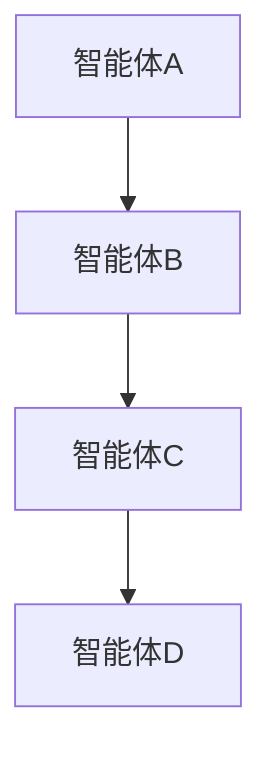
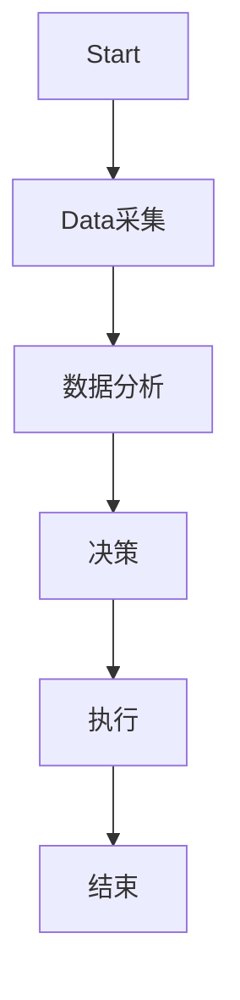
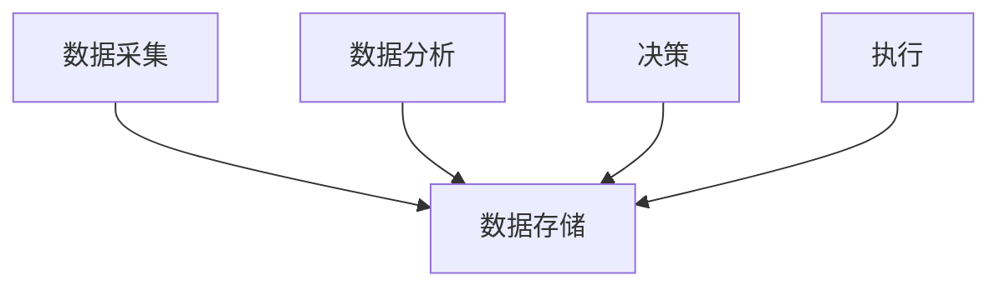
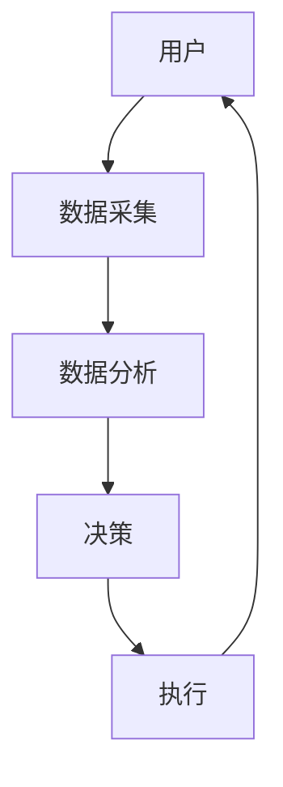

                 


# 多智能体系统在全球监管环境分析中的角色

## 关键词：多智能体系统、监管环境分析、分布式计算、博弈论、智能体协作、强化学习

## 摘要：  
多智能体系统（Multi-Agent System, MAS）作为一种新兴的技术架构，在全球监管环境分析中展现出独特的优势。本文将深入探讨多智能体系统的核心概念、算法原理、系统架构设计以及在实际监管环境中的应用场景。通过结合具体案例和代码实现，分析多智能体系统在全球监管环境中的角色，包括信息收集、分析、决策和执行等环节。同时，本文还将讨论多智能体系统的优化与扩展策略，以及其在未来监管环境分析中的潜力。

---

# 第1章: 多智能体系统概述

## 1.1 多智能体系统的基本概念

### 1.1.1 多智能体系统的定义  
多智能体系统（Multi-Agent System, MAS）是由多个智能体（Agent）组成的分布式系统，这些智能体能够通过协同工作完成复杂任务。智能体是具有感知、决策和行动能力的实体，能够独立执行任务并与其他智能体或环境交互。

### 1.1.2 多智能体系统的分类  
多智能体系统可以根据智能体的结构、功能和行为方式进行分类：

| 分类维度       | 类型                          | 描述                                      |
|----------------|-------------------------------|-------------------------------------------|
| 智能体的结构    | 分散式、集中式、混合式         | 分散式系统中，智能体相对独立；集中式系统中，有一个中央控制节点。 |
| 智能体的功能    | 行为型、知识型、混合型         | 行为型智能体主要执行任务；知识型智能体负责信息处理和分析。 |
| 智能体的行为方式 | 合作型、竞争型、中立型         | 合作型智能体之间协同工作；竞争型智能体之间存在竞争关系。 |

### 1.1.3 多智能体系统的特征与优势  
- **分布式性**：多个智能体分布在网络中，避免单点故障。  
- **自主性**：智能体能够自主决策，无需外部干预。  
- **协作性**：智能体之间通过通信和协作完成复杂任务。  
- **动态性**：能够适应动态变化的环境。  

---

## 1.2 全球监管环境分析的背景

### 1.2.1 全球监管环境的复杂性  
随着全球化和数字化的快速发展，监管环境变得日益复杂。例如，金融市场的监管需要考虑跨国交易、数据隐私、反洗钱等多种因素。

### 1.2.2 监管环境分析的重要性  
监管环境分析是确保市场合规性、防范风险的重要手段。例如，在金融监管中，需要实时监控交易数据，识别异常行为。

### 1.2.3 多智能体系统在监管分析中的应用前景  
多智能体系统能够通过分布式的智能体协作，实时分析海量数据，识别潜在风险，提高监管效率。

---

## 1.3 多智能体系统与全球监管环境的关系

### 1.3.1 多智能体系统在全球监管中的角色  
- **信息收集**：智能体可以实时收集监管环境中的数据，如交易记录、市场动态等。  
- **分析与决策**：通过协作分析，智能体能够识别潜在风险，并提出监管建议。  
- **执行与反馈**：智能体可以执行监管指令，并实时反馈执行结果。  

### 1.3.2 多智能体系统与监管规则的交互  
智能体需要理解并遵守监管规则，同时能够根据环境变化动态调整行为。

### 1.3.3 多智能体系统的监管合规性  
多智能体系统需要确保其行为符合监管要求，避免因智能体的自主性而引发合规问题。

---

## 1.4 本章小结  
本章介绍了多智能体系统的定义、分类和特征，分析了全球监管环境的复杂性和监管分析的重要性，并探讨了多智能体系统在全球监管环境中的角色和作用。

---

# 第2章: 多智能体系统的核心概念与原理

## 2.1 多智能体系统的构成要素

### 2.1.1 智能体的定义与特征  
智能体是具有感知、决策和行动能力的实体，能够独立完成任务。

### 2.1.2 智能体的分类与层次结构  
智能体可以分为**知识型智能体**和**行为型智能体**。知识型智能体通过分析数据提供决策支持；行为型智能体通过执行任务直接作用于环境。

### 2.1.3 智能体之间的交互与协作  
智能体之间的交互可以通过**通信协议**和**协作算法**实现。

---

## 2.2 多智能体系统的通信机制

### 2.2.1 智能体间通信的协议与标准  
通信协议是智能体之间交互的基础，常见的通信协议包括**HTTP**、**WebSocket**等。

### 2.2.2 通信模型与信息交换方式  
通信模型可以采用**发布-订阅模式**，智能体之间通过消息队列进行信息交换。

### 2.2.3 通信中的隐私与安全问题  
多智能体系统的通信需要考虑数据隐私和安全，可以通过加密技术和访问控制来解决。

---

## 2.3 多智能体系统的协调与决策机制

### 2.3.1 协调机制的定义与类型  
协调机制是确保多个智能体协同工作的规则和策略，常见的协调机制包括**规则驱动**和**模型驱动**。

### 2.3.2 基于博弈论的决策模型  
博弈论是一种研究智能体之间策略选择的数学工具，常用于多智能体系统的决策分析。

### 2.3.3 分布式决策算法  
分布式决策算法通过智能体之间的协作，实现全局最优决策。

---

## 2.4 多智能体系统的动态环境适应性

### 2.4.1 动态环境的定义与挑战  
动态环境是指环境条件不断变化的场景，如金融市场中的实时交易数据。

### 2.4.2 动态环境下的自适应策略  
智能体需要通过学习和调整策略，适应环境的变化。

### 2.4.3 动态环境中的学习与进化  
智能体可以通过强化学习等方法，不断优化自身的决策能力。

---

## 2.5 本章小结  
本章详细介绍了多智能体系统的构成要素、通信机制、协调与决策机制，以及在动态环境中的适应性。

---

# 第3章: 多智能体系统的算法基础

## 3.1 分布式计算与协作算法

### 3.1.1 分布式计算的基本原理  
分布式计算是多智能体系统的核心技术，通过将任务分解为多个子任务，由不同的智能体协作完成。

### 3.1.2 协作算法的分类与特点  
协作算法可以分为**基于规则的协作**和**基于学习的协作**。

### 3.1.3 基于分布式计算的协作流程  
通过Mermaid流程图展示协作流程：



---

## 3.2 多智能体系统的协调算法

### 3.2.1 基于规则的协调算法  
规则驱动的协调算法通过预定义的规则，指导智能体的行为。

### 3.2.2 基于模型的协调算法  
模型驱动的协调算法通过构建环境模型，优化智能体的协作策略。

### 3.2.3 基于强化学习的协调算法  
强化学习是一种通过试错优化决策的算法，适用于复杂的动态环境。

---

## 3.3 多智能体系统的通信协议与信息处理

### 3.3.1 通信协议的选择与设计  
通信协议的选择需要考虑系统的实时性、可靠性和安全性。

### 3.3.2 信息处理的流程  
信息处理包括数据采集、数据解析和数据存储。

---

## 3.4 本章小结  
本章介绍了多智能体系统的算法基础，包括分布式计算、协调算法和通信协议。

---

# 第4章: 多智能体系统的系统架构设计

## 4.1 系统功能设计

### 4.1.1 问题场景介绍  
以金融监管为例，设计一个实时监控交易数据的系统。

### 4.1.2 系统功能模块  
- 数据采集模块：负责采集交易数据。  
- 数据分析模块：对数据进行分析，识别异常行为。  
- 决策模块：基于分析结果，生成监管指令。  
- 执行模块：执行监管指令，如冻结账户。  

### 4.1.3 系统功能流程图  
通过Mermaid图展示功能流程：



---

## 4.2 系统架构设计

### 4.2.1 系统架构的类型  
常见的系统架构包括**分层架构**和**微服务架构**。

### 4.2.2 系统架构设计图  
通过Mermaid图展示系统架构：



---

## 4.3 系统接口设计

### 4.3.1 接口的设计原则  
接口设计需要遵循**松耦合**和**可扩展性**的原则。

### 4.3.2 接口实现方式  
接口可以通过RESTful API或WebSocket实现。

---

## 4.4 系统交互设计

### 4.4.1 系统交互流程图  
通过Mermaid图展示系统交互：



---

## 4.5 本章小结  
本章详细介绍了多智能体系统的系统架构设计，包括功能设计、架构设计、接口设计和交互设计。

---

# 第5章: 多智能体系统的项目实战

## 5.1 环境搭建

### 5.1.1 环境要求  
- 操作系统：Linux或Windows  
- 开发工具：Python、Docker、Kubernetes  
- 依赖库：Flask、Pandas、Scikit-learn  

### 5.1.2 环境配置  
安装必要的依赖库和工具。

---

## 5.2 系统核心实现

### 5.2.1 数据采集模块  
实现从数据库中采集交易数据的代码：

```python
import sqlite3

def collect_data():
    conn = sqlite3.connect('transactions.db')
    cursor = conn.cursor()
    cursor.execute('SELECT * FROM transactions')
    data = cursor.fetchall()
    return data
```

### 5.2.2 数据分析模块  
实现异常检测的代码：

```python
import pandas as pd
from sklearn.ensemble import IsolationForest

def detect_anomaly(data):
    df = pd.DataFrame(data)
    model = IsolationForest(n_estimators=100, random_state=42)
    model.fit(df)
    anomalies = model.predict_outlier(df)
    return anomalies
```

### 5.2.3 决策模块  
实现监管决策的代码：

```python
def make_decision(anomalies):
    if anomalies:
        return '冻结账户'
    else:
        return '正常交易'
```

### 5.2.4 执行模块  
实现监管指令的执行：

```python
def execute_decision(decision):
    if decision == '冻结账户':
        print('冻结账户')
    else:
        print('正常交易')
```

---

## 5.3 代码应用解读与分析

### 5.3.1 代码实现的细节  
- 数据采集模块通过SQL查询数据库，获取交易数据。  
- 数据分析模块使用Isolation Forest算法检测异常。  
- 决策模块根据分析结果生成监管指令。  
- 执行模块执行监管指令。

---

## 5.4 案例分析与详细讲解

### 5.4.1 案例分析  
以金融监管为例，分析交易数据，识别异常交易行为。

### 5.4.2 详细讲解  
通过具体案例，展示多智能体系统的实际应用和效果。

---

## 5.5 项目小结  
本章通过具体的项目实战，展示了多智能体系统的实现过程，包括环境搭建、代码实现和案例分析。

---

# 第6章: 多智能体系统的优化与扩展

## 6.1 系统优化策略

### 6.1.1 性能优化  
- 使用分布式计算优化系统性能。  
- 采用缓存技术减少重复计算。  

### 6.1.2 系统扩展  
- 使用微服务架构扩展系统功能。  
- 通过容器化技术实现系统的弹性扩展。

---

## 6.2 系统与大数据技术的结合

### 6.2.1 大数据技术在多智能体系统中的应用  
- 数据采集：使用Hadoop或Spark处理海量数据。  
- 数据分析：使用Hive或Presto进行复杂查询。

### 6.2.2 系统与大数据技术的集成  
通过集成大数据技术，提高系统的数据处理能力和分析能力。

---

## 6.3 系统与区块链技术的结合

### 6.3.1 区块链技术在多智能体系统中的应用  
- 数据存储：通过区块链实现数据的不可篡改性。  
- 智能合约：通过智能合约实现自动化的监管指令执行。

### 6.3.2 系统与区块链技术的集成  
通过区块链技术，提高系统的信任度和安全性。

---

## 6.4 本章小结  
本章介绍了多智能体系统的优化策略，以及与大数据和区块链技术的结合。

---

# 第7章: 多智能体系统的挑战与未来展望

## 7.1 多智能体系统在监管环境中的挑战

### 7.1.1 智能体之间的协作问题  
智能体之间的协作需要解决通信延迟和资源竞争问题。

### 7.1.2 动态环境下的适应性问题  
智能体需要快速适应环境变化，避免因决策滞后导致的风险。

### 7.1.3 系统安全与隐私问题  
多智能体系统的通信和数据存储需要考虑安全和隐私保护。

---

## 7.2 多智能体系统的未来展望

### 7.2.1 智能体的自主性与智能性提升  
未来，智能体将更加智能化，能够自主学习和优化决策。

### 7.2.2 多智能体系统的扩展性与集成性  
多智能体系统将与更多新兴技术（如边缘计算、5G）结合，实现更广泛的应用。

### 7.2.3 多智能体系统的合规性与监管政策  
随着监管政策的变化，多智能体系统需要不断调整以符合新的监管要求。

---

## 7.3 本章小结  
本章分析了多智能体系统在监管环境中的挑战，并展望了未来的发展方向。

---

# 第8章: 多智能体系统的结论与展望

## 8.1 结论

### 8.1.1 多智能体系统的核心价值  
多智能体系统通过分布式计算和智能体协作，能够高效、灵活地应对复杂的监管环境。

### 8.1.2 多智能体系统的应用前景  
随着技术的进步，多智能体系统将在更多领域发挥重要作用。

---

## 8.2 未来展望

### 8.2.1 技术发展的方向  
未来，多智能体系统将更加智能化和自适应。

### 8.2.2 应用领域的扩展  
多智能体系统将应用于更多复杂的监管环境，如智能城市、智能交通等。

---

## 作者：AI天才研究院/AI Genius Institute & 禅与计算机程序设计艺术 /Zen And The Art of Computer Programming

