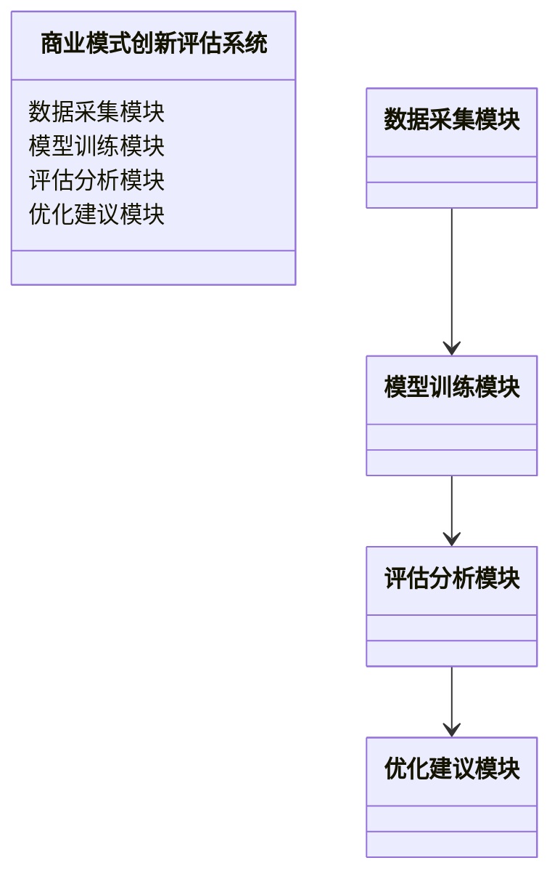
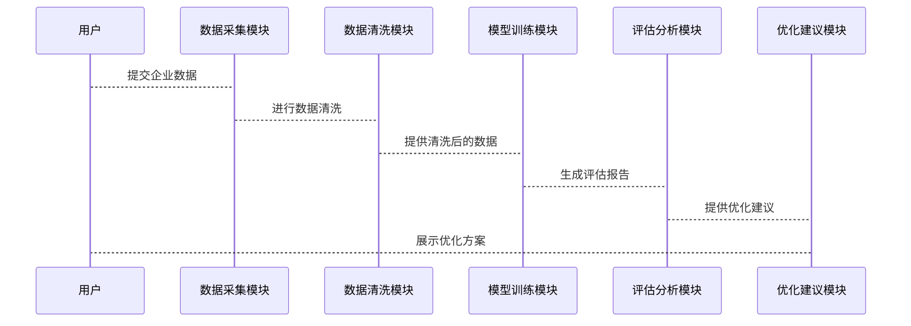

                 


# 智能系统辅助商业模式创新评估

> 关键词：智能系统、商业模式创新、算法原理、系统架构、项目实战

> 摘要：随着数字化转型的深入推进，智能系统在商业模式创新中的作用日益凸显。本文通过分析智能系统的核心技术、商业模式创新的理论基础、算法原理、系统架构设计以及项目实战，全面探讨智能系统如何辅助商业模式创新评估。文章旨在为企业提供一套基于智能系统的商业模式创新评估方法，帮助企业更好地应对数字化时代的挑战。

---

# 第1章: 智能系统与商业模式创新概述

## 1.1 智能系统的定义与特征

### 1.1.1 智能系统的定义
智能系统是指能够感知环境、进行推理、学习和自适应的计算机系统。它通过整合人工智能、大数据、物联网等技术，实现对复杂问题的自主决策和优化。

### 1.1.2 智能系统的核心特征
- **数据驱动**：智能系统依赖大量数据进行分析和决策。
- **自主学习**：通过机器学习算法实现自我优化。
- **实时响应**：能够快速处理数据并做出实时反馈。
- **灵活性**：适应不同场景和需求的变化。

### 1.1.3 智能系统与传统系统的主要区别
| 特性         | 智能系统                     | 传统系统                   |
|--------------|------------------------------|-----------------------------|
| 数据处理     | 强大数据处理能力             | 数据处理能力有限           |
| 自主性       | 高度自主，能够自我优化       | 需要人工干预               |
| 应用场景     | 复杂、动态场景               | 简单、静态场景             |

## 1.2 商业模式创新的定义与重要性

### 1.2.1 商业模式创新的定义
商业模式创新是指通过重新设计企业的价值主张、资源分配、业务流程和客户关系，以创造新的价值来源和实现方式。

### 1.2.2 商业模式创新对企业发展的意义
- **提升竞争力**：通过创新找到新的市场机会。
- **优化资源配置**：提高企业运营效率。
- **增强客户价值**：为客户提供更好的产品和服务。

### 1.2.3 商业模式创新的常见形式
- **产品创新**：开发新产品或服务。
- **流程创新**：优化业务流程。
- **市场创新**：开拓新市场或客户群体。

## 1.3 智能系统辅助商业模式创新的背景

### 1.3.1 数字化转型的背景
随着信息技术的飞速发展，企业逐步从传统模式向数字化模式转型，智能系统成为这一过程的核心驱动力。

### 1.3.2 智能技术在商业领域的应用趋势
人工智能、大数据、区块链等技术在商业领域的应用越来越广泛，为企业提供了新的商业模式创新工具。

### 1.3.3 商业模式创新面临的挑战与机遇
- **挑战**：市场竞争加剧，客户需求多样化。
- **机遇**：技术进步为企业提供了更多创新的可能性。

## 1.4 本章小结
本章介绍了智能系统的定义、特征及其与传统系统的区别，分析了商业模式创新的定义、重要性及其常见形式，最后探讨了智能系统辅助商业模式创新的背景和意义。

---

# 第2章: 智能系统辅助商业模式创新的理论基础

## 2.1 商业模式画布模型

### 2.1.1 商业模式画布的核心要素
商业模式画布由价值主张、客户关系、客户细分、渠道、核心资源、关键活动、核心优势、成本结构和收入来源九个要素组成。

### 2.1.2 商业模式画布的构建步骤
1. 明确企业目标客户。
2. 确定核心资源和关键活动。
3. 设计价值主张和收入来源。
4. 构建客户关系和渠道。
5. 优化成本结构。

### 2.1.3 商业模式画布在创新中的应用
通过商业模式画布，企业可以系统性地分析和优化商业模式，发现新的商业机会。

## 2.2 智能系统的核心技术

### 2.2.1 人工智能技术
人工智能通过机器学习、自然语言处理等技术，帮助企业进行数据分析和决策支持。

### 2.2.2 大数据技术
大数据技术帮助企业从海量数据中提取有价值的信息，支持商业模式创新。

### 2.2.3 区块链技术
区块链技术通过去中心化的方式，提高商业模式的安全性和透明性。

### 2.2.4 物联网技术
物联网技术通过连接设备和数据，实现智能化的商业模式创新。

## 2.3 商业模式创新与智能系统的结合

### 2.3.1 智能系统如何赋能商业模式创新
- **数据驱动**：智能系统通过数据分析为企业提供决策支持。
- **自动化**：智能系统实现业务流程的自动化，提高效率。
- **个性化**：智能系统支持个性化服务，提升客户体验。

### 2.3.2 商业模式创新对智能系统的需求
- **数据处理能力**：需要处理大量数据。
- **算法优化**：需要高效的算法支持。
- **灵活性**：需要适应不同商业模式的需求。

### 2.3.3 两者的协同效应
智能系统通过数据驱动和自动化支持商业模式创新，商业模式创新为智能系统提供应用场景。

## 2.4 核心概念对比分析

### 2.4.1 商业模式创新与技术创新的对比
| 特性         | 商业模式创新                  | 技术创新                   |
|--------------|------------------------------|-----------------------------|
| 目标         | 创新商业模式                  | 开发新技术                  |
| 实施主体     | 企业高管和市场部门          | 技术研发部门               |
| 影响范围     | 企业的业务流程和收入模式      | 企业的技术能力             |

### 2.4.2 智能系统与传统信息技术的对比
| 特性         | 智能系统                     | 传统信息技术               |
|--------------|------------------------------|-----------------------------|
| 核心能力     | 数据分析和自主学习          | 数据存储和传输             |
| 应用场景     | 复杂决策和创新               | 数据处理和存储             |
| 技术基础     | 人工智能、大数据             | 数据库、网络技术           |

### 2.4.3 商业模式创新与业务模式创新的对比
| 特性         | 商业模式创新                  | 业务模式创新               |
|--------------|------------------------------|-----------------------------|
| 聚焦点       | 整体商业模式设计              | 业务流程和操作模式优化     |
| 驱动力       | 市场需求和竞争               | 运营效率和成本优化         |

## 2.5 本章小结
本章分析了商业模式画布模型的核心要素和构建步骤，探讨了智能系统的核心技术及其在商业模式创新中的应用，最后通过对比分析明确了智能系统与相关概念的区别与联系。

---

# 第3章: 商业模式创新评估的算法原理

## 3.1 商业模式创新评估的指标体系

### 3.1.1 评估指标的分类
- **财务指标**：如收入增长率、利润率。
- **市场指标**：如市场份额、客户满意度。
- **创新指标**：如新产品开发周期、专利数量。

### 3.1.2 指标权重的确定方法
常用方法包括层次分析法（AHP）和主成分分析法（PCA）。

### 3.1.3 指标数据的采集与处理
- 数据采集：通过问卷调查、市场调研等方式获取数据。
- 数据处理：数据清洗、标准化和归一化处理。

## 3.2 基于机器学习的商业模式创新评估

### 3.2.1 机器学习在商业模式创新中的应用
- **分类**：预测商业模式的成功与否。
- **回归**：预测收入、利润等连续变量。
- **聚类**：发现市场中的潜在客户群体。

### 3.2.2 常见的机器学习算法
- **决策树**：如ID3、C4.5算法。
- **支持向量机**：SVM算法。
- **随机森林**：集成学习算法。
- **神经网络**：深度学习算法。

### 3.2.3 算法选择的依据与步骤
1. 明确问题类型（分类、回归、聚类）。
2. 选择合适的算法框架。
3. 通过实验验证算法性能。

## 3.3 商业模式创新评估的数学模型

### 3.3.1 线性回归模型
$$ y = \beta_0 + \beta_1x_1 + \beta_2x_2 + \ldots + \beta_nx_n $$

### 3.3.2 支持向量机模型
$$ \text{最大化} \quad \sum_{i=1}^n \xi_i $$
$$ \text{约束} \quad y_i(\omega \cdot x_i + b) \geq 1 - \xi_i $$
$$ \xi_i \geq 0 $$

### 3.3.3 随机森林模型
随机森林通过集成多个决策树模型，提高预测准确性和鲁棒性。

### 3.3.4 神经网络模型
$$ z = \sigma(wx + b) $$
$$ \text{损失函数} = \sum (y_{\text{预测}} - y_{\text{真实}})^2 $$

## 3.4 算法实现与优化

### 3.4.1 算法实现的步骤
1. 数据预处理：清洗、标准化。
2. 模型训练：选择算法并训练模型。
3. 模型评估：计算准确率、召回率等指标。
4. 模型优化：调整参数、优化算法。

### 3.4.2 算法优化的策略
- 参数调优：如学习率、树深度等。
- 数据增强：增加训练数据多样性。
- 集成学习：结合多种算法提高性能。

### 3.4.3 算法性能的评估指标
- 准确率（Accuracy）
- 召回率（Recall）
- F1分数（F1 Score）
- AUC曲线（Area Under Curve）

## 3.5 本章小结
本章介绍了商业模式创新评估的指标体系，探讨了基于机器学习的评估方法，详细讲解了常见算法的原理和实现步骤，并通过数学公式和图表展示了算法的应用过程。

---

# 第4章: 智能系统辅助商业模式创新的系统架构设计

## 4.1 系统功能需求分析

### 4.1.1 系统目标
构建一个基于智能系统的商业模式创新评估平台，帮助企业优化商业模式。

### 4.1.2 系统功能模块
- **数据采集模块**：采集企业数据。
- **模型训练模块**：训练机器学习模型。
- **评估分析模块**：生成评估报告。
- **优化建议模块**：提供优化方案。

## 4.2 系统功能设计（领域模型）



## 4.3 系统架构设计


## 4.4 系统接口设计

| 接口名称   | 描述               | 输入        | 输出       |
|------------|--------------------|-------------|------------|
| 数据采集   | 采集企业数据       | 企业数据    | 数据清洗结果 |
| 模型训练   | 训练机器学习模型   | 清洗后的数据 | 训练模型     |
| 评估分析   | 生成评估报告       | 模型和数据   | 评估报告     |
| 优化建议   | 提供优化方案       | 评估报告     | 优化建议     |

## 4.5 系统交互设计



## 4.6 本章小结
本章通过领域模型、架构图和交互图，详细设计了智能系统辅助商业模式创新的系统架构，明确了各模块的功能和交互流程。

---

# 第5章: 项目实战

## 5.1 环境安装

### 5.1.1 安装Python
```bash
# 安装Python
sudo apt-get install python3 python3-dev
```

### 5.1.2 安装机器学习库
```bash
pip install numpy scikit-learn
```

## 5.2 系统核心实现源代码

### 5.2.1 数据预处理代码
```python
import numpy as np
from sklearn import preprocessing

# 假设data是原始数据
data = np.array([...])
# 标准化处理
data_normalized = preprocessing.normalize(data)
```

### 5.2.2 机器学习模型训练代码
```python
from sklearn.tree import DecisionTreeClassifier
from sklearn.metrics import accuracy_score

# 训练决策树模型
model = DecisionTreeClassifier()
model.fit(X_train, y_train)
# 预测结果
y_pred = model.predict(X_test)
# 计算准确率
accuracy = accuracy_score(y_test, y_pred)
print(f"准确率：{accuracy}")
```

### 5.2.3 评估报告生成代码
```python
from sklearn.metrics import classification_report

print(classification_report(y_test, y_pred))
```

## 5.3 代码应用解读与分析

### 5.3.1 数据预处理
通过标准化处理，确保不同特征的数据范围一致，提高模型训练效果。

### 5.3.2 模型训练
使用决策树模型进行分类，训练过程包括特征选择和模型优化。

### 5.3.3 模型评估
通过准确率、召回率等指标评估模型性能，找出模型的优缺点。

## 5.4 实际案例分析

### 5.4.1 案例背景
某互联网公司希望通过智能系统优化其商业模式。

### 5.4.2 数据分析
通过机器学习模型预测客户流失率，识别关键客户群体。

### 5.4.3 模型优化
根据评估结果优化模型参数，提高预测准确率。

## 5.5 项目小结
通过实际案例，展示了智能系统辅助商业模式创新评估的具体实现过程，验证了系统的可行性和有效性。

---

# 第6章: 总结与展望

## 6.1 总结
智能系统通过数据驱动和自主学习，为商业模式创新提供了新的工具和方法。本文从理论基础、算法原理到系统设计和项目实战，全面探讨了智能系统辅助商业模式创新评估的实现过程。

## 6.2 展望
未来，随着人工智能和大数据技术的进一步发展，智能系统在商业模式创新中的应用将更加广泛和深入。企业需要结合自身特点，充分利用智能系统的优势，推动商业模式的持续创新。

---

# 作者：AI天才研究院 & 禅与计算机程序设计艺术

---

**注意事项**：
- 本文内容基于学术研究和实践经验编写，仅供参考。
- 如需转载请注明出处，尊重作者的知识产权。

