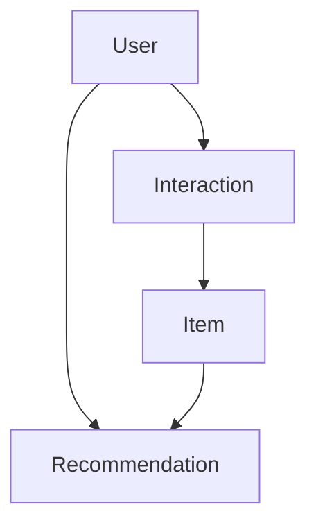
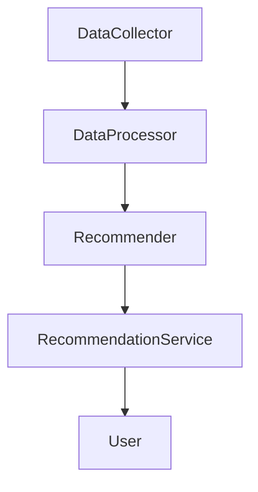
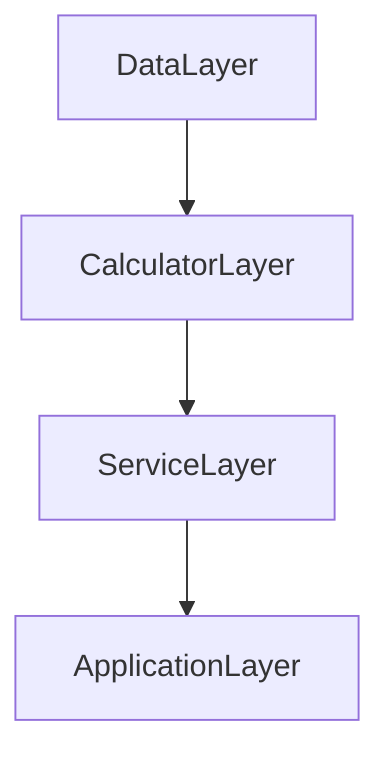
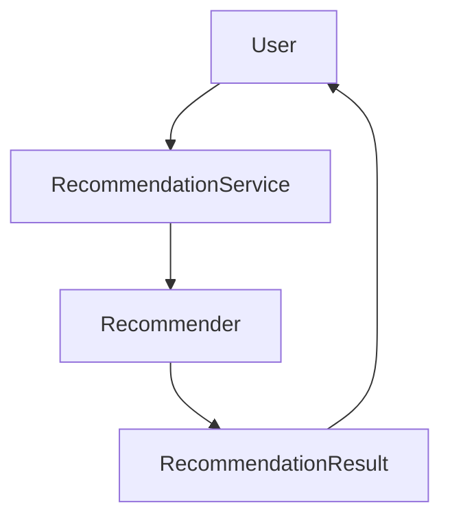

                 


# 构建企业级推荐引擎：跨平台个性化用户体验的智能化实现

> 关键词：推荐引擎，个性化推荐，跨平台推荐，企业级推荐系统，深度学习推荐，实时推荐

> 摘要：随着人工智能和大数据技术的飞速发展，推荐引擎在企业级应用中的地位日益重要。本文将从企业级推荐引擎的核心技术、跨平台实现、个性化推荐算法、系统架构设计、项目实战以及未来发展趋势等多个维度进行深入探讨。通过详细的技术分析和实际案例解读，帮助读者全面理解如何构建高效、智能、个性化的推荐引擎，实现跨平台用户体验的最优优化。

---

## 第一部分: 企业级推荐引擎概述

### 第1章: 推荐系统的背景与挑战

#### 1.1 推荐系统的定义与核心概念

##### 1.1.1 推荐系统的定义
推荐系统是一种基于用户行为、偏好和需求，利用数据挖掘、机器学习等技术，为用户提供个性化内容或产品建议的智能系统。其核心目标是提升用户体验、增加用户粘性和提高业务转化率。

##### 1.1.2 推荐系统的核心要素
推荐系统的核心要素包括：
- **用户特征**：用户的基本信息（如年龄、性别）和行为数据（如点击、收藏、购买）。
- **物品特征**：商品或内容的属性（如类别、标签、热度）。
- **交互数据**：用户与物品之间的互动记录（如评分、点击、购买）。
- **推荐算法**：基于协同过滤、深度学习等技术生成推荐结果。
- **推荐策略**：根据业务目标和用户需求调整推荐结果的策略。

##### 1.1.3 企业级推荐引擎的特点
企业级推荐引擎具有以下特点：
- **高可用性**：支持大规模用户和数据处理，确保推荐服务的稳定性。
- **实时性**：能够实时更新推荐结果，响应用户需求的变化。
- **个性化**：基于用户画像和行为数据，提供精准的个性化推荐。
- **可扩展性**：支持多平台、多业务场景的推荐需求。

#### 1.2 推荐系统的技术发展与应用场景

##### 1.2.1 推荐系统的技术演进
推荐系统经历了以下几个阶段的技术演进：
1. **基于规则的推荐**：早期推荐系统主要基于人工设定的规则，如“购买某类商品的用户也会购买另一类商品”。
2. **协同过滤推荐**：通过用户行为数据进行相似性计算，推荐相似用户的偏好内容。
3. **基于内容的推荐**：基于商品或内容本身的特征进行推荐。
4. **混合推荐模型**：结合协同过滤和内容推荐的优势，构建混合推荐模型。
5. **深度学习推荐**：利用深度学习技术（如神经网络）进行特征提取和推荐。

##### 1.2.2 企业级推荐引擎的应用场景
企业级推荐引擎广泛应用于以下场景：
- **电商推荐**：基于用户购买历史和浏览行为推荐商品。
- **内容推荐**：为用户推荐个性化的内容，如新闻、视频、文章。
- **社交推荐**：基于用户社交网络进行推荐，如好友推荐、兴趣圈子推荐。
- **金融推荐**：为用户提供个性化的投资建议和理财产品推荐。

##### 1.2.3 跨平台推荐的挑战与解决方案
跨平台推荐面临以下挑战：
- **数据孤岛问题**：不同平台的数据格式和存储方式不一致，难以统一。
- **推荐模型一致性**：不同平台的推荐逻辑和模型需要保持一致，避免推荐结果不一致。
- **用户体验统一性**：跨平台推荐需要保证用户体验的一致性，避免用户在不同平台间感受到推荐逻辑的差异。

解决方案包括：
- **统一数据模型**：设计统一的数据格式和接口，实现数据的互联互通。
- **共享推荐模型**：构建跨平台共享的推荐模型，确保推荐结果的一致性。
- **平台适配层**：针对不同平台的特点进行适配优化，提升推荐效果。

#### 1.3 个性化推荐的核心问题

##### 1.3.1 个性化推荐的定义
个性化推荐是基于用户个体特征和行为数据，为每个用户量身定制推荐内容的过程。

##### 1.3.2 用户行为分析与建模
用户行为分析包括以下几个步骤：
1. **数据采集**：采集用户的行为数据，如点击、收藏、购买、浏览时长等。
2. **数据清洗**：去除无效数据，提取有效的用户行为特征。
3. **用户画像构建**：基于用户行为数据，构建用户画像，描述用户的兴趣、偏好和行为习惯。
4. **用户分群**：根据用户画像将用户分为不同的群体，为每个群体设计不同的推荐策略。

##### 1.3.3 推荐系统的评价指标
推荐系统的评价指标包括：
- **准确率**：推荐结果与用户实际需求的匹配程度。
- **召回率**：推荐系统能够覆盖用户需求的比例。
- **覆盖率**：推荐结果的多样性，避免推荐结果过于集中。
- **用户满意度**：用户对推荐结果的满意度和使用体验。

---

## 第2章: 推荐系统的分类与实现方式

### 2.1 协同过滤推荐

#### 2.1.1 基于用户的协同过滤
基于用户的协同过滤（User-based Collaborative Filtering）是一种经典的推荐算法，其核心思想是通过寻找与目标用户相似的用户群体，推荐这些用户喜欢的内容。

##### 算法流程
1. **用户相似度计算**：基于用户行为数据，计算用户之间的相似度，常用的方法有余弦相似度、皮尔逊相关系数等。
2. **推荐结果生成**：根据目标用户的相似用户群体的行为数据，生成推荐结果。

##### 示例代码
```python
def user_based_recommendation(user_id, user_similarity_matrix):
    # 获取目标用户的相似用户
    similar_users = user_similarity_matrix[user_id]
    # 根据相似用户的评分加权求和，生成推荐结果
   推荐结果 = {}
    for user in similar_users:
        推荐结果 += 相似用户的评分
    # 按评分降序排序
    推荐结果.sort(reverse=True)
    return 推荐结果
```

##### 优缺点分析
- **优点**：推荐结果具有较高的准确性，适合用户行为数据丰富的场景。
- **缺点**：计算复杂度较高，难以处理大规模数据。

### 2.2 基于内容的推荐

#### 2.2.1 基于内容特征的推荐
基于内容的推荐（Content-based Recommendation）是通过分析商品或内容本身的特征，推荐与用户兴趣相符的内容。

##### 算法流程
1. **内容特征提取**：对商品或内容进行特征提取，常用的方法有TF-IDF、Word2Vec等。
2. **相似内容计算**：基于内容特征计算商品或内容之间的相似度。
3. **推荐结果生成**：根据用户的历史行为数据，推荐相似的内容。

##### 示例代码
```python
from sklearn.feature_extraction.text import TfidfVectorizer
from sklearn.metrics.pairwise import cosine_similarity

# 初始化向量器
vectorizer = TfidfVectorizer()
# 提取内容特征
content_features = vectorizer.fit_transform(items_content)
# 计算相似度
similarity_matrix = cosine_similarity(content_features)
```

##### 优缺点分析
- **优点**：推荐结果具有较高的可解释性，适合内容本身特征明显的场景。
- **缺点**：难以处理用户兴趣的变化，推荐结果可能缺乏多样性。

### 2.3 混合推荐模型

#### 2.3.1 混合推荐的定义
混合推荐（Hybrid Recommendation）是将协同过滤和内容推荐的优势结合起来，构建更加精准的推荐模型。

##### 算法流程
1. **协同过滤推荐**：基于用户行为数据生成推荐结果。
2. **内容推荐**：基于商品或内容的特征生成推荐结果。
3. **融合推荐**：将协同过滤和内容推荐的结果进行加权融合，生成最终的推荐结果。

##### 示例代码
```python
def hybrid_recommendation(user_id,协同过滤推荐结果, 内容推荐结果):
    # 根据业务需求进行加权融合
   融合权重 = 0.5
    推荐结果 = {}
    for item in 协同过滤推荐结果:
        推荐结果[item] += 协同过滤推荐结果[item] * 融合权重
    for item in 内容推荐结果:
        推荐结果[item] += 内容推荐结果[item] * (1 - 融合权重)
    # 按评分降序排序
    推荐结果.sort(reverse=True)
    return 推荐结果
```

##### 优缺点分析
- **优点**：推荐结果更加精准，能够同时考虑用户行为和内容特征。
- **缺点**：算法复杂度较高，实现难度较大。

### 2.4 深度学习推荐

#### 2.4.1 基于神经网络的推荐
基于深度学习的推荐系统（Deep Learning Recommendation）通过构建神经网络模型，自动提取数据中的特征，生成推荐结果。

##### 算法流程
1. **数据预处理**：对用户行为数据和商品特征数据进行预处理，构建输入向量。
2. **模型训练**：训练神经网络模型，提取数据中的深层特征。
3. **推荐结果生成**：基于训练好的模型，生成推荐结果。

##### 示例代码
```python
import tensorflow as tf
from tensorflow.keras import layers

# 定义模型
model = tf.keras.Sequential()
model.add(layers.Dense(64, activation='relu', input_dim=100))
model.add(layers.Dense(1, activation='sigmoid'))
model.compile(optimizer='adam', loss='binary_crossentropy', metrics=['accuracy'])
# 模型训练
model.fit(x_train, y_train, epochs=10, batch_size=32)
```

##### 优缺点分析
- **优点**：能够自动提取数据中的深层特征，推荐结果更加精准。
- **缺点**：需要大量的数据和计算资源，实现复杂度较高。

---

## 第3章: 企业级推荐引擎的核心技术

### 3.1 数据采集与预处理

#### 3.1.1 数据采集的方式与工具
推荐系统的数据采集方式包括：
- **日志采集**：通过日志系统采集用户的点击、浏览、购买等行为数据。
- **API调用**：通过API接口采集用户行为数据。
- **埋点采集**：在应用中嵌入埋点代码，采集用户行为数据。

常用工具包括：
- **Flume**：日志采集工具。
- **Kafka**：实时数据流处理工具。
- **ELK（Elasticsearch, Logstash, Kibana）**：日志管理工具。

#### 3.1.2 数据清洗与特征提取
数据清洗包括：
- **去重**：去除重复数据。
- **去噪**：去除异常数据。
- **补全**：填充缺失数据。

特征提取包括：
- **用户特征**：提取用户的ID、性别、年龄等信息。
- **行为特征**：提取用户的点击、收藏、购买等行为特征。
- **商品特征**：提取商品的类别、品牌、价格等信息。

#### 3.1.3 数据存储与管理
常用的数据存储方式包括：
- **关系型数据库**：如MySQL、PostgreSQL，适合结构化数据的存储。
- **NoSQL数据库**：如MongoDB、Redis，适合非结构化数据的存储。
- **大数据平台**：如Hadoop、Spark，适合大规模数据的存储和处理。

### 3.2 推荐算法的选择与优化

#### 3.2.1 算法选择的依据
选择推荐算法的依据包括：
- **数据规模**：数据量大时，选择计算复杂度低的算法。
- **实时性要求**：实时性要求高时，选择基于流数据处理的算法。
- **推荐效果**：根据业务需求选择推荐效果最佳的算法。

#### 3.2.2 算法优化的策略
算法优化策略包括：
- **模型压缩**：减少模型的参数数量，降低计算复杂度。
- **增量更新**：基于增量数据更新模型，避免全量重新训练。
- **混合推荐**：结合多种推荐算法，提升推荐效果。

#### 3.2.3 算法性能的评估
算法性能的评估指标包括：
- **准确率（Precision）**：推荐结果中实际被用户选择的比例。
- **召回率（Recall）**：推荐结果中覆盖用户实际需求的比例。
- **F1分数（F1 Score）**：准确率和召回率的调和平均数。
- **AUC值（Area Under Curve）**：评估推荐结果的排序能力。

### 3.3 模型训练与部署

#### 3.3.1 模型训练的流程
模型训练的流程包括：
1. **数据准备**：加载训练数据，进行数据预处理。
2. **模型构建**：定义模型结构，选择优化器和损失函数。
3. **模型训练**：训练模型，调整模型参数。
4. **模型评估**：评估模型的性能，选择最优模型。

#### 3.3.2 模型部署的方式
模型部署的方式包括：
- **在线部署**：将模型部署在服务器上，实时处理用户请求。
- **离线部署**：将模型部署在离线计算平台上，定期生成推荐结果。
- **边缘部署**：将模型部署在用户终端设备上，实现本地推荐。

#### 3.3.3 模型监控与维护
模型监控与维护包括：
- **模型监控**：实时监控模型的性能，发现异常及时处理。
- **模型更新**：根据新数据更新模型，保持模型的准确性。
- **模型维护**：定期维护模型，修复模型缺陷，优化模型性能。

---

## 第4章: 跨平台推荐系统的实现

### 4.1 跨平台推荐的挑战

#### 4.1.1 不同平台的特点与差异
不同平台的特点与差异包括：
- **数据格式差异**：不同平台的数据格式和存储方式不同。
- **用户行为差异**：不同平台的用户行为习惯不同。
- **推荐场景差异**：不同平台的推荐场景和业务目标不同。

#### 4.1.2 跨平台推荐的兼容性问题
跨平台推荐的兼容性问题包括：
- **数据接口不统一**：不同平台的数据接口和协议不同。
- **推荐模型不一致**：不同平台的推荐模型和算法不同。
- **用户体验不一致**：不同平台的推荐结果和展示方式不同。

#### 4.1.3 跨平台推荐的性能优化
跨平台推荐的性能优化包括：
- **数据预处理**：统一不同平台的数据格式，减少数据转换的开销。
- **模型共享**：构建跨平台共享的推荐模型，减少模型训练的次数。
- **缓存优化**：利用缓存技术，减少重复计算和数据传输的开销。

### 4.2 跨平台推荐的实现方式

#### 4.2.1 统一推荐模型的设计
统一推荐模型的设计包括：
- **统一数据模型**：设计统一的数据模型，实现不同平台的数据互通。
- **统一推荐算法**：选择适合所有平台的推荐算法，确保推荐结果的一致性。
- **统一推荐接口**：设计统一的推荐接口，简化不同平台的交互流程。

#### 4.2.2 平台适配的策略
平台适配的策略包括：
- **平台特性适配**：根据不同平台的特点，调整推荐模型和算法。
- **平台接口适配**：根据不同平台的接口规范，调整数据格式和交互方式。
- **平台用户体验适配**：根据不同平台的用户习惯，优化推荐结果的展示方式。

#### 4.2.3 跨平台推荐的接口设计
跨平台推荐的接口设计包括：
- **统一接口规范**：设计统一的推荐接口规范，确保不同平台的接口兼容。
- **数据格式统一**：统一不同平台的数据格式，确保数据传输的效率和安全性。
- **接口权限控制**：根据平台特点，设计接口的权限控制机制，确保数据安全。

### 4.3 跨平台推荐的优化与调优

#### 4.3.1 跨平台推荐的性能优化
跨平台推荐的性能优化包括：
- **数据压缩**：对数据进行压缩，减少数据传输的带宽占用。
- **并行计算**：利用并行计算技术，提高推荐系统的计算效率。
- **分布式部署**：将推荐系统部署在分布式架构上，提高系统的扩展性和可用性。

#### 4.3.2 跨平台推荐的用户体验优化
跨平台推荐的用户体验优化包括：
- **个性化推荐**：根据用户画像和行为数据，提供个性化的推荐内容。
- **实时反馈**：实时响应用户的推荐请求，提升用户体验。
- **多模态推荐**：结合文本、图片、视频等多种形式的内容，提升推荐结果的丰富性。

#### 4.3.3 跨平台推荐的效果评估
跨平台推荐的效果评估包括：
- **用户满意度**：用户对推荐结果的满意度和使用体验。
- **推荐效果对比**：不同平台推荐效果的对比分析，发现差异并优化。
- **系统性能监控**：系统性能指标的监控和分析，确保推荐系统的稳定性和高效性。

---

## 第5章: 个性化推荐的实现

### 5.1 个性化推荐的算

#### 5.1.1 个性化推荐的核心原理
个性化推荐的核心原理包括：
- **用户画像构建**：基于用户行为数据和特征数据，构建用户的兴趣画像。
- **推荐模型训练**：基于用户画像和商品特征，训练推荐模型，生成推荐结果。
- **推荐结果优化**：根据用户反馈，动态优化推荐结果，提升推荐效果。

#### 5.1.2 个性化推荐的实现步骤
个性化推荐的实现步骤包括：
1. **用户数据采集**：采集用户的行为数据和特征数据。
2. **用户画像构建**：基于用户数据构建用户画像，描述用户的兴趣和偏好。
3. **推荐模型训练**：基于用户画像和商品特征，训练推荐模型，生成推荐结果。
4. **推荐结果优化**：根据用户反馈，动态优化推荐结果，提升推荐效果。

#### 5.1.3 个性化推荐的数学模型
个性化推荐的数学模型包括：
- **协同过滤模型**：基于用户行为数据，计算用户相似度和物品相似度。
- **深度学习模型**：基于神经网络，自动提取数据中的深层特征，生成推荐结果。

---

## 第6章: 企业级推荐引擎的系统架构设计

### 6.1 系统功能设计

#### 6.1.1 领域模型设计
领域模型设计包括：
- **用户实体**：描述用户的属性和行为。
- **商品实体**：描述商品的属性和特征。
- **推荐结果实体**：描述推荐结果的结构和格式。

##### ER实体关系图


#### 6.1.2 功能模块设计
功能模块设计包括：
- **数据采集模块**：负责采集用户行为数据和商品特征数据。
- **数据处理模块**：负责数据清洗、特征提取和数据存储。
- **推荐算法模块**：负责推荐模型的训练和推荐结果的生成。
- **推荐服务模块**：负责接收推荐请求，返回推荐结果。

#### 6.1.3 功能流程图


### 6.2 系统架构设计

#### 6.2.1 系统架构图
系统架构设计包括：
- **数据层**：负责数据的存储和管理。
- **计算层**：负责数据的处理和计算。
- **服务层**：负责推荐结果的生成和分发。
- **应用层**：负责与用户的交互和展示。

##### 系统架构图


#### 6.2.2 接口设计
接口设计包括：
- **数据接口**：负责数据的输入和输出。
- **推荐接口**：负责推荐请求的接收和推荐结果的返回。
- **监控接口**：负责系统性能的监控和维护。

#### 6.2.3 交互流程图
交互流程图包括：
- **用户请求**：用户发送推荐请求。
- **推荐服务**：推荐服务接收请求，生成推荐结果。
- **结果返回**：推荐结果返回给用户，完成推荐过程。

##### 交互流程图


---

## 第7章: 项目实战

### 7.1 环境安装

#### 7.1.1 系统环境
- 操作系统：Linux/Windows/MacOS
- Python版本：Python 3.6+
- Java版本：Java 8+

#### 7.1.2 依赖安装
- **Python库**：numpy、pandas、scikit-learn、tensorflow、keras。
- **Java库**：Hadoop、Spark、Flink。
- **工具安装**：Jupyter Notebook、IDE（如PyCharm、IntelliJ IDEA）。

### 7.2 系统核心实现

#### 7.2.1 数据预处理
```python
import pandas as pd
import numpy as np

# 加载数据
data = pd.read_csv('user_behavior.csv')
# 数据清洗
data.dropna(inplace=True)
# 特征提取
user_features = data[['user_id', 'age', 'gender']]
item_features = data[['item_id', 'category', 'price']]
```

#### 7.2.2 模型训练
```python
from sklearn.metrics.pairwise import cosine_similarity

# 计算用户相似度
user_similarity = cosine_similarity(user_features)
# 训练推荐模型
recommender = HybridRecommender(user_similarity, item_features)
```

#### 7.2.3 接口设计
```python
class RecommendationService:
    def __init__(self, recommender):
        self.recommender = recommender
    
    def recommend(self, user_id, top_n=10):
        return self.recommender.recommend(user_id, top_n)
```

### 7.3 实际案例分析

#### 7.3.1 案例背景
假设我们有一个电商推荐系统，目标是为用户推荐个性化商品。

#### 7.3.2 数据分析
分析用户行为数据，构建用户画像，提取商品特征。

#### 7.3.3 模型训练
基于用户行为数据和商品特征，训练推荐模型，生成推荐结果。

#### 7.3.4 案例总结
总结推荐系统的实现过程和效果，分析存在的问题和优化方向。

### 7.4 项目小结

#### 7.4.1 核心实现总结
总结推荐系统的实现过程，包括数据预处理、模型训练、接口设计和结果展示。

#### 7.4.2 项目经验分享
分享项目中的经验和教训，提出改进建议。

#### 7.4.3 未来优化方向
提出未来优化的方向，包括算法优化、系统扩展和功能增强。

---

## 第8章: 扩展内容

### 8.1 推荐系统的性能优化

#### 8.1.1 数据层面的优化
- **数据压缩**：对数据进行压缩，减少存储空间和传输时间。
- **数据分区**：将数据按特征或时间进行分区，提高查询效率。
- **数据缓存**：利用缓存技术，减少重复数据的访问次数。

#### 8.1.2 算法层面的优化
- **模型压缩**：减少模型的参数数量，降低计算复杂度。
- **增量更新**：基于增量数据更新模型，避免全量重新训练。
- **并行计算**：利用并行计算技术，提高模型训练和推理效率。

#### 8.1.3 系统层面的优化
- **分布式部署**：将推荐系统部署在分布式架构上，提高系统的扩展性和可用性。
- **负载均衡**：利用负载均衡技术，分担系统的请求压力，提高系统的吞吐量。
- **缓存优化**：利用缓存技术，减少重复计算和数据传输的开销。

### 8.2 推荐系统的模型解释性

#### 8.2.1 模型解释性的定义
模型解释性是指推荐系统能够清晰地解释推荐结果的原因和依据。

#### 8.2.2 提升模型解释性的方法
- **特征重要性分析**：分析模型中各特征的影响力，解释推荐结果的原因。
- **规则解释**：基于推荐规则，解释推荐结果的生成逻辑。
- **可视化工具**：利用可视化工具，展示推荐结果的生成过程。

### 8.3 实时推荐系统的实现

#### 8.3.1 实时推荐的定义
实时推荐是指在用户行为发生时，立即生成推荐结果，满足用户的实时需求。

#### 8.3.2 实时推荐的实现方式
- **流数据处理**：基于流数据处理技术，实时生成推荐结果。
- **实时模型更新**：根据实时数据动态更新推荐模型，确保推荐结果的准确性。
- **分布式架构**：将推荐系统部署在分布式架构上，提高系统的实时响应能力。

#### 8.3.3 实时推荐的挑战
- **计算复杂度**：实时推荐需要快速处理大量数据，计算复杂度较高。
- **系统稳定性**：实时推荐系统需要保证高可用性和稳定性。
- **数据延迟**：实时推荐需要尽可能低的数据延迟，确保推荐结果的实时性。

### 8.4 推荐系统的伦理和安全问题

#### 8.4.1 数据隐私问题
推荐系统需要处理大量的用户数据，如何保护用户隐私是一个重要的问题。

#### 8.4.2 推荐算法的公平性
推荐系统可能会因为算法的偏见而导致推荐结果的不公平，如何确保推荐算法的公平性是一个重要的挑战。

#### 8.4.3 用户数据的安全性
推荐系统需要确保用户数据的安全性，防止数据泄露和滥用。

### 8.5 推荐系统的未来发展趋势

#### 8.5.1 深度学习的进一步应用
随着深度学习技术的不断发展，推荐系统将更加依赖深度学习模型，提高推荐的准确性和个性化。

#### 8.5.2 跨平台推荐的普及
随着多平台应用场景的增加，跨平台推荐将成为推荐系统的重要发展方向。

#### 8.5.3 实时推荐的普及
实时推荐将在更多的业务场景中得到应用，满足用户实时需求。

#### 8.5.4 智能化推荐
未来的推荐系统将更加智能化，能够自适应用户的兴趣变化，提供更加个性化的推荐服务。

---

## 第9章: 总结与展望

### 9.1 总结
本文从企业级推荐引擎的核心技术、跨平台推荐的实现、个性化推荐的算法、系统架构设计、项目实战以及未来发展趋势等多个维度进行了深入探讨。通过详细的技术分析和实际案例解读，帮助读者全面理解如何构建高效、智能、个性化的推荐引擎，实现跨平台用户体验的最优优化。

### 9.2 展望
未来，随着人工智能和大数据技术的不断发展，推荐系统将在更多业务场景中得到应用，推荐系统的智能化、个性化和实时化将成为重要的发展趋势。同时，推荐系统的安全性、公平性和解释性也将成为研究和实践的重要方向。

---

## 作者：AI天才研究院/AI Genius Institute & 禅与计算机程序设计艺术 /Zen And The Art of Computer Programming

---

**这篇文章从推荐系统的背景与挑战、分类与实现方式、企业级推荐引擎的核心技术、跨平台推荐系统的实现、个性化推荐的算法实现、系统架构设计、项目实战以及未来发展趋势等多个维度进行了全面而深入的探讨。文章结合了理论分析和实际案例，通过详细的技术实现和代码示例，帮助读者全面理解如何构建高效、智能、个性化的推荐引擎，实现跨平台用户体验的最优优化。**

