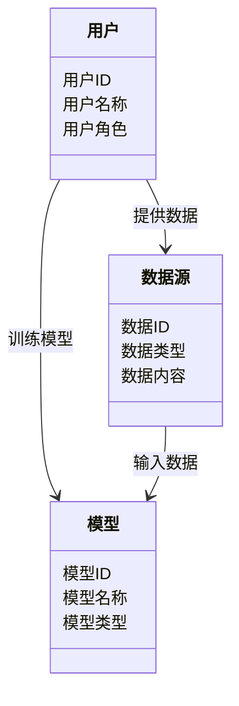
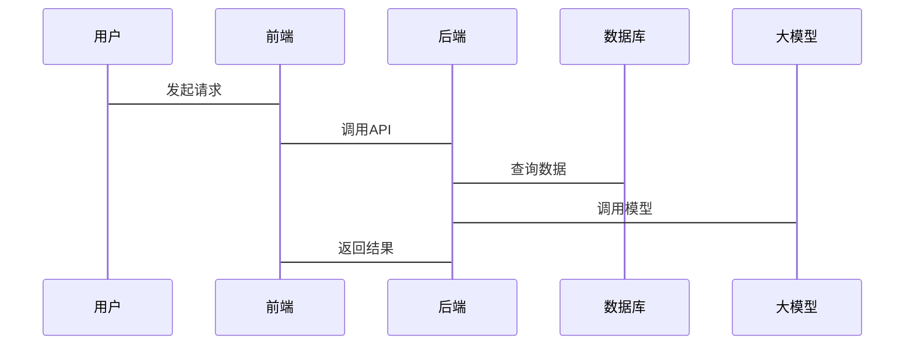

                 


# 构建基于大模型的金融监管沙盒模拟平台

> 关键词：大模型、金融监管、沙盒模拟、系统设计、项目实战

> 摘要：本文详细介绍了构建基于大模型的金融监管沙盒模拟平台的背景、核心概念、算法原理、系统架构设计、项目实战以及最佳实践。通过分析大模型在金融监管中的应用，结合实际案例，展示了如何利用大模型技术构建一个高效、智能的金融监管沙盒模拟平台。

---

## 第一部分：背景介绍

### 第1章：背景介绍

#### 1.1 问题背景

##### 1.1.1 金融监管的复杂性与挑战
金融监管是维护金融市场稳定的重要手段，但传统监管方法存在效率低、覆盖面有限、难以应对复杂金融行为等问题。金融机构的多样性、金融产品的创新性以及全球化的金融交易，使得传统的监管手段难以应对日益复杂的金融环境。

##### 1.1.2 传统金融监管的局限性
传统金融监管主要依赖人工审核和简单的规则引擎，难以应对金融市场的动态变化和复杂场景。例如，传统方法难以有效识别隐藏在大量数据中的异常交易行为，且难以快速适应新的金融监管规则。

##### 1.1.3 大模型技术在金融监管中的应用潜力
大模型（如GPT-3、PaLM等）具有强大的自然语言处理能力和数据分析能力，可以用于金融文本分析、风险评估、异常检测等领域。通过大模型技术，可以显著提升金融监管的效率和准确性。

#### 1.2 问题描述

##### 1.2.1 金融监管沙盒的概念与目标
金融监管沙盒是指一个虚拟的环境，允许金融机构在受控的环境中测试新产品、服务或流程，同时确保这些创新不会对金融市场造成风险。其目标是为金融机构提供一个安全的实验环境，降低创新成本，同时确保金融稳定。

##### 1.2.2 大模型在金融监管中的角色
大模型可以在金融监管沙盒中扮演多重角色，包括数据分析、风险评估、行为预测等。例如，大模型可以通过分析大量的金融数据，识别潜在的金融风险，并为监管机构提供决策支持。

##### 1.2.3 金融监管沙盒模拟平台的需求分析
为了有效利用大模型技术，构建一个金融监管沙盒模拟平台的需求包括：数据采集、模型训练、风险评估、实时监控等功能。

#### 1.3 问题解决

##### 1.3.1 大模型技术如何解决金融监管问题
通过大模型技术，可以实现对海量金融数据的深度分析，快速识别潜在风险，提高监管效率。同时，大模型还可以用于模拟不同金融场景下的市场反应，帮助监管机构制定更有效的监管策略。

##### 1.3.2 金融监管沙盒模拟平台的构建目标
构建一个基于大模型的金融监管沙盒模拟平台，旨在提供一个高效、智能的金融监管工具，帮助监管机构快速识别风险，优化监管流程。

##### 1.3.3 平台的核心功能与预期效果
平台的核心功能包括数据采集与处理、模型训练与部署、风险评估与预警、模拟与分析等。预期效果是显著提高金融监管的效率和准确性，降低金融风险。

#### 1.4 边界与外延

##### 1.4.1 金融监管沙盒的边界定义
金融监管沙盒的边界包括数据范围、监管对象、模拟场景等。例如，数据范围可能仅限于特定金融机构的交易数据，监管对象可能是某些金融产品或服务。

##### 1.4.2 平台的适用范围与限制
平台适用于金融机构、监管机构等，但目前可能受到数据隐私、计算资源等方面的限制。

##### 1.4.3 与其他金融监管工具的对比
与传统监管工具相比，基于大模型的金融监管沙盒模拟平台具有更高的智能化和自动化能力，能够处理更复杂的数据和场景。

#### 1.5 概念结构与核心要素

##### 1.5.1 金融监管沙盒的组成要素
包括数据层、模型层、模拟层、分析层等。

##### 1.5.2 大模型在平台中的作用
大模型用于数据处理、模型训练、风险评估等核心功能。

##### 1.5.3 平台的核心功能模块
包括数据采集模块、模型训练模块、风险评估模块、模拟与分析模块等。

#### 1.6 本章小结

##### 1.6.1 本章内容回顾
本章介绍了金融监管的复杂性与挑战，分析了传统监管方法的局限性，探讨了大模型技术在金融监管中的应用潜力，并明确了平台的构建目标和核心功能。

##### 1.6.2 下一章的预览
下一章将详细探讨核心概念与联系，包括大模型与金融监管沙盒的关系、核心概念原理、概念属性特征对比等。

---

## 第二部分：核心概念与联系

### 第2章：核心概念与联系

#### 2.1 大模型与金融监管沙盒的关系

##### 2.1.1 大模型在金融监管中的核心作用
大模型可以用于金融数据的深度分析、风险预测、模拟与评估等。

##### 2.1.2 金融监管沙盒模拟平台的构建逻辑
通过大模型技术，构建一个虚拟的金融环境，模拟不同场景下的市场反应，帮助监管机构制定有效的监管策略。

##### 2.1.3 大模型与金融监管沙盒的协同效应
大模型提供强大的数据分析能力，金融监管沙盒提供实验环境，两者结合可以显著提升金融监管的效率和效果。

#### 2.2 核心概念原理

##### 2.2.1 大模型的基本原理
大模型通过多层神经网络结构，利用自注意力机制和前馈网络，实现对文本和数据的深度理解和生成。

##### 2.2.2 金融监管沙盒的核心机制
金融监管沙盒通过模拟和分析，帮助监管机构识别潜在风险，优化监管策略。

##### 2.2.3 平台的整体架构
平台由数据层、模型层、模拟层和分析层组成，各层协同工作，实现金融监管的目标。

#### 2.3 概念属性特征对比

##### 2.3.1 大模型与传统AI模型的对比
| 特性          | 大模型            | 传统AI模型          |
|---------------|-------------------|--------------------|
| 数据需求      | 高               | 较低               |
| 模型复杂度    | 高               | 较低               |
| 表现能力      | 强               | 较弱               |

##### 2.3.2 金融监管沙盒与其他监管工具的对比
| 特性          | 金融监管沙盒      | 传统监管工具        |
|---------------|-------------------|--------------------|
| 动态性         | 高               | 较低               |
| 智能性         | 高               | 较低               |
| 适应性         | 高               | 较低               |

##### 2.3.3 平台功能模块的对比分析
通过对比分析，明确平台各功能模块的优势和不足，为后续设计提供依据。

#### 2.4 ER实体关系图

```mermaid
erDiagram
    用户 {
        <属性> 用户ID
        <属性> 用户名称
        <属性> 用户角色
    }
    数据源 {
        <属性> 数据ID
        <属性> 数据类型
        <属性> 数据内容
    }
    模型 {
        <属性> 模型ID
        <属性> 模型名称
        <属性> 模型类型
    }
    用户 -> 数据源 : 提供数据
    用户 -> 模型 : 训练模型
    数据源 -> 模型 : 输入数据
```

---

## 第三部分：算法原理

### 第3章：算法原理

#### 3.1 大模型的算法原理

##### 3.1.1 大模型的基本结构
大模型通常基于Transformer架构，包括编码器和解码器两个部分。

```mermaid
graph LR
    Encoder(input) -> Multi-head Attention -> Output Attention
    Output Attention -> FFN -> Output
    Decoder(input) -> Multi-head Attention -> Output Attention
    Output Attention -> FFN -> Output
```

##### 3.1.2 自注意力机制
自注意力机制用于捕捉文本中的长距离依赖关系，公式如下：

$$ \text{Attention}(Q, K, V) = \text{softmax}\left(\frac{QK^T}{\sqrt{d_k}}\right)V $$

##### 3.1.3 前馈前向网络
前馈网络用于将注意力输出进行非线性变换，通常包含两个线性层和一个激活函数。

##### 3.1.4 模型训练流程
包括数据预处理、模型初始化、前向传播、损失计算、反向传播和参数更新。

##### 3.1.5 Python代码示例
```python
import torch
import torch.nn as nn

class Transformer(nn.Module):
    def __init__(self, d_model, n_head, d_ff):
        super().__init__()
        self.attention = nn.MultiheadAttention(d_model, n_head)
        self.ffn = nn.Sequential(
            nn.Linear(d_model, d_ff),
            nn.ReLU(),
            nn.Linear(d_ff, d_model)
        )
    
    def forward(self, x):
        attn_output, _ = self.attention(x, x, x)
        ffn_output = self.ffn(attn_output)
        return ffn_output
```

---

## 第四部分：系统分析与架构设计

### 第4章：系统分析与架构设计

#### 4.1 问题场景介绍
构建一个基于大模型的金融监管沙盒模拟平台，需要考虑数据采集、模型部署、用户交互等多个方面。

#### 4.2 项目介绍

##### 4.2.1 项目目标
实现一个高效、智能的金融监管沙盒模拟平台。

##### 4.2.2 项目范围
涵盖数据采集、模型训练、风险评估、模拟分析等功能。

#### 4.3 系统功能设计

##### 4.3.1 领域模型类图


##### 4.3.2 系统架构设计


#### 4.4 系统接口设计

##### 4.4.1 API接口设计
定义RESTful API接口，包括数据上传、模型训练、风险评估等功能。

##### 4.4.2 接口交互流程


---

## 第五部分：项目实战

### 第5章：项目实战

#### 5.1 环境安装

##### 5.1.1 安装Python
```bash
python --version
pip install --upgrade pip
```

##### 5.1.2 安装必要的库
```bash
pip install torch transformers
```

#### 5.2 系统核心实现

##### 5.2.1 数据处理代码
```python
import pandas as pd

def process_data(data_path):
    df = pd.read_csv(data_path)
    # 数据清洗和预处理
    return df
```

##### 5.2.2 模型训练代码
```python
import torch
from torch import nn

class RegulatorModel(nn.Module):
    def __init__(self, input_dim, output_dim):
        super().__init__()
        self.fc = nn.Linear(input_dim, output_dim)
    
    def forward(self, x):
        return self.fc(x)

model = RegulatorModel(input_dim, output_dim)
criterion = nn.MSELoss()
optimizer = torch.optim.Adam(model.parameters(), lr=0.001)
```

##### 5.2.3 风险评估代码
```python
def evaluate_risk(model, data_loader):
    model.eval()
    total_loss = 0
    for batch in data_loader:
        outputs = model(batch)
        loss = criterion(outputs, batch_labels)
        total_loss += loss.item()
    return total_loss / len(data_loader)
```

#### 5.3 案例分析

##### 5.3.1 案例背景
假设我们有一个金融交易数据集，需要识别潜在的欺诈交易。

##### 5.3.2 数据处理与分析
使用Pandas对数据进行清洗和分析，识别异常值和数据分布。

##### 5.3.3 模型训练与评估
训练大模型识别欺诈交易，评估模型的准确率和召回率。

#### 5.4 项目总结
通过实际案例，验证了平台的有效性和实用性，为后续优化提供了方向。

---

## 第六部分：最佳实践与小结

### 第6章：最佳实践与小结

#### 6.1 最佳实践

##### 6.1.1 数据隐私保护
在数据处理和模型训练中，要严格遵守数据隐私法规，保护用户隐私。

##### 6.1.2 模型可解释性
在金融监管中，模型的可解释性非常重要，需要确保监管机构能够理解模型的决策过程。

##### 6.1.3 持续优化
定期更新模型和平台功能，以应对金融市场的变化和新的监管要求。

#### 6.2 小结

##### 6.2.1 全文总结
本文详细介绍了构建基于大模型的金融监管沙盒模拟平台的背景、核心概念、算法原理、系统架构设计、项目实战以及最佳实践。

##### 6.2.2 未来展望
随着大模型技术的不断发展，金融监管沙盒模拟平台将更加智能化和自动化，为金融监管带来更多的创新和突破。

---

## 作者

作者：AI天才研究院/AI Genius Institute & 禅与计算机程序设计艺术 /Zen And The Art of Computer Programming

