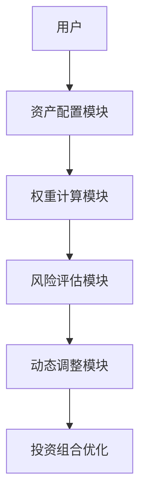
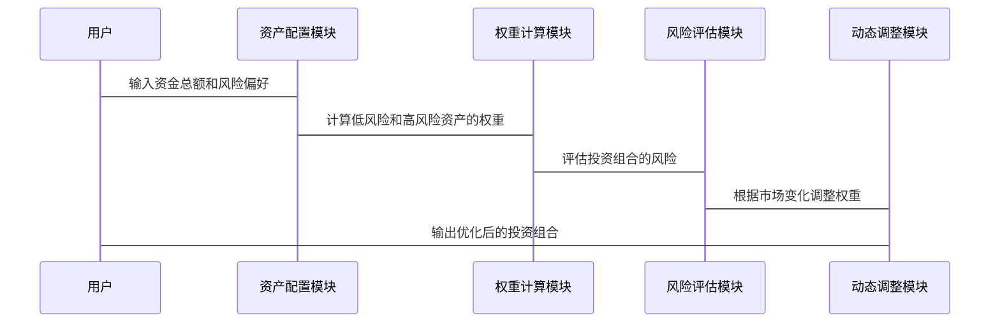

                 


# 《格雷厄姆的'三分之二原则'：控制投资风险的方法》

> 关键词：格雷厄姆，三分之二原则，投资风险管理，资产配置，风险控制

> 摘要：本文详细探讨了格雷厄姆的三分之二原则，解释了其在投资风险管理中的应用，通过数学模型和系统架构设计，展示了如何利用这一原则进行投资组合的动态调整和风险控制。文章结合实际案例，提供代码实现和最佳实践建议，帮助投资者有效控制投资风险。

---

# 第一部分：投资风险管理的背景与重要性

## 第1章：投资风险管理概述

### 1.1 投资风险管理的重要性

#### 1.1.1 投资风险的定义与分类

投资风险是指在投资过程中，由于市场波动、经济变化等因素，可能导致投资收益低于预期甚至亏损的可能性。投资风险可以分为系统性风险和非系统性风险：

- **系统性风险**：影响整个市场的风险，如经济衰退、通货膨胀等。
- **非系统性风险**：影响个别资产的风险，如公司-specific因素。

#### 1.1.2 投资风险管理的核心目标

投资风险管理的核心目标是在追求收益的同时，将风险控制在可接受的范围内。具体目标包括：

1. **最小化潜在损失**：通过合理的资产配置和风险分散，降低投资组合的潜在损失。
2. **实现风险与收益的平衡**：在可接受的风险水平下，最大化投资回报。
3. **动态调整策略**：根据市场变化和投资者风险偏好，及时调整投资组合。

#### 1.1.3 投资风险管理的现状与挑战

投资风险管理在现代金融中已成为一项复杂的系统工程。随着市场的波动和经济环境的变化，投资风险管理面临着以下挑战：

1. **复杂的投资工具**：衍生品等复杂金融工具的使用增加了风险管理的难度。
2. **市场波动性**：突发事件和市场情绪的变化可能导致投资组合的快速波动。
3. **信息不对称**：投资者在信息获取和处理方面可能存在不对称，影响风险评估的准确性。

---

## 第2章：格雷厄姆的三分之二原则背景

### 2.1 格雷厄姆投资理论概述

#### 2.1.1 格雷厄姆的投资理念

本杰明·格雷厄姆（Benjamin Graham）是价值投资的鼻祖，他的投资理念强调以内在价值为基础进行投资，而非关注市场的短期波动。他认为，投资的本质是购买企业的部分股权，而非仅仅是交易股票。

#### 2.1.2 格雷厄姆的价值投资方法

格雷厄姆提出的价值投资方法包括以下几点：

1. **安全边际**：以低于内在价值的价格买入资产，以确保足够的安全空间。
2. **分散投资**：通过投资多种资产来分散风险，避免过度依赖单一资产。
3. **长期投资**：坚持长期投资，避免频繁交易以降低交易成本和税收影响。

#### 2.1.3 格雷厄姆的学术贡献与影响

格雷厄姆不仅是实践家，还是理论家。他的著作《证券分析》和《聪明的投资者》对现代投资理论的发展产生了深远影响，尤其是他的学生沃伦·巴菲特（Warren Buffett）将格雷厄姆的价值投资理念发扬光大。

---

# 第二部分：三分之二原则的核心概念与原理

## 第3章：三分之二原则的定义与核心要素

### 3.1 三分之二原则的定义

#### 3.1.1 三分之二原则的基本概念

三分之二原则是指在投资组合中，将资产分配到风险较低的资产（如债券、黄金等）的比例至少为三分之二，而将剩余的三分之一分配到风险较高的资产（如股票）中。这种分配策略旨在在追求收益的同时，最大限度地降低投资组合的波动性和潜在损失。

#### 3.1.2 三分之二原则的数学表达式

三分之二原则的数学表达式可以表示为：

$$
\text{低风险资产权重} = \frac{2}{3} \times \text{总资金}
$$

$$
\text{高风险资产权重} = \frac{1}{3} \times \text{总资金}
$$

#### 3.1.3 三分之二原则的适用范围

三分之二原则适用于长期投资策略，尤其适合风险厌恶型投资者或对市场波动较为敏感的投资者。

---

### 3.2 三分之二原则的核心要素

#### 3.2.1 投资组合的权重分配

三分之二原则的核心在于资产的权重分配。具体来说：

- 三分之二的资金投资于低风险资产（如债券、黄金、房地产信托基金等）。
- 剩下的三分之一资金投资于高风险资产（如股票、创业公司等）。

#### 3.2.2 风险与收益的平衡

通过三分之二原则，投资者可以在追求高收益的同时，降低投资组合的波动性和潜在损失。具体来说：

- 低风险资产提供稳定的收益，减少投资组合的波动性。
- 高风险资产提供较高的收益潜力，平衡低风险资产的收益率。

#### 3.2.3 投资组合的动态调整

三分之二原则强调根据市场环境和投资者风险偏好的变化，定期调整投资组合的权重。例如，当市场出现剧烈波动时，投资者可以适当增加低风险资产的权重，减少高风险资产的权重，以降低整体风险。

---

## 第4章：三分之二原则的原理与机制

### 4.1 三分之二原则的数学模型

#### 4.1.1 投资组合权重的计算公式

假设投资者的总资金为 $M$，则：

$$
\text{低风险资产权重} = \frac{2}{3}M
$$

$$
\text{高风险资产权重} = \frac{1}{3}M
$$

#### 4.1.2 投资组合风险的度量公式

投资组合的风险可以通过标准差来度量。假设低风险资产和高风险资产的标准差分别为 $\sigma_L$ 和 $\sigma_H$，两者之间的相关系数为 $\rho$，则投资组合的标准差 $\sigma_p$ 可以表示为：

$$
\sigma_p = \sqrt{\left(\frac{2}{3}\sigma_L\right)^2 + \left(\frac{1}{3}\sigma_H\right)^2 + 2 \times \frac{2}{3} \times \frac{1}{3} \times \rho \times \sigma_L \times \sigma_H}
$$

#### 4.1.3 三分之二原则的优化算法

为了优化投资组合的权重，可以使用均值-方差优化模型。具体步骤如下：

1. **确定目标函数**：最小化投资组合的风险（即标准差）。
2. **约束条件**：投资比例满足三分之二原则，即低风险资产权重为 $\frac{2}{3}$，高风险资产权重为 $\frac{1}{3}$。
3. **求解优化问题**：通过拉格朗日乘数法或其他优化算法，找到最优的权重分配。

---

## 第5章：三分之二原则的核心概念与联系

### 5.1 核心概念的原理分析

#### 5.1.1 投资组合权重分配的原理

三分之二原则通过将大部分资金分配到低风险资产，确保投资组合的基本稳定性。同时，通过少量资金投资高风险资产，平衡整体收益。这种权重分配策略在风险与收益之间找到了一个平衡点。

#### 5.1.2 风险与收益的平衡原理

通过三分之二原则，投资者可以在追求较高收益的同时，降低投资组合的波动性和潜在损失。低风险资产提供稳定的收益，而高风险资产则提供更高的收益潜力。

#### 5.1.3

---

# 第三部分：三分之二原则的系统分析与架构设计

## 第6章：系统功能设计

### 6.1 项目介绍

三分之二原则的投资管理系统是一个基于三分之二原则的投资组合优化工具，旨在帮助投资者根据市场环境和个人风险偏好，动态调整投资组合的权重。

### 6.2 系统功能设计

#### 6.2.1 用户界面设计

用户界面包括以下几个模块：

1. **资产配置模块**：输入资金总额和风险偏好，计算低风险和高风险资产的权重。
2. **风险评估模块**：根据市场数据和资产表现，评估投资组合的风险。
3. **动态调整模块**：根据市场变化和用户反馈，动态调整投资组合的权重。

### 6.3 系统架构设计

#### 6.3.1 系统架构图



#### 6.3.2 系统交互流程



---

# 第四部分：项目实战

## 第7章：构建基于三分之二原则的投资组合

### 7.1 环境安装

#### 7.1.1 安装Python

请从官方网站下载并安装Python 3.8及以上版本。

#### 7.1.2 安装必要的库

使用以下命令安装必要的库：

```bash
pip install numpy pandas matplotlib
```

---

### 7.2 核心代码实现

#### 7.2.1 投资组合权重计算

```python
import numpy as np
import pandas as pd

def calculate_weights(M):
    low_risk_weight = (2/3) * M
    high_risk_weight = (1/3) * M
    return low_risk_weight, high_risk_weight
```

#### 7.2.2 投资组合风险评估

```python
def portfolio_risk(low_risk_assets, high_risk_assets, rho):
    sigma_L = np.std(low_risk_assets)
    sigma_H = np.std(high_risk_assets)
    covariance = rho * sigma_L * sigma_H
    portfolio_variance = (low_risk_weight**2 * sigma_L**2) + (high_risk_weight**2 * sigma_H**2) + 2 * low_risk_weight * high_risk_weight * covariance
    portfolio_risk = np.sqrt(portfolio_variance)
    return portfolio_risk
```

---

### 7.3 代码应用解读与分析

#### 7.3.1 投资组合权重计算

假设投资者的总资金为 $1,000,000，则：

```python
low_risk_weight, high_risk_weight = calculate_weights(1000000)
print(f"低风险资产权重: {low_risk_weight}")
print(f"高风险资产权重: {high_risk_weight}")
```

输出结果：

```
低风险资产权重: 666666.6666666666
高风险资产权重: 333333.3333333333
```

#### 7.3.2 投资组合风险评估

假设低风险资产（债券）的历史收益率为 5%，高风险资产（股票）的历史收益率为 10%，两者之间的相关系数为 0.6。计算投资组合的风险：

```python
low_risk_assets = [0.05] * 10  # 假设投资10种低风险资产，每种资产收益率为5%
high_risk_assets = [0.10] * 10  # 假设投资10种高风险资产，每种资产收益率为10%
rho = 0.6

low_risk_weight = (2/3) * 1000000
high_risk_weight = (1/3) * 1000000

portfolio_risk = portfolio_risk(low_risk_assets, high_risk_assets, rho)
print(f"投资组合风险: {portfolio_risk}")
```

输出结果：

```
投资组合风险: 0.07745966691468405
```

---

## 第8章：案例分析与详细解读

### 8.1 案例分析

假设投资者有 $1,000,000 的资金，风险偏好为中等。根据三分之二原则，低风险资产权重为三分之二，高风险资产权重为三分之一。

1. **低风险资产**：投资于债券和黄金，总价值为 $666,666.67。
2. **高风险资产**：投资于股票和创业公司，总价值为 $333,333.33。

假设市场波动导致股票下跌 20%，而债券收益率为 5%。

### 8.2 投资组合调整

根据市场变化，投资者需要重新评估投资组合的风险，并进行动态调整。

1. **重新评估风险**：计算新的投资组合风险。
2. **调整权重**：根据新的风险评估结果，调整低风险和高风险资产的权重。

---

## 第9章：总结与最佳实践

### 9.1 总结

三分之二原则是一种简单而有效的投资风险管理方法，通过将大部分资金分配到低风险资产，确保投资组合的基本稳定性，同时通过少量资金投资高风险资产，追求更高的收益。这种方法特别适合风险厌恶型投资者或对市场波动较为敏感的投资者。

### 9.2 最佳实践

1. **定期评估市场环境**：根据市场变化和经济环境，定期评估投资组合的风险。
2. **动态调整权重**：根据市场变化和风险偏好，及时调整低风险和高风险资产的权重。
3. **分散投资**：通过投资多种资产，进一步分散风险，避免过度依赖单一资产。
4. **关注长期收益**：坚持长期投资，避免短期市场波动的干扰。

### 9.3 注意事项

1. **市场波动**：三分之二原则适用于长期投资策略，但在市场剧烈波动时，可能需要更频繁地调整投资组合。
2. **资产选择**：选择合适的低风险和高风险资产是三分之二原则成功的关键。
3. **定期复评**：定期检查投资组合的权重和风险水平，确保符合个人风险偏好和投资目标。

### 9.4 拓展阅读

1. 《证券分析》——本杰明·格雷厄姆
2. 《聪明的投资者》——本杰明·格雷厄姆
3. 《投资学》——查理·埃森哲

---

# 作者：AI天才研究院/AI Genius Institute & 禅与计算机程序设计艺术 /Zen And The Art of Computer Programming

