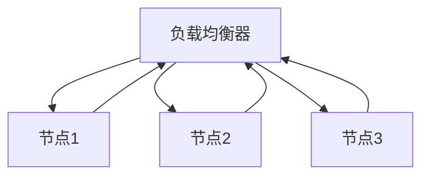
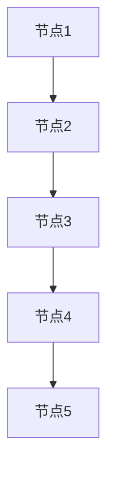

                 


# 灾难恢复：确保AI Agent服务的高可用性

---

## 关键词：
AI Agent、高可用性、灾难恢复、容灾、系统架构、负载均衡

---

## 摘要：
随着人工智能技术的快速发展，AI Agent（智能代理）服务在企业中的应用越来越广泛。然而，AI Agent服务的高可用性需求也随之增加，尤其是在面对系统故障或灾难性事件时，如何快速恢复并确保服务的连续性成为关键挑战。本文从AI Agent服务的特点出发，详细探讨了灾难恢复与高可用性的核心概念、实现方法及系统架构设计。通过分析实际场景，结合算法原理和项目实战，本文为读者提供了一套确保AI Agent服务高可用性的解决方案。

---

## 第一部分：灾难恢复与AI Agent服务的背景介绍

### 第1章：灾难恢复与AI Agent服务的背景介绍

#### 1.1 问题背景与问题描述
AI Agent服务作为一种智能代理系统，广泛应用于自动化决策、智能客服、推荐系统等领域。然而，AI Agent服务的高可用性需求与其复杂性密切相关。在实际应用中，AI Agent服务可能会面临硬件故障、网络中断、数据丢失等多种风险，导致服务中断或数据丢失。这些问题可能对企业造成巨大的经济损失和声誉损害。

#### 1.2 AI Agent服务的特点与需求
AI Agent服务具有以下特点：
1. **智能化**：基于机器学习和自然语言处理技术，能够自主决策和执行任务。
2. **实时性**：需要在极短的时间内响应用户请求。
3. **数据依赖性**：高度依赖数据的完整性和准确性。
4. **分布式架构**：通常采用分布式系统架构，以提高性能和扩展性。

基于以上特点，AI Agent服务对高可用性提出了更高的要求，包括：
- **快速恢复**：在发生故障时，能够在最短时间内恢复服务。
- **数据一致性**：确保数据在故障后的一致性和完整性。
- **负载均衡**：在分布式架构中实现负载均衡，避免单点故障。

#### 1.3 灾难恢复与高可用性的挑战
AI Agent服务的高可用性需求面临以下挑战：
1. **数据一致性**：在分布式系统中，数据的一致性难以保证，尤其是在网络分区的情况下。
2. **故障检测与隔离**：如何快速检测故障节点并将其隔离，以避免影响整个系统。
3. **快速恢复**：在故障发生后，如何快速恢复服务，确保用户体验不受影响。

#### 1.4 灾难恢复与高可用性的解决方案
为了解决上述挑战，我们需要采取以下措施：
1. **数据备份与恢复**：定期备份数据，并在故障发生后快速恢复。
2. **冗余设计**：通过冗余设计，确保在单点故障时系统仍能正常运行。
3. **分布式架构**：采用分布式系统架构，避免单点故障。
4. **负载均衡与容错机制**：通过负载均衡技术实现任务分担，并通过容错机制快速恢复故障节点。

---

## 第二部分：灾难恢复与AI Agent服务的核心概念

### 第2章：灾难恢复与高可用性的核心概念

#### 2.1 灾难恢复的核心概念
##### 2.1.1 灾难恢复的定义与目标
灾难恢复是指在系统发生故障或灾难性事件后，通过备份数据和恢复系统，将系统恢复到正常运行状态的过程。其目标是尽可能减少数据丢失和系统停机时间。

##### 2.1.2 灾难恢复的关键技术
1. **数据备份**：通过定期备份数据，确保数据的安全性。
2. **数据恢复**：在数据丢失后，通过备份数据快速恢复。
3. **系统冗余**：通过冗余设计，确保在故障发生时系统仍能正常运行。

##### 2.1.3 灾难恢复的实现机制
1. **数据备份与恢复**：采用增量备份或全备份策略，确保数据的完整性和一致性。
2. **系统冗余**：通过冗余设计，确保在故障发生时系统仍能正常运行。
3. **故障检测与隔离**：通过心跳检测机制，快速检测故障节点并将其隔离。

#### 2.2 高可用性的核心概念
##### 2.2.1 高可用性的定义与目标
高可用性是指系统在故障发生时，能够快速恢复并继续提供服务的能力。其目标是最大限度地减少系统停机时间，确保服务的连续性。

##### 2.2.2 高可用性的关键技术
1. **负载均衡**：通过负载均衡技术，将任务分担到多个节点，避免单点故障。
2. **容错机制**：通过冗余设计和故障检测机制，快速恢复故障节点。
3. **分布式架构**：采用分布式系统架构，避免单点故障。

#### 2.3 灾难恢复与高可用性的区别与联系
##### 2.3.1 区别
- **灾难恢复**：侧重于在系统故障后快速恢复数据和系统。
- **高可用性**：侧重于在系统运行中避免故障发生，确保服务的连续性。

##### 2.3.2 联系
- 灾难恢复是高可用性的重要组成部分，是高可用性实现的基础。
- 通过高可用性设计，可以减少灾难恢复的频率和复杂性。

---

## 第三部分：AI Agent服务高可用性的算法原理

### 第3章：AI Agent服务高可用性的算法原理

#### 3.1 负载均衡算法
##### 3.1.1 负载均衡算法的定义与作用
负载均衡算法用于将任务分担到多个节点，避免单点故障。常见的负载均衡算法包括轮询算法、随机算法、加权轮询算法等。

##### 3.1.2 轮询算法的实现
轮询算法是一种简单的负载均衡算法，通过依次将任务分配到不同的节点，实现任务的均衡分担。



##### 3.1.3 加权轮询算法的实现
加权轮询算法是一种基于节点权重的负载均衡算法，节点权重越高，分配的任务越多。

```mermaid
graph TD
    A[负载均衡器] --> B[节点1 (权重=2)]
    B --> A
    A --> C[节点2 (权重=1)]
    C --> A
    A --> D[节点3 (权重=1)]
    D --> A
```

#### 3.2 心跳检测算法
##### 3.2.1 心跳检测算法的定义与作用
心跳检测算法用于检测节点的健康状态，通过定期发送心跳包，判断节点是否存活。

##### 3.2.2 心跳检测算法的实现
心跳检测算法通常采用超时机制，当节点在规定时间内未发送心跳包，则认为该节点故障。

```mermaid
graph TD
    A[负载均衡器] --> B[节点1]
    B --> A (心跳包)
    A --> C[节点2]
    C --> A (心跳包)
    A --> D[节点3]
    D --> A (心跳包)
```

#### 3.3 分布式一致性算法
##### 3.3.1 分布式一致性算法的定义与作用
分布式一致性算法用于保证分布式系统中数据的一致性，常见的算法包括PAXOS和RAFT。

##### 3.3.2 PAXOS算法的实现
PAXOS算法是一种经典的分布式一致性算法，用于保证分布式系统中数据的一致性。



---

## 第四部分：AI Agent服务高可用性的系统架构设计

### 第4章：AI Agent服务高可用性的系统架构设计

#### 4.1 系统功能设计
##### 4.1.1 系统功能模块
AI Agent服务高可用性系统主要包含以下功能模块：
1. **负载均衡模块**：负责任务的分担和负载均衡。
2. **心跳检测模块**：负责检测节点的健康状态。
3. **数据备份与恢复模块**：负责数据的备份和恢复。

##### 4.1.2 系统功能流程
1. **任务分担**：负载均衡模块将任务分担到不同的节点。
2. **心跳检测**：心跳检测模块定期检测节点的健康状态。
3. **故障恢复**：当检测到节点故障时，负载均衡模块将任务转移到其他节点。

#### 4.2 系统架构设计
##### 4.2.1 系统架构图
```mermaid
graph TD
    A[负载均衡器] --> B[节点1]
    B --> A (心跳包)
    A --> C[节点2]
    C --> A (心跳包)
    A --> D[节点3]
    D --> A (心跳包)
```

##### 4.2.2 系统交互流程
1. **用户请求**：用户向AI Agent服务发送请求。
2. **任务分担**：负载均衡器将任务分担到不同的节点。
3. **节点处理**：节点处理任务并返回结果。
4. **心跳检测**：节点定期发送心跳包，检测健康状态。
5. **故障恢复**：当检测到节点故障时，负载均衡器将任务转移到其他节点。

#### 4.3 系统接口设计
##### 4.3.1 API接口设计
AI Agent服务高可用性系统提供以下API接口：
1. **提交任务接口**：用户提交任务到负载均衡器。
2. **心跳检测接口**：节点向负载均衡器发送心跳包。
3. **故障恢复接口**：负载均衡器将任务转移到其他节点。

##### 4.3.2 接口交互流程
1. **用户提交任务**：用户通过API接口提交任务到负载均衡器。
2. **任务分担**：负载均衡器将任务分担到不同的节点。
3. **节点处理任务**：节点处理任务并返回结果。
4. **心跳检测**：节点定期发送心跳包，检测健康状态。
5. **故障恢复**：当检测到节点故障时，负载均衡器将任务转移到其他节点。

---

## 第五部分：AI Agent服务高可用性的项目实战

### 第5章：AI Agent服务高可用性的项目实战

#### 5.1 项目环境安装
##### 5.1.1 环境要求
AI Agent服务高可用性系统需要以下环境：
1. **操作系统**：Linux系统。
2. **编程语言**：Python 3.8及以上版本。
3. **依赖库**：安装必要的Python库，如`asyncio`、`pymongo`等。

##### 5.1.2 安装步骤
1. **安装Python**：下载并安装Python 3.8及以上版本。
2. **安装依赖库**：使用pip命令安装必要的Python库。
   ```bash
   pip install asyncio pymongo requests
   ```

#### 5.2 系统核心实现
##### 5.2.1 负载均衡器实现
```python
import asyncio
import random

class LoadBalancer:
    def __init__(self, nodes):
        self.nodes = nodes
        self.current_node = 0

    async def assign_task(self):
        node = self.nodes[self.current_node]
        self.current_node = (self.current_node + 1) % len(self.nodes)
        return node

    async def heartbeat(self):
        # 模拟心跳检测
        pass
```

##### 5.2.2 心跳检测实现
```python
import asyncio

async def heartbeat(node):
    while True:
        try:
            # 模拟心跳包
            print(f"Node {node} is alive")
            await asyncio.sleep(1)
        except Exception as e:
            print(f"Node {node} is dead")
            break
```

##### 5.2.3 故障恢复实现
```python
import asyncio
import random

class FaultRecovery:
    def __init__(self, nodes):
        self.nodes = nodes
        self.active_nodes = nodes.copy()

    async def detect_fault(self):
        while True:
            # 模拟故障检测
            if random.random() < 0.1:
                node = random.choice(self.active_nodes)
                self.active_nodes.remove(node)
                print(f"Node {node} is dead")
            await asyncio.sleep(1)

    async def recover_fault(self):
        while True:
            # 模拟故障恢复
            if len(self.active_nodes) < len(self.nodes):
                node = random.choice([n for n in self.nodes if n not in self.active_nodes])
                self.active_nodes.append(node)
                print(f"Node {node} is recovered")
            await asyncio.sleep(1)
```

#### 5.3 项目运行与测试
##### 5.3.1 系统运行流程
1. **启动负载均衡器**：初始化负载均衡器并启动任务分担。
2. **启动心跳检测**：每个节点启动心跳检测任务。
3. **启动故障检测与恢复**：检测故障节点并恢复。

##### 5.3.2 系统测试
通过运行上述代码，可以测试AI Agent服务高可用性系统的负载均衡、心跳检测和故障恢复功能。观察系统在故障发生时的响应速度和恢复能力。

---

## 第六部分：最佳实践与小结

### 第6章：最佳实践与小结

#### 6.1 最佳实践
1. **定期备份数据**：确保数据的安全性和一致性。
2. **采用分布式架构**：避免单点故障，提高系统的可用性。
3. **负载均衡与容错机制**：通过负载均衡和容错机制，快速恢复故障节点。
4. **故障检测与隔离**：及时检测故障节点并将其隔离，避免影响整个系统。

#### 6.2 小结
通过本文的详细讲解，我们了解了AI Agent服务高可用性的实现方法和系统架构设计。通过负载均衡、心跳检测和故障恢复等技术，可以有效提高AI Agent服务的可用性和容灾能力，确保服务的连续性和稳定性。

---

## 作者：AI天才研究院/AI Genius Institute & 禅与计算机程序设计艺术 /Zen And The Art of Computer Programming

