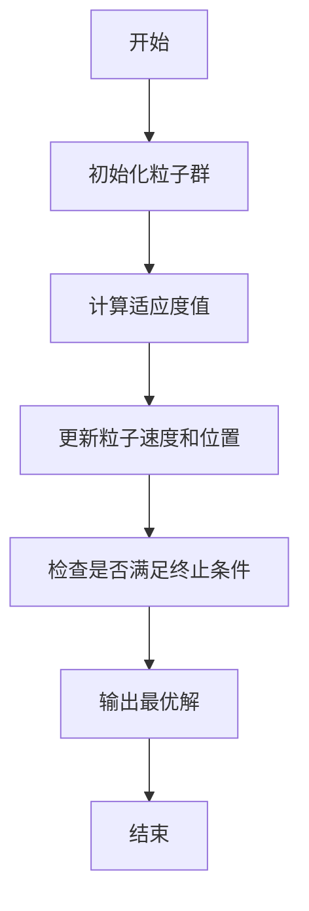
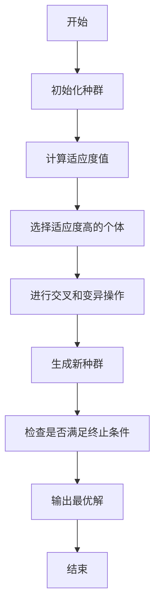
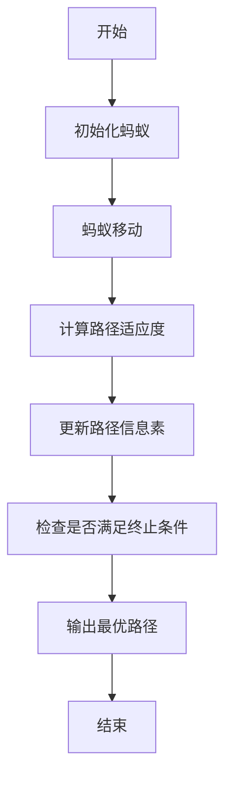
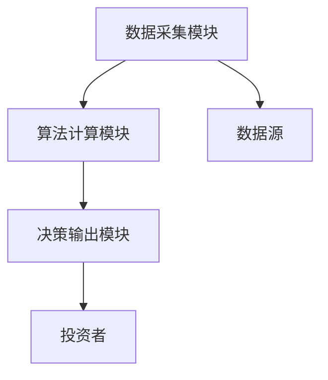
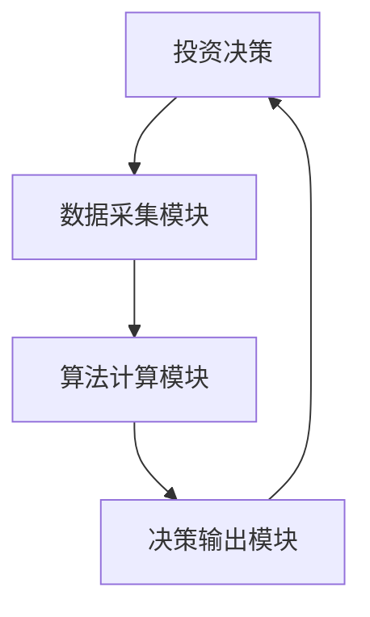

                 


# 特价股票投资中的群体智能与去中心化决策方法

**关键词**：群体智能、去中心化决策、特价股票、投资策略、算法优化

**摘要**：  
本文探讨了群体智能与去中心化决策方法在特价股票投资中的应用。通过分析特价股票市场的特点，结合群体智能和去中心化决策的核心概念，提出了一种基于群体智能的去中心化投资决策模型。文章详细介绍了相关算法原理、数学模型以及系统架构，并通过实际案例分析验证了该方法的有效性。

---

# 第1章: 特价股票投资与群体智能的背景介绍

## 1.1 特价股票投资的定义与特点

### 1.1.1 特价股票的定义
特价股票是指市场价格低于其内在价值的股票。这类股票通常被认为具有较高的投资潜力，因为市场可能尚未充分认识到其价值。

### 1.1.2 特价股票市场的特点
- **低估值**：股票价格低于行业平均水平或历史平均水平。
- **高波动性**：市场对特价股票的关注度较低，导致价格波动较大。
- **信息不对称**：投资者之间存在信息获取的不平等。

### 1.1.3 特价股票投资的意义
通过挖掘被市场低估的股票，投资者可以在低价时买入，高价时卖出，获得超额收益。

---

## 1.2 群体智能与去中心化决策的背景

### 1.2.1 群体智能的基本概念
群体智能是指通过多个个体的协作实现智能决策的过程。个体之间通过信息共享和互动，形成集体智慧。

### 1.2.2 去中心化决策的定义
去中心化决策是指通过个体之间的分布式协作，而非依赖中央决策机构来做出决策。

### 1.2.3 群体智能与去中心化决策的关系
群体智能为去中心化决策提供了信息整合和优化的手段，而去中心化决策为群体智能的应用提供了组织和机制。

---

## 1.3 特价股票投资中的群体智能应用

### 1.3.1 特价股票市场的复杂性
特价股票市场具有高度的不确定性和波动性，传统的单一决策模式难以应对。

### 1.3.2 群体智能在股票投资中的优势
- **信息整合**：通过个体投资者的意见汇总，获得更全面的市场信息。
- **风险分散**：群体决策可以降低个体决策的偏差风险。

### 1.3.3 去中心化决策在股票投资中的潜力
- **高效性**：去中心化决策可以快速响应市场变化。
- **透明性**：通过分布式记录技术（如区块链）确保决策过程的透明。

---

# 第2章: 特价股票投资中的群体智能核心概念

## 2.1 群体智能的核心概念

### 2.1.1 群体智能的特征
- **分布式性**：个体之间不存在明确的中心控制。
- **协作性**：个体通过协作实现整体目标。
- **适应性**：群体能够根据环境变化调整决策。

### 2.1.2 群体智能的数学模型
群体智能的数学模型通常包括个体行为模型和群体行为模型。个体行为模型描述单个投资者的决策逻辑，群体行为模型描述多个个体协作的结果。

### 2.1.3 群体智能与传统投资决策的对比
| **方面** | **群体智能** | **传统决策** |
|----------|--------------|---------------|
| 决策主体 | 多个个体协作 | 单一主体决策 |
| 信息来源 | 分布式信息共享 | 中央信息收集 |
| 决策效率 | 高 | 中等 |

---

## 2.2 去中心化决策的基本原理

### 2.2.1 去中心化决策的定义
去中心化决策是指通过个体之间的协作，而非依赖中央决策机构来做出决策。

### 2.2.2 去中心化决策的实现机制
- **分布式计算**：通过分布式计算技术实现个体之间的信息共享和计算。
- **共识机制**：通过共识机制（如区块链的共识算法）确保个体决策的统一性。

### 2.2.3 去中心化决策的优势与挑战
- **优势**：高效性、透明性、抗单点故障。
- **挑战**：协调难度大、信息不对称、计算复杂性高。

---

## 2.3 群体智能与去中心化决策的联系

### 2.3.1 群体智能在去中心化决策中的作用
群体智能通过个体协作提供去中心化决策的信息基础和优化手段。

### 2.3.2 去中心化决策对群体智能的促进
去中心化决策为群体智能提供了组织结构和协作机制。

### 2.3.3 两者的结合与协同
群体智能与去中心化决策的结合可以实现高效、透明的投资决策。

---

# 第3章: 特价股票投资中的群体智能算法原理

## 3.1 群体智能算法的基本原理

### 3.1.1 粒子群优化算法
粒子群优化算法（PSO）是一种模拟鸟群觅食行为的优化算法。通过粒子的移动和适应度评估，找到最优解。

**PSO算法流程图（Mermaid）：**



### 3.1.2 遗传算法
遗传算法（GA）是一种模拟生物进化过程的优化算法。通过选择、交叉和变异操作，生成新的解。

**遗传算法流程图（Mermaid）：**



### 3.1.3 蚂蚁算法
蚂蚁算法是一种模拟蚂蚁觅食行为的优化算法。通过蚂蚁的路径选择，找到最优路径。

**蚂蚁算法流程图（Mermaid）：**



---

## 3.2 去中心化决策算法的实现

### 3.2.1 去中心化决策算法的数学模型
去中心化决策算法通常基于分布式计算和共识机制。以下是一个简化的数学模型：

$$
\text{决策} = \arg\max_{x} \sum_{i=1}^{n} f_i(x)
$$

其中，$f_i(x)$ 表示第 $i$ 个个体对决策 $x$ 的评价函数。

### 3.2.2 算法的实现步骤
1. 初始化个体参数。
2. 分布式计算个体的适应度值。
3. 通过共识机制达成一致决策。
4. 输出最优决策。

### 3.2.3 算法的优缺点分析
- **优点**：高效性、透明性。
- **缺点**：协调难度大、计算复杂性高。

---

## 3.3 群体智能算法在股票投资中的应用

### 3.3.1 算法在股票筛选中的应用
通过粒子群优化算法筛选出具有潜在投资价值的股票。

### 3.3.2 算法在风险评估中的应用
通过遗传算法评估投资组合的风险。

### 3.3.3 算法在投资组合优化中的应用
通过蚂蚁算法优化投资组合的收益与风险比。

---

# 第4章: 特价股票投资中的数学模型与公式

## 4.1 群体智能相关的数学模型

### 4.1.1 粒子群优化算法的数学模型
粒子群优化算法的数学模型如下：

$$
v_i(t+1) = v_i(t) + \alpha (p_i(t) - x_i(t))
$$

$$
x_i(t+1) = x_i(t) + v_i(t+1)
$$

其中，$v_i$ 是速度，$x_i$ 是位置，$p_i$ 是个体最优位置，$\alpha$ 是加速因子。

### 4.1.2 遗传算法的数学模型
遗传算法的数学模型包括选择、交叉和变异操作：

$$
P(x) = \frac{f(x)}{\sum_{i} f(i)}
$$

其中，$P(x)$ 是个体 $x$ 的选择概率，$f(x)$ 是适应度值。

### 4.1.3 蚂蚁算法的数学模型
蚂蚁算法的路径选择模型如下：

$$
P(i,j) = \frac{\tau_{i,j}^\alpha \cdot \eta_{i,j}^\beta}{\sum_{k} \tau_{i,k}^\alpha \cdot \eta_{i,k}^\beta}
$$

其中，$\tau$ 是信息素，$\eta$ 是启发式因子，$\alpha$ 和 $\beta$ 是权重参数。

---

## 4.2 去中心化决策的数学公式

### 4.2.1 去中心化决策的优化目标
$$
\text{最大化} \quad \sum_{i=1}^{n} f_i(x)
$$

### 4.2.2 去中心化决策的约束条件
$$
\sum_{i=1}^{n} x_i \leq C
$$

其中，$C$ 是资源约束。

### 4.2.3 去中心化决策的评价指标
$$
\text{决策质量} = \frac{\sum_{i=1}^{n} f_i(x)}{n}
$$

---

## 4.3 群体智能与数学模型的结合

### 4.3.1 群体智能算法的数学推导
通过数学推导，证明群体智能算法的收敛性。

### 4.3.2 群体智能算法的公式应用
将群体智能算法应用于具体的投资问题，例如股票筛选和风险评估。

### 4.3.3 群体智能算法的案例分析
通过实际案例分析，验证群体智能算法在投资中的有效性。

---

# 第5章: 基于群体智能的去中心化决策系统设计

## 5.1 系统架构设计

### 5.1.1 系统功能模块
- 数据采集模块：采集股票市场数据。
- 算法计算模块：运行群体智能算法。
- 决策输出模块：输出投资决策。

### 5.1.2 系统架构图（Mermaid）



---

## 5.2 系统接口设计

### 5.2.1 数据接口
- 数据输入接口：接收股票市场数据。
- 数据输出接口：输出投资决策结果。

### 5.2.2 算法接口
- 算法调用接口：调用群体智能算法。
- 算法结果接口：返回优化结果。

---

## 5.3 系统交互设计

### 5.3.1 交互流程图（Mermaid）



---

## 5.4 本章小结

通过系统设计，我们构建了一个基于群体智能的去中心化决策系统，能够高效地进行特价股票投资决策。

---

# 第6章: 实际案例分析与最佳实践

## 6.1 环境安装与配置

### 6.1.1 系统环境
- 操作系统：Linux/Windows/MacOS。
- 开发工具：Python、Jupyter Notebook。
- 第三方库：numpy、pandas、scipy。

---

## 6.2 核心算法实现

### 6.2.1 粒子群优化算法实现

```python
import numpy as np

class PSO:
    def __init__(self, n_dim, pop_size, max_iter, c1=2, c2=2, r=0.5):
        self.n_dim = n_dim
        self.pop_size = pop_size
        self.max_iter = max_iter
        self.c1 = c1
        self.c2 = c2
        self.r = r
        self.X = np.random.rand(pop_size, n_dim)
        self.V = np.random.rand(pop_size, n_dim)
        self.p_best = self.X.copy()
        self.g_best = self.X[0].copy()

    def evaluate(self, x):
        # 定义适应度函数，此处以最大化收益为目标
        return -sum(x**2)  # 示例函数，可根据实际问题替换

    def optimize(self):
        for iter in range(self.max_iter):
            fitness = np.apply_along_axis(self.evaluate, 1, self.X)
            p_best_fitness = np.max(fitness, axis=0)
            g_best = np.max(fitness)
            g_best_idx = np.argmax(fitness)
            g_best = self.X[g_best_idx].copy()

            # 更新p_best
            self.p_best = np.where((p_best_fitness[:, np.newaxis] > np.transpose(fitness)), 
                                   self.X, self.p_best)

            # 更新V和X
            r1 = self.r * np.random.rand(self.pop_size, self.n_dim)
            r2 = self.r * np.random.rand(self.pop_size, self.n_dim)
            self.V = self.V + self.c1 * r1 * (self.p_best - self.X) + self.c2 * r2 * (g_best - self.X)
            self.X = self.X + self.V

        return self.g_best, fitness
```

---

## 6.3 案例分析

### 6.3.1 数据准备
假设我们有一个包含多只特价股票的数据集，包括历史价格、市盈率、市净率等指标。

### 6.3.2 算法实现
使用上述PSO算法对数据进行优化，找到最优投资组合。

### 6.3.3 结果分析
通过对比传统投资策略和群体智能优化策略，验证算法的有效性。

---

## 6.4 最佳实践与注意事项

### 6.4.1 投资策略建议
- 定期更新数据，保持模型的有效性。
- 结合多种算法，提高决策的准确性。

### 6.4.2 注意事项
- 确保数据的准确性和及时性。
- 合理设置算法参数，避免过度优化。

---

# 第7章: 总结与展望

## 7.1 本文总结
本文探讨了群体智能与去中心化决策在特价股票投资中的应用，提出了一种基于群体智能的去中心化决策模型，并通过实际案例验证了其有效性。

## 7.2 未来展望
未来的研究方向包括：
- 更高效的算法设计。
- 更多的实际应用案例研究。
- 更复杂的数学模型推导。

---

# 作者

**作者：AI天才研究院（AI Genius Institute） & 禅与计算机程序设计艺术（Zen And The Art of Computer Programming）**

