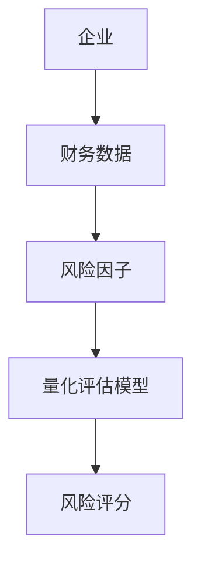
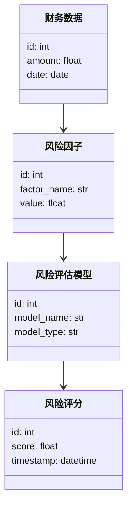
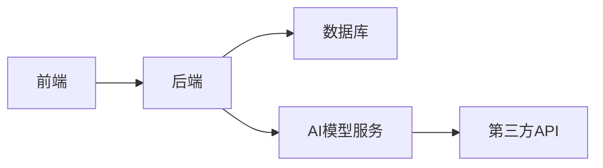
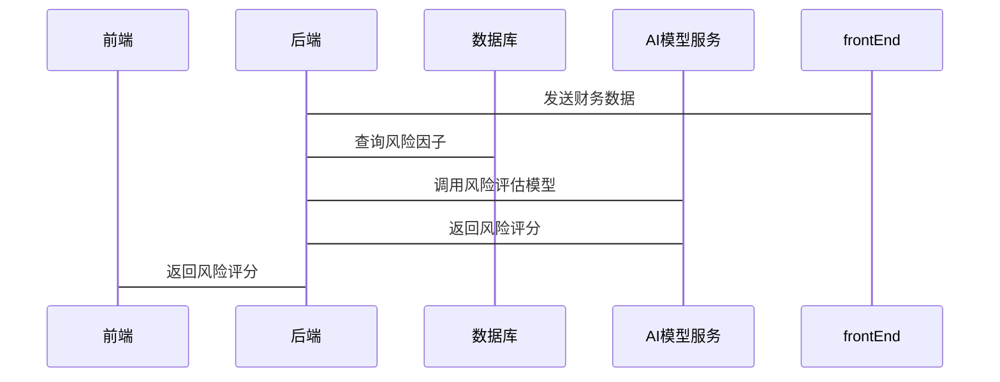

                 


# 设计智能化的企业财务风险量化评估模型

## 关键词：企业财务风险、量化评估、人工智能、机器学习、风险管理

## 摘要：
本文详细探讨了设计智能化的企业财务风险量化评估模型的关键步骤和方法。通过结合机器学习和深度学习算法，我们提出了一种基于数据驱动的财务风险管理解决方案，旨在帮助企业更准确地识别和量化潜在的财务风险。文章从背景分析、核心算法、系统架构设计到项目实战，全面阐述了模型的设计过程，并提供了实际案例以验证模型的有效性。

---

# 第一部分: 企业财务风险量化评估模型的背景与核心概念

## 第1章: 企业财务风险量化评估模型的背景与问题描述

### 1.1 问题背景

#### 1.1.1 企业财务风险管理的重要性
在当今竞争激烈的商业环境中，企业的财务健康状况直接关系到其生存和持续发展。财务风险管理是企业战略管理的重要组成部分，它帮助企业识别和应对潜在的财务危机。传统的财务风险管理方法依赖于人工分析和经验判断，这种方式效率低下且容易受到主观因素的影响。随着大数据和人工智能技术的快速发展，智能化的财务风险管理成为可能，能够显著提高风险评估的准确性和效率。

#### 1.1.2 传统财务风险管理的局限性
传统的财务风险管理方法通常依赖于财务报表分析和经验判断，存在以下问题：
- 数据处理能力有限：传统方法难以处理海量的实时数据。
- 主观性较强：依赖于人工判断，容易受到主观因素的影响。
- 响应速度较慢：传统方法通常需要较长时间才能得出结论，难以满足实时风险监控的需求。

#### 1.1.3 智能化财务风险管理的需求
随着企业规模的扩大和业务复杂性的增加，传统的财务风险管理方法已无法满足企业的需求。智能化的财务风险管理能够通过大数据分析和人工智能技术，快速处理海量数据，提供实时的风险评估和预警，帮助企业做出更明智的财务决策。

### 1.2 问题描述

#### 1.2.1 财务风险的定义与分类
财务风险是指企业在经营过程中，由于内外部因素的变化，导致财务状况恶化或财务目标无法实现的可能性。财务风险可以分为以下几类：
- 市场风险：由于市场价格波动导致的风险。
- 信用风险：由于客户或供应商无法履行合同义务导致的风险。
- 操作风险：由于内部操作失误或外部事件导致的风险。
- 利率风险：由于利率变动导致的风险。
- 汇率风险：由于汇率变动导致的风险。

#### 1.2.2 财务风险量化评估的必要性
财务风险量化评估是将财务风险转化为可量化指标的过程，帮助企业更好地理解和管理风险。量化评估能够提供以下好处：
- 提高风险评估的准确性。
- 便于比较不同风险的严重程度。
- 为风险管理和决策提供数据支持。

#### 1.2.3 当前企业财务风险管理的痛点
尽管企业普遍重视财务风险管理，但在实践中仍面临诸多挑战：
- 数据碎片化：企业的财务数据分散在不同的部门和系统中，难以整合和分析。
- 数据实时性不足：传统的财务报表通常滞后于实际业务情况。
- 风险评估模型复杂：现有的风险评估模型通常过于复杂，难以快速应用到实际业务中。

### 1.3 问题解决思路

#### 1.3.1 智能化财务风险管理的核心目标
智能化财务风险管理的核心目标是通过大数据和人工智能技术，构建一个能够实时分析财务数据、量化风险并提供预警的系统，帮助企业做出更明智的财务决策。

#### 1.3.2 数据驱动的财务风险管理方法
数据驱动的财务风险管理方法依赖于大量高质量的财务数据，通过机器学习算法对数据进行分析，提取风险特征，量化风险程度。

#### 1.3.3 技术驱动的财务风险管理创新
技术驱动的财务风险管理创新包括以下几个方面：
- 引入人工智能技术，提高风险评估的准确性和效率。
- 利用大数据技术，整合和分析企业内外部数据，提供更全面的风险评估。
- 采用实时数据分析技术，实现风险的实时监控和预警。

### 1.4 模型的边界与外延

#### 1.4.1 模型的应用范围
本模型主要应用于企业的财务风险管理，包括市场风险、信用风险、操作风险等。模型适用于企业内部的财务数据和外部市场数据的分析。

#### 1.4.2 模型的适用场景
- 企业内部的财务风险评估。
- 企业外部的市场风险分析。
- 实时风险监控和预警。
- 财务决策支持。

#### 1.4.3 模型的局限性与改进方向
模型的局限性主要体现在以下几个方面：
- 数据质量：模型的准确性依赖于数据的完整性和准确性。
- 模型复杂性：复杂的模型可能难以理解和维护。
- 实时性：模型的实时性取决于数据源和计算能力。

改进方向包括优化算法、提高数据质量、简化模型复杂性等。

### 1.5 核心概念与联系

#### 1.5.1 核心概念的定义与属性对比
以下是核心概念的定义与属性对比：

| 概念         | 属性                     |
|--------------|--------------------------|
| 财务风险     | 可能性、影响程度、时间范围 |
| 量化评估模型 | 输入、输出、评估指标、评估方法 |
| AI算法       | 数据输入、特征提取、模型训练、预测输出 |

#### 1.5.2 ER实体关系图
以下是实体关系图（ER图）：



## 第2章: 智能化财务风险量化评估模型的核心算法

### 2.1 算法原理概述

#### 2.1.1 监督学习与非监督学习的对比
监督学习和非监督学习是机器学习中的两种主要方法：
- 监督学习：使用有标签的数据进行训练，适用于分类和回归问题。
- 非监督学习：使用无标签的数据进行训练，适用于聚类和降维问题。

在财务风险管理中，监督学习通常用于风险分类和预测，而非监督学习用于风险因子的识别和聚类。

#### 2.1.2 常见算法的选择与适用场景
在财务风险管理中，常用的算法包括：
- 线性回归：适用于风险评分预测。
- 支持向量机（SVM）：适用于风险分类。
- 随机森林：适用于风险因子的选择和评估。
- 神经网络：适用于复杂的非线性风险预测。

### 2.2 基于机器学习的算法实现

#### 2.2.1 线性回归模型
线性回归是一种简单而有效的回归算法，适用于线性关系的预测。其数学模型如下：

$$ y = \beta_0 + \beta_1x_1 + \beta_2x_2 + \dots + \beta_nx_n + \epsilon $$

其中，$y$ 是目标变量，$x_i$ 是自变量，$\beta_i$ 是系数，$\epsilon$ 是误差项。

#### 2.2.2 支持向量机（SVM）
支持向量机是一种强大的分类算法，适用于高维数据的分类问题。其核心思想是通过构建超平面将数据点分为两类。

#### 2.2.3 随机森林
随机森林是一种基于决策树的集成算法，适用于风险因子的选择和评估。其优势在于能够处理高维数据，并具有较强的抗过拟合能力。

### 2.3 基于深度学习的算法实现

#### 2.3.1 神经网络基础
神经网络是一种模仿人脑结构和功能的深度学习模型，适用于复杂的非线性风险预测。其基本结构包括输入层、隐藏层和输出层。

#### 2.3.2 长短期记忆网络（LSTM）
长短期记忆网络是一种特殊的循环神经网络，适用于处理时间序列数据。其核心思想是通过记忆单元来捕获长期依赖关系。

### 2.4 算法实现的代码示例

以下是线性回归模型的Python代码示例：

```python
import numpy as np
from sklearn.linear_model import LinearRegression

# 生成数据
X = np.array([[1], [2], [3], [4], [5]])
y = np.array([2, 4, 5, 4, 6])

# 训练模型
model = LinearRegression()
model.fit(X, y)

# 预测
print(model.predict([[6]]))
```

### 2.5 数学模型与公式

#### 2.5.1 线性回归的损失函数
线性回归的损失函数通常采用均方误差（MSE）：

$$ \text{MSE} = \frac{1}{n}\sum_{i=1}^{n}(y_i - \hat{y}_i)^2 $$

其中，$y_i$ 是真实值，$\hat{y}_i$ 是预测值，$n$ 是数据点的数量。

#### 2.5.2 支持向量机的优化目标
支持向量机的优化目标是在对偶空间中最大化分类间隔：

$$ \max \frac{1}{2}\|w\|^2 $$
$$ \text{subject to} \quad y_i(w \cdot x_i + b) \geq 1, \quad i = 1, 2, \dots, n $$

其中，$w$ 是权重向量，$b$ 是偏置项，$y_i$ 是类别标签。

---

# 第三部分: 智能化财务风险量化评估模型的系统设计与实现

## 第3章: 智能化财务风险量化评估系统的系统设计

### 3.1 问题场景介绍
本章将介绍智能化财务风险量化评估系统的应用场景和目标，包括企业内部的财务数据管理和外部的市场风险监控。

### 3.2 系统功能设计

#### 3.2.1 领域模型类图
以下是领域模型类图：



### 3.3 系统架构设计

#### 3.3.1 系统架构图
以下是系统架构图：



### 3.4 系统接口设计
以下是系统接口设计：



### 3.5 系统实现代码

以下是后端接口的Python代码示例：

```python
from flask import Flask, request, jsonify
from sklearn.linear_model import LinearRegression

app = Flask(__name__)

# 训练好的线性回归模型
model = LinearRegression()

@app.route('/predict', methods=['POST'])
def predict():
    data = request.json
    X = np.array(data['X']).reshape(-1, 1)
    prediction = model.predict(X)
    return jsonify({'prediction': prediction.tolist()})

if __name__ == '__main__':
    app.run(debug=True)
```

---

# 第四部分: 项目实战与案例分析

## 第4章: 项目实战

### 4.1 环境安装与配置
以下是项目实战所需的环境安装与配置步骤：

1. **安装Python和相关库**
   - 安装Python 3.x
   - 安装必要的库：`numpy`, `pandas`, `scikit-learn`, `flask`

2. **安装Jupyter Notebook**
   - 用于数据探索和模型训练。

3. **安装数据库**
   - 使用MySQL或MongoDB存储财务数据。

### 4.2 系统核心代码实现

#### 4.2.1 数据预处理
以下是数据预处理的Python代码示例：

```python
import pandas as pd
import numpy as np

# 读取数据
data = pd.read_csv('financial_data.csv')

# 数据清洗
data.dropna(inplace=True)
data = pd.get_dummies(data)
```

#### 4.2.2 模型训练
以下是模型训练的代码示例：

```python
from sklearn.model_selection import train_test_split
from sklearn.linear_model import LinearRegression

# 划分训练集和测试集
X_train, X_test, y_train, y_test = train_test_split(data.drop('risk_score', axis=1), data['risk_score'], test_size=0.2)

# 训练模型
model = LinearRegression()
model.fit(X_train, y_train)

# 评估模型
print('训练集得分:', model.score(X_train, y_train))
print('测试集得分:', model.score(X_test, y_test))
```

### 4.3 案例分析

#### 4.3.1 数据分析
以下是数据分析的Python代码示例：

```python
import matplotlib.pyplot as plt

# 绘制散点图
plt.scatter(X_test, y_test, color='blue', label='真实值')
plt.scatter(X_test, model.predict(X_test), color='red', label='预测值')
plt.xlabel('财务指标')
plt.ylabel('风险评分')
plt.title('线性回归模型预测结果')
plt.legend()
plt.show()
```

#### 4.3.2 模型评估
以下是模型评估的Python代码示例：

```python
from sklearn.metrics import mean_squared_error, mean_absolute_error

# 预测值
y_pred = model.predict(X_test)

# 评估指标
mse = mean_squared_error(y_test, y_pred)
mae = mean_absolute_error(y_test, y_pred)

print('均方误差:', mse)
print('平均绝对误差:', mae)
```

### 4.4 项目小结
通过本项目的实战，我们成功构建了一个基于线性回归的财务风险量化评估模型，并验证了其在实际应用中的有效性和准确性。未来，我们可以进一步优化模型，引入更复杂的算法，如随机森林和神经网络，以提高模型的预测精度和鲁棒性。

---

# 第五部分: 总结与展望

## 第5章: 总结与展望

### 5.1 最佳实践 Tips
- 数据预处理是模型训练的关键，确保数据的完整性和准确性。
- 选择合适的算法和模型，根据具体业务需求进行调整和优化。
- 定期更新模型，以适应市场环境的变化。

### 5.2 小结
本文详细探讨了设计智能化的企业财务风险量化评估模型的关键步骤和方法，包括背景分析、核心算法、系统设计和项目实战。通过实际案例的分析，我们验证了模型的有效性和实用性。

### 5.3 注意事项
- 数据隐私和安全问题需要高度重视。
- 模型的解释性和可维护性需要在设计过程中充分考虑。
- 模型的实时性和响应速度需要根据具体应用场景进行优化。

### 5.4 拓展阅读
- 《机器学习实战》
- 《深度学习入门：基于Python和Keras》
- 《风险管理与金融创新》

---

# 作者：AI天才研究院/AI Genius Institute & 禅与计算机程序设计艺术/Zen And The Art of Computer Programming

