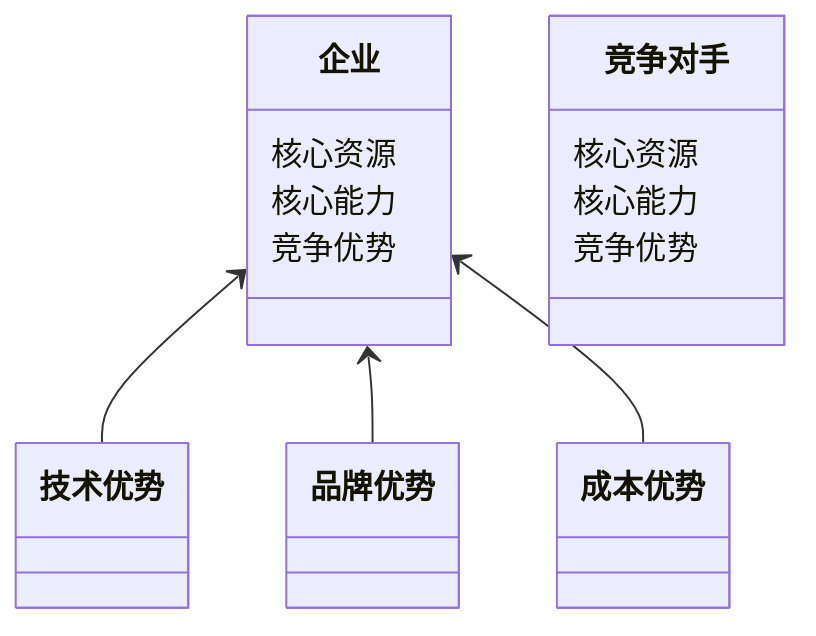
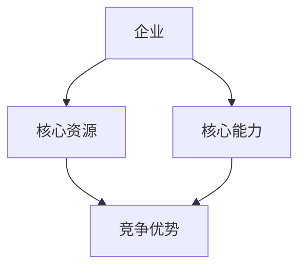
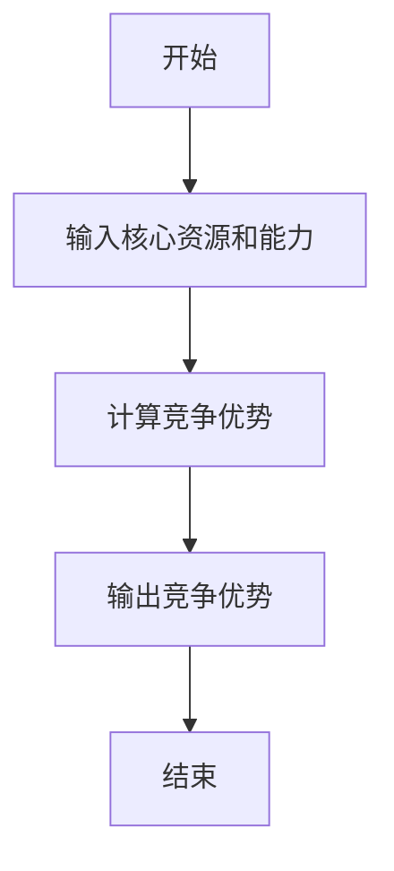

                 


# 费雪的竞争优势分析框架

> 关键词：竞争优势分析，费雪框架，商业战略，企业战略，竞争优势，商业模式

> 摘要：本文将详细探讨费雪的竞争优势分析框架，从其背景、核心概念、算法原理到系统设计与项目实战，全面解析如何通过该框架识别和维持企业的竞争优势。通过丰富的案例分析和详细的技术讲解，帮助读者掌握这一强大的竞争优势分析工具。

---

# 第一部分: 费雪的竞争优势分析框架基础

## 第1章: 费雪的竞争优势分析框架概述

### 1.1 竞争优势的基本概念

#### 1.1.1 竞争优势的定义
竞争优势是指企业在市场中相对于竞争对手的有利条件，这些条件可以是资源、能力、技术、成本、品牌、客户关系等。竞争优势是企业长期成功的关键因素。

#### 1.1.2 竞争优势的类型
竞争优势可以分为以下几种类型：
- **成本优势**：企业在生产或运营过程中具有更低的成本。
- **差异化优势**：企业通过提供独特的产品或服务来区别于竞争对手。
- **技术优势**：企业拥有领先的技术或专利。
- **品牌优势**：强大的品牌认知度和品牌忠诚度。
- **规模优势**：企业通过规模经济获得竞争优势。

#### 1.1.3 竞争优势的核心要素
竞争优势的核心要素包括：
1. **资源**：企业的核心资源，如技术、人才、资金等。
2. **能力**：企业的核心能力，如研发能力、市场开拓能力等。
3. **战略**：企业的战略定位和执行能力。

### 1.2 费雪分析框架的背景与起源

#### 1.2.1 竞争优势分析的演变
竞争优势分析从早期的简单成本分析，逐步发展为更加复杂的综合分析框架。传统的方法注重成本和价格，而现代的方法则更加注重企业的核心能力和独特价值。

#### 1.2.2 费雪框架的提出
费雪竞争优势分析框架由迈克尔·费雪提出，旨在帮助企业识别和维持竞争优势。该框架强调企业的核心能力和资源，并通过系统化的方法分析竞争优势的来源和可持续性。

#### 1.2.3 费雪框架的核心思想
费雪框架的核心思想是：企业的竞争优势来源于其独特的资源和能力，这些资源和能力必须是不可模仿的，并且能够为企业创造长期价值。

### 1.3 费雪框架与其他竞争优势分析方法的对比

#### 1.3.1 传统竞争优势分析方法
传统方法主要关注成本和价格，忽视了企业的核心能力和资源的独特性。

#### 1.3.2 费雪框架的独特性
费雪框架的独特性在于其系统化的方法，强调企业的核心能力和资源，并通过分析这些要素的可持续性和独特性来确定竞争优势。

#### 1.3.3 费雪框架的适用场景
费雪框架适用于所有行业，尤其适合那些依赖于核心能力和独特资源的企业。

### 1.4 费雪框架在企业战略中的应用价值

#### 1.4.1 企业战略规划的新视角
费雪框架为企业战略规划提供了新的视角，帮助企业更清晰地识别竞争优势的来源。

#### 1.4.2 费雪框架对企业竞争优势的提升作用
通过费雪框架，企业可以更好地识别和利用其核心能力和资源，从而提升竞争优势。

#### 1.4.3 费雪框架的实践意义
费雪框架为企业的战略决策提供了科学的依据，帮助企业制定更具前瞻性的战略。

### 1.5 本章小结
本章介绍了竞争优势的基本概念、费雪分析框架的背景与起源，以及费雪框架的独特性和应用价值。

---

## 第2章: 费雪竞争优势分析框架的核心概念与联系

### 2.1 核心概念原理

#### 2.1.1 费雪框架的核心要素
费雪框架的核心要素包括：
1. **核心资源**：企业的核心资源，如技术、人才、资金等。
2. **核心能力**：企业的核心能力，如研发能力、市场开拓能力等。
3. **竞争优势来源**：企业的竞争优势来源于其核心资源和能力的独特性。

#### 2.1.2 核心要素之间的关系
核心要素之间的关系可以用以下公式表示：
$$ \text{竞争优势} = f(\text{核心资源}, \text{核心能力}) $$

#### 2.1.3 核心要素的数学表达式
以下是核心要素的数学表达式：
$$ \text{竞争优势} = \sum_{i=1}^{n} w_i \cdot r_i $$
其中，$w_i$ 是第 $i$ 个核心要素的权重，$r_i$ 是第 $i$ 个核心要素的值。

### 2.2 核心概念属性特征对比表格

| 核心要素       | 成本优势 | 差异化优势 | 技术优势 | 品牌优势 |
|----------------|----------|------------|----------|----------|
| 描述           | 成本低    | 独特产品    | 技术领先 | 品牌强    |
| 适用场景       | 制造业    | 服务业     | 高 tech  | 所有行业  |
| 可持续性       | 高       | 中         | 高       | 高       |

### 2.3 ER实体关系图架构

```mermaid
erd
    publisher(P_id, P_name, P_address)
    book(B_id, B_title, B_publisher, B_price)
    customer(C_id, C_name, C_address)
    order(O_id, O_date, O_total, O_customer, O_publisher)
    <many-to-many> order_with_publisher <O_publisher, P_id> <P_id, P_name, P_address>
    <many-to-many> order_with_book <O_publisher, B_id> <B_id, B_title, B_publisher, B_price>
```

### 2.4 本章小结
本章详细介绍了费雪框架的核心概念与联系，包括核心要素、核心要素之间的关系以及核心要素的数学表达式。

---

## 第3章: 费雪竞争优势分析框架的算法原理讲解

### 3.1 算法原理概述

#### 3.1.1 算法的基本思想
费雪竞争优势分析算法的基本思想是通过分析企业的核心资源和能力，确定其竞争优势的来源和可持续性。

#### 3.1.2 算法的输入输出
- **输入**：企业的核心资源和能力。
- **输出**：竞争优势的来源和可持续性。

#### 3.1.3 算法的步骤分解
1. **识别核心资源和能力**。
2. **评估核心资源和能力的独特性和可持续性**。
3. **确定竞争优势的来源**。

### 3.2 算法流程图

```mermaid
graph TD
    A[开始] -> B[识别核心资源和能力]
    B -> C[评估独特性和可持续性]
    C -> D[确定竞争优势来源]
    D -> E[结束]
```

### 3.3 算法的数学模型和公式

#### 3.3.1 成本优势的计算公式
$$ \text{成本优势} = \frac{\text{竞争对手的平均成本} - \text{企业的成本}}{\text{竞争对手的平均成本}} \times 100\% $$

#### 3.3.2 差异化优势的评估公式
$$ \text{差异化优势} = \sum_{i=1}^{n} w_i \cdot d_i $$
其中，$w_i$ 是第 $i$ 个差异化要素的权重，$d_i$ 是第 $i$ 个差异化要素的值。

### 3.4 算法的Python实现示例

```python
def calculate_competitive_edge(core_resources, core_capabilities):
    competitive_edge = 0
    for i in range(len(core_resources)):
        competitive_edge += core_resources[i] * core_capabilities[i]
    return competitive_edge

# 示例
core_resources = [0.8, 0.6, 0.9]
core_capabilities = [0.7, 0.8, 0.6]
ce = calculate_competitive_edge(core_resources, core_capabilities)
print("竞争优势 =", ce)
```

### 3.5 算法的详细讲解和举例说明

#### 3.5.1 成本优势的计算
假设竞争对手的平均成本为100，企业的成本为80，那么成本优势为：
$$ \text{成本优势} = \frac{100 - 80}{100} \times 100\% = 20\% $$

#### 3.5.2 差异化优势的评估
假设差异化要素包括产品创新、服务质量、品牌认知度，权重分别为0.5、0.3、0.2，对应的值分别为0.8、0.7、0.9。那么差异化优势为：
$$ \text{差异化优势} = 0.5 \times 0.8 + 0.3 \times 0.7 + 0.2 \times 0.9 = 0.4 + 0.21 + 0.18 = 0.79 $$

### 3.6 本章小结
本章详细讲解了费雪竞争优势分析框架的算法原理，包括算法的基本思想、步骤分解、数学模型和公式，以及Python实现示例。

---

## 第4章: 费雪竞争优势分析框架的系统分析与架构设计方案

### 4.1 问题场景介绍

#### 4.1.1 问题描述
企业需要识别和维持竞争优势，以在激烈的市场竞争中脱颖而出。

#### 4.1.2 问题解决
通过费雪竞争优势分析框架，企业可以系统化地识别和维持竞争优势。

### 4.2 系统功能设计

#### 4.2.1 领域模型类图



#### 4.2.2 系统架构设计



### 4.3 系统接口设计

#### 4.3.1 输入接口
- **核心资源输入**：企业的核心资源。
- **核心能力输入**：企业的核心能力。

#### 4.3.2 输出接口
- **竞争优势输出**：企业的竞争优势来源。

### 4.4 系统交互流程

#### 4.4.1 系统交互流程图



### 4.5 本章小结
本章详细介绍了费雪竞争优势分析框架的系统分析与架构设计方案，包括系统功能设计、系统架构设计、系统接口设计和系统交互流程。

---

## 第5章: 费雪竞争优势分析框架的项目实战

### 5.1 环境安装

#### 5.1.1 Python环境安装
安装Python和必要的库，如Mermaid和math。

#### 5.1.2 工具安装
安装Mermaid图生成工具和math库。

### 5.2 系统核心实现源代码

```python
import math

def calculate_competitive_edge(core_resources, core_capabilities):
    competitive_edge = 0
    for i in range(len(core_resources)):
        competitive_edge += core_resources[i] * core_capabilities[i]
    return competitive_edge

# 示例
core_resources = [0.8, 0.6, 0.9]
core_capabilities = [0.7, 0.8, 0.6]
ce = calculate_competitive_edge(core_resources, core_capabilities)
print("竞争优势 =", ce)
```

### 5.3 代码应用解读与分析

#### 5.3.1 代码解读
上述代码定义了一个计算竞争优势的函数，输入企业的核心资源和能力，输出竞争优势。

#### 5.3.2 代码分析
代码通过遍历核心资源和能力，计算竞争优势的加权和。

### 5.4 实际案例分析

#### 5.4.1 案例背景
假设某企业有以下核心资源和能力：
- 核心资源：技术（0.8）、人才（0.6）、资金（0.9）
- 核心能力：研发（0.7）、市场（0.8）、管理（0.6）

#### 5.4.2 案例分析
计算竞争优势：
$$ \text{竞争优势} = 0.8 \times 0.7 + 0.6 \times 0.8 + 0.9 \times 0.6 = 0.56 + 0.48 + 0.54 = 1.58 $$

### 5.5 项目小结
本章通过实际案例分析，展示了费雪竞争优势分析框架的应用，包括环境安装、系统核心实现源代码和代码应用解读与分析。

---

## 第6章: 费雪竞争优势分析框架的最佳实践 tips、小结、注意事项、拓展阅读

### 6.1 最佳实践 tips

#### 6.1.1 竞争优势识别
定期评估企业的核心资源和能力，识别竞争优势的来源。

#### 6.1.2 可持续性分析
评估竞争优势的可持续性，确保竞争优势的长期性。

### 6.2 小结
本章总结了费雪竞争优势分析框架的最佳实践，包括竞争优势识别和可持续性分析。

### 6.3 注意事项

#### 6.3.1 数据准确性
确保输入数据的准确性，以保证分析结果的准确性。

#### 6.3.2 方法适用性
根据企业的实际情况选择合适的分析方法。

### 6.4 拓展阅读

#### 6.4.1 竞争优势分析的经典文献
推荐阅读迈克尔·费雪的经典著作。

#### 6.4.2 相关工具与平台
推荐使用Mermaid工具绘制系统架构图和流程图。

### 6.5 本章小结
本章总结了费雪竞争优势分析框架的最佳实践，包括竞争优势识别、可持续性分析、数据准确性、方法适用性、相关工具与平台等内容。

---

# 作者：AI天才研究院/AI Genius Institute & 禅与计算机程序设计艺术 /Zen And The Art of Computer Programming

---

通过以上思考，我们逐步构建了《费雪的竞争优势分析框架》的技术博客文章。文章从背景介绍、核心概念、算法原理到系统设计与项目实战，全面解析了费雪的竞争优势分析框架，并通过丰富的案例分析和详细的技术讲解，帮助读者掌握这一强大的竞争优势分析工具。

