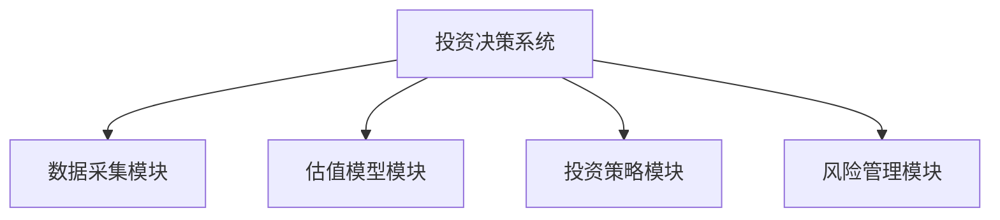
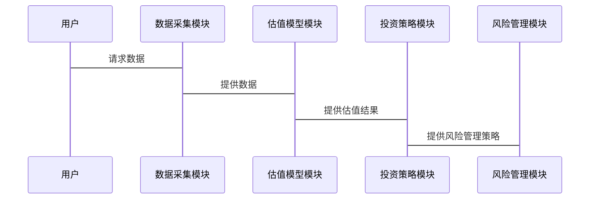

                 


# 马里奥·加贝利的全球宏观价值投资

> 关键词：全球宏观，价值投资，马里奥·加贝利，投资策略，投资系统，投资案例

> 摘要：本文深入探讨了马里奥·加贝利的全球宏观价值投资理念、策略及其在实际投资中的应用。文章从全球宏观环境出发，分析了价值投资的核心概念、算法原理、系统架构，并通过具体案例展示了如何在全球宏观视角下进行价值投资。

---

# 第1章: 全球宏观价值投资的背景与概述

## 1.1 全球宏观环境与价值投资

### 1.1.1 全球宏观经济环境的演变
- 全球化与逆全球化趋势
- 经济周期的波动
- 主要经济体的经济政策

### 1.1.2 价值投资的定义
- 价值投资的核心理念
- 价值投资的三个关键要素：安全边际、内在价值、市场先生
- 价值投资与成长投资的区别

### 1.1.3 马里奥·加贝利的全球宏观视角
- 加贝利的投资哲学
- 全球宏观视角下的资产配置
- 长期投资与逆向思维

## 1.2 价值投资的定义与特点

### 1.2.1 价值投资的定义
- 内在价值：股票的真实价值
- 市场价格：波动性与非理性

### 1.2.2 价值投资的核心特点
- 长期导向
- 逆向思维
- 安全边际

### 1.2.3 价值投资与其它投资策略的对比
- 成长投资：高风险，高回报
- 技术分析：短期波动，情绪驱动
- 价值投资：基本面驱动，长期稳健

## 1.3 马里奥·加贝利的投资理念

### 1.3.1 加贝利的价值投资体系
- 选股标准：低市盈率、低市净率、高股息率
- 投资策略：买入低估资产，长期持有

### 1.3.2 加贝利的投资策略
- 逆向投资：在市场恐慌时买入
- 价值发现：寻找市场忽略的低估资产

### 1.3.3 加贝利的全球宏观视野
- 全球经济周期分析
- 主要经济体的经济政策
- 货币政策与财政政策对资产价格的影响

## 1.4 本章小结
- 价值投资的核心理念是寻找市场价格低于内在价值的资产
- 马里奥·加贝利的全球宏观视角为投资者提供了独特的资产配置思路
- 价值投资需要耐心、纪律和对市场的深刻理解

---

# 第2章: 价值投资的核心概念与原理

## 2.1 价值投资的核心概念

### 2.1.1 股票的内在价值
- 内在价值的定义：股票的真实价值
- 内在价值的计算方法：现金流折现模型（DCF）
- 内在价值的影响因素：盈利能力、成长性、竞争优势

### 2.1.2 市场价值与内在价值的关系
- 市场价格的波动性
- 市场价格与内在价值的背离
- 安全边际的计算

### 2.1.3 安全边际的概念
- 安全边际的重要性
- 安全边际的计算方法
- 安全边际与风险控制

## 2.2 价值投资的分析框架

### 2.2.1 财务报表分析
- 资产负债表：评估公司的财务健康状况
- 利润表：分析公司的盈利能力
- 现金流量表：评估公司的现金流状况

### 2.2.2 行业分析与竞争优势
- 行业生命周期分析
- 行业竞争结构分析
- 公司的竞争优势：成本优势、品牌优势、技术优势

### 2.2.3 宏观经济环境对投资的影响
- 经济周期与资产价格的关系
- 货币政策与财政政策对资产价格的影响
- 全球宏观经济环境对投资组合的影响

## 2.3 价值投资的决策模型

### 2.3.1 股票估值模型
- 现金流折现模型（DCF）
- 市盈率模型（P/E）
- 市净率模型（P/B）

### 2.3.2 投资组合构建模型
- 投资组合的分散化
- 投资组合的风险管理
- 投资组合的再平衡

### 2.3.3 风险管理模型
- 风险的定义与分类
- 风险的量化方法
- 风险的控制策略

## 2.4 核心概念对比表格

| 概念 | 描述 |
|------|------|
| 内在价值 | 股票的真实价值，基于公司基本面的估值 |
| 安全边际 | 市场价格与内在价值的差额，提供风险保护 |
| 财务报表分析 | 通过分析财务报表，评估公司的财务状况和盈利能力 |

## 2.5 本章小结
- 价值投资的核心概念包括内在价值、市场价值和安全边际
- 财务报表分析、行业分析和宏观经济分析是价值投资的三大支柱
- 价值投资的决策模型包括估值模型、投资组合构建模型和风险管理模型

---

# 第3章: 全球宏观环境下的价值投资策略

## 3.1 全球宏观经济分析

### 3.1.1 经济周期的分析
- 经济周期的定义与阶段
- 经济周期对资产价格的影响
- 不同经济周期下的投资策略

### 3.1.2 主要经济体的经济政策
- 美国：美联储的货币政策
- 欧洲：欧洲央行的货币政策
- 中国：中国人民银行的货币政策
- 经济政策对全球资产配置的影响

### 3.1.3 全球化与逆全球化的趋势
- 全球化的定义与影响
- 逆全球化的定义与影响
- 全球化与逆全球化对投资策略的影响

## 3.2 行业分析与投资机会

### 3.2.1 行业生命周期分析
- 行业生命周期的定义与阶段
- 不同行业生命周期下的投资策略
- 行业生命周期与全球宏观环境的关系

### 3.2.2 行业竞争结构分析
- 行业竞争结构的定义与分类
- 不同行业竞争结构下的投资策略
- 行业竞争结构与全球宏观环境的关系

### 3.2.3 行业投资机会评估
- 行业投资机会的定义与评估方法
- 不同行业投资机会的全球宏观视角分析
- 行业投资机会与经济周期的关系

## 3.3 投资策略与资产配置

### 3.3.1 股票筛选与投资组合构建
- 股票筛选标准：低市盈率、低市净率、高股息率
- 投资组合构建方法：分散化、风险控制、再平衡
- 投资组合的全球宏观视角分析

### 3.3.2 投资策略的全球宏观视角
- 全球宏观视角下的资产配置
- 不同经济周期下的投资策略
- 全球宏观经济环境对投资策略的影响

## 3.4 本章小结
- 全球宏观经济环境是价值投资的重要背景
- 行业分析与投资机会评估是价值投资的重要环节
- 全球宏观视角下的资产配置是价值投资的重要策略

---

# 第4章: 马里奥·加贝利的投资策略与案例分析

## 4.1 加贝利的投资策略

### 4.1.1 长期投资策略
- 长期投资的定义与特点
- 长期投资的核心理念
- 长期投资与价值投资的关系

### 4.1.2 逆向投资策略
- 逆向投资的定义与特点
- 逆向投资的核心理念
- 逆向投资与市场情绪的关系

### 4.1.3 价值发现策略
- 价值发现的定义与特点
- 价值发现的核心理念
- 价值发现与基本面分析的关系

## 4.2 投资案例分析

### 4.2.1 经典投资案例
- 案例一：某公司的低市盈率投资
- 案例二：某公司的高股息率投资
- 案例三：某公司的逆向投资

### 4.2.2 投资决策过程
- 案例分析的步骤与方法
- 案例分析的启示与总结
- 案例分析的全球宏观视角

## 4.3 本章小结
- 马里奥·加贝利的投资策略以长期投资、逆向投资和价值发现为核心
- 投资案例分析展示了这些策略在实际中的应用
- 全球宏观视角是加贝利投资策略的重要组成部分

---

# 第5章: 全球宏观价值投资的系统分析与架构设计

## 5.1 系统分析

### 5.1.1 投资决策系统的功能
- 数据采集与处理
- 估值模型的构建与应用
- 投资策略的制定与优化
- 风险管理与绩效评估

### 5.1.2 系统分析的流程
- 数据采集：全球宏观经济数据、行业数据、公司数据
- 数据处理：清洗、转换、分析
- 系统设计：功能模块划分、系统架构设计
- 系统实现：算法实现、接口设计、系统测试

## 5.2 系统架构设计

### 5.2.1 系统功能模块
- 数据采集模块：实时采集全球宏观经济数据、行业数据、公司数据
- 估值模型模块：构建现金流折现模型、市盈率模型、市净率模型
- 投资策略模块：制定投资策略，优化投资组合
- 风险管理模块：评估风险，制定风险管理策略

### 5.2.2 系统架构图


### 5.2.3 系统接口设计
- 数据接口：API接口设计
- 算法接口：估值模型接口、投资策略接口
- 管理接口：用户界面设计

### 5.2.4 系统交互序列图


## 5.3 本章小结
- 投资决策系统的功能模块包括数据采集、估值模型、投资策略和风险管理
- 系统架构设计是实现价值投资策略的重要基础
- 系统接口设计和交互流程是系统实现的关键环节

---

# 第6章: 项目实战

## 6.1 环境安装与配置

### 6.1.1 系统环境
- 操作系统：Windows/Mac/Linux
- 开发工具：Python、Jupyter Notebook、IDE
- 数据源：全球宏观经济数据、行业数据、公司数据

### 6.1.2 依赖库安装
- Python库：pandas、numpy、scipy、matplotlib
- 数据接口库：requests、pandas_datareader
- 其他工具：jupyter notebook

## 6.2 核心实现与代码解读

### 6.2.1 数据采集与处理
```python
import pandas_datareader as pdr
import pandas as pd
import numpy as np

# 数据采集
df = pdr.get_data_yahoo('AAPL', start='2020-01-01', end='2023-12-31')
df.head()
```

### 6.2.2 估值模型实现
```python
def dcf_valuation(cash_flows, discount_rate):
    return np.irr(cash_flows) - discount_rate
```

### 6.2.3 投资策略实现
```python
def value_investing_strategy(prices, intrinsic_values):
    return prices[intrinsic_values < prices]
```

### 6.2.4 风险管理实现
```python
def risk_management(portfolio, risk_limit):
    portfolio_value = portfolio.sum()
    if portfolio_value > risk_limit:
        return portfolio / (portfolio_value / risk_limit)
    else:
        return portfolio
```

## 6.3 案例分析与解读

### 6.3.1 案例分析
- 案例一：某公司股票的估值与投资决策
- 案例二：某行业的投资机会分析
- 案例三：全球宏观经济环境下的资产配置

### 6.3.2 代码实现与解读
- 数据采集与处理：展示如何获取数据并进行初步处理
- 估值模型实现：展示如何使用DCF模型进行估值
- 投资策略实现：展示如何基于估值结果制定投资策略
- 风险管理实现：展示如何基于投资组合进行风险管理

## 6.4 本章小结
- 项目实战展示了如何将理论应用于实际投资中
- 代码实现是理论与实践结合的重要工具
- 案例分析是验证投资策略的有效性的重要方法

---

# 第7章: 总结与最佳实践

## 7.1 总结

### 7.1.1 全球宏观视角下的价值投资
- 全球宏观经济环境是价值投资的重要背景
- 行业分析与投资机会评估是价值投资的重要环节
- 全球宏观视角下的资产配置是价值投资的重要策略

### 7.1.2 价值投资的核心理念
- 寻找市场价格低于内在价值的资产
- 保持长期投资，逆向投资
- 重视安全边际，控制风险

### 7.1.3 马里奥·加贝利的投资策略
- 长期投资、逆向投资、价值发现
- 全球宏观视角下的资产配置
- 低市盈率、低市净率、高股息率的投资策略

## 7.2 最佳实践

### 7.2.1 投资理念
- 长期投资：避免短期波动，关注长期价值
- 逆向投资：在市场恐慌时寻找机会
- 价值发现：深入分析公司基本面

### 7.2.2 投资策略
- 股票筛选：基于财务指标和估值模型
- 投资组合：分散化、风险控制、再平衡
- 资产配置：基于全球宏观环境

### 7.2.3 系统分析与架构设计
- 数据采集与处理：实时获取全球宏观经济数据
- 估值模型：基于DCF模型、市盈率模型、市净率模型
- 投资策略：制定长期投资、逆向投资、价值发现策略
- 风险管理：评估风险，制定风险管理策略

## 7.3 小结

### 7.3.1 价值投资的核心理念
- 内在价值、市场价值、安全边际
- 财务报表分析、行业分析、宏观经济分析
- 估值模型、投资组合构建模型、风险管理模型

### 7.3.2 马里奥·加贝利的投资策略
- 长期投资、逆向投资、价值发现
- 全球宏观视角下的资产配置
- 低市盈率、低市净率、高股息率的投资策略

### 7.3.3 全球宏观视角下的价值投资
- 全球宏观经济环境是价值投资的重要背景
- 行业分析与投资机会评估是价值投资的重要环节
- 全球宏观视角下的资产配置是价值投资的重要策略

---

# 作者：AI天才研究院/AI Genius Institute & 禅与计算机程序设计艺术/Zen And The Art of Computer Programming

---

# 总结

本文从全球宏观视角出发，深入探讨了马里奥·加贝利的价值投资理念、策略及其在实际投资中的应用。通过系统分析和项目实战，展示了如何将理论应用于实际投资中，并通过代码实现和案例分析验证了投资策略的有效性。

