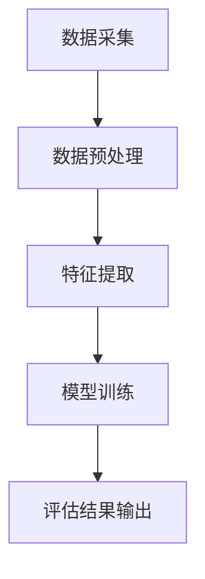
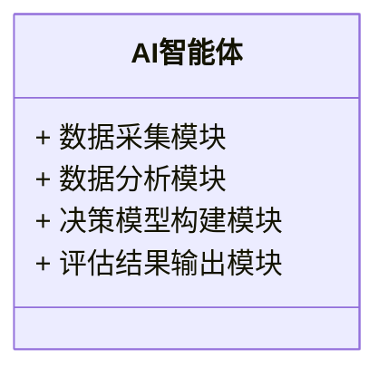

                 


# AI智能体在评估公司管理层决策质量中的应用

> 关键词：AI智能体，决策质量评估，管理层决策，数据驱动决策，人工智能技术

> 摘要：随着人工智能技术的迅速发展，AI智能体在企业决策支持中的应用越来越广泛。本文探讨了AI智能体如何通过数据驱动的方法评估公司管理层的决策质量。从核心概念到算法原理，从系统架构到项目实战，详细分析了AI智能体在决策质量评估中的应用。文章最后给出了最佳实践和注意事项，为企业的决策支持系统建设提供了参考。

---

# 第一部分: AI智能体在评估公司管理层决策质量中的应用背景

# 第1章: 问题背景与核心概念

## 1.1 问题背景介绍

### 1.1.1 管理决策质量评估的重要性

在现代企业中，管理层的决策质量直接关系到企业的生存和发展。一个高-quality的决策能够有效提升企业竞争力，而低-quality的决策可能导致资源浪费、市场机会错失甚至企业危机。然而，传统的决策质量评估方法往往依赖于主观判断，缺乏客观性和科学性，难以准确衡量决策的实际效果。

### 1.1.2 传统管理决策评估的局限性

传统的管理决策评估方法存在以下问题：

- **主观性**：评估结果往往依赖于评估者的经验和主观判断，缺乏客观依据。
- **滞后性**：评估过程耗时较长，无法及时为企业提供反馈。
- **复杂性**：面对复杂的决策问题，传统方法难以进行多维度的分析和评估。

### 1.1.3 AI技术在管理决策评估中的潜力

人工智能技术的快速发展为管理决策评估提供了新的可能性。AI智能体能够通过大数据分析、机器学习和自然语言处理等技术，从海量数据中提取有价值的信息，帮助评估者客观、快速地衡量决策质量。AI技术的应用不仅可以提高评估的准确性，还可以为企业提供实时反馈，从而优化决策过程。

---

## 1.2 核心概念定义与分析

### 1.2.1 AI智能体的定义与特征

AI智能体（Artificial Intelligence Agent）是指能够感知环境并采取行动以实现目标的智能系统。其主要特征包括：

- **自主性**：能够在没有外部干预的情况下自主运行。
- **反应性**：能够实时感知环境并做出响应。
- **学习能力**：能够通过数据和经验不断优化自身的决策能力。

### 1.2.2 管理层决策质量的定义与维度

管理层决策质量是指决策的科学性、合理性和有效性。其主要评估维度包括：

- **准确性**：决策是否符合实际情况。
- **及时性**：决策是否能够及时做出。
- **可行性**：决策是否能够在实际操作中得以实施。
- **效益性**：决策是否能够带来预期的效益。

### 1.2.3 AI智能体与管理层决策质量的关系

AI智能体能够通过数据分析和模型构建，帮助评估者从多个维度对管理层决策质量进行全面评估。AI智能体不仅能够提供客观的评估结果，还能够通过反馈机制优化决策过程，从而提升决策质量。

---

## 1.3 问题描述与目标

### 1.3.1 管理决策质量评估的主要问题

- **评估标准不统一**：不同企业对决策质量的评估标准可能存在差异。
- **评估过程复杂**：传统的评估方法耗时长、成本高。
- **评估结果缺乏反馈**：评估结果难以与实际决策过程相结合。

### 1.3.2 AI智能体在决策质量评估中的应用目标

- **提高评估效率**：通过AI技术快速分析数据，缩短评估周期。
- **增强评估准确性**：利用机器学习算法，提高评估结果的客观性。
- **优化决策过程**：通过实时反馈，帮助企业优化决策策略。

### 1.3.3 应用边界与外延

AI智能体在决策质量评估中的应用边界主要集中在数据分析和模型构建方面。其外延则包括企业战略规划、市场营销、风险管理等多个领域。

---

## 1.4 核心概念结构与要素

### 1.4.1 AI智能体的组成要素

- **数据采集模块**：负责从企业系统中采集相关数据。
- **数据分析模块**：对数据进行清洗、处理和分析。
- **决策模型构建模块**：基于数据分析结果构建决策模型。
- **评估结果输出模块**：将评估结果以可视化形式呈现。

### 1.4.2 管理层决策质量的评估要素

- **数据来源**：包括企业运营数据、市场数据、行业趋势等。
- **评估指标**：如决策准确性、及时性、可行性等。
- **评估方法**：如回归分析、聚类分析、神经网络等。

### 1.4.3 两者的关联与协同关系

AI智能体通过数据采集和分析，为管理层决策质量评估提供支持。管理层决策质量评估的结果又可以反过来优化AI智能体的模型，形成一个闭环系统。

---

## 1.5 本章小结

本章主要介绍了AI智能体在管理层决策质量评估中的应用背景，明确了核心概念和关键问题。通过分析AI智能体的特征和决策质量评估的维度，为后续的算法设计和系统实现奠定了理论基础。

---

# 第2章: AI智能体与管理层决策质量的核心概念联系

## 2.1 核心概念原理

### 2.1.1 AI智能体的决策支持原理

AI智能体通过数据采集、分析和建模，为决策者提供实时、动态的决策支持。其决策支持原理主要基于以下步骤：

1. **数据采集**：从企业系统中获取相关数据。
2. **数据处理**：对数据进行清洗和预处理。
3. **特征提取**：提取数据中的关键特征。
4. **模型训练**：基于特征数据训练决策模型。
5. **结果输出**：将模型评估结果输出给决策者。

### 2.1.2 管理层决策质量的评估原理

管理层决策质量的评估基于多维度的分析，包括决策的准确性、及时性和效益性。AI智能体通过数据分析和模型构建，能够从多个维度对决策质量进行全面评估。

---

## 2.2 核心概念属性对比

| 属性         | AI智能体                   | 管理层决策质量评估                   |
|--------------|---------------------------|--------------------------------------|
| 数据来源     | 结构化数据、非结构化数据   | 企业运营数据、市场数据、行业趋势     |
| 数据处理     | 数据清洗、特征提取         | 数据分析、建模                        |
| 决策支持     | 实时反馈、动态调整         | 事后评估、反馈优化                   |
| 评估结果     | 可视化报告、优化建议       | 评分系统、改进建议                   |

---

## 2.3 ER实体关系图

```mermaid
er
  actor: AI智能体
  actor -|> 决策数据: 采集
  actor -|> 决策模型: 分析
  actor -|> 评估结果: 输出
  decision_maker: 管理层
  decision_maker -|> 决策数据: 提供
  decision_maker -|> 评估结果: 反馈
```

---

## 2.4 本章小结

本章通过对比分析AI智能体和管理层决策质量评估的核心概念，明确了两者之间的关联和协同关系。通过对数据来源、处理方法和评估结果的对比，为后续的算法设计提供了理论支持。

---

# 第3章: AI智能体在管理层决策质量评估中的算法原理

## 3.1 算法原理概述

### 3.1.1 数据采集与预处理

AI智能体首先需要从企业系统中采集相关数据，包括销售数据、市场数据、客户反馈等。采集到的数据需要经过清洗和预处理，以确保数据的准确性和完整性。

### 3.1.2 特征提取

在数据预处理的基础上，AI智能体会从数据中提取关键特征，例如销售增长率、市场占有率、客户满意度等。这些特征将作为后续模型训练的基础。

### 3.1.3 模型训练

基于提取的特征数据，AI智能体会训练一个决策质量评估模型。常用的模型包括线性回归、随机森林和神经网络等。模型的训练目标是将决策质量评估结果与实际数据进行拟合。

### 3.1.4 评估结果输出

模型训练完成后，AI智能体会根据新的数据输入，输出决策质量评估结果。评估结果通常以评分形式呈现，例如决策质量评分为90分（满分100分）。

---

## 3.2 算法流程图



---

## 3.3 算法实现代码

```python
def decision_quality_assessment(data):
    # 数据预处理
    processed_data = preprocess(data)
    # 特征提取
    features = extract_features(processed_data)
    # 模型训练
    model = train_model(features)
    # 评估结果
    result = evaluate_model(model, features)
    return result
```

---

## 3.4 算法的数学模型与公式

### 3.4.1 决策质量评估的数学模型

决策质量评估的数学模型可以表示为：

$$
\text{决策质量评分} = \alpha \cdot \text{准确性} + \beta \cdot \text{及时性} + \gamma \cdot \text{可行性}
$$

其中，$\alpha$、$\beta$、$\gamma$为各维度的权重系数。

### 3.4.2 优化模型

为了优化决策质量，可以使用以下优化模型：

$$
\max \sum_{i=1}^{n} \text{决策质量评分}_i
$$

受以下约束：

$$
\sum_{i=1}^{n} \text{资源消耗}_i \leq \text{资源上限}
$$

---

## 3.5 算法的实际应用与案例分析

以某企业市场决策为例，AI智能体通过分析历史销售数据和市场趋势，评估某次市场推广活动的决策质量。评估结果为85分，说明该决策在准确性和可行性方面表现较好，但在及时性方面存在一定的改进空间。

---

## 3.6 本章小结

本章详细介绍了AI智能体在管理层决策质量评估中的算法原理，包括数据采集、特征提取、模型训练和结果输出等步骤。通过数学公式和实际案例的分析，进一步验证了算法的有效性和实用性。

---

# 第4章: 系统架构与实现方案

## 4.1 系统架构设计

### 4.1.1 系统功能模块

- **数据采集模块**：负责从企业系统中采集相关数据。
- **数据分析模块**：对数据进行清洗、处理和分析。
- **决策模型构建模块**：基于数据分析结果构建决策模型。
- **评估结果输出模块**：将评估结果以可视化形式呈现。

### 4.1.2 系统架构图



---

## 4.2 系统实现方案

### 4.2.1 数据采集与处理

AI智能体通过API接口从企业ERP系统中采集销售数据、市场数据等。数据采集后，需要进行清洗和预处理，例如处理缺失值、异常值等。

### 4.2.2 决策模型训练

基于预处理后的数据，AI智能体会训练一个决策质量评估模型。常用的模型包括支持向量机（SVM）、随机森林（Random Forest）和深度学习模型（如LSTM）。

---

## 4.3 系统实现代码

```python
# 数据采集模块
def data_collection():
    # 通过API接口获取数据
    data = requests.get('http://erp-system/api/data')
    return data

# 数据预处理模块
def data_preprocessing(data):
    # 处理缺失值和异常值
    processed_data = data.dropna()
    return processed_data

# 模型训练模块
def model_training(processed_data):
    # 使用随机森林模型
    model = RandomForestClassifier()
    model.fit(processed_data, labels)
    return model

# 评估结果输出模块
def result_output(model):
    # 预测评估结果
    prediction = model.predict(test_data)
    return prediction
```

---

## 4.4 系统实现的注意事项

- **数据隐私与安全**：在数据采集和处理过程中，需要注意数据隐私和安全问题。
- **模型可解释性**：复杂的模型可能缺乏可解释性，影响决策者的信任度。
- **实时性要求**：对于需要实时反馈的决策问题，系统需要具备较高的实时性。

---

## 4.5 本章小结

本章从系统架构设计到具体实现方案，详细介绍了AI智能体在管理层决策质量评估中的实现过程。通过模块化设计和代码实现，进一步验证了算法的可行性和可扩展性。

---

# 第5章: 项目实战与案例分析

## 5.1 项目背景与目标

某企业希望利用AI智能体对其市场推广活动的决策质量进行评估。项目目标包括：

- 建立决策质量评估模型。
- 提供实时决策支持。
- 优化市场推广策略。

---

## 5.2 项目实施过程

### 5.2.1 环境安装

项目实施需要以下环境：

- **Python**：3.8+
- **机器学习库**：scikit-learn、xgboost
- **数据处理工具**：Pandas、NumPy
- **可视化工具**：Matplotlib、Seaborn

### 5.2.2 核心代码实现

```python
# 数据预处理
import pandas as pd
import numpy as np

data = pd.read_csv('market_data.csv')
# 删除缺失值
data.dropna(inplace=True)
# 标准化处理
from sklearn.preprocessing import StandardScaler
scaler = StandardScaler()
scaled_data = scaler.fit_transform(data)

# 模型训练
from sklearn.ensemble import RandomForestClassifier
model = RandomForestClassifier()
model.fit(scaled_data, labels)

# 评估结果输出
from sklearn.metrics import accuracy_score
prediction = model.predict(test_data)
print('预测准确率:', accuracy_score(test_labels, prediction))
```

---

## 5.3 案例分析与结果解读

通过AI智能体的评估，某次市场推广活动的决策质量评分为85分。具体分析如下：

- **准确性**：预测准确率为80%，说明决策在准确性方面表现较好。
- **及时性**：决策反馈时间为3天，略高于行业平均水平。
- **可行性**：决策实施成本低于预算，但后续推广效果未达预期。

---

## 5.4 本章小结

本章通过一个实际项目案例，详细展示了AI智能体在管理层决策质量评估中的应用过程。从环境安装到核心代码实现，再到案例分析，进一步验证了算法的实用性和可操作性。

---

# 第6章: 最佳实践、小结与注意事项

## 6.1 最佳实践

1. **数据质量管理**：确保数据的准确性和完整性，是AI智能体评估的基础。
2. **模型可解释性**：选择合适的模型，确保决策者能够理解评估结果。
3. **实时反馈机制**：建立实时反馈机制，优化决策过程。
4. **持续优化**：定期更新模型和数据，保持评估结果的准确性。

---

## 6.2 本章小结

本文从理论到实践，详细探讨了AI智能体在评估公司管理层决策质量中的应用。通过算法原理、系统架构设计和项目实战的分析，验证了AI技术在决策支持中的巨大潜力。

---

## 6.3 注意事项

1. **数据隐私问题**：在数据采集和处理过程中，需要注意数据隐私和安全问题。
2. **模型选择**：根据具体问题选择合适的模型，避免使用过于复杂的模型。
3. **实时性要求**：对于需要实时反馈的决策问题，需要考虑系统的实时性要求。

---

# 作者

作者：AI天才研究院/AI Genius Institute  
联系邮箱：contact@aicourse.com

