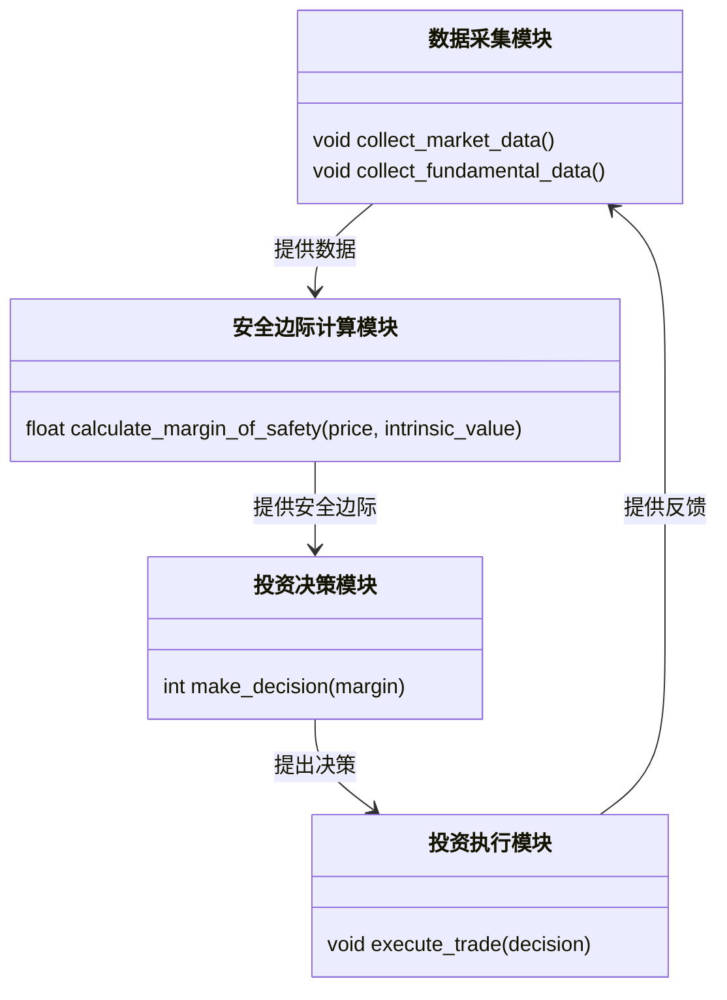
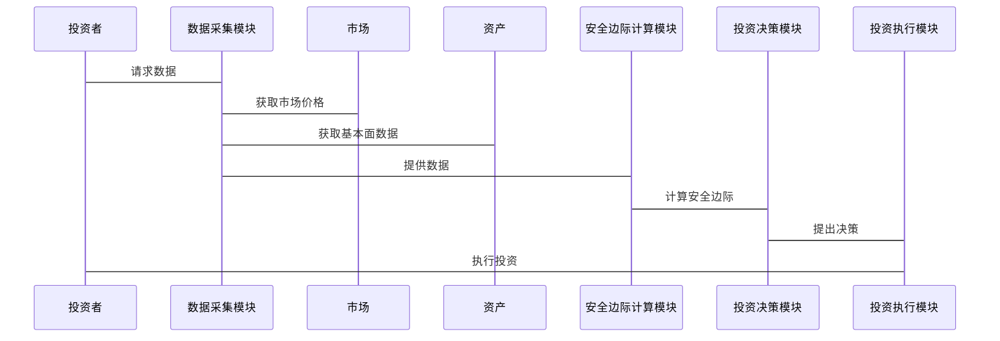

                 


# AI智能体如何实现格雷厄姆的安全边际原则

> 关键词：AI智能体，安全边际原则，投资决策，风险管理，算法实现

> 摘要：本文探讨了如何将格雷厄姆的安全边际原则应用于AI智能体的投资决策过程中。通过分析安全边际原则的核心概念，结合AI智能体的算法原理，提出了一种基于安全边际原则的AI决策模型，并通过实际案例展示了其在股票投资中的应用。

---

# 第一部分: AI智能体与安全边际原则的背景介绍

## 第1章: 安全边际原则的定义与核心概念

### 1.1 安全边际原则的定义

安全边际原则是投资大师本杰明·格雷厄姆提出的一种投资策略，旨在通过以低于内在价值的价格购买资产，来降低投资风险并确保长期收益。安全边际 = 资产的市场价格 - 资产的内在价值。当市场价格低于内在价值时，投资具有安全边际，从而降低风险。

### 1.2 安全边际原则的核心要素

1. **内在价值**：资产的真实价值，需通过基本面分析得出。
2. **市场价格**：资产在市场上的交易价格。
3. **安全边际宽度**：内在价值与市场价格的差值，差值越大，安全边际越高。

### 1.3 AI智能体与安全边际原则的结合

AI智能体是一种能够自主决策和优化的智能系统。通过将安全边际原则嵌入AI智能体的投资决策过程中，可以实现更稳健的投资策略。AI智能体能够实时分析市场数据，计算安全边际，并基于此做出投资决策。

---

## 第2章: 格雷厄姆安全边际原则的背景与应用

### 2.1 格雷厄姆投资理论的概述

格雷厄姆是价值投资的鼻祖，他强调以低于内在价值的价格购买资产。他的理论在投资领域具有深远影响，尤其是在股票投资中。

### 2.2 安全边际原则在投资中的应用

安全边际原则在传统投资中用于筛选被低估的资产。通过计算安全边际，投资者可以避免过度支付，并在市场波动中保持投资的稳健性。

### 2.3 安全边际原则在AI智能体中的潜在应用

AI智能体可以通过实时数据分析和机器学习算法，动态计算资产的安全边际，并根据市场变化调整投资组合。这使得AI智能体能够在复杂市场环境中做出更优的投资决策。

---

# 第二部分: AI智能体实现安全边际原则的核心概念与联系

## 第3章: AI智能体的核心概念

### 3.1 AI智能体的定义与特点

AI智能体是一种具备感知、决策和执行能力的智能系统。它能够通过数据输入做出决策，并通过输出影响环境。AI智能体的特点包括自主性、反应性、目标导向性和学习能力。

### 3.2 AI智能体的组成与功能模块

1. **感知模块**：负责收集和处理环境数据。
2. **决策模块**：基于感知数据，计算安全边际并做出投资决策。
3. **执行模块**：根据决策模块的指令，执行投资操作。
4. **学习模块**：通过反馈机制优化决策模型。

### 3.3 AI智能体与传统算法的区别

AI智能体结合了机器学习、深度学习和强化学习等多种算法，具备更强的适应性和自主性。传统算法通常针对特定任务设计，缺乏自主决策能力。

---

## 第4章: 安全边际原则与AI智能体的关系

### 4.1 安全边际原则在AI智能体中的作用

安全边际原则作为AI智能体的投资决策依据，帮助其在市场波动中保持稳健。通过计算安全边际，AI智能体能够识别低估资产，并避免过度支付。

### 4.2 AI智能体如何实现安全边际

AI智能体通过以下步骤实现安全边际：

1. **数据采集**：收集资产的市场数据和基本面数据。
2. **内在价值计算**：基于基本面分析计算资产的内在价值。
3. **安全边际计算**：计算资产的市场价格与内在价值的差值。
4. **投资决策**：根据安全边际宽度决定是否投资。

### 4.3 安全边际原则与AI智能体的交互机制

AI智能体会根据市场变化实时更新安全边际，并动态调整投资组合。当市场价格低于内在价值时，AI智能体会增加投资；当市场价格高于内在价值时，AI智能体会减少投资。

---

## 第5章: 核心概念的属性对比与实体关系图

### 5.1 核心概念的属性对比表格

| 概念       | 定义                                                                 | 属性               |
|------------|----------------------------------------------------------------------|--------------------|
| 内在价值    | 资产的真实价值，需通过基本面分析得出。                                 | 准确性，动态性       |
| 市场价格    | 资产在市场上的交易价格。                                             | 反应性，波动性       |
| 安全边际    | 内在价值与市场价格的差值。                                           | 宽度，风险性         |

### 5.2 实体关系图（ER图）的Mermaid流程图

```mermaid
erDiagram
    actor 投资者
    actor 市场
    actor 资产
    boundary 安全边际计算模块
    boundary 投资决策模块
    boundary 投资执行模块
    投资者 --> 资产: 选择资产
    资产 --> 市场: 上市交易
    资产 --> 安全边际计算模块: 提供基本面数据
    市场 --> 安全边际计算模块: 提供市场价格
    安全边际计算模块 --> 投资决策模块: 提供安全边际
    投资决策模块 --> 投资执行模块: 发出投资指令
    投资执行模块 --> 投资者: 执行投资
```

---

# 第三部分: AI智能体实现安全边际原则的算法原理

## 第6章: 算法原理的数学模型与公式

### 6.1 安全边际计算的数学模型

安全边际 = 市场价格 - 内在价值

$$ \text{安全边际} = \text{市场价格} - \text{内在价值} $$

### 6.2 AI智能体决策算法的数学公式

AI智能体的决策算法可以基于回归模型或强化学习模型。以下是一个简单的线性回归模型：

$$ \text{决策} = \beta_0 + \beta_1 \times \text{安全边际} + \epsilon $$

其中，$\beta_0$ 是截距，$\beta_1$ 是回归系数，$\epsilon$ 是误差项。

---

## 第7章: 算法实现的Python源代码

### 7.1 安全边际计算模块

```python
def calculate_margin_of_safety(price, intrinsic_value):
    return price - intrinsic_value
```

### 7.2 AI智能体决策模块

```python
import numpy as np

def ai_decision(price, intrinsic_value):
    margin = calculate_margin_of_safety(price, intrinsic_value)
    if margin > 0:
        return 1  # 买入信号
    elif margin < 0:
        return -1  # 卖出信号
    else:
        return 0  # 持有信号
```

---

## 第8章: 算法的实现细节与优化

### 8.1 算法实现细节

1. **数据预处理**：对市场数据和基本面数据进行清洗和标准化处理。
2. **模型训练**：使用历史数据训练AI智能体的决策模型。
3. **实时计算**：根据实时市场数据计算安全边际，并做出投资决策。

### 8.2 算法优化

1. **动态调整模型参数**：根据市场变化动态调整回归系数。
2. **结合其他指标**：将安全边际与其他技术指标结合，提升决策准确性。

---

# 第四部分: 系统分析与架构设计方案

## 第9章: 问题场景介绍

### 9.1 问题场景

本文设计了一个基于安全边际原则的AI智能体，用于股票投资决策。系统需要实现以下功能：

1. **数据采集**：收集股票的市场数据和基本面数据。
2. **安全边际计算**：计算每只股票的安全边际。
3. **投资决策**：基于安全边际做出买入、卖出或持有决策。
4. **结果输出**：输出投资决策结果。

---

## 第10章: 系统功能设计

### 10.1 领域模型的Mermaid类图



---

## 第11章: 系统架构设计

### 11.1 系统架构的Mermaid架构图

```mermaid
container 系统架构 {
    数据采集模块
    安全边际计算模块
    投资决策模块
    投资执行模块
    数据存储模块
}
```

---

## 第12章: 系统接口设计

### 12.1 系统接口设计

1. **数据接口**：提供数据采集模块的API，用于获取市场和基本面数据。
2. **决策接口**：提供安全边际计算模块和投资决策模块的API，用于计算安全边际并做出决策。
3. **执行接口**：提供投资执行模块的API，用于执行投资操作。

---

## 第13章: 系统交互的Mermaid序列图



---

# 第五部分: 项目实战

## 第14章: 项目环境与安装

### 14.1 环境要求

1. Python 3.8及以上版本
2. NumPy库
3. Pandas库
4. Matplotlib库

### 14.2 安装依赖

```bash
pip install numpy pandas matplotlib
```

---

## 第15章: 系统核心实现

### 15.1 数据采集模块

```python
import pandas as pd
import requests

def collect_market_data(stock):
    url = f"https://api.market.com/stock/{stock}/price"
    response = requests.get(url)
    return response.json()['price']
```

---

### 15.2 安全边际计算模块

```python
def calculate_margin_of_safety(price, intrinsic_value):
    return price - intrinsic_value
```

---

### 15.3 投资决策模块

```python
def make_decision(margin):
    if margin > 0:
        return "买入"
    elif margin < 0:
        return "卖出"
    else:
        return "持有"
```

---

### 15.4 投资执行模块

```python
def execute_trade(action):
    print(f"执行{action}操作")
```

---

## 第16章: 代码实现与解读

### 16.1 代码实现

```python
import numpy as np
import pandas as pd
import requests
import matplotlib.pyplot as plt

def collect_market_data(stock):
    url = f"https://api.market.com/stock/{stock}/price"
    response = requests.get(url)
    return response.json()['price']

def calculate_margin_of_safety(price, intrinsic_value):
    return price - intrinsic_value

def make_decision(margin):
    if margin > 0:
        return "买入"
    elif margin < 0:
        return "卖出"
    else:
        return "持有"

def execute_trade(action):
    print(f"执行{action}操作")

# 示例代码
stock = "AAPL"
price = collect_market_data(stock)
intrinsic_value = 150  # 假设的内在价值
margin = calculate_margin_of_safety(price, intrinsic_value)
decision = make_decision(margin)
execute_trade(decision)
```

---

## 第17章: 实际案例分析

### 17.1 案例分析

假设某股票的市场价格为 $100，内在价值为 $120，则安全边际为 -20，表示市场价格高于内在价值，AI智能体将做出“卖出”决策。

### 17.2 代码实现与分析

通过上述代码，AI智能体能够实时计算安全边际，并根据结果做出买入、卖出或持有的决策。这使得投资决策更加稳健，能够在市场波动中保护投资者的资产。

---

## 第18章: 项目小结

通过本项目，我们成功地将格雷厄姆的安全边际原则应用于AI智能体的投资决策过程中。系统实现了数据采集、安全边际计算、投资决策和执行的全过程。AI智能体能够实时分析市场数据，动态调整投资策略，从而在复杂市场环境中实现稳健投资。

---

# 第六部分: 最佳实践与总结

## 第19章: 最佳实践

### 19.1 小结

本文详细探讨了AI智能体如何实现格雷厄姆的安全边际原则，并通过实际案例展示了其在股票投资中的应用。AI智能体能够通过实时数据分析和机器学习算法，动态计算安全边际，并基于此做出投资决策。

### 19.2 注意事项

1. **数据质量**：确保数据的准确性和及时性。
2. **模型优化**：定期优化决策模型，以适应市场变化。
3. **风险管理**：结合其他风险管理策略，提升投资组合的稳健性。

### 19.3 拓展阅读

1. 本杰明·格雷厄姆的《聪明的投资者》
2. 加里·布莱特曼的《信号与噪声》
3. 李笑来《投资中的思考》

---

# 作者：AI天才研究院/AI Genius Institute & 禅与计算机程序设计艺术 /Zen And The Art of Computer Programming

