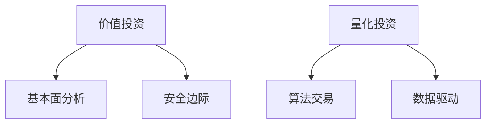
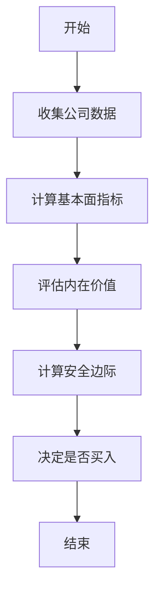
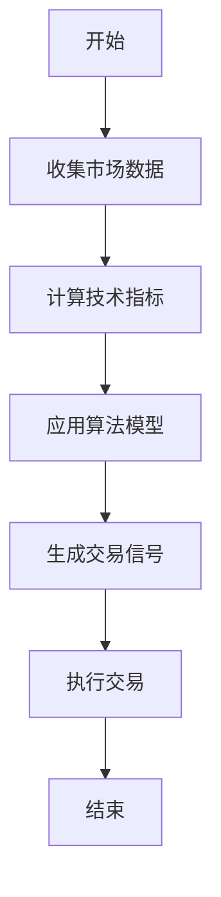
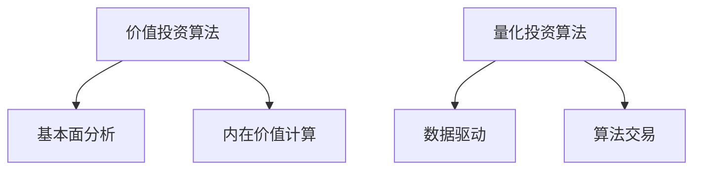
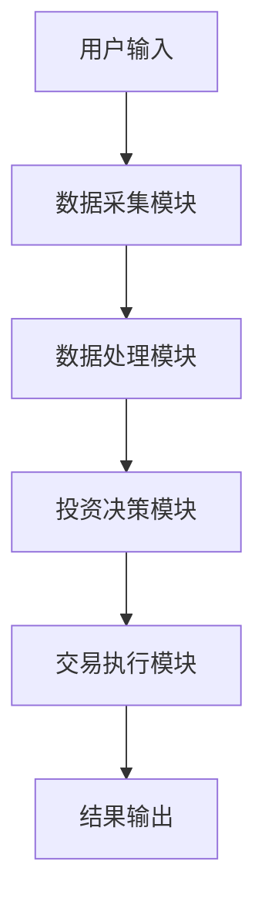

                 


```markdown
# 价值投资与量化投资的对比

> 关键词：价值投资、量化投资、算法交易、基本面分析、系统化决策

> 摘要：本文对比分析了价值投资和量化投资两种投资策略的核心概念、算法原理和系统架构，帮助投资者理解它们的异同及适用场景。通过详细解释和对比，本文为投资者提供了全面的视角，帮助他们在实际投资中做出更明智的决策。

---

## 第1章: 价值投资与量化投资概述

### 1.1 价值投资的定义与核心思想

#### 1.1.1 价值投资的基本概念
价值投资是一种长期投资策略，主要关注于寻找被市场低估的优质股票。其核心思想是购买价格低于其内在价值的股票，长期持有，等待价值回归。

#### 1.1.2 价值投资的核心理念
- **安全边际**：买入价格远低于内在价值的股票，以降低风险。
- **内在价值**：通过基本面分析确定股票的真实价值。
- **长期持有**：相信市场短期波动，但长期趋势会反映内在价值。

#### 1.1.3 价值投资的历史发展
价值投资起源于20世纪，由本杰明·格雷厄姆和戴维·多德提出，后来被沃伦·巴菲特发扬光大。

### 1.2 量化投资的定义与核心思想

#### 1.2.1 量化投资的基本概念
量化投资是通过数学模型和算法进行交易决策，依赖数据和统计分析，追求短期收益最大化。

#### 1.2.2 量化投资的核心理念
- **数据驱动**：依赖历史数据和市场信号进行交易决策。
- **算法交易**：使用复杂算法自动执行交易。
- **系统化决策**：通过系统化模型减少人为情绪干扰。

#### 1.2.3 量化投资的历史发展
量化投资起源于20世纪60年代，随着计算机技术的发展，在2000年后迅速崛起。

### 1.3 价值投资与量化投资的对比背景

#### 1.3.1 投资市场的多样性
不同市场环境和投资者需求适合不同的投资策略。

#### 1.3.2 两种投资方法的兴起与演变
价值投资和量化投资分别在不同历史时期发展起来，各有优劣。

#### 1.3.3 价值投资与量化投资的互补性
两者在数据和模型的基础上，互补性强，可以结合使用。

### 1.4 本书的核心内容与目标

#### 1.4.1 本书的研究范围
分析价值投资与量化投资的核心概念、算法和系统架构。

#### 1.4.2 本书的主要目标
帮助读者理解两种投资策略的异同，指导实际投资。

#### 1.4.3 本书的结构安排
从背景、核心概念对比、算法原理、系统设计到项目实战，全面分析两种策略。

---

## 第2章: 价值投资与量化投资的核心概念对比

### 2.1 价值投资的核心概念

#### 2.1.1 价值投资的三要素
- **安全边际**：买入价低于内在价值。
- **内在价值**：基本面分析确定的股票真实价值。
- **市场价格**：当前市场价，可能低于内在价值。

#### 2.1.2 价值投资的选股标准
- 盈利能力：ROE、净利润率。
- 财务健康：低负债率、稳定的现金流。
- 管理团队：经验丰富、诚信可靠。

#### 2.1.3 价值投资的风险控制策略
分散投资、长期持有、定期复评估。

### 2.2 量化投资的核心概念

#### 2.2.1 量化投资的三要素
- **数据驱动**：依赖历史和实时数据。
- **算法交易**：使用数学模型自动交易。
- **系统化决策**：通过系统化模型减少人为干预。

#### 2.2.2 量化投资的选股模型
- 均值回归：价格偏离均值时买入或卖出。
- 动量策略：近期表现好的股票会继续表现良好。
- 风险中性：通过 hedging 减少市场风险。

#### 2.2.3 量化投资的风险控制策略
设置止损、风险中性投资、动态调整头寸。

### 2.3 价值投资与量化投资的核心概念对比

#### 2.3.1 核心概念对比表格
| 核心概念       | 价值投资               | 量化投资               |
|----------------|------------------------|------------------------|
| 投资依据       | 公司基本面、内在价值   | 数据、算法、统计模型   |
| 投资策略       | 长期持有、价值回归     | 短期交易、算法驱动     |
| 风险控制       | 安全边际、分散投资     | 风险中性、动态调整     |

#### 2.3.2 核心概念的ER实体关系图


---

## 第3章: 价值投资的算法原理

### 3.1 价值投资的核心算法

#### 3.1.1 基本面分析算法
通过分析公司的财务报表（收入、利润、现金流等）来评估其内在价值。

#### 3.1.2 市盈率计算算法
$$市盈率 = 股价 / 每股收益$$

#### 3.1.3 内在价值评估算法
使用DCF模型计算公司未来现金流的现值。

### 3.2 价值投资的算法实现

#### 3.2.1 价值投资算法的Python实现
```python
import pandas as pd

def calculate_intrinsic_value(company_data):
    # 假设 company_data 包含收入、利润等数据
    # 计算DCF模型
    return intrinsic_value

# 示例数据
data = {'收入': [100, 200, 300], '利润': [20, 40, 60]}
df = pd.DataFrame(data)
intrinsic_value = calculate_intrinsic_value(df)
print(f"内在价值为: {intrinsic_value}")
```

#### 3.2.2 价值投资算法的流程图


---

## 第4章: 量化投资的算法原理

### 4.1 量化投资的核心算法

#### 4.1.1 均值回归算法
$$均值回归策略：当价格偏离均值时，回归均值时买入或卖出$$

#### 4.1.2 动量策略算法
$$动量策略：近期价格上涨则继续买入，下跌则卖出$$

#### 4.1.3 马科维茨有效前沿算法
使用均值-方差优化模型确定最优投资组合。

### 4.2 量化投资的算法实现

#### 4.2.1 量化投资算法的Python实现
```python
import numpy as np

def calculate_efficient_frontier(returns, covariance):
    # 计算有效前沿
    n = len(returns)
    # 优化问题设定
    # （此处需要详细实现优化模型）
    return optimal_weights

# 示例数据
returns = np.array([0.1, 0.2, 0.15])
covariance = np.array([[0.01, 0.005, 0.004],
                       [0.005, 0.02, 0.006],
                       [0.004, 0.006, 0.03]])
weights = calculate_efficient_frontier(returns, covariance)
print(f"最优权重为: {weights}")
```

#### 4.2.2 量化投资算法的流程图


---

## 第5章: 价值投资与量化投资的算法对比

### 5.1 算法对比分析

#### 5.1.1 算法目标对比
- 价值投资：寻找低估股票，长期持有。
- 量化投资：通过算法寻找短期交易机会。

#### 5.1.2 算法实现对比
- 价值投资：依赖基本面分析，计算内在价值。
- 量化投资：依赖数据和算法，自动交易。

#### 5.1.3 算法优缺点对比
- 价值投资：优点是风险低、回报稳定，缺点是需要大量研究，见效慢。
- 量化投资：优点是见效快、风险可控，缺点是依赖模型，市场变化可能导致亏损。

### 5.2 算法对比表格
| 算法目标       | 价值投资算法           | 量化投资算法           |
|----------------|------------------------|------------------------|
| 长期目标       | 寻找低估股票，长期持有   | 寻找短期交易机会       |
| 依赖因素       | 公司基本面、内在价值     | 数据、算法、统计模型     |
| 交易频率       | 低                     | 高                     |
| 风险控制       | 分散投资、安全边际       | 风险中性、动态调整       |

### 5.3 算法对比的ER实体关系图


---

## 第6章: 价值投资与量化投资的系统架构设计

### 6.1 价值投资系统的架构设计

#### 6.1.1 系统功能设计
- 数据采集：收集公司基本面数据。
- 数据处理：计算市盈率、市净率等指标。
- 投资决策：判断是否符合价值投资标准。
- 交易执行：下单购买低估股票。

#### 6.1.2 系统架构设计


### 6.2 量化投资系统的架构设计

#### 6.2.1 系统功能设计
- 数据采集：收集市场数据。
- 数据处理：计算技术指标。
- 投资决策：应用算法模型。
- 交易执行：自动执行交易。

#### 6.2.2 系统架构设计


---

## 第7章: 项目实战——价值与量化投资系统开发

### 7.1 项目需求分析

#### 7.1.1 项目目标
开发一个结合价值投资和量化投资策略的投资系统。

#### 7.1.2 项目范围
包括数据采集、算法实现、交易执行和结果分析模块。

### 7.2 项目环境配置

#### 7.2.1 开发工具安装
- Python 3.8+
- Jupyter Notebook
- 金融数据API（如Yahoo Finance）

#### 7.2.2 数据库配置
使用MySQL或MongoDB存储数据。

### 7.3 项目核心代码实现

#### 7.3.1 价值投资算法的Python实现
```python
import pandas as pd

def calculate_intrinsic_value(company_data):
    # 示例代码，计算内在价值
    revenue = company_data['收入'].mean()
    net_profit = company_data['利润'].mean()
    # 使用DCF模型计算内在价值
    return revenue + net_profit

# 示例数据
data = {'收入': [100, 200, 300], '利润': [20, 40, 60]}
df = pd.DataFrame(data)
intrinsic_value = calculate_intrinsic_value(df)
print(f"内在价值为: {intrinsic_value}")
```

#### 7.3.2 量化投资算法的Python实现
```python
import numpy as np

def calculate_momentum_strategy(prices, window=20):
    # 计算动量策略
    momentum = prices.rolling(window).mean()
    return momentum

# 示例数据
prices = pd.DataFrame({'价格': [100, 105, 110, 108, 115, 120, 118, 125, 130, 128]})
momentum = calculate_momentum_strategy(prices['价格'])
print(f"动量指标为: {momentum}")
```

### 7.4 项目测试与调试

#### 7.4.1 单元测试
对每个模块进行独立测试，确保功能正常。

#### 7.4.2 集成测试
整体测试系统，确保各模块协同工作。

### 7.5 项目部署与运行

#### 7.5.1 系统部署
部署到云服务器，配置数据源和API接口。

#### 7.5.2 系统运行
运行系统，监控性能和稳定性。

---

## 第8章: 总结与展望

### 8.1 全书内容总结
总结价值投资与量化投资的核心概念、算法和系统设计。

### 8.2 未来研究方向
- 结合两者的优势，开发混合策略。
- 研究更先进的算法和模型。
- 优化系统架构，提高效率和稳定性。

---

## 附录

### 术语表
- 价值投资：寻找被低估股票，长期持有。
- 量化投资：通过算法进行交易，追求短期收益。
- 内在价值：基本面分析确定的股票真实价值。
- 马科维茨有效前沿：最优投资组合的数学模型。

### 参考文献
- 格雷厄姆，B. (1974). 《 Intelligent Investor》。
- 西蒙斯，J. (2009). 《A Random Walk Down Wall Street》。

### 工具与资源
- 开发工具：Python、Jupyter Notebook。
- 数据源：Yahoo Finance、Quandl。
- 学习资源：QuantInsti、Coursera上的量化投资课程。

---

作者：AI天才研究院/AI Genius Institute & 禅与计算机程序设计艺术/Zen And The Art of Computer Programming
```

