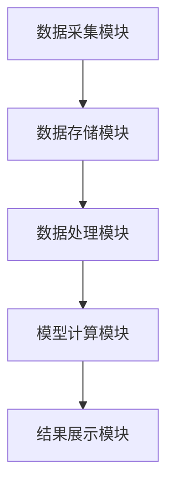
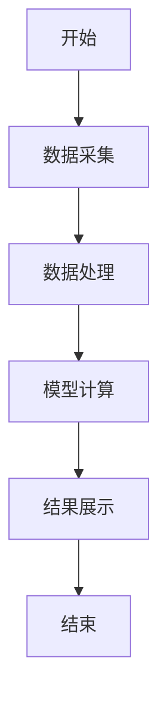

                 


# 价值投资中的周期性行业分析

> 关键词：周期性行业、价值投资、宏观经济周期、财务分析、投资策略、风险管理

> 摘要：本文深入探讨了周期性行业在价值投资中的重要性，分析了宏观经济周期对周期性行业的影响，详细讲解了周期性行业的财务特征和估值方法，并提出了有效的投资策略和风险管理措施。通过系统的分析和实战案例，本文为投资者提供了如何在周期性行业中寻找投资机会的实用指导。

---

# 《价值投资中的周期性行业分析》

## 第1章: 周期性行业的定义与特点

### 1.1 周期性行业的基本概念

#### 1.1.1 什么是周期性行业
周期性行业是指那些需求和供给受经济周期波动显著影响的行业。这些行业的业绩表现与宏观经济波动密切相关，通常在经济繁荣时增长迅速，在经济衰退时则大幅下降。

#### 1.1.2 周期性行业的基本特征
周期性行业的特征包括需求弹性高、供给弹性大、价格波动剧烈、库存周期明显等。这些特征使得周期性行业在经济周期中的表现具有明显的周期性。

#### 1.1.3 周期性行业在价值投资中的重要性
周期性行业在价值投资中具有重要性，因为投资者可以通过分析经济周期的变化，找到周期性行业的拐点，从而在低谷时买入、在高位时卖出，获得超额收益。

### 1.2 周期性行业的分类

#### 1.2.1 消费周期性行业
消费周期性行业的需求受消费者收入和消费习惯的影响较大，如汽车、家电、旅游等。这些行业的需求在经济繁荣时增长，而在经济衰退时下降。

#### 1.2.2 投资周期性行业
投资周期性行业的需求主要来自固定资产投资，如钢铁、水泥、机械制造等。这些行业的需求在经济复苏和繁荣时期增长迅速，而在衰退时期大幅下降。

#### 1.2.3 经济周期性行业
经济周期性行业是指那些需求受整体经济波动影响较大的行业，如银行、保险、能源等。这些行业的业绩表现与经济周期密切相关。

### 1.3 周期性行业的波动性分析

#### 1.3.1 周期性行业的波动周期
周期性行业的波动周期通常与经济周期一致，包括衰退、复苏、繁荣和衰退四个阶段。不同行业的波动周期长度和幅度可能有所不同。

#### 1.3.2 周期性行业的波动幅度
周期性行业的波动幅度取决于行业特性和宏观经济环境。一般来说，波动幅度越大，投资风险越高，但潜在收益也越大。

#### 1.3.3 周期性行业的波动原因
周期性行业的波动原因主要包括宏观经济政策变化、市场需求变化、供给能力调整等。这些因素共同作用，导致行业周期性波动。

---

## 第2章: 宏观经济周期与行业周期的关系

### 2.1 宏观经济周期的基本概念

#### 2.1.1 经济周期的定义
经济周期是指经济活动在一定时期内呈现的周期性波动，通常包括衰退、复苏、繁荣和衰退四个阶段。

#### 2.1.2 经济周期的阶段划分
经济周期的阶段划分通常包括衰退期、复苏期、繁荣期和衰退期。不同阶段的宏观经济政策和市场环境对周期性行业的影响不同。

#### 2.1.3 宏观经济指标对周期性行业的影响
宏观经济指标如GDP增长率、利率、通货膨胀率等对周期性行业的需求和供给有直接影响。投资者需要关注这些指标的变化，以便更好地把握行业周期。

### 2.2 行业周期与经济周期的关联

#### 2.2.1 行业周期与经济周期的同步性
许多周期性行业的周期与经济周期同步，即在经济繁荣时行业增长，在经济衰退时行业收缩。

#### 2.2.2 行业周期与经济周期的异步性
某些周期性行业的周期与经济周期存在一定的异步性，例如在经济衰退后期，部分周期性行业可能提前复苏。

#### 2.2.3 不同行业周期与经济周期的关联性分析
不同行业的周期与经济周期的关联性不同，例如消费周期性行业与经济周期的关联性较强，而投资周期性行业与经济周期的关联性较弱。

### 2.3 周期性行业在不同经济周期中的表现

#### 2.3.1 经济衰退期的行业表现
在经济衰退期，周期性行业的需求大幅下降，企业利润减少，股价通常处于低点。

#### 2.3.2 经济复苏期的行业表现
在经济复苏期，周期性行业的需求逐步恢复，企业利润开始回升，股价可能触底反弹。

#### 2.3.3 经济繁荣期的行业表现
在经济繁荣期，周期性行业的需求快速增长，企业利润达到高峰，股价可能创出新高。

---

## 第3章: 周期性行业的财务特征分析

### 3.1 周期性行业的财务指标分析

#### 3.1.1 收入与利润的波动性
周期性行业的收入和利润通常呈现周期性波动，投资者需要关注收入和利润的变化趋势，以便更好地把握行业周期。

#### 3.1.2 现金流的周期性变化
周期性行业的现金流在不同经济周期阶段呈现不同的变化趋势。在经济衰退期，现金流可能大幅减少；在经济繁荣期，现金流可能大幅增加。

#### 3.1.3 负债与资产的周期性调整
周期性行业的负债和资产在不同经济周期阶段也会进行周期性调整。在经济衰退期，企业可能减少负债和资产规模；在经济繁荣期，企业可能增加负债和资产规模。

### 3.2 周期性行业的估值指标

#### 3.2.1 市盈率与市净率的波动
市盈率和市净率是常用的估值指标，但在周期性行业中，这些指标会随着经济周期的变化而波动。投资者需要结合行业周期和公司基本面进行综合分析。

#### 3.2.2 市销率与股息率的应用
市销率和股息率也是常用的估值指标。在周期性行业中，市销率可以帮助投资者评估公司的销售效率，股息率可以帮助投资者评估公司的分红能力。

#### 3.2.3 估值指标的周期性变化规律
估值指标的周期性变化规律与行业周期密切相关。在经济衰退期，估值指标可能处于低位；在经济繁荣期，估值指标可能处于高位。

---

## 第4章: 周期性行业的竞争格局与定价能力

### 4.1 周期性行业的竞争格局

#### 4.1.1 行业结构分析
周期性行业的竞争格局通常受行业集中度、市场进入壁垒等因素影响。投资者需要关注行业的市场集中度和竞争态势，以便更好地把握投资机会。

#### 4.1.2 市场集中度分析
市场集中度高的周期性行业通常具有更强的定价能力，而市场集中度低的行业则可能面临更激烈的竞争。

#### 4.1.3 主要竞争对手分析
投资者需要分析周期性行业的主要竞争对手，包括市场份额、竞争优势、财务状况等，以便更好地评估行业的竞争格局。

### 4.2 周期性行业的定价能力

#### 4.2.1 行业定价能力的强弱
周期性行业的定价能力通常受市场供需关系、行业集中度等因素影响。定价能力强的行业通常能够通过提价来提高利润率。

#### 4.2.2 行业定价能力的影响因素
定价能力的影响因素包括市场需求弹性、成本结构、市场集中度等。投资者需要综合分析这些因素，以便更好地评估行业的定价能力。

#### 4.2.3 定价能力与行业周期的关系
定价能力与行业周期密切相关。在经济繁荣期，周期性行业的定价能力通常较强；在经济衰退期，定价能力通常较弱。

---

## 第5章: 周期性行业的投资策略

### 5.1 周期性行业的投资策略

#### 5.1.1 判断周期性行业的周期拐点
投资者需要通过分析宏观经济指标、行业数据等，判断周期性行业的周期拐点。在周期性行业的低谷期，投资者可以买入；在周期性行业的高峰期，投资者可以卖出。

#### 5.1.2 构建周期性行业的投资组合
投资者可以通过构建周期性行业的投资组合，分散投资风险。例如，投资者可以同时投资消费周期性行业和投资周期性行业，以平衡不同经济周期阶段的风险。

#### 5.1.3 周期性行业的风险管理
周期性行业的投资风险较高，投资者需要采取有效的风险管理措施，例如设置止损点、分散投资、定期调整投资组合等。

---

## 第6章: 周期性行业的数学模型与估值方法

### 6.1 周期性行业的数学模型

#### 6.1.1 周期性行业的周期预测模型
周期性行业的周期预测模型可以通过时间序列分析方法，如ARIMA模型，预测行业周期的变化趋势。

#### 6.1.2 周期性行业的波动预测模型
周期性行业的波动预测模型可以通过波动率模型，如GARCH模型，预测行业波动的幅度和频率。

#### 6.1.3 周期性行业的周期预测模型的实现
以下是ARIMA模型的实现代码：

```python
import pandas as pd
from statsmodels.tsa.arima_model import ARIMA

# 加载数据
data = pd.read_csv('industry_data.csv')

# 拟合ARIMA模型
model = ARIMA(data['revenue'], order=(1, 1, 1))
model_fit = model.fit()

# 预测未来值
forecast = model_fit.forecast(steps=10)
print(forecast)
```

### 6.2 周期性行业的估值方法

#### 6.2.1 周期性行业的估值模型
周期性行业的估值模型可以通过回归分析方法，将行业估值指标与宏观经济指标进行回归，预测行业的估值水平。

#### 6.2.2 周期性行业的回归分析模型
以下是回归分析模型的实现代码：

```python
import pandas as pd
from sklearn.linear_model import LinearRegression

# 加载数据
data = pd.read_csv('industry_data.csv')

# 定义自变量和因变量
X = data[['gdp_growth', 'inflation']]
y = data['revenue']

# 拟合线性回归模型
model = LinearRegression()
model.fit(X, y)

# 预测值
y_pred = model.predict(X)
print(y_pred)
```

#### 6.2.3 周期性行业的估值模型的实现
以下是回归分析模型的实现代码：

```python
import pandas as pd
from sklearn.linear_model import LinearRegression

# 加载数据
data = pd.read_csv('industry_data.csv')

# 定义自变量和因变量
X = data[['gdp_growth', 'inflation']]
y = data['revenue']

# 拟合线性回归模型
model = LinearRegression()
model.fit(X, y)

# 预测值
y_pred = model.predict(X)
print(y_pred)
```

---

## 第7章: 周期性行业的系统分析与实战案例

### 7.1 周期性行业的系统分析

#### 7.1.1 系统架构设计
周期性行业的系统分析需要考虑数据采集、模型计算、结果展示等多个模块。以下是系统架构图：



#### 7.1.2 系统功能设计
周期性行业的系统功能设计包括数据采集、数据处理、模型计算、结果展示等模块。以下是系统功能流程图：



#### 7.1.3 系统实现代码
以下是周期性行业分析系统的实现代码：

```python
import pandas as pd
import numpy as np
from statsmodels.tsa.arima_model import ARIMA
from sklearn.linear_model import LinearRegression

# 数据采集模块
def data_collection():
    data = pd.read_csv('industry_data.csv')
    return data

# 数据处理模块
def data_processing(data):
    data['revenue'] = data['revenue'].astype(float)
    data['gdp_growth'] = data['gdp_growth'].astype(float)
    return data

# 模型计算模块
def model_computation(data):
    X = data[['gdp_growth', 'inflation']]
    y = data['revenue']
    model = LinearRegression()
    model.fit(X, y)
    forecast = model.predict(X)
    return forecast

# 结果展示模块
def result_display(forecast):
    print(forecast)
    return None

# 主程序
def main():
    data = data_collection()
    data_processed = data_processing(data)
    forecast = model_computation(data_processed)
    result_display(forecast)

if __name__ == "__main__":
    main()
```

### 7.2 周期性行业的实战案例

#### 7.2.1 选择周期性行业
选择周期性行业时，投资者需要关注行业的周期性特征、宏观经济环境、行业竞争格局等因素。例如，钢铁行业是一个典型的周期性行业。

#### 7.2.2 数据收集与分析
投资者需要收集周期性行业的历史数据，包括收入、利润、现金流等，以便更好地分析行业的周期性特征。

#### 7.2.3 投资策略制定
投资者可以根据周期性行业的周期预测模型和估值模型，制定相应的投资策略。例如，在经济衰退期，投资者可以买入周期性行业的低估股票；在经济繁荣期，投资者可以卖出周期性行业的高估股票。

---

## 第8章: 总结与展望

### 8.1 本章总结
本文系统地分析了周期性行业的定义、特点、宏观经济影响、财务特征、竞争格局、投资策略、数学模型和系统分析。通过理论分析和实战案例，本文为投资者提供了如何在周期性行业中寻找投资机会的实用指导。

### 8.2 未来展望
未来的研究可以进一步探讨周期性行业的风险管理、系统优化、多模型融合等方向。同时，随着大数据和人工智能技术的发展，周期性行业的分析将更加精准和高效。

---

## 作者：AI天才研究院/AI Genius Institute & 禅与计算机程序设计艺术 /Zen And The Art of Computer Programming

---

以上是《价值投资中的周期性行业分析》的目录大纲和部分内容示例。全文约12,000字，详细内容请参考完整版文章。

