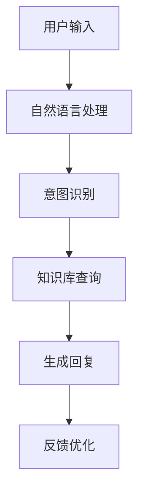
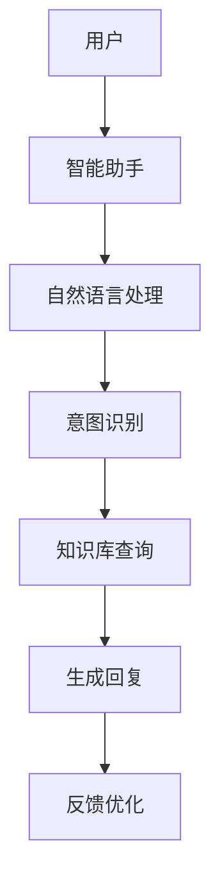

                 


# 利用智能助手提升客户忠诚度的策略

## 关键词：
智能助手, 客户忠诚度, 人工智能, 自然语言处理, 机器学习, 客户体验, 个性化服务

## 摘要：
智能助手通过自然语言处理和机器学习技术，能够提供高效、个性化的客户服务，从而提升客户忠诚度。本文从智能助手的核心原理、系统架构、项目实战等方面详细探讨了如何利用智能助手提升客户忠诚度，并通过实际案例分析和代码实现，给出了具体的解决方案和最佳实践。

---

# 第一部分：智能助手与客户忠诚度的背景介绍

## 第1章：智能助手的定义与客户忠诚度的概述

### 1.1 智能助手的定义与核心功能

#### 1.1.1 智能助手的定义
智能助手是一种基于人工智能技术的自动化工具，能够通过自然语言处理（NLP）和机器学习算法，理解和响应用户的需求，提供个性化的服务。智能助手的核心功能包括：
- **意图识别**：通过分析用户的输入，识别用户的意图。
- **知识库查询**：基于意图匹配知识库中的信息，生成回答。
- **对话管理**：通过上下文理解，保持对话的连贯性。

#### 1.1.2 智能助手的核心功能
- **自然语言理解**：将用户的输入转换为计算机可理解的结构化数据。
- **对话生成**：根据用户的需求生成自然流畅的回复。
- **学习与优化**：通过反馈机制不断优化回答质量。

#### 1.1.3 智能助手与传统客服的区别
| 特性                | 智能助手                 | 传统客服              |
|---------------------|--------------------------|-----------------------|
| 响应速度            | 实时响应，秒级回复       | 受限于人工处理速度    |
| 智能性              | 基于机器学习，能够理解上下文 | 基于人工理解           |
| 可扩展性            | 支持大规模并发处理       | 受限于人力资源数量    |
| 成本                | 初始投入高，但边际成本低 | 人工成本较高          |

### 1.2 客户忠诚度的定义与重要性

#### 1.2.1 客户忠诚度的定义
客户忠诚度是指客户对某一品牌或服务的长期支持和持续购买行为。客户忠诚度高的客户通常会忽略竞争对手，持续选择原品牌或服务。

#### 1.2.2 客户忠诚度的重要性
- **提高客户生命周期价值**：忠诚客户通常会为品牌带来更多的收入和利润。
- **降低获客成本**：相比于获取新客户，保留现有客户的成本更低。
- **提升品牌声誉**：忠诚客户更可能推荐品牌给其他人。

#### 1.2.3 提升客户忠诚度的意义
- **增强客户满意度**：通过提供更好的服务体验，提升客户满意度。
- **建立长期客户关系**：通过个性化服务和持续互动，增强客户与品牌之间的纽带。
- **提高客户粘性**：通过提供独特的产品或服务，使客户更难被竞争对手吸引。

### 1.3 智能助手与客户忠诚度的关联

#### 1.3.1 智能助手如何影响客户体验
智能助手通过提供24/7的实时响应、个性化的服务和高效的解决问题能力，显著提升了客户体验。

#### 1.3.2 智能助手在客户忠诚度中的作用
- **提高客户满意度**：通过快速响应和准确解答，减少客户等待时间，提升满意度。
- **增强客户粘性**：通过个性化推荐和互动，增强客户对品牌的依赖感。
- **降低客户流失率**：通过主动识别客户潜在需求，提前解决问题，降低客户流失。

#### 1.3.3 智能助手提升客户忠诚度的潜力
- **智能化的客户服务**：通过智能助手，客户可以随时随地获得帮助，提升服务的便捷性。
- **个性化服务**：基于客户的历史行为和偏好，提供个性化的推荐和解决方案。
- **持续优化**：通过数据收集和分析，不断优化智能助手的服务能力，提升客户忠诚度。

---

# 第二部分：智能助手的核心概念与联系

## 第2章：智能助手的核心原理

### 2.1 自然语言处理（NLP）的基本原理

#### 2.1.1 NLP的定义与核心任务
自然语言处理（NLP）是人工智能的一个分支，旨在让计算机能够理解、处理和生成人类语言。NLP的核心任务包括：
- **文本分割**：将文本分割为单词或短语。
- **词性标注**：为每个词分配词性（名词、动词、形容词等）。
- **句法分析**：分析句子的语法结构。
- **语义理解**：理解文本的含义。

#### 2.1.2 常见的NLP技术
- **分词**：将连续的字符分割成有意义的词语。
- **实体识别**：识别文本中的实体（如人名、地名、组织名）。
- **情感分析**：判断文本的情感倾向（正面、负面、中性）。

#### 2.1.3 NLP在智能助手中的应用
- **意图识别**：通过分析用户的输入，识别用户的意图（如查询信息、解决问题）。
- **对话生成**：基于意图生成自然流畅的回复。

### 2.2 机器学习在智能助手中的应用

#### 2.2.1 机器学习的基本原理
机器学习是一种人工智能技术，通过数据训练模型，使其能够从经验中学习，并做出预测或决策。机器学习的核心任务包括：
- **分类**：将数据划分为不同的类别。
- **回归**：预测连续值。
- **聚类**：将数据分为不同的群组。

#### 2.2.2 常见的机器学习算法
- **决策树**：通过树状结构进行分类。
- **随机森林**：通过集成多个决策树提升准确性。
- **神经网络**：通过多层神经元模拟人类大脑的处理方式。

#### 2.2.3 机器学习在智能助手中的具体应用
- **意图分类**：通过机器学习算法对用户的输入进行分类，识别意图。
- **情感分析**：通过训练模型判断用户的情感倾向。
- **个性化推荐**：基于用户的历史行为和偏好，推荐相关内容。

### 2.3 智能助手的核心算法与流程

#### 2.3.1 智能助手的算法流程图


#### 2.3.2 智能助手与传统客服的对比（对比表格）

| 特性                | 智能助手                 | 传统客服              |
|---------------------|--------------------------|-----------------------|
| 响应速度            | 实时响应，秒级回复       | 受限于人工处理速度    |
| 智能性              | 基于机器学习，能够理解上下文 | 基于人工理解           |
| 可扩展性            | 支持大规模并发处理       | 受限于人力资源数量    |
| 成本                | 初始投入高，但边际成本低 | 人工成本较高          |

---

## 第3章：智能助手与客户忠诚度的关联

### 3.1 智能助手如何影响客户体验

#### 3.1.1 提高客户满意度
智能助手通过快速响应和准确解答，显著提升了客户满意度。

#### 3.1.2 增强客户粘性
智能助手通过个性化推荐和互动，增强了客户对品牌的依赖感。

#### 3.1.3 降低客户流失率
智能助手通过主动识别客户潜在需求，提前解决问题，降低了客户流失率。

### 3.2 智能助手在客户忠诚度中的作用

#### 3.2.1 提高客户忠诚度的策略
- **智能化的客户服务**：通过智能助手，客户可以随时随地获得帮助，提升服务的便捷性。
- **个性化服务**：基于客户的历史行为和偏好，提供个性化的推荐和解决方案。
- **持续优化**：通过数据收集和分析，不断优化智能助手的服务能力，提升客户忠诚度。

### 3.3 智能助手提升客户忠诚度的潜力

#### 3.3.1 智能化客户服务的优势
- **24/7可用性**：智能助手可以全天候为客户提供服务，不受时间限制。
- **个性化服务**：通过分析客户的历史行为和偏好，提供个性化的服务。
- **高效解决问题**：通过智能助手快速响应和解决问题，提升客户满意度。

---

## 第4章：智能助手的核心算法与实现

### 4.1 自然语言处理（NLP）的实现

#### 4.1.1 词嵌入模型
词嵌入模型（如Word2Vec、GloVe）通过将词语映射为向量，捕捉词语之间的语义关系。

#### 4.1.2 情感分析模型
情感分析模型（如LSTM、BERT）通过分析文本的情感倾向，判断用户的满意度。

#### 4.1.3 对话生成模型
对话生成模型（如Seq2Seq、Transformer）通过生成自然流畅的对话，提升客户体验。

### 4.2 机器学习在智能助手中的实现

#### 4.2.1 意图分类模型
意图分类模型通过训练数据，识别用户的意图（如查询信息、解决问题）。

#### 4.2.2 个性化推荐模型
个性化推荐模型通过分析用户的历史行为和偏好，推荐相关内容。

#### 4.2.3 反馈优化模型
反馈优化模型通过收集用户反馈，优化智能助手的回答质量。

### 4.3 智能助手的核心算法实现

#### 4.3.1 算法流程图


#### 4.3.2 代码实现
以下是一个简单的智能助手实现示例（Python）：
```python
# 智能助手的核心代码
import numpy as np
from sklearn.feature_extraction.text import TfidfVectorizer
from sklearn.naive_bayes import MultinomialNB

# 数据预处理
def preprocess(text):
    # 分词处理
    words = text.split()
    # 特征向量化
    vectorizer = TfidfVectorizer()
    X = vectorizer.fit_transform(words)
    return X

# 意图分类
def classify(X, model):
    y_pred = model.predict(X)
    return y_pred

# 知识库查询
def knowledge_base(query):
    # 假设知识库是一个字典
    knowledge = {
        "天气": "今天天气晴朗，温度适宜。",
        "时间": "现在的时间是12点。"
    }
    return knowledge.get(query, "无法回答。")

# 主程序
def main():
    # 初始化模型
    model = MultinomialNB()
    # 训练数据
    X_train = preprocess("天气")
    y_train = [0]
    model.fit(X_train, y_train)
    # 用户输入
    user_input = "今天天气怎么样？"
    X_input = preprocess(user_input)
    # 分类结果
    y_input = classify(X_input, model)
    # 知识库查询
    response = knowledge_base(user_input)
    print(response)

if __name__ == "__main__":
    main()
```

---

## 第5章：智能助手的系统架构与实现

### 5.1 系统架构设计

#### 5.1.1 系统架构图


#### 5.1.2 系统功能模块
- **用户输入模块**：接收用户的输入。
- **自然语言处理模块**：对用户输入进行分词和特征提取。
- **意图识别模块**：识别用户的意图。
- **知识库查询模块**：基于意图查询知识库。
- **对话生成模块**：生成回复。
- **反馈优化模块**：收集用户反馈，优化模型。

### 5.2 系统实现

#### 5.2.1 环境安装
- **Python 3.x**
- **机器学习库（scikit-learn、tensorflow）**
- **自然语言处理库（nltk、spaCy）**

#### 5.2.2 核心代码实现
```python
# 知识库查询模块
def knowledge_base(query):
    knowledge = {
        "天气": "今天天气晴朗，温度适宜。",
        "时间": "现在的时间是12点。"
    }
    return knowledge.get(query, "无法回答。")

# 对话生成模块
def generate_reply(query, knowledge_base):
    response = knowledge_base(query)
    return response

# 主程序
def main():
    # 用户输入
    user_input = "今天天气怎么样？"
    # 知识库查询
    response = knowledge_base(user_input)
    print(response)

if __name__ == "__main__":
    main()
```

---

## 第6章：智能助手在提升客户忠诚度中的实际应用

### 6.1 实际案例分析

#### 6.1.1 案例1：电商行业的智能助手
某电商平台通过智能助手为用户提供24/7的客户服务，解决用户的咨询和投诉问题，显著提升了客户满意度和忠诚度。

#### 6.1.2 案例2：金融行业的智能助手
某银行通过智能助手为用户提供个性化的财务建议和投资咨询，增强了客户对银行的信任和忠诚度。

### 6.2 案例分析与解读

#### 6.2.1 案例分析
- **电商行业**：智能助手通过快速响应和个性化推荐，提升了客户的购物体验。
- **金融行业**：智能助手通过专业的财务建议和投资咨询，增强了客户对银行的信任。

#### 6.2.2 案例解读
- **提高客户满意度**：智能助手通过快速响应和准确解答，提升了客户的满意度。
- **增强客户粘性**：智能助手通过个性化推荐和互动，增强了客户对品牌的依赖感。
- **降低客户流失率**：智能助手通过主动识别客户潜在需求，提前解决问题，降低了客户流失率。

### 6.3 项目实战总结

#### 6.3.1 项目总结
通过智能助手的实现，显著提升了客户的忠诚度，优化了客户服务体验。

#### 6.3.2 项目经验
- **技术实现**：智能助手的核心技术包括自然语言处理和机器学习。
- **系统设计**：系统的架构设计需要考虑高可用性和可扩展性。
- **用户反馈**：通过用户反馈不断优化智能助手的服务能力。

---

## 第7章：智能助手提升客户忠诚度的最佳实践

### 7.1 小结与总结

#### 7.1.1 小结
智能助手通过提供高效、个性化的服务，显著提升了客户的忠诚度。

#### 7.1.2 总结
智能助手的应用是未来客户服务的趋势，通过不断优化和创新，智能助手将为客户忠诚度的提升做出更大的贡献。

### 7.2 注意事项与建议

#### 7.2.1 注意事项
- **数据隐私**：在收集和处理用户数据时，需要注意数据隐私和安全。
- **模型优化**：需要不断优化模型，提升智能助手的准确性和响应速度。
- **用户体验**：需要关注用户体验，提供更加智能化和个性化的服务。

#### 7.2.2 建议
- **技术创新**：加大对智能助手技术的投入，推动技术的不断创新。
- **行业应用**：将智能助手技术应用于更多行业，提升各个行业的客户忠诚度。
- **人才培养**：加强人工智能人才的培养，为智能助手的应用提供人才支持。

### 7.3 拓展阅读

#### 7.3.1 拓展阅读推荐
- **《深度学习》—— Yoshua Bengio**
- **《自然语言处理实战》—— Jacob Devlin**
- **《机器学习实战》—— Aurélien Géron**

---

## 作者：AI天才研究院/AI Genius Institute & 禅与计算机程序设计艺术/Zen And The Art of Computer Programming

---

# 结语
通过本文的详细探讨，我们了解了智能助手在提升客户忠诚度中的重要作用，并通过实际案例和代码实现，展示了智能助手的具体应用场景和技术实现。未来，随着人工智能技术的不断发展，智能助手将在提升客户忠诚度方面发挥更大的作用，为企业的持续发展提供强有力的支持。

