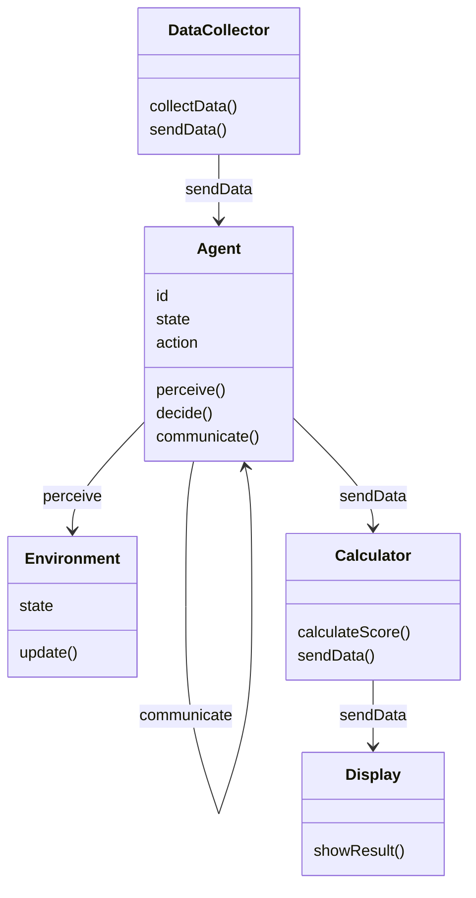
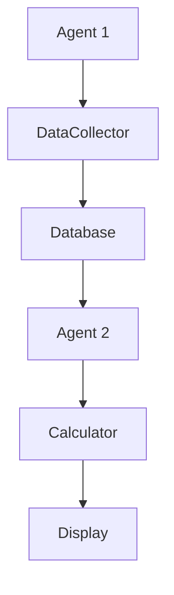
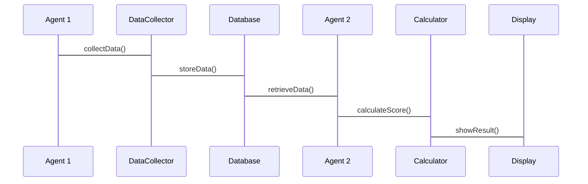

                 


# 多智能体系统在评估公司治理和ESG因素中的应用

## 关键词：多智能体系统, 公司治理, ESG, 分布式计算, 人工智能

## 摘要：  
本文探讨了多智能体系统在公司治理和ESG（环境、社会、治理）评估中的应用。通过分析多智能体系统的原理和架构，结合实际案例，展示了如何利用多智能体系统来提升公司治理的透明度和效率，以及如何更准确地评估ESG因素。文章从理论到实践，详细阐述了多智能体系统在这些领域的优势和挑战，并提出了可行的解决方案。

---

# 第一部分：多智能体系统与公司治理背景

## 第1章：多智能体系统与公司治理概述

### 1.1 多智能体系统的基本概念

#### 1.1.1 多智能体系统的定义  
多智能体系统（Multi-Agent System, MAS）是由多个智能体（Agent）组成的系统，这些智能体能够通过协作完成复杂任务。智能体是具有感知、决策和执行能力的实体，可以是软件程序或物理设备。

#### 1.1.2 多智能体系统的特征  
- **分布式性**：智能体分布在不同的位置，独立运行。  
- **协作性**：智能体之间通过通信和协作完成共同目标。  
- **动态性**：系统环境和智能体状态可能动态变化。  
- **自主性**：每个智能体具有自主决策的能力。  

#### 1.1.3 多智能体系统与传统单智能体系统的区别  
| 特性 | 多智能体系统 | 单智能体系统 |  
|------|--------------|--------------|  
| 决策 | 分布式决策 | 中央化决策 |  
| 通信 | 智能体之间需要通信 | 单一智能体独立运行 |  
| 效率 | 可能更高，任务分解更细 | 可能较低，任务集中处理 |  

### 1.2 公司治理的基本概念

#### 1.2.1 公司治理的定义  
公司治理是指公司内部和外部利益相关者之间的关系，包括董事会、管理层、股东、员工和外部机构之间的互动。

#### 1.2.2 公司治理的核心要素  
- **董事会结构**：董事会的组成和职责。  
- **管理层责任**：管理层的权力和责任。  
- **股东权利**：股东的知情权和决策权。  
- **公司透明度**：公司信息披露的规范性。  

#### 1.2.3 公司治理与企业绩效的关系  
良好的公司治理能够提高企业绩效，增强投资者信心，降低运营风险。

### 1.3 ESG因素的基本概念

#### 1.3.1 ESG的定义与内涵  
ESG是指环境（Environmental）、社会（Social）和治理（Governance）三个方面的表现，是评估企业可持续发展能力的重要指标。

#### 1.3.2 ESG的三个维度  
- **环境（Environmental）**：碳排放、能源使用、环保合规性。  
- **社会（Social）**：员工权益、社会责任、供应链管理。  
- **治理（Governance）**：董事会结构、高管薪酬、公司透明度。  

#### 1.3.3 ESG与企业可持续发展的关系  
ESG表现优秀的企业更有可能实现可持续发展，增强企业竞争力。

### 1.4 多智能体系统在公司治理与ESG中的应用前景

#### 1.4.1 多智能体系统在公司治理中的潜在应用  
- **董事会决策支持**：通过多智能体系统提供实时数据和决策建议。  
- **风险管理**：智能体协作识别潜在风险并提出解决方案。  
- **透明化管理**：通过智能体之间的协作实现信息透明共享。  

#### 1.4.2 多智能体系统在ESG评估中的优势  
- **分布式数据处理**：多智能体系统能够高效处理分散的ESG数据。  
- **协作学习**：通过智能体协作，提高ESG评估的准确性和全面性。  
- **动态适应性**：能够实时更新ESG评估结果，适应市场变化。  

#### 1.4.3 应用中的挑战与机遇  
- **挑战**：数据隐私、智能体协作的复杂性、系统集成难度。  
- **机遇**：提升企业透明度，增强投资者信任，推动可持续发展。  

## 1.5 本章小结  
本章介绍了多智能体系统的基本概念和特征，分析了公司治理和ESG的内涵，探讨了多智能体系统在公司治理和ESG评估中的应用前景，为后续章节的深入分析奠定了基础。

---

## 第2章：多智能体系统的原理与架构

### 2.1 多智能体系统的原理

#### 2.1.1 分布式计算与协作  
多智能体系统通过分布式计算实现任务分解和协作，每个智能体负责一部分任务，最终通过协作完成整体目标。

#### 2.1.2 智能体之间的通信与协调  
智能体之间通过通信协议交换信息，协调行动。通信内容包括数据传输、任务分配和状态更新。

#### 2.1.3 多智能体系统的动态性与适应性  
多智能体系统能够根据环境变化动态调整智能体的行为和任务分配，具有较强的适应性。

### 2.2 多智能体系统的架构设计

#### 2.2.1 分层架构  
分层架构将系统分为多个层次，每个层次负责不同的功能，如感知层、决策层和执行层。

#### 2.2.2 分布式架构  
分布式架构将智能体分布在不同的节点上，通过网络通信实现协作。

#### 2.2.3 混合架构  
混合架构结合了分层架构和分布式架构的特点，适用于复杂任务的处理。

### 2.3 多智能体系统的通信协议

#### 2.3.1 通信模型  
通信模型包括发送方、接收方和传输通道，确保智能体之间的信息高效传递。

#### 2.3.2 通信协议的选择与设计  
选择合适的通信协议，如HTTP、WebSocket等，设计协议格式和数据结构。

#### 2.3.3 通信中的安全与隐私保护  
通过加密技术和访问控制，保护智能体之间的通信安全，防止数据泄露。

### 2.4 本章小结  
本章详细介绍了多智能体系统的原理和架构设计，为后续章节的应用提供了理论基础。

---

## 第3章：多智能体系统在ESG评估中的应用

### 3.1 ESG评估的基本框架

#### 3.1.1 环境因素（Environmental）  
环境因素包括碳排放、能源使用、环保合规性等。

#### 3.1.2 社会因素（Social）  
社会因素包括员工权益、社会责任、供应链管理等。

#### 3.1.3 治理因素（Governance）  
治理因素包括董事会结构、高管薪酬、公司透明度等。

### 3.2 ESG评估的关键指标

#### 3.2.1 环境指标  
- 碳排放量  
- 能源使用效率  
- 环保投资比例  

#### 3.2.2 社会指标  
- 员工满意度  
- 社会责任履行情况  
- 供应链合规性  

#### 3.2.3 治理指标  
- 董事会多样性  
- 高管薪酬与绩效关系  
- 信息披露透明度  

### 3.3 多智能体系统在ESG指标评估中的作用

#### 3.3.1 数据采集与整合  
多智能体系统能够从多个数据源采集ESG相关数据，并通过协作完成数据整合。

#### 3.3.2 指标计算与分析  
通过智能体协作，实现ESG指标的计算和分析，提供实时评估结果。

#### 3.3.3 结果展示与反馈  
多智能体系统能够将评估结果以可视化形式展示，并提供反馈，帮助公司改进ESG表现。

### 3.4 本章小结  
本章分析了ESG评估的核心指标，探讨了多智能体系统在ESG评估中的具体应用，为后续章节的系统设计提供了方向。

---

## 第4章：多智能体系统在公司治理中的应用

### 4.1 公司治理中的多智能体系统

#### 4.1.1 董事会决策支持  
多智能体系统可以为董事会提供实时数据和决策建议，帮助董事会做出更明智的决策。

#### 4.1.2 风险管理  
通过多智能体系统的协作，能够及时发现潜在风险并提出解决方案，降低公司治理风险。

#### 4.1.3 透明化管理  
多智能体系统能够实现信息透明共享，增强公司治理的透明度，提升投资者信任。

### 4.2 多智能体系统在公司治理中的优势

#### 4.2.1 提高决策效率  
通过任务分解和协作，多智能体系统能够提高公司治理的决策效率。

#### 4.2.2 增强透明度  
多智能体系统的协作机制能够确保信息的透明共享，减少信息不对称。

#### 4.2.3 动态适应性  
多智能体系统能够根据环境变化动态调整公司治理策略，增强公司的适应能力。

### 4.3 本章小结  
本章探讨了多智能体系统在公司治理中的具体应用，分析了其优势和潜在价值。

---

## 第5章：多智能体系统在ESG评估中的算法实现

### 5.1 算法原理

#### 5.1.1 分布式强化学习  
分布式强化学习是一种适用于多智能体协作的算法，通过智能体之间的协作学习，提高ESG评估的准确性。

#### 5.1.2 算法流程  
1. 初始化智能体和环境。  
2. 智能体感知环境并采取行动。  
3. 智能体之间通信并协作。  
4. 环境状态更新并反馈给智能体。  
5. 重复上述步骤，直到达到目标。  

#### 5.1.3 算法实现  
```python
class Agent:
    def __init__(self, id):
        self.id = id
        self.state = None
        self.action = None

    def perceive(self, state):
        self.state = state

    def decide(self):
        # 根据当前状态决定行动
        pass

    def communicate(self, other_agent):
        # 与其他智能体通信
        pass

# 初始化多个智能体
agents = [Agent(i) for i in range(5)]

# 环境初始化
environment = Environment()

# 运行算法
while True:
    for agent in agents:
        agent.perceive(environment.state)
        agent.decide()
        agent.communicate(other_agents)
    environment.update()
```

### 5.2 算法实现的细节

#### 5.2.1 智能体通信  
智能体之间通过通信模块交换信息，如使用消息队列或RPC（远程过程调用）。

#### 5.2.2 状态更新  
环境状态根据智能体的行动进行更新，确保系统能够适应变化。

#### 5.2.3 学习与优化  
通过强化学习算法，智能体不断优化自己的决策策略，提高ESG评估的准确性。

### 5.3 算法实现的数学模型

#### 5.3.1 强化学习模型  
$$ Q-learning 算法的更新公式：$$
$$ Q(s, a) = Q(s, a) + \alpha [r + \gamma \max Q(s', a') - Q(s, a)] $$

其中，$s$ 是当前状态，$a$ 是当前动作，$r$ 是奖励，$s'$ 是下一个状态，$\alpha$ 是学习率，$\gamma$ 是折扣因子。

#### 5.3.2 分布式协作模型  
$$ 协作学习公式：$$
$$ \theta_i = \theta_i + \alpha (r_i - Q_i) $$

其中，$\theta_i$ 是智能体$i$的参数，$r_i$ 是智能体$i$的奖励，$Q_i$ 是智能体$i$的评估值。

### 5.4 本章小结  
本章详细介绍了多智能体系统在ESG评估中的算法实现，包括分布式强化学习的原理和实现细节。

---

## 第6章：系统架构设计与实现

### 6.1 系统功能模块设计

#### 6.1.1 数据采集模块  
负责从多个数据源采集ESG相关数据，如公司财报、社会责任报告等。

#### 6.1.2 数据处理模块  
对采集到的数据进行清洗、转换和整合，确保数据的准确性和一致性。

#### 6.1.3 指标计算模块  
根据ESG评估指标，计算每个公司的ESG得分。

#### 6.1.4 结果展示模块  
将评估结果以可视化形式展示，如图表、报告等。

### 6.2 系统架构设计

#### 6.2.1 领域模型类图  


#### 6.2.2 系统架构图  


### 6.3 接口设计与交互流程图

#### 6.3.1 接口设计  
- **数据采集接口**：`/api/data/collect`  
- **指标计算接口**：`/api/evaluate/esg`  
- **结果展示接口**：`/api/result/display`  

#### 6.3.2 交互流程图  


### 6.4 本章小结  
本章设计了多智能体系统在ESG评估中的系统架构，包括功能模块设计、系统架构图和交互流程图。

---

## 第7章：项目实战与案例分析

### 7.1 项目实战

#### 7.1.1 环境安装  
```bash
pip install python-multiprocessing
pip install requests
pip install matplotlib
```

#### 7.1.2 核心代码实现  
```python
import requests
import matplotlib.pyplot as plt

class ESGAgent(Agent):
    def __init__(self, id, company_name):
        super().__init__(id)
        self.company_name = company_name

    def perceive(self, state):
        super().perceive(state)
        self.data = requests.get(f"http://data-source/{self.company_name}").json()

    def decide(self):
        # 计算ESG得分
        self.score = self.data['environment'] * 0.4 + self.data['social'] * 0.3 + self.data['governance'] * 0.3

    def communicate(self, other_agents):
        # 与其他智能体交换数据
        pass

# 初始化多智能体系统
agents = [ESGAgent(i, f"Company{i+1}") for i in range(5)]
environment = ESGEnvironment()

# 运行系统
for agent in agents:
    agent.perceive(environment.state)
    agent.decide()
    agent.communicate(other_agents)
environment.update()
```

#### 7.1.3 案例分析  
以某公司为例，分析多智能体系统在ESG评估中的应用效果。

### 7.2 本章小结  
本章通过实际案例分析，展示了多智能体系统在ESG评估中的应用效果，验证了系统的可行性和有效性。

---

## 第8章：最佳实践与总结

### 8.1 最佳实践

#### 8.1.1 数据隐私保护  
通过加密技术和访问控制，确保数据的安全性和隐私性。

#### 8.1.2 系统可扩展性  
设计模块化的系统架构，确保系统的可扩展性和灵活性。

#### 8.1.3 智能体协作优化  
通过优化协作算法，提高系统的效率和准确性。

### 8.2 小结  
本文详细探讨了多智能体系统在公司治理和ESG评估中的应用，分析了其原理和优势，并通过实际案例验证了系统的有效性。

### 8.3 注意事项  
- 确保数据的准确性和完整性。  
- 注意智能体协作中的通信延迟问题。  
- 定期更新系统以适应环境变化。  

### 8.4 拓展阅读  
- 推荐阅读相关领域的最新研究论文。  
- 关注多智能体系统在其他领域的应用案例。  

---

## 作者：AI天才研究院/AI Genius Institute & 禅与计算机程序设计艺术/Zen And The Art of Computer Programming

---

以上是完整的目录大纲和文章结构，您可以根据需要进一步扩展每个部分的内容，添加更多细节和具体实现。

