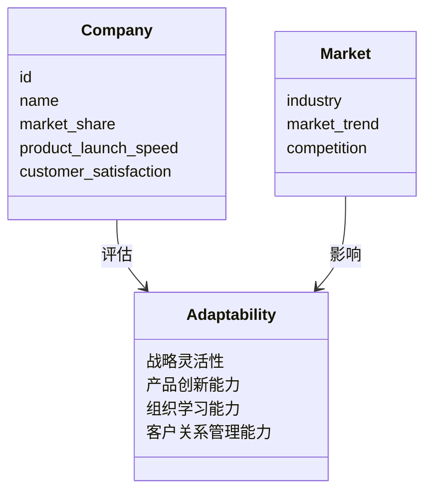
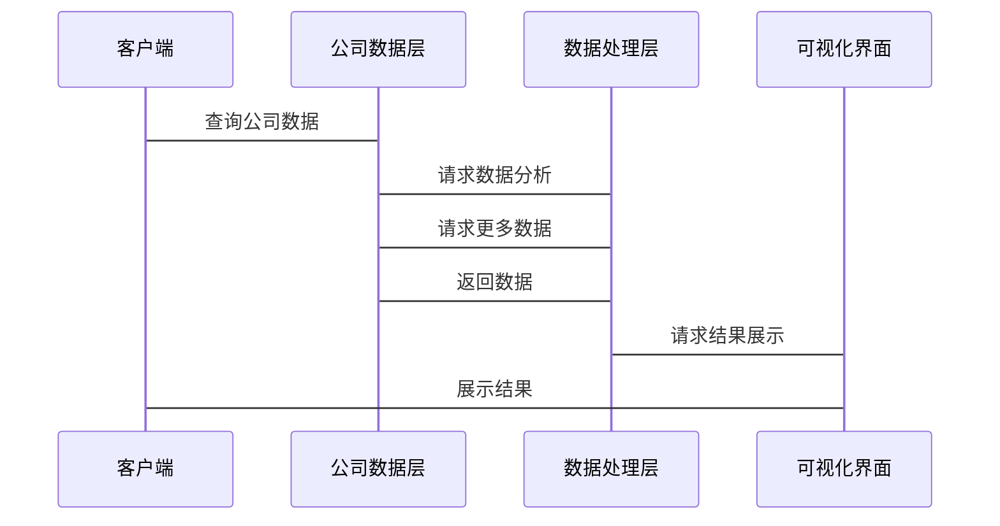

                 


# 彼得林奇如何看待公司的市场适应能力

## 关键词：彼得林奇，市场适应能力，投资策略，企业分析，竞争分析，市场反应能力

## 摘要：本文深入探讨了彼得·林奇如何从投资者的角度看待公司的市场适应能力。文章从市场适应能力的定义、核心要素、评估模型、系统架构设计、彼得·林奇的分析方法、投资策略以及项目实战等多个方面进行了详细分析。通过实际案例和数学模型，本文展示了如何将市场适应能力与投资决策相结合，帮助投资者更好地识别和评估具有长期市场适应能力的公司。

---

## 第1章: 市场适应能力的定义与重要性

### 1.1 市场适应能力的定义

#### 1.1.1 什么是市场适应能力
市场适应能力是指公司在不断变化的市场环境中，能够快速识别、响应和调整自身战略、产品、组织结构和运营模式的能力。这种能力使公司能够在竞争激烈的市场中保持优势，并实现可持续发展。

#### 1.1.2 市场适应能力的核心要素
市场适应能力的核心要素包括：
1. **战略灵活性**：公司能够根据市场变化调整战略方向。
2. **产品创新能力**：公司能够快速推出符合市场需求的新产品或服务。
3. **组织学习能力**：公司内部能够高效学习和适应新环境。
4. **客户关系管理能力**：公司能够维护和增强与客户的关系，及时响应客户需求。

#### 1.1.3 市场适应能力的重要性
在当前快速变化的市场环境中，市场适应能力是公司生存和发展的关键因素。具备强大市场适应能力的公司能够更快地应对市场变化，抓住新的机会，避免潜在风险。

---

### 1.2 市场适应能力的背景与问题背景

#### 1.2.1 当前市场环境的复杂性
当前市场环境复杂多变，技术进步、政策变化、消费者行为的变化等因素都在影响着市场的动态。公司需要具备快速适应市场变化的能力，才能在竞争中立于不败之地。

#### 1.2.2 公司面临的市场适应挑战
公司面临的主要市场适应挑战包括：
1. **技术变革**：新技术的出现可能导致现有产品和服务的迅速过时。
2. **政策变化**：政策的变化可能影响公司的运营模式和市场准入。
3. **消费者需求变化**：消费者需求的变化要求公司不断调整产品和服务策略。

#### 1.2.3 为什么市场适应能力是投资的关键因素
市场适应能力是投资的关键因素，因为具备这种能力的公司更有可能在长期中保持竞争优势，实现持续增长。

---

### 1.3 本章小结

#### 1.3.1 市场适应能力的核心概念总结
市场适应能力是公司快速适应市场变化的能力，包括战略灵活性、产品创新能力、组织学习能力和客户关系管理能力。

#### 1.3.2 投资者视角下的市场适应能力的重要性
在投资决策中，市场适应能力是评估公司长期竞争力的重要指标。具备强大市场适应能力的公司更有可能在复杂多变的市场环境中取得成功。

---

## 第2章: 市场适应能力的核心要素与分析框架

### 2.1 市场适应能力的核心要素

#### 2.1.1 战略灵活性
战略灵活性是指公司能够根据市场变化调整战略方向的能力。具备战略灵活性的公司能够更好地应对市场变化，抓住新的机会。

#### 2.1.2 产品创新能力
产品创新能力是指公司能够快速推出符合市场需求的新产品或服务的能力。具备强大产品创新能力的公司能够在市场上保持竞争优势。

#### 2.1.3 组织学习能力
组织学习能力是指公司内部能够高效学习和适应新环境的能力。具备强大组织学习能力的公司能够更快地响应市场变化。

#### 2.1.4 客户关系管理能力
客户关系管理能力是指公司能够维护和增强与客户的关系，及时响应客户需求的能力。具备强大客户关系管理能力的公司能够更好地满足客户需求，提高客户忠诚度。

---

### 2.2 市场适应能力的分析框架

#### 2.2.1 战略层的市场适应能力分析
战略层的市场适应能力分析包括分析公司的战略灵活性、市场定位和长期发展目标。

#### 2.2.2 操作层的市场适应能力分析
操作层的市场适应能力分析包括分析公司的产品创新能力、组织学习能力和客户关系管理能力。

#### 2.2.3 绩效评估指标
市场适应能力的绩效评估指标包括市场份额变化率、新产品推出速度、客户满意度和市场反应时间。

---

### 2.3 核心概念对比分析

#### 2.3.1 市场适应能力与市场反应能力的对比
市场适应能力与市场反应能力的对比如下：

| 特性                | 市场适应能力                     | 市场反应能力                     |
|---------------------|----------------------------------|----------------------------------|
| 定义                | 公司快速适应市场变化的能力       | 公司对市场变化的快速反应能力     |
| 重点                | 战略、产品、组织、客户关系       | 反应速度、灵活性                 |
| 目标                | 实现长期竞争优势                 | 应对短期市场变化                 |

#### 2.3.2 市场适应能力与市场领导能力的对比
市场适应能力与市场领导能力的对比如下：

| 特性                | 市场适应能力                     | 市场领导能力                     |
|---------------------|----------------------------------|----------------------------------|
| 定义                | 公司快速适应市场变化的能力       | 公司在市场中的领导地位           |
| 重点                | 战略、产品、组织、客户关系       | 市场份额、品牌影响力               |
| 目标                | 实现长期竞争优势                 | 维持市场领导地位                 |

---

### 2.4 本章小结

#### 2.4.1 核心要素总结
市场适应能力的核心要素包括战略灵活性、产品创新能力、组织学习能力和客户关系管理能力。

#### 2.4.2 分析框架的实用性
通过战略层和操作层的分析框架，投资者可以全面评估公司的市场适应能力，从而做出更明智的投资决策。

---

## 第3章: 彼得·林奇的投资策略与市场适应能力

### 3.1 彼得·林奇的投资哲学

#### 3.1.1 长期投资与价值发现
彼得·林奇主张长期投资，寻找具有持续竞争优势和增长潜力的公司。他认为，长期投资能够避免短期市场波动的影响，实现财富的长期增长。

#### 3.1.2 避免短期市场波动的影响
彼得·林奇认为，短期市场波动是不可预测的，投资者应关注公司的长期价值，而不是短期价格波动。

#### 3.1.3 寻找具有持续市场适应能力的公司
彼得·林奇的投资策略之一是寻找那些能够持续适应市场变化的公司。他认为，具备强大市场适应能力的公司能够在长期中保持竞争优势。

---

### 3.2 彼得·林奇如何评估市场适应能力

#### 3.2.1 公司战略的灵活性评估
彼得·林奇通过分析公司的战略灵活性来评估其市场适应能力。他关注公司是否能够根据市场变化调整战略方向。

#### 3.2.2 产品生命周期管理
彼得·林奇认为，产品生命周期管理是评估公司市场适应能力的重要指标。他关注公司是否能够快速推出新产品，并保持产品的市场竞争力。

#### 3.2.3 组织学习与创新能力评估
彼得·林奇通过评估公司的组织学习能力和创新能力来判断其市场适应能力。他认为，具备强大组织学习能力和创新能力的公司能够更快地适应市场变化。

#### 3.2.4 客户关系管理能力评估
彼得·林奇认为，客户关系管理能力是公司市场适应能力的重要组成部分。他关注公司是否能够维护和增强与客户的关系，及时响应客户需求。

---

### 3.3 彼得·林奇的行业分析方法

#### 3.3.1 行业趋势分析
彼得·林奇通过行业趋势分析来评估公司所处行业的市场适应能力。他关注行业的发展趋势、技术进步和政策变化。

#### 3.3.2 行业竞争结构分析
彼得·林奇通过行业竞争结构分析来评估公司所处行业的市场适应能力。他关注行业的竞争格局、主要竞争对手和市场进入壁垒。

#### 3.3.3 行业周期性与市场适应能力的关系
彼得·林奇认为，行业周期性与市场适应能力密切相关。他关注公司是否能够在行业周期性变化中保持竞争优势。

---

### 3.4 本章小结

#### 3.4.1 彼得·林奇投资策略的核心要点
彼得·林奇的投资策略的核心要点包括长期投资、价值发现和寻找具有持续市场适应能力的公司。

#### 3.4.2 市场适应能力在投资中的应用
市场适应能力是彼得·林奇投资策略的重要组成部分。他通过评估公司的战略灵活性、产品创新能力、组织学习能力和客户关系管理能力来判断其市场适应能力。

---

## 第4章: 市场适应能力的评估模型与指标

### 4.1 市场适应能力的评估模型

#### 4.1.1 模型概述
市场适应能力的评估模型包括战略灵活性评估、产品创新能力评估、组织学习能力评估和客户关系管理能力评估四个部分。

#### 4.1.2 模型输入
模型输入包括公司的战略规划、产品开发周期、组织学习速度和客户满意度。

#### 4.1.3 模型输出
模型输出包括公司的市场适应能力评分和市场适应能力的优劣势分析。

---

### 4.2 市场适应能力的关键指标

#### 4.2.1 市场份额变化率
市场份额变化率是指公司在一定时期内的市场份额变化情况。公式为：

$$ \text{市场份额变化率} = \frac{\text{当前市场份额} - \text{历史市场份额}}{\text{历史市场份额}} \times 100\% $$

#### 4.2.2 新产品研发周期
产品研发周期是指从产品设计到产品上市所需的时间。产品研发周期越短，公司的产品创新能力越强。

#### 4.2.3 客户满意度
客户满意度是指客户对公司的产品或服务的满意程度。客户满意度越高，公司的客户关系管理能力越强。

---

### 4.3 指标对比分析

#### 4.3.1 不同行业的市场适应能力对比
不同行业的市场适应能力对比如下：

| 行业            | 市场适应能力 | 原因             |
|-----------------|--------------|-----------------|
| 科技行业        | 高           | 技术更新快       |
| 零售行业        | 中           | 市场变化较快     |
| 制造业          | 低           | 技术更新较慢     |

#### 4.3.2 不同公司规模的市场适应能力对比
不同公司规模的市场适应能力对比如下：

| 公司规模        | 市场适应能力 | 原因             |
|-----------------|--------------|-----------------|
| 大型公司        | 中           | 资源较多，反应较慢 |
| 中型公司        | 高           | 资源适中，反应较快 |
| 小型公司        | 高           | 灵活性强，反应快   |

---

### 4.4 本章小结

#### 4.4.1 评估模型的实用性
通过市场适应能力的评估模型，投资者可以全面评估公司的市场适应能力，从而做出更明智的投资决策。

#### 4.4.2 关键指标的应用
关键指标如市场份额变化率、产品研发周期和客户满意度是评估公司市场适应能力的重要工具。

---

## 第5章: 系统分析与架构设计

### 5.1 系统分析

#### 5.1.1 问题场景介绍
在当前市场环境中，公司需要具备快速适应市场变化的能力。然而，许多公司由于缺乏有效的市场适应能力，难以应对市场的快速变化。

#### 5.1.2 项目介绍
本项目旨在设计一个评估公司市场适应能力的系统，帮助投资者快速识别和评估具有强大市场适应能力的公司。

---

### 5.2 系统功能设计

#### 5.2.1 领域模型
以下是领域模型的Mermaid类图：



---

### 5.3 系统架构设计

#### 5.3.1 系统架构
以下是系统架构的Mermaid图：


---

### 5.4 系统接口设计

#### 5.4.1 API接口
系统提供以下API接口：
1. 获取公司数据：`GET /company/{id}`
2. 评估市场适应能力：`POST /adaptability`
3. 获取评估结果：`GET /result`

---

### 5.5 系统交互设计

#### 5.5.1 交互流程
以下是系统交互的Mermaid序列图：



---

### 5.6 本章小结

#### 5.6.1 系统分析的重要性
系统分析是设计评估公司市场适应能力系统的基础。通过系统分析，我们可以明确系统的需求和功能。

#### 5.6.2 系统架构设计的合理性
系统架构设计的合理性体现在模块化设计和高效的数据处理能力上。通过合理的架构设计，系统能够快速响应用户需求，提供准确的评估结果。

---

## 第6章: 项目实战

### 6.1 环境安装

#### 6.1.1 系统要求
本系统要求安装Python 3.6及以上版本，以及必要的Python库，如Pandas、NumPy和Matplotlib。

#### 6.1.2 安装依赖
```bash
pip install pandas numpy matplotlib
```

---

### 6.2 核心实现

#### 6.2.1 读取数据
```python
import pandas as pd

# 读取公司数据
data = pd.read_csv('company.csv')

# 读取市场数据
market_data = pd.read_csv('market.csv')
```

#### 6.2.2 评估市场适应能力
```python
def assess_adaptability(data, market_data):
    # 计算市场份额变化率
    market_share_change = (data['current_market_share'] - data['historical_market_share']) / data['historical_market_share'] * 100
    # 计算产品研发周期
    product_launch_speed = data['product_launch_speed']
    # 计算客户满意度
    customer_satisfaction = data['customer_satisfaction']
    
    return {
        '市场份额变化率': market_share_change,
        '产品研发周期': product_launch_speed,
        '客户满意度': customer_satisfaction
    }

# 调用评估函数
adaptability_assessment = assess_adaptability(data, market_data)
```

#### 6.2.3 可视化结果
```python
import matplotlib.pyplot as plt

# 绘制市场份额变化率图表
plt.figure(figsize=(10, 6))
plt.plot(adaptability_assessment['市场份额变化率'], label='市场份额变化率')
plt.xlabel('公司')
plt.ylabel('市场份额变化率(%)')
plt.title('公司市场份额变化率')
plt.legend()
plt.show()

# 绘制产品研发周期图表
plt.figure(figsize=(10, 6))
plt.bar(adaptability_assessment['产品研发周期'], adaptability_assessment['产品研发周期'], label='产品研发周期')
plt.xlabel('公司')
plt.ylabel('产品研发周期(天)')
plt.title('公司产品研发周期')
plt.legend()
plt.show()

# 绘制客户满意度图表
plt.figure(figsize=(10, 6))
plt.hist(adaptability_assessment['客户满意度'], bins=5, label='客户满意度')
plt.xlabel('客户满意度(分)')
plt.ylabel('公司数量')
plt.title('公司客户满意度分布')
plt.legend()
plt.show()
```

---

### 6.3 项目小结

#### 6.3.1 核心实现的实用性
通过Python代码实现市场适应能力的评估，可以帮助投资者快速获取数据并进行分析。

#### 6.3.2 数据可视化的重要性
数据可视化是评估市场适应能力的重要工具。通过可视化图表，投资者可以更直观地了解公司的市场适应能力。

---

## 第7章: 总结与展望

### 7.1 总结

#### 7.1.1 彼得·林奇的智慧
彼得·林奇的投资策略强调长期投资和寻找具有持续市场适应能力的公司。他的智慧在于关注公司的长期价值，而不是短期市场波动。

#### 7.1.2 市场适应能力的核心要素
市场适应能力的核心要素包括战略灵活性、产品创新能力、组织学习能力和客户关系管理能力。这些要素共同决定了公司是否能够在复杂多变的市场环境中保持竞争优势。

---

### 7.2 展望

#### 7.2.1 长期投资策略的坚持
长期投资策略是实现财富增长的关键。投资者应坚持长期投资，避免短期市场波动的影响。

#### 7.2.2 市场适应能力的持续关注
市场适应能力是公司长期竞争优势的重要来源。投资者应持续关注公司的市场适应能力，选择具有强大市场适应能力的公司进行投资。

---

## 作者信息

作者：AI天才研究院/AI Genius Institute & 禅与计算机程序设计艺术/Zen And The Art of Computer Programming

