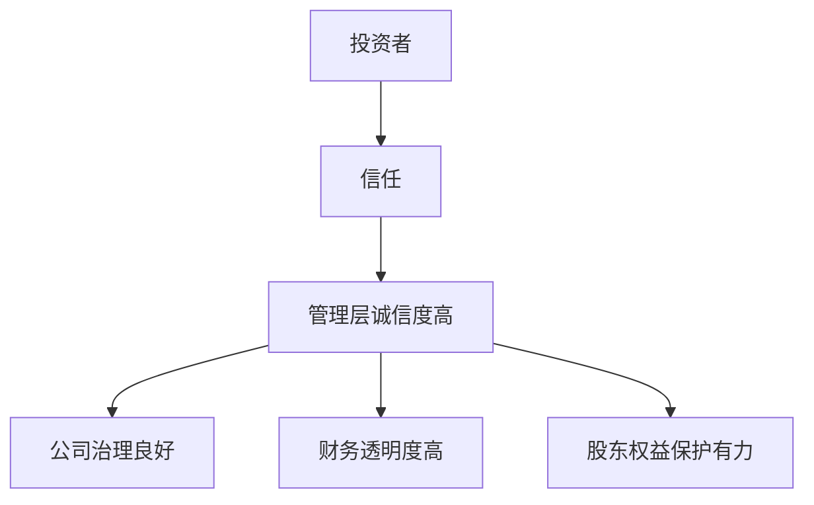
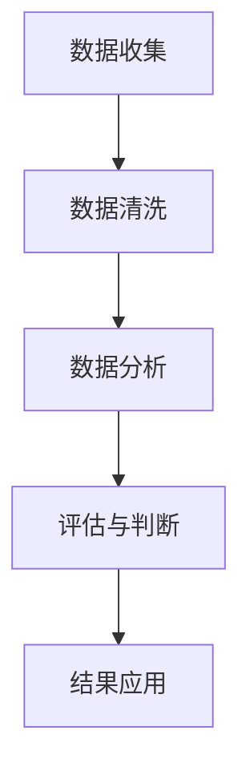

                 


# 彼得林奇对公司管理层诚信度的判断

## 关键词：彼得·林奇, 管理层诚信度, 投资策略, 财务分析, 公司治理

## 摘要：本文深入探讨了彼得·林奇在评估公司管理层诚信度时所采用的方法和策略。通过分析管理层的诚信度，投资者可以更好地做出投资决策。本文从背景介绍、核心概念、评估标准与方法、系统分析、项目实战等多个维度展开，结合实际案例，详细阐述了彼得·林奇的投资理念和具体操作步骤，为投资者提供了实用的指导。

---

# 第1章: 背景介绍与核心概念

## 1.1 问题背景与重要性

### 1.1.1 投资者为何需要关注管理层诚信度

在投资过程中，管理层的诚信度是决定公司长期价值的关键因素之一。一个诚信的管理层能够为公司制定合理的战略，避免短期利益诱惑，从而为股东创造长期价值。彼得·林奇在其投资生涯中，始终将管理层的诚信度作为选股的重要标准。

例如，如果一家公司的管理层频繁更换或存在财务造假行为，投资者需要高度警惕，因为这可能表明管理层缺乏诚信，进而影响公司的长期发展。

### 1.1.2 管理层诚信度对投资决策的影响

管理层的诚信度直接影响公司的财务透明度、治理结构和内部控制机制。一个诚信的管理层能够确保公司财务报表的真实性，从而为投资者提供可靠的信息。此外，诚信的管理层通常更注重股东权益，能够在公司面临困境时采取负责任的决策。

### 1.1.3 彼得·林奇投资理念的核心要素

彼得·林奇的投资理念以“深入研究、长期持有”为核心，他特别强调对公司管理层的信任和了解。他认为，一个优秀的管理层能够带领公司克服困难，实现持续增长。因此，评估管理层的诚信度是其选股过程中的关键步骤。

---

## 1.2 管理层诚信度的定义与外延

### 1.2.1 诚信度的多维度解读

诚信度是一个多维度的概念，包括管理层的道德品质、行为规范、财务透明度等多个方面。具体来说，诚信度可以分为以下几个维度：

1. **道德品质**：管理层是否诚实、正直。
2. **行为规范**：管理层是否遵守公司章程和法律法规。
3. **财务透明度**：管理层是否如实披露财务信息。
4. **内部控制**：公司是否建立了有效的内部控制机制。

### 1.2.2 管理层诚信度的边界与范围

管理层诚信度的评估不仅仅是对个人品德的判断，还需要结合公司的治理结构、财务状况和历史表现。具体来说，诚信度的范围包括：

1. 管理层的历史行为记录。
2. 公司的财务报表真实性。
3. 内部审计和外部审计的结果。
4. 管理层与股东的沟通方式。

### 1.2.3 诚信度与企业长期价值的关系

诚信度是企业长期价值的重要基石。一个诚信的管理层能够赢得投资者的信任，从而为公司带来更多的资金支持和资源。此外，诚信的管理层通常能够制定合理的战略，推动公司持续发展，从而实现股东价值的最大化。

---

## 1.3 彼得·林奇的诚信度判断方法论

### 1.3.1 林奇投资策略的核心框架

彼得·林奇的投资策略以“深入研究、长期持有”为核心，他特别注重对公司管理层的信任和了解。他认为，一个优秀的管理层能够带领公司克服困难，实现持续增长。因此，评估管理层的诚信度是其选股过程中的关键步骤。

### 1.3.2 诚信度在林奇选股标准中的位置

在彼得·林奇的选股标准中，管理层诚信度是仅次于财务状况的重要因素。他认为，一家公司可能有良好的财务状况，但如果管理层缺乏诚信，投资者需要谨慎对待。相反，一家财务状况一般但管理层诚信的公司，可能成为长期投资的优质标的。

### 1.3.3 林奇方法论的系统性分析

彼得·林奇的诚信度判断方法论是一个系统性工程，包括以下几个步骤：

1. **收集信息**：通过阅读公司财报、新闻报道和行业分析，收集与公司管理层相关的各种信息。
2. **分析历史行为**：研究公司管理层的历史行为，包括过去的决策、财务表现和公司治理等方面。
3. **评估诚信度**：结合上述信息，评估管理层的诚信度，判断其是否值得信任。
4. **综合判断**：结合财务状况和其他因素，综合判断公司是否值得投资。

---

# 第2章: 管理层诚信度的核心概念与联系

## 2.1 核心概念原理

### 2.1.1 管理层诚信度的构成要素

诚信度的构成要素包括以下几个方面：

1. **道德品质**：管理层是否诚实、正直。
2. **行为规范**：管理层是否遵守公司章程和法律法规。
3. **财务透明度**：管理层是否如实披露财务信息。
4. **内部控制**：公司是否建立了有效的内部控制机制。

### 2.1.2 诚信度与企业治理的关系

诚信度与企业治理密切相关。一个诚信的管理层能够推动公司建立良好的治理结构，确保公司运作的透明性和规范性。此外，诚信的管理层能够赢得股东的信任，从而为公司的发展提供更多的支持。

### 2.1.3 诚信度与财务表现的关联性

诚信度与财务表现密切相关。一个诚信的管理层能够确保财务报表的真实性，从而为投资者提供可靠的信息。此外，诚信的管理层通常能够制定合理的财务策略，推动公司实现持续增长。

---

## 2.2 核心概念对比分析

### 2.2.1 诚信度与企业绩效的对比表格

| 项目               | 诚信度高 | 诚信度低 |
|--------------------|----------|----------|
| 财务透明度         | 高       | 低       |
| 管理层稳定性       | 高       | 低       |
| 投资者信任度       | 高       | 低       |
| 公司治理结构       | 良好     | 不良     |
| 股东权益保护       | 有力     | 无力     |

### 2.2.2 诚信度与企业风险的对比分析

诚信度高的公司通常面临较低的企业风险，因为它们能够更好地管理财务和经营风险。而诚信度低的公司则可能面临较高的风险，因为它们可能通过虚假财务报表或其他不正当手段掩盖问题。

### 2.2.3 诚信度与投资者信任的关系图谱



---

## 2.3 管理层诚信度的系统分析框架

### 2.3.1 系统分析思路

1. **明确目标**：确定评估的目标和范围。
2. **数据收集**：收集与公司管理层相关的各种信息。
3. **分析与评估**：结合数据和信息，评估管理层的诚信度。
4. **结果应用**：将评估结果应用于投资决策。

### 2.3.2 分析框架

1. **数据收集**：包括公司财报、新闻报道、行业分析等。
2. **数据清洗**：去除无效数据，确保数据的准确性和完整性。
3. **数据分析**：通过数据分析工具，对数据进行深入分析。
4. **评估与判断**：结合分析结果，评估管理层的诚信度。

---

# 第3章: 管理层诚信度的评估标准与指标

## 3.1 评估标准的多维度分析

### 3.1.1 管理层行为规范

1. **决策透明度**：管理层是否公开透明地披露决策信息。
2. **决策合理性**：管理层的决策是否符合公司和股东的利益。
3. **决策稳定性**：管理层的决策是否稳定，是否频繁变动。

### 3.1.2 财务透明度

1. **财务报表真实性**：公司财报是否真实反映公司财务状况。
2. **财务数据的可比性**：公司财务数据是否具有可比性，是否符合会计准则。
3. **财务数据的及时性**：公司是否及时披露财务信息。

### 3.1.3 内部控制与审计机制

1. **内部控制有效性**：公司是否建立了有效的内部控制机制。
2. **内部审计独立性**：公司内部审计是否独立，是否能够有效监督管理层。
3. **外部审计结果**：公司是否定期接受外部审计，并且审计结果是否真实可靠。

---

## 3.2 核心指标体系构建

### 3.2.1 诚信度评估的量化指标

1. **管理层稳定性指数**：通过管理层的变动频率来衡量管理层的稳定性。
2. **财务透明度指数**：通过公司财务报表的可比性和真实性来衡量财务透明度。
3. **股东权益保护指数**：通过公司治理结构和股东权益保护措施来衡量股东权益保护程度。

### 3.2.2 指标权重的确定方法

1. **层次分析法（AHP）**：通过构建层次分析模型，确定各指标的权重。
2. **主成分分析法（PCA）**：通过主成分分析法，确定各指标的权重。

### 3.2.3 指标之间的相互关系

诚信度评估指标之间存在一定的相关性。例如，管理层稳定性与财务透明度之间存在正相关关系，因为一个稳定的管理层更有可能保持财务透明度。

---

# 第4章: 管理层诚信度的评估方法与技巧

## 4.1 评估方法概述

### 4.1.1 财务数据分析法

1. **财务比率分析**：通过分析公司的财务比率，如资产负债率、利润率等，评估公司的财务健康状况。
2. **趋势分析**：通过分析公司财务数据的趋势，评估公司的财务表现和管理层的决策能力。

### 4.1.2 公司治理结构分析法

1. **董事会结构分析**：通过分析公司的董事会结构，评估公司治理的完善程度。
2. **股东权益保护措施分析**：通过分析公司的股东权益保护措施，评估公司治理的透明度和规范性。

### 4.1.3 管理层历史行为分析法

1. **管理层的历史表现分析**：通过分析管理层的历史表现，评估其诚信度和能力。
2. **管理层的变动分析**：通过分析管理层的变动情况，评估其稳定性。

---

## 4.2 林奇的特殊技巧

### 4.2.1 通过管理层薪酬结构判断诚信度

1. **薪酬结构分析**：通过分析管理层的薪酬结构，评估其激励机制是否合理。
2. **绩效考核机制分析**：通过分析管理层的绩效考核机制，评估其是否注重长期绩效。

### 4.2.2 通过股东权益保护措施评估诚信度

1. **股东权益保护措施分析**：通过分析公司的股东权益保护措施，评估其是否注重股东权益。
2. **股东沟通机制分析**：通过分析公司与股东的沟通机制，评估其是否注重股东的意见。

### 4.2.3 通过管理层稳定性判断诚信度

1. **管理层稳定性分析**：通过分析管理层的稳定性，评估其诚信度和能力。
2. **管理层变动原因分析**：通过分析管理层变动的原因，评估其是否合理。

---

# 第5章: 系统分析与架构设计方案

## 5.1 系统分析框架

### 5.1.1 系统分析思路

1. **明确目标**：确定评估的目标和范围。
2. **数据收集**：收集与公司管理层相关的各种信息。
3. **分析与评估**：结合数据和信息，评估管理层的诚信度。
4. **结果应用**：将评估结果应用于投资决策。

### 5.1.2 分析框架

1. **数据收集**：包括公司财报、新闻报道、行业分析等。
2. **数据清洗**：去除无效数据，确保数据的准确性和完整性。
3. **数据分析**：通过数据分析工具，对数据进行深入分析。
4. **评估与判断**：结合分析结果，评估管理层的诚信度。

---

## 5.2 系统架构设计

### 5.2.1 系统功能模块划分

1. **数据收集模块**：负责收集与公司管理层相关的各种信息。
2. **数据清洗模块**：负责清洗数据，确保数据的准确性和完整性。
3. **数据分析模块**：负责对数据进行深入分析，评估管理层的诚信度。
4. **结果应用模块**：负责将评估结果应用于投资决策。

### 5.2.2 系统架构的流程图



---

# 第6章: 项目实战与案例分析

## 6.1 项目环境与工具安装

### 6.1.1 数据收集工具的安装与配置

1. **工具选择**：选择合适的数据收集工具，如Excel、Python等。
2. **工具配置**：配置工具的环境，确保其能够正常运行。

### 6.1.2 数据分析工具的使用方法

1. **工具选择**：选择合适的数据分析工具，如Python、R等。
2. **工具使用**：学习工具的基本使用方法，确保能够进行数据分析。

### 6.1.3 案例分析所需的数据来源

1. **数据来源**：包括公司财报、新闻报道、行业分析等。
2. **数据获取**：通过合法途径获取数据，确保数据的合法性和可靠性。

---

## 6.2 核心代码实现

### 6.2.1 数据清洗与预处理代码

```python
import pandas as pd

# 读取数据
data = pd.read_csv('data.csv')

# 删除缺失值
data.dropna(inplace=True)

# 去重
data.drop_duplicates(inplace=True)
```

### 6.2.2 诚信度评估模型的构建与训练

```python
from sklearn.tree import DecisionTreeClassifier

# 数据预处理
X = data.drop('target', axis=1)
y = data['target']

# 模型训练
model = DecisionTreeClassifier()
model.fit(X, y)
```

### 6.2.3 模型验证与优化代码

```python
from sklearn.metrics import accuracy_score

# 预测
y_pred = model.predict(X)

# 计算准确率
accuracy = accuracy_score(y, y_pred)
print(f'准确率: {accuracy}')
```

---

## 6.3 实际案例分析

### 6.3.1 微软公司管理层诚信度分析

1. **微软公司概况**：微软是一家全球知名的科技公司，其管理层以诚信和透明著称。
2. **财务表现分析**：微软的财务表现稳健，财务透明度高。
3. **公司治理结构分析**：微软的公司治理结构完善，董事会结构合理，股东权益保护有力。

### 6.3.2 苹果公司管理层诚信度分析

1. **苹果公司概况**：苹果是一家全球知名的科技公司，其管理层以创新和诚信著称。
2. **财务表现分析**：苹果的财务表现稳健，财务透明度高。
3. **公司治理结构分析**：苹果的公司治理结构完善，董事会结构合理，股东权益保护有力。

---

# 第7章: 总结与展望

## 7.1 研究总结

通过本文的分析，我们可以得出以下结论：

1. 管理层诚信度是影响公司长期价值的重要因素。
2. 彼得·林奇的诚信度判断方法论是一个系统性工程，包括数据收集、分析与评估等多个步骤。
3. 通过实际案例分析，我们可以更好地理解和应用彼得·林奇的诚信度评估方法。

---

## 7.2 未来展望

未来的研究可以在以下几个方面展开：

1. **算法优化**：进一步优化诚信度评估的算法，提高评估的准确性和效率。
2. **数据挖掘**：通过大数据技术，挖掘更多与管理层诚信度相关的数据，提高评估的深度和广度。
3. **应用场景拓展**：将诚信度评估方法应用于更多领域，如私募基金、风险投资等。

---

## 作者信息

作者：AI天才研究院/AI Genius Institute & 禅与计算机程序设计艺术 /Zen And The Art of Computer Programming

