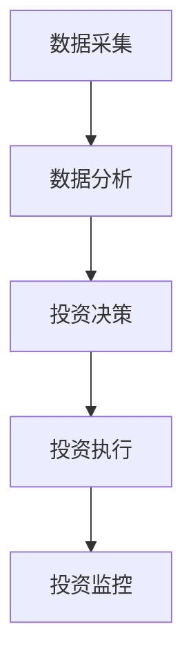

                 


# 彼得林奇的"耐心投资"在波动市场中的优势

> 关键词：彼得·林奇，耐心投资，波动市场，投资策略，风险管理，长期持有

> 摘要：本文深入探讨了彼得·林奇的耐心投资理念在波动市场中的优势，通过分析波动市场的特点、耐心投资的核心原则、数学模型与算法原理、系统架构设计、项目实战案例以及最佳实践，展示了耐心投资在复杂金融环境中的有效性和长期收益潜力。

---

## 第一部分: 彼得·林奇的“耐心投资”概述

### 第1章: 彼得·林奇与耐心投资理念

#### 1.1 彼得·林奇的投资哲学

##### 1.1.1 彼得·林奇的生平简介
彼得·林奇（Peter Lynch）是美国著名的投资专家，被誉为“股票投资之父”。他在富达投资管理公司（Fidelity）任职期间，管理着麦哲伦基金（Magellan Fund），取得了辉煌的投资业绩。林奇的投资理念强调长期持有优质股票，注重公司基本面分析，并倡导投资者坚持自己的投资策略，避免被短期市场波动干扰。

##### 1.1.2 耐心投资的核心理念
耐心投资的核心理念是通过长期持有优质股票，避免频繁交易，从而减少交易成本和情绪化决策的影响。林奇认为，短期市场波动是不可预测的，而优质公司的长期价值是可以通过基本面分析确定的。

##### 1.1.3 耐心投资与价值投资的联系与区别
耐心投资与价值投资有相似之处，都强调长期持有优质资产。但耐心投资更注重市场的短期波动和投资纪律，而价值投资更关注资产的内在价值和价格折扣。

---

#### 1.2 耐心投资的基本原则

##### 1.2.1 长期持有的投资策略
耐心投资的核心是长期持有优质股票，避免频繁买卖。林奇认为，短期交易容易受到市场波动的影响，而长期持有优质股票能够获得企业的成长收益。

##### 1.2.2 选择优质公司的标准
优质公司具有强大的竞争优势、稳定的财务状况和良好的管理团队。林奇强调，投资者应选择那些能够持续增长且估值合理的公司。

##### 1.2.3 避免短期市场波动的干扰
市场波动是投资中的常见现象，但短期波动并不能决定股票的长期价值。耐心投资通过长期持有优质股票，避免了短期波动的干扰。

---

#### 1.3 耐心投资的哲学意义

##### 1.3.1 投资中的耐心与纪律
耐心投资不仅仅是投资策略，更是一种投资纪律。林奇强调，投资者需要在市场波动中保持冷静，避免被情绪化决策影响。

##### 1.3.2 耐心与投资回报的关系
长期持有优质股票能够带来稳定的回报，而频繁交易则容易导致交易成本增加和投资回报下降。耐心投资通过减少交易次数，提高了长期投资回报。

##### 1.3.3 耐心投资在现代金融环境中的价值
在现代金融市场中，信息不对称和市场波动加剧，耐心投资为投资者提供了一种稳定的投资策略，帮助投资者在复杂环境中实现长期收益。

---

## 第2章: 波动市场的投资挑战

### 2.1 波动市场的基本特征

#### 2.1.1 市场波动的定义与表现
市场波动是指股票价格或其他金融资产价格在短时间内剧烈波动的现象。波动市场的特点是价格波动大、市场情绪不稳定、信息变化快。

#### 2.1.2 市场波动的周期性分析
市场波动具有周期性，通常分为上升、下降、震荡等阶段。投资者需要在波动中识别市场趋势和潜在机会。

#### 2.1.3 波动市场中的投资者行为
波动市场容易引发投资者的恐慌和贪婪情绪，导致非理性决策。投资者在波动市场中需要保持冷静，避免情绪化交易。

---

### 2.2 波动市场中的常见投资误区

#### 2.2.1 追涨杀跌的交易习惯
许多投资者在市场上涨时追高，市场下跌时杀跌，这种交易习惯容易导致亏损。耐心投资强调避免这种短期交易行为。

#### 2.2.2 短期收益与长期价值的混淆
投资者容易被短期收益迷惑，忽视长期价值。耐心投资通过长期持有优质股票，避免了这种混淆。

#### 2.2.3 情绪化投资的风险
市场波动容易引发情绪化投资，导致决策失误。耐心投资通过纪律性投资，避免了情绪化决策的影响。

---

### 2.3 波动市场中的投资策略选择

#### 2.3.1 被动投资与主动投资的对比
被动投资通过指数基金等方式，避免频繁交易。主动投资通过精选个股，实现超额收益。耐心投资更接近被动投资，但注重长期持有优质股票。

#### 2.3.2 均值回归与趋势投资的结合
均值回归假设市场价格会回归长期均值，而趋势投资则关注价格的持续走势。耐心投资可以通过结合这两种策略，应对市场波动。

#### 2.3.3 风险控制在波动市场中的重要性
波动市场中，风险控制是投资成功的关键。耐心投资通过长期持有优质股票和分散投资，降低了市场波动带来的风险。

---

## 第3章: 耐心投资在波动市场中的优势

### 3.1 耐心投资的核心优势

#### 3.1.1 长期视角下的价值发现
耐心投资通过长期持有优质股票，能够捕捉企业的长期成长价值，避免短期波动的干扰。

#### 3.1.2 避免短期市场波动的干扰
耐心投资通过减少交易次数，降低了交易成本和市场波动的影响，提高了投资回报。

#### 3.1.3 优质公司长期持有的收益
优质公司具有持续增长的潜力，长期持有能够获得稳定的收益。波动市场中，优质公司往往能够抵御短期波动，实现长期增长。

---

### 3.2 波动市场中耐心投资的策略

#### 3.2.1 选择优质公司的标准
优质公司具有强大的竞争优势、稳定的财务状况和良好的管理团队。投资者需要通过基本面分析，选择那些具有长期增长潜力的公司。

#### 3.2.2 长期持有与定期再平衡
耐心投资通过长期持有优质股票，避免频繁交易。同时，定期再平衡投资组合，确保投资策略与市场变化保持一致。

#### 3.2.3 风险控制与仓位管理
波动市场中，风险控制是投资成功的关键。耐心投资通过分散投资和风险控制，降低了市场波动带来的风险。

---

### 3.3 耐心投资的实际案例分析

#### 3.3.1 经典投资案例回顾
以苹果公司为例，长期持有苹果股票的投资者能够获得稳定的收益。即使在市场波动期间，苹果的长期增长潜力依然吸引投资者。

#### 3.3.2 案例中的经验与教训
长期持有优质股票需要耐心和纪律。市场波动期间，投资者需要避免恐慌性抛售，坚持持有优质股票。

#### 3.3.3 案例对当前投资策略的启示
优质公司的长期增长潜力是投资成功的关键。投资者需要通过基本面分析，选择那些具有长期增长潜力的公司。

---

## 第4章: 耐心投资的数学模型与算法原理

### 4.1 耐心投资的数学模型

#### 4.1.1 股票价值的评估模型
股票价值可以通过市盈率（P/E）、市净率（P/B）等指标进行评估。优质公司通常具有合理的估值和稳定的盈利增长。

#### 4.1.2 长期收益的计算公式
长期收益可以通过复利公式计算。复利公式为：
$$
FV = PV \times (1 + r)^n
$$
其中，FV为终值，PV为现值，r为年化收益率，n为投资期限。

#### 4.1.3 市场波动对投资组合的影响
市场波动可以通过波动率（Volatility）来衡量。波动率是衡量资产价格波动程度的指标，通常用标准差表示。

---

### 4.2 投资组合优化的算法

#### 4.2.1 Markowitz有效前沿理论
Markowitz有效前沿理论通过优化投资组合的风险和收益，找到最优的投资组合。投资者可以通过有效前沿理论，选择最优的长期持有投资组合。

#### 4.2.2 风险调整后的收益优化
风险调整后的收益可以通过夏普比率（Sharpe Ratio）来衡量。夏普比率公式为：
$$
Sharpe Ratio = \frac{E(r - r_f)}{\sigma}
$$
其中，\( E(r - r_f) \)为投资组合的预期超额收益，\( \sigma \)为投资组合的波动率。

#### 4.2.3 长期投资组合的构建与调整
长期投资组合的构建需要考虑资产配置、风险承受能力和投资目标。定期再平衡投资组合，确保投资策略与市场变化保持一致。

---

### 4.3 波动市场中的风险管理算法

#### 4.3.1 风险价值（VaR）模型
风险价值（VaR）模型用于衡量投资组合在一定置信水平下的潜在损失。VaR公式为：
$$
VaR = \text{损失的金额}
$$
其中，损失的金额取决于置信水平和投资组合的波动性。

#### 4.3.2 风险调整后的投资策略
投资者可以通过调整投资组合的权重，降低高风险资产的比例，增加低风险资产的比例，从而降低整体投资组合的风险。

#### 4.3.3 跌幅限制与止损机制
投资者可以通过设定止损点，限制投资组合的最大亏损。止损机制可以通过技术指标或固定比例来实现。

---

## 第5章: 系统分析与架构设计方案

### 5.1 投资决策系统的整体架构

#### 5.1.1 系统功能模块划分
投资决策系统主要包括数据采集、数据分析、投资决策、投资执行和投资监控五个模块。

#### 5.1.2 系统输入与输出的定义
输入包括市场数据、公司基本面数据和投资者需求，输出包括投资组合建议、风险评估和市场分析报告。

#### 5.1.3 系统架构的流程图
以下为投资决策系统的流程图：



---

### 5.2 风险控制系统的实现

#### 5.2.1 风险价值（VaR）模型
风险价值模型用于衡量投资组合的风险。投资者可以通过VaR模型，了解投资组合在不同置信水平下的潜在损失。

#### 5.2.2 风险调整后的投资策略
投资者可以通过调整投资组合的权重，降低高风险资产的比例，增加低风险资产的比例，从而降低整体投资组合的风险。

#### 5.2.3 跌幅限制与止损机制
投资者可以通过设定止损点，限制投资组合的最大亏损。止损机制可以通过技术指标或固定比例来实现。

---

## 第6章: 项目实战

### 6.1 环境安装

#### 6.1.1 数据采集工具
投资者需要安装数据采集工具，如Yahoo Finance API或Quandl API。

#### 6.1.2 数据分析工具
投资者需要安装数据分析工具，如Python的Pandas和NumPy库。

#### 6.1.3 投资决策工具
投资者需要安装投资决策工具，如Excel或专业的投资组合管理软件。

---

### 6.2 系统核心实现源代码

#### 6.2.1 数据采集代码
以下为Python代码，用于从Yahoo Finance API获取股票数据：

```python
import pandas_datareader as pdr

# 获取苹果公司的股票数据
data = pdr.get_data_yahoo('AAPL', start='2020-01-01', end='2023-12-31')
print(data)
```

#### 6.2.2 数据分析代码
以下为Python代码，用于计算股票的波动率：

```python
import numpy as np

# 计算苹果股票的波动率
log_returns = np.log(data['Adj Close'].pct_change().dropna())
volatility = log_returns.std() * np.sqrt(252)
print("波动率:", volatility)
```

#### 6.2.3 投资组合优化代码
以下为Python代码，用于优化投资组合：

```python
import numpy as np
from scipy.optimize import minimize

# 定义目标函数
def portfolio_variance(weights, covariance_matrix):
    return np.dot(weights.T, np.dot(covariance_matrix, weights))

# 定义约束条件
def constraint(weights):
    return np.sum(weights) - 1

# 最优化问题
covariance_matrix = data.cov()
initial_guess = np.array([1.0] * len(covariance_matrix)) / len(covariance_matrix)
result = minimize(portfolio_variance, initial_guess, args=(covariance_matrix,), constraints={'type': 'eq', 'fun': constraint})
optimal_weights = result.x
print("最优权重:", optimal_weights)
```

---

### 6.3 实际案例分析

#### 6.3.1 案例背景
以苹果公司为例，投资者长期持有苹果股票，通过耐心投资策略，实现稳定的收益。

#### 6.3.2 数据分析
通过数据分析，投资者可以发现苹果公司的长期增长潜力，从而决定长期持有苹果股票。

#### 6.3.3 投资决策
投资者通过投资组合优化算法，选择最优的投资组合，降低市场波动带来的风险。

#### 6.3.4 投资执行
投资者根据投资决策，执行投资操作，长期持有优质股票。

#### 6.3.5 投资监控
投资者定期监控投资组合的表现，调整投资策略，确保投资目标的实现。

---

## 第7章: 总结与最佳实践

### 7.1 总结

耐心投资是一种有效的投资策略，通过长期持有优质股票，避免短期市场波动的干扰，实现稳定的收益。波动市场中，耐心投资的优势更加明显，优质公司长期持有的收益潜力巨大。

---

### 7.2 最佳实践 tips

- **坚持长期投资**：长期持有优质股票，避免频繁交易。
- **选择优质公司**：通过基本面分析，选择具有长期增长潜力的公司。
- **风险控制**：通过分散投资和风险控制，降低市场波动带来的风险。
- **定期再平衡**：定期调整投资组合，确保投资策略与市场变化保持一致。

---

### 7.3 注意事项

- **避免短期交易**：短期交易容易导致亏损。
- **控制情绪化决策**：市场波动容易引发情绪化决策，投资者需要保持冷静。
- **关注公司基本面**：优质公司是长期投资的基础。

---

### 7.4 拓展阅读

- 《彼得·林奇的投资经典》
- 《投资学原理》
- 《波动市场的投资策略》

---

## 作者：AI天才研究院/AI Genius Institute & 禅与计算机程序设计艺术 /Zen And The Art of Computer Programming

