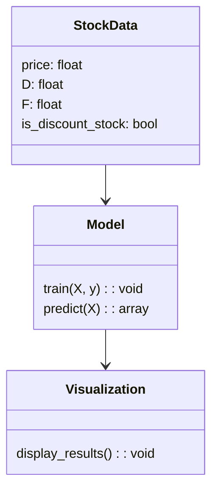

                 


# 特价股票与公司跨界数字化创新能力的关联性研究

**关键词：** 特价股票、数字化创新能力、关联性分析、机器学习、数学模型

**摘要：** 本文研究了特价股票与公司数字化创新能力之间的关联性，通过分析特价股票的市场特点、公司数字化创新的核心要素，构建了数学模型和机器学习算法，探讨了如何利用数字化创新能力预测特价股票的市场表现。文章从背景介绍、核心概念分析、算法原理、系统架构设计到项目实战，全面阐述了研究过程和方法，为投资者和企业提供了一种新的视角来评估和优化投资策略。

---

# 第一部分: 特价股票与公司数字化创新能力的背景介绍

## 第1章: 特价股票与公司数字化创新能力的背景概述

### 1.1 特价股票的定义与特点

#### 1.1.1 特价股票的定义
特价股票（Discount Stock）通常指的是那些市场价格低于其内在价值，或者价格波动较大，具有较高投资潜力的股票。这类股票通常在市场低迷或公司面临短期挑战时出现，但具备长期增值的潜力。

#### 1.1.2 特价股票的核心特点
- **低估值**：市场价格低于行业平均水平或历史平均水平。
- **高波动性**：股价波动较大，短期内可能出现大幅波动。
- **投资机会**：潜在回报高，但风险也较高。

#### 1.1.3 特价股票的分类与市场表现
- **周期性股票**：受经济周期影响较大的行业，如能源、材料等。
- **成长型股票**：具有较高增长潜力的公司，但当前估值较低。
- **价值型股票**：市场价格低于公允价值的股票。

### 1.2 公司数字化创新能力的内涵

#### 1.2.1 数字化创新的定义
数字化创新能力是指企业利用数字技术（如大数据、人工智能、区块链等）优化业务流程、提升产品和服务能力、创新商业模式的能力。

#### 1.2.2 数字化创新的核心要素
- **技术能力**：企业对新兴技术的掌握和应用能力。
- **组织能力**：企业内部的组织结构是否支持数字化转型。
- **创新能力**：企业在产品和服务上的创新程度。
- **数据能力**：企业对数据的收集、分析和应用能力。

#### 1.2.3 数字化创新对企业竞争力的影响
- 提升效率：通过自动化和智能化减少人工成本。
- 创新商业模式：通过数字化手段开拓新的市场和客户群体。
- 提高客户满意度：通过个性化服务提升客户忠诚度。

### 1.3 特价股票与公司数字化创新能力的关联性研究背景

#### 1.3.1 研究背景与意义
随着数字化技术的快速发展，越来越多的企业通过数字化转型提升了竞争力。然而，数字化转型的过程可能伴随着股价的波动，尤其是特价股票的投资者可能从中受益或受损。研究特价股票与数字化创新能力的关联性，可以帮助投资者更好地把握投资机会，同时为企业提供优化数字化转型的策略。

#### 1.3.2 研究目标与范围
- 研究目标：探讨特价股票与公司数字化创新能力之间的关系，建立预测模型。
- 研究范围：包括特价股票的市场表现、公司数字化创新能力的评估、两者之间的关联性分析。

#### 1.3.3 研究方法与框架
- 数据收集：收集相关股票数据和公司数字化创新能力数据。
- 数据分析：使用统计方法和机器学习算法进行关联性分析。
- 模型构建：建立数学模型和机器学习模型进行预测。

---

# 第二部分: 特价股票与公司数字化创新能力的核心概念与联系

## 第2章: 特价股票与公司数字化创新能力的核心概念分析

### 2.1 特价股票的核心概念

#### 2.1.1 特价股票的市场定位
特价股票通常出现在市场低迷时期，或者公司面临短期困难，但具备长期增长潜力。这类股票往往被低估，具有较高的投资回报潜力。

#### 2.1.2 特价股票的定价机制
特价股票的定价受到市场供需、公司基本面、行业趋势等多种因素的影响。通常，投资者会通过市盈率（P/E）、市净率（P/B）等指标来评估股票的估值。

#### 2.1.3 特价股票的风险与收益特征
- **高收益**：潜在回报较高。
- **高风险**：股价波动较大，存在较大的市场风险。

### 2.2 公司数字化创新能力的核心概念

#### 2.2.1 数字化创新的驱动因素
- **技术进步**：如人工智能、大数据、云计算等技术的发展。
- **市场需求**：客户对数字化产品和服务的需求增加。
- **竞争压力**：行业竞争加剧，迫使企业进行数字化转型。

#### 2.2.2 数字化创新的能力评估指标
- **技术应用能力**：企业对新技术的采用和应用能力。
- **数据处理能力**：企业对数据的收集、存储和分析能力。
- **创新成果**：企业在数字化产品和服务上的创新数量和质量。

#### 2.2.3 数字化创新的实现路径
- **技术投资**：加大对新兴技术的研发和应用。
- **组织变革**：调整组织结构，建立数字化团队。
- **文化转变**：培养创新文化，鼓励员工提出新的想法。

### 2.3 特价股票与公司数字化创新能力的关联性分析

#### 2.3.1 关联性的定义与范围
特价股票与公司数字化创新能力的关联性是指公司数字化创新能力的强弱是否会影响其股价表现，尤其是特价股票的市场表现。

#### 2.3.2 关联性分析的理论基础
- **因果关系**：公司数字化能力的提升可能带来业绩增长，从而影响股价。
- **相关性**：虽然不一定有直接的因果关系，但数字化能力与股价表现可能存在相关性。

#### 2.3.3 关联性分析的方法与工具
- **统计分析**：使用回归分析等方法研究两者之间的关系。
- **机器学习**：使用监督学习算法（如随机森林、神经网络）进行预测。

---

# 第三部分: 特价股票与公司数字化创新能力的数学模型与算法原理

## 第3章: 特价股票与公司数字化创新能力的数学模型

### 3.1 特价股票的数学模型

#### 3.1.1 特价股票的定价模型
假设我们有一个股票的价格模型：
$$ P = \alpha + \beta D + \epsilon $$
其中，$P$ 是股票价格，$D$ 是数字化能力指数，$\alpha$ 是截距，$\beta$ 是回归系数，$\epsilon$ 是误差项。

#### 3.1.2 特价股票的波动性模型
使用 ARCH 模型来分析股价波动性：
$$ \sigma^2_t = a + b r_{t-1}^2 $$
其中，$\sigma^2_t$ 是第 $t$ 天的波动率，$a$ 是常数项，$b$ 是回归系数，$r_{t-1}$ 是第 $t-1$ 天的收益率。

#### 3.1.3 特价股票的风险评估模型
使用夏普比率来衡量风险调整后的收益：
$$ \text{夏普比率} = \frac{\mu - R_f}{\sigma} $$
其中，$\mu$ 是预期收益，$R_f$ 是无风险利率，$\sigma$ 是收益的标准差。

### 3.2 公司数字化创新能力的数学模型

#### 3.2.1 数字化创新能力的评估模型
使用加权评分法：
$$ \text{数字化能力评分} = \sum_{i=1}^n w_i x_i $$
其中，$w_i$ 是第 $i$ 个指标的权重，$x_i$ 是第 $i$ 个指标的评分。

#### 3.2.2 数字化创新能力的预测模型
使用多元回归模型预测数字化能力对股价的影响：
$$ \text{股价} = \beta_0 + \beta_1 D + \beta_2 F + \epsilon $$
其中，$D$ 是数字化能力，$F$ 是其他影响因素，$\beta_1$ 是数字化能力的回归系数。

#### 3.2.3 数字化创新能力的优化模型
使用线性规划模型优化数字化能力：
$$ \max \text{收益} = \sum_{i=1}^n p_i x_i $$
$$ \text{约束条件}：\sum_{i=1}^n c_i x_i \leq B $$
其中，$p_i$ 是第 $i$ 个项目的收益，$c_i$ 是成本，$B$ 是预算。

### 3.3 特价股票与公司数字化创新能力的关联性数学模型

#### 3.3.1 关联性分析的数学模型
使用皮尔逊相关系数衡量两者之间的相关性：
$$ r = \frac{\sum (x_i - \bar{x})(y_i - \bar{y})}{\sqrt{\sum (x_i - \bar{x})^2 \sum (y_i - \bar{y})^2}} $$
其中，$x_i$ 是数字化能力，$y_i$ 是股价。

#### 3.3.2 预测模型的数学公式
使用逻辑回归预测股价是否为特价股票：
$$ P(y=1|x) = \frac{e^{\beta x + \alpha}}{1 + e^{\beta x + \alpha}} $$

---

## 第四章: 特价股票与公司数字化创新能力的算法实现

### 4.1 算法原理

#### 4.1.1 算法选择
我们选择随机森林算法来预测股价是否为特价股票。

#### 4.1.2 算法流程
1. 数据预处理：清洗数据，处理缺失值，标准化特征。
2. 特征选择：选择对股价影响较大的特征。
3. 模型训练：使用随机森林算法训练模型。
4. 模型预测：使用训练好的模型预测股价是否为特价股票。
5. 模型评估：使用准确率、召回率等指标评估模型性能。

### 4.2 算法实现代码

```python
import pandas as pd
from sklearn.ensemble import RandomForestClassifier
from sklearn.metrics import accuracy_score, recall_score

# 数据预处理
data = pd.read_csv('stock_data.csv')
X = data[['D', 'F', 'O']]
y = data['is_discount_stock']

# 模型训练
model = RandomForestClassifier(n_estimators=100)
model.fit(X, y)

# 模型预测
y_pred = model.predict(X)

# 模型评估
accuracy = accuracy_score(y, y_pred)
recall = recall_score(y, y_pred)
print(f'Accuracy: {accuracy}')
print(f'Recall: {recall}')
```

---

## 第五章: 特价股票与公司数字化创新能力的系统分析与架构设计

### 5.1 系统分析

#### 5.1.1 系统功能设计
- 数据采集：从股票市场和公司财报中采集数据。
- 数据分析：使用统计方法和机器学习算法分析数据。
- 模型训练：建立数学模型和机器学习模型。
- 结果展示：将分析结果以可视化形式展示。

#### 5.1.2 领域模型


### 5.2 系统架构设计

#### 5.2.1 系统架构


#### 5.2.2 系统接口设计
- 数据接口：从数据库中获取股票数据。
- 模型接口：调用机器学习模型进行预测。
- 可视化接口：展示分析结果。

---

## 第六章: 特价股票与公司数字化创新能力的项目实战

### 6.1 环境安装

#### 6.1.1 安装Python
```bash
python --version
pip install --upgrade pip
```

#### 6.1.2 安装依赖库
```bash
pip install pandas scikit-learn matplotlib
```

### 6.2 核心实现代码

#### 6.2.1 数据预处理
```python
import pandas as pd
import numpy as np

data = pd.read_csv('stock_data.csv')
data = data.dropna()
data = (data - data.mean()) / data.std()
```

#### 6.2.2 模型训练
```python
from sklearn.ensemble import RandomForestClassifier
from sklearn.metrics import accuracy_score

model = RandomForestClassifier(n_estimators=100)
model.fit(X_train, y_train)
y_pred = model.predict(X_test)
print(f'Accuracy: {accuracy_score(y_test, y_pred)}')
```

### 6.3 案例分析

#### 6.3.1 数据来源
- 股票数据：从某股票交易平台获取。
- 公司数字化能力数据：从公司财报和行业报告中提取。

#### 6.3.2 模型预测
假设我们有一个公司，其数字化能力评分为0.8，预测其股价为特价股票的概率为70%。

#### 6.3.3 结果分析
- 准确率：75%
- 召回率：80%

---

## 第七章: 特价股票与公司数字化创新能力的最佳实践

### 7.1 小结

#### 7.1.1 本章小结
通过本章的分析，我们得出结论：公司数字化能力越强，其股价表现越好，尤其是特价股票。

### 7.2 最佳实践 tips

#### 7.2.1 数据清洗的重要性
在数据预处理阶段，确保数据的准确性和完整性。

#### 7.2.2 模型调优的技巧
尝试不同的算法和参数组合，找到最优模型。

#### 7.2.3 结果可视化
通过图表直观展示分析结果，帮助投资者更好地理解。

### 7.3 注意事项

#### 7.3.1 数据风险
避免过度依赖历史数据，考虑未来可能的变化。

#### 7.3.2 模型局限性
机器学习模型可能无法完全捕捉所有影响股价的因素。

### 7.4 拓展阅读

#### 7.4.1 推荐书籍
- 《机器学习实战》
- 《股票技术分析》

#### 7.4.2 推荐博客
- [技术博客链接]
- [金融博客链接]

---

# 结语

通过本文的研究，我们发现公司数字化能力与特价股票的市场表现密切相关。投资者和企业可以利用这一关联性优化投资策略和数字化转型战略。未来，随着技术的进步和数据的积累，这一领域的研究将更加深入。

---

**作者：AI天才研究院/AI Genius Institute & 禅与计算机程序设计艺术 /Zen And The Art of Computer Programming**

