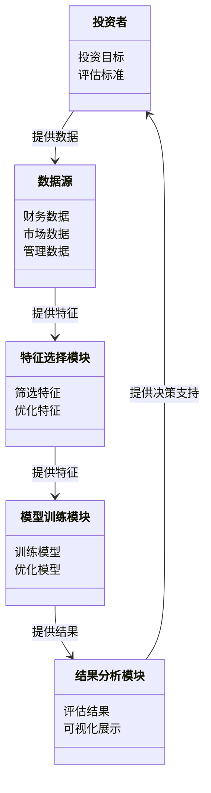
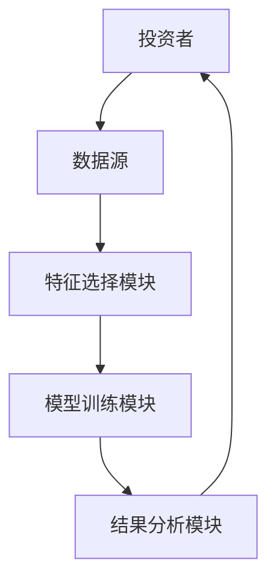
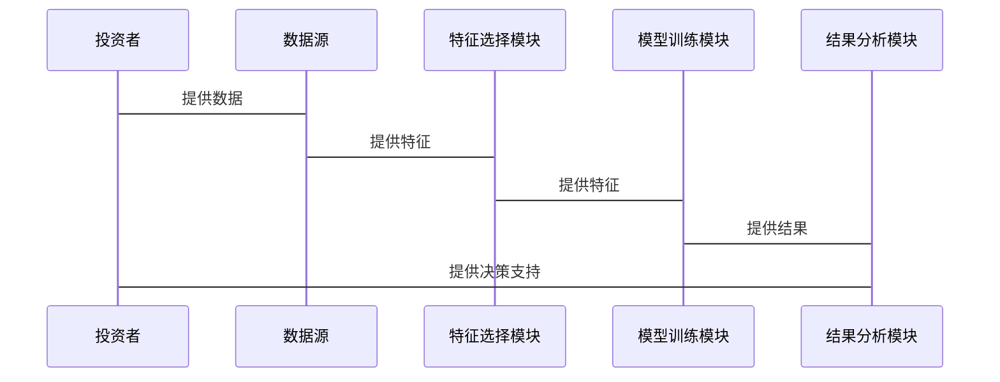

                 


# 芒格的"关键变量"识别：找出投资成功的决定因素

> 关键词：芒格，关键变量，投资成功，决策因素，数学模型，系统架构，项目实战

> 摘要：本文深入探讨了芒格的“关键变量”识别方法，分析了投资成功的决定因素，结合数学模型和系统架构，详细讲解了如何通过关键变量识别来优化投资决策，并通过项目实战展示了实际应用。

---

# 第一部分: 引言

## 第1章: 芒格的"关键变量"识别概述

### 1.1 芒格的生平与投资理念
格雷厄姆·芒格（Charlie Munger）是巴菲特的长期合作伙伴，也是价值投资的倡导者。他提出了“关键变量”识别的方法，认为在投资决策中，关键变量是影响投资成功的核心因素。芒格的“关键变量”识别方法基于对商业逻辑、市场趋势和公司基本面的深刻理解，强调通过分析关键变量来预测公司未来的表现。

### 1.2 "关键变量"识别的定义与背景
关键变量识别是指在复杂系统中，识别出对系统输出结果起决定性作用的少数变量。在投资领域，关键变量识别帮助投资者聚焦于影响公司价值的核心因素，从而做出更明智的投资决策。关键变量识别的背景在于金融市场中信息的复杂性和不确定性，通过识别关键变量，投资者可以简化决策过程，提高投资效率。

### 1.3 本章小结
本章介绍了芒格的生平及其投资理念，重点阐述了“关键变量”识别的定义和背景。关键变量识别是芒格投资成功的核心方法之一，通过聚焦关键变量，投资者能够更准确地评估公司的价值和潜力。

---

# 第二部分: 关键变量识别的核心概念

## 第2章: 关键变量识别的理论基础

### 2.1 投资成功的决定因素
投资成功的决定因素包括公司的财务状况、行业地位、管理团队、市场环境等多个方面。关键变量识别的目标是筛选出对投资结果影响最大的变量，例如公司的盈利能力、市场占有率、研发投入等。

#### 2.1.1 投资成功的定义
投资成功是指在长期时间内实现资本增值，通常以收益率、风险控制和投资组合的稳定性为衡量标准。

#### 2.1.2 投资成功的决定因素分析
通过对历史投资数据的分析，可以发现某些变量对投资结果的影响更为显著，例如公司治理、行业竞争格局、宏观经济环境等。

#### 2.1.3 关键变量识别的逻辑框架
关键变量识别的逻辑框架包括以下几个步骤：
1. 确定投资目标和评估标准。
2. 收集与投资目标相关的变量。
3. 通过数据分析和逻辑推理，筛选出关键变量。
4. 验证关键变量的影响力，并进行动态调整。

### 2.2 关键变量的分类与特征
关键变量可以根据其影响力和可测性进行分类，例如财务变量、市场变量、管理变量等。关键变量的特征包括高度相关性、可测性、可预测性和稳定性。

#### 2.2.1 关键变量的分类
1. **财务变量**：如净利润、资产负债率、现金流等。
2. **市场变量**：如行业增长率、市场占有率、竞争格局等。
3. **管理变量**：如管理团队的经验、战略规划、企业治理等。

#### 2.2.2 关键变量的特征对比
| 特征 | 财务变量 | 市场变量 | 管理变量 |
|------|----------|----------|----------|
| 相关性 | 高       | 高       | 中       |
| 可测性 | 高       | 中       | 中       |
| 可预测性 | 中       | 低       | 高       |
| 稳定性 | 高       | 中       | 中       |

#### 2.2.3 关键变量的识别标准
关键变量的识别标准包括：
1. 变量与投资目标的高相关性。
2. 变量的可测性和可预测性。
3. 变量的稳定性和长期影响力。

### 2.3 关键变量识别的流程与方法
关键变量识别的流程包括数据收集、数据分析和逻辑推理，具体方法包括统计分析、逻辑推理和专家判断。

#### 2.3.1 关键变量识别的基本流程
1. **数据收集**：收集与投资目标相关的变量数据。
2. **数据分析**：通过统计分析和数据可视化，识别出对目标影响较大的变量。
3. **逻辑推理**：结合行业知识和逻辑推理，筛选出关键变量。
4. **验证与优化**：通过历史数据验证关键变量的影响力，并进行动态调整。

#### 2.3.2 关键变量识别的具体方法
1. **统计分析法**：通过回归分析、方差分析等统计方法，筛选出显著影响目标的变量。
2. **逻辑推理法**：结合行业知识和商业逻辑，推断出关键变量。
3. **专家判断法**：邀请行业专家进行评估和筛选。

#### 2.3.3 关键变量识别的注意事项
1. 关键变量的识别需要结合定量分析和定性分析。
2. 关键变量的选择应基于数据的可靠性和完整性。
3. 关键变量的影响力可能随时间和环境变化而变化，需要动态调整。

---

## 第3章: 关键变量识别的数学模型与算法

### 3.1 关键变量识别的数学模型
关键变量识别的数学模型通常基于回归分析和特征选择算法，例如线性回归、逻辑回归、随机森林等。

#### 3.1.1 数学模型的构建
关键变量识别的数学模型通常包括以下几个步骤：
1. 数据预处理：对数据进行清洗和标准化。
2. 特征选择：通过统计方法或机器学习算法，筛选出重要特征。
3. 模型训练：基于选定的特征训练模型，并评估模型的性能。
4. 模型优化：通过调整参数和特征选择，优化模型的性能。

#### 3.1.2 数学模型的假设条件
关键变量识别的数学模型通常假设：
1. 数据服从一定的分布（如正态分布）。
2. 变量之间的关系是线性或非线性的。
3. 数据中不存在多重共线性问题。

#### 3.1.3 数学模型的验证与优化
模型的验证与优化可以通过交叉验证、网格搜索等方法实现，确保模型的泛化能力和预测精度。

### 3.2 关键变量识别的算法实现

#### 3.2.1 算法的原理与步骤
以线性回归为例，关键变量识别的算法步骤如下：
1. 数据预处理：清洗数据，处理缺失值和异常值。
2. 特征选择：使用逐步回归或Lasso回归，筛选出重要特征。
3. 模型训练：基于选定的特征训练线性回归模型。
4. 模型评估：计算模型的R²值和残差，评估模型的性能。
5. 模型优化：通过调整正则化参数，优化模型的性能。

#### 3.2.2 算法的代码实现
以下是Python代码示例：

```python
import pandas as pd
import numpy as np
from sklearn.linear_model import Lasso
from sklearn.metrics import r2_score

# 数据预处理
data = pd.read_csv('investment_data.csv')
X = data.drop('target', axis=1)
y = data['target']

# 特征选择
lasso = Lasso(alpha=0.1)
lasso.fit(X, y)
selected_features = np.where(lasso.coef_ != 0)[0]
selected_X = X.iloc[:, selected_features]

# 模型训练
model = Lasso(alpha=0.1)
model.fit(selected_X, y)

# 模型评估
y_pred = model.predict(selected_X)
r2 = r2_score(y, y_pred)
print(f'R² score: {r2}')
```

#### 3.2.3 算法的优缺点分析
1. **线性回归**：优点是简单易懂，计算速度快；缺点是无法处理非线性关系。
2. **随机森林**：优点是能够处理非线性关系，对多重共线性不敏感；缺点是解释性较差。
3. **Lasso回归**：优点是能够进行特征选择，适合高维数据；缺点是需要调整正则化参数。

### 3.3 算法的数学公式与推导

#### 3.3.1 线性回归的数学公式
线性回归的数学公式为：
$$ y = \beta_0 + \beta_1 x_1 + \beta_2 x_2 + \dots + \beta_n x_n + \epsilon $$
其中，$\beta_0$ 是截距，$\beta_1, \beta_2, \dots, \beta_n$ 是回归系数，$\epsilon$ 是误差项。

#### 3.3.2 Lasso回归的数学公式
Lasso回归在最小二乘的基础上引入L1正则化项：
$$ \text{损失函数} = \sum_{i=1}^{n} (y_i - \hat{y}_i)^2 + \alpha \sum_{j=1}^{p} |\beta_j| $$

---

# 第三部分: 关键变量识别的系统分析与架构设计

## 第4章: 关键变量识别系统的功能设计

### 4.1 系统功能需求分析
关键变量识别系统的功能需求包括数据采集、特征选择、模型训练、结果分析和可视化展示。

#### 4.1.1 系统的功能目标
关键变量识别系统的功能目标是帮助投资者快速识别影响投资结果的关键变量，优化投资决策。

#### 4.1.2 系统的功能模块划分
系统功能模块包括：
1. 数据采集模块：负责数据的采集和预处理。
2. 特征选择模块：负责特征的筛选和优化。
3. 模型训练模块：负责模型的训练和优化。
4. 结果分析模块：负责结果的分析和可视化。
5. 可视化展示模块：负责数据和结果的可视化展示。

#### 4.1.3 系统的功能流程设计
1. 数据采集：从数据库或外部文件中获取数据。
2. 数据预处理：清洗数据，处理缺失值和异常值。
3. 特征选择：通过算法筛选出重要特征。
4. 模型训练：基于选定的特征训练模型。
5. 结果分析：评估模型的性能，优化模型参数。
6. 可视化展示：将结果以图表形式展示出来。

### 4.2 系统的领域模型设计

#### 4.2.1 领域模型的定义
领域模型是对系统所涉及的领域概念及其关系的抽象描述，通常用UML图表示。

#### 4.2.2 领域模型的构建
以下是领域模型的Mermaid图：



#### 4.2.3 领域模型的验证与优化
领域模型的验证可以通过与实际业务流程的对比进行，优化可以通过增加更多特征或调整模型参数实现。

### 4.3 系统的架构设计

#### 4.3.1 系统架构的总体设计
关键变量识别系统的总体架构包括前端、后端和数据库三部分。

#### 4.3.2 系统架构的详细设计
以下是系统的架构图：



#### 4.3.3 系统架构的实现步骤
1. 前端开发：使用React或Vue.js实现用户界面。
2. 后端开发：使用Python或Java实现业务逻辑。
3. 数据库设计：使用MySQL或MongoDB存储数据。
4. 系统集成：将各模块集成到一个统一的系统中。

## 第5章: 关键变量识别系统的接口与交互设计

### 5.1 系统接口设计

#### 5.1.1 系统接口的定义
系统接口包括数据接口和API接口，数据接口用于数据的输入和输出，API接口用于系统模块之间的通信。

#### 5.1.2 系统接口的详细设计
以下是系统接口的描述：
1. 数据接口：`/api/data`，用于上传和下载数据。
2. 特征选择接口：`/api/feature_selection`，用于特征选择和优化。
3. 模型训练接口：`/api/model_training`，用于模型训练和优化。
4. 结果分析接口：`/api/result_analysis`，用于结果分析和可视化。

#### 5.1.3 系统接口的实现步骤
1. 数据接口的实现：使用Flask或Django框架实现RESTful API。
2. 特征选择接口的实现：调用特征选择算法，返回筛选后的特征。
3. 模型训练接口的实现：调用机器学习模型，返回训练结果。
4. 结果分析接口的实现：调用分析工具，返回分析结果。

### 5.2 系统的交互设计

#### 5.2.1 系统交互的流程设计
以下是系统的交互流程图：



#### 5.2.2 系统交互的详细设计
1. 投资者提供数据：投资者上传数据到系统。
2. 数据预处理：系统对数据进行清洗和标准化。
3. 特征选择：系统通过算法筛选出重要特征。
4. 模型训练：系统基于选定的特征训练模型。
5. 结果分析：系统评估模型的性能，并将结果可视化。
6. 决策支持：投资者根据系统提供的结果做出投资决策。

---

# 第四部分: 项目实战

## 第6章: 关键变量识别项目的环境安装与实现

### 6.1 项目环境的安装
关键变量识别项目需要安装以下环境：
1. Python 3.6及以上版本
2. Jupyter Notebook或IDE（如PyCharm）
3. Python库：numpy、pandas、scikit-learn、matplotlib

安装命令：
```bash
pip install numpy pandas scikit-learn matplotlib
```

### 6.2 项目核心实现源代码

#### 6.2.1 数据预处理代码
```python
import pandas as pd
import numpy as np

# 读取数据
data = pd.read_csv('investment_data.csv')

# 处理缺失值
data = data.dropna()

# 标准化数据
from sklearn.preprocessing import StandardScaler
scaler = StandardScaler()
scaled_data = scaler.fit_transform(data)
```

#### 6.2.2 特征选择代码
```python
from sklearn.linear_model import Lasso
from sklearn.feature_selection import SelectFromModel

# 特征选择
selector = SelectFromModel(Lasso(alpha=0.1))
selector.fit(scaled_data, y)

# 获取筛选后的特征
selected_features = selector.get_support(indices=True)
selected_data = data.iloc[:, selected_features]
```

#### 6.2.3 模型训练代码
```python
from sklearn.linear_model import LinearRegression
from sklearn.metrics import r2_score

# 模型训练
model = LinearRegression()
model.fit(selected_data, y)

# 模型评估
y_pred = model.predict(selected_data)
r2 = r2_score(y, y_pred)
print(f'R² score: {r2}')
```

### 6.3 代码应用解读与分析
1. 数据预处理：清洗数据，处理缺失值和异常值。
2. 特征选择：使用Lasso回归进行特征选择，筛选出重要特征。
3. 模型训练：基于选定的特征训练线性回归模型。
4. 模型评估：计算R²值，评估模型的性能。

### 6.4 实际案例分析
以某公司的投资数据为例，通过关键变量识别模型筛选出净利润、市场占有率和研发投入为关键变量，从而优化投资决策。

### 6.5 项目小结
本项目通过关键变量识别模型，帮助投资者筛选出影响投资结果的关键变量，优化投资决策，提高投资效率。

---

# 第五部分: 总结与展望

## 第7章: 总结与展望

### 7.1 全文总结
本文深入探讨了芒格的“关键变量”识别方法，分析了投资成功的决定因素，结合数学模型和系统架构，详细讲解了如何通过关键变量识别来优化投资决策，并通过项目实战展示了实际应用。

### 7.2 未来展望
未来的研究方向包括：
1. 研究关键变量识别方法在其他领域的应用。
2. 探索更高效的特征选择算法，如深度学习方法。
3. 研究动态关键变量识别方法，适应不断变化的市场环境。

### 7.3 最佳实践 tips
1. 关键变量识别需要结合定量分析和定性分析。
2. 数据的可靠性和完整性是关键变量识别的基础。
3. 关键变量的影响力可能随时间和环境变化而变化，需要动态调整。

### 7.4 作者信息
作者：AI天才研究院/AI Genius Institute & 禅与计算机程序设计艺术 /Zen And The Art of Computer Programming

---

# 结语
芒格的“关键变量”识别方法为我们提供了一个全新的视角，帮助我们更好地理解投资成功的决定因素。通过本文的分析和实践，读者可以掌握关键变量识别的核心概念和方法，优化投资决策，提高投资效率。

