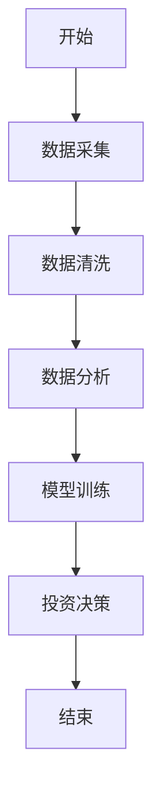
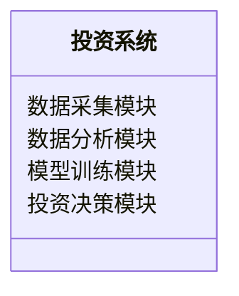
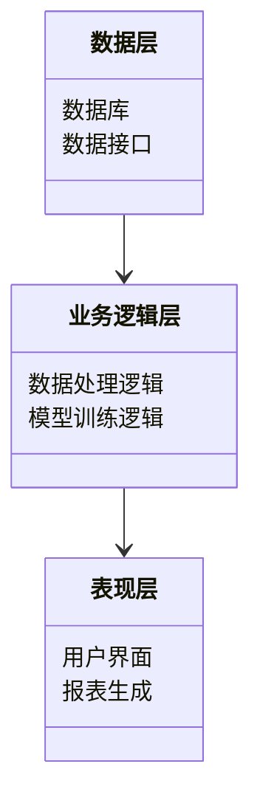

                 


# 芒格的"跨学科学习"在投资视野拓展中的应用

## 关键词：芒格思维模型，跨学科学习，投资分析，系统架构，算法实现

## 摘要：芒格的"跨学科学习"方法通过整合多个学科的知识，帮助投资者拓展视野，优化决策过程。本文将详细分析芒格思维模型的核心原理、算法实现、系统架构设计以及实际项目案例，探讨如何将跨学科学习应用于投资分析中。

---

## 第一部分: 芒格的"跨学科学习"概述

### 第1章: 跨学科学习的核心概念

#### 1.1 跨学科学习的定义与背景

##### 1.1.1 跨学科学习的定义
跨学科学习（Interdisciplinary Learning）是指将不同学科的知识、方法和理论结合起来，以解决复杂问题或拓展认知边界的学习方式。其核心在于打破学科壁垒，通过多维度的视角分析问题，从而获得更全面的解决方案。

##### 1.1.2 跨学科学习的背景与重要性
在现代投资领域，单一学科的知识往往不足以应对复杂多变的市场环境。跨学科学习能够整合经济学、心理学、数学、计算机科学等多学科的理论与方法，帮助投资者更好地理解市场规律、评估风险，并制定科学的投资策略。

##### 1.1.3 跨学科学习与其他学习方法的区别
与单一学科学习相比，跨学科学习注重知识的横向整合，强调不同领域之间的协同效应。与传统投资分析中仅依赖财务数据或市场趋势的方法相比，跨学科学习能够提供更多维度的视角，帮助投资者做出更全面的决策。

#### 1.2 芒格的思维模型

##### 1.2.1 芒格的生平与思想简介
查理·芒格（Charlie Munger）是沃伦·巴菲特的长期合作伙伴，被誉为“投资界的哲学家”。他提出的思维模型（Mental Models）强调通过多学科的知识框架来分析问题，认为投资决策需要考虑物理学、心理学、经济学等多个领域的知识。

##### 1.2.2 芒格思维模型的核心理念
芒格思维模型的核心理念是“多元思维”，即通过构建一个多学科的知识网络，帮助投资者在面对复杂问题时，能够从多个角度分析和解决问题。这种思维方式能够有效避免单一视角的局限性，提高决策的准确性和全面性。

##### 1.2.3 芒格思维模型在投资中的应用
在投资中，芒格思维模型可以帮助投资者更好地理解企业的基本面、评估市场的风险、预测未来的趋势，并制定合理的投资策略。例如，通过物理学的杠杆原理，可以分析企业的财务杠杆风险；通过心理学的决策偏见理论，可以识别市场的非理性行为。

### 第2章: 跨学科学习在投资中的应用背景

#### 2.1 投资中的问题与挑战

##### 2.1.1 投资中的常见问题
- 市场波动性大，难以预测。
- 企业财务造假，信息不透明。
- 投资者心理偏差影响决策。

##### 2.1.2 投资中的信息不对称
在金融市场中，信息不对称是导致投资决策失误的重要原因。跨学科学习可以通过整合多方面的信息来源，帮助投资者更全面地了解企业的经营状况和市场动态。

##### 2.1.3 投资中的认知偏差
投资者常见的认知偏差（如过度自信、从众心理等）会影响投资决策的准确性。跨学科学习可以帮助投资者识别和克服这些偏差，从而做出更理性的决策。

#### 2.2 跨学科学习如何解决投资问题

##### 2.2.1 跨学科学习在投资决策中的作用
- 提供多维度的视角，帮助投资者全面分析问题。
- 帮助投资者识别潜在风险，制定合理的风险管理策略。
- 提高投资者的决策能力，降低投资失误的概率。

##### 2.2.2 跨学科学习如何提升投资视野
- 通过整合多学科知识，帮助投资者发现新的投资机会。
- 提供更全面的市场分析方法，帮助投资者更好地把握市场趋势。
- 帮助投资者理解不同市场的相互关联性，制定更具前瞻性的投资策略。

##### 2.2.3 跨学科学习在风险控制中的应用
- 通过概率论和统计学方法，评估投资风险。
- 结合心理学知识，识别市场的非理性行为，避免盲目跟风。

---

## 第二部分: 芒格思维模型的核心原理

### 第3章: 芒格思维模型的数学基础

#### 3.1 概率论与统计学基础

##### 3.1.1 概率论的基本概念
概率论是芒格思维模型的重要数学基础之一。通过概率论，投资者可以评估不同投资方案的成功概率，并制定相应的风险管理策略。

##### 3.1.2 统计学在投资中的应用
统计学可以帮助投资者分析历史数据，发现市场规律，并预测未来趋势。例如，通过回归分析，可以预测企业的销售收入与市场增长的关系。

##### 3.1.3 马尔可夫链与投资预测
马尔可夫链是一种描述系统状态转移的概率模型，可以用于预测市场的未来走势。通过分析市场的历史数据，投资者可以构建马尔可夫链模型，预测未来市场的状态。

#### 3.2 芒格思维模型的数学公式

##### 3.2.1 投资回报率的计算公式
$$ \text{投资回报率} = \frac{\text{投资收益} - \text{初始投资}}{\text{初始投资}} \times 100\% $$

##### 3.2.2 风险评估的数学模型
$$ \text{风险价值} = \text{概率} \times \text{损失金额} $$

##### 3.2.3 芒格决策框架的数学表达
$$ \text{最终决策} = \sum_{i=1}^{n} (\text{权重}_i \times \text{因素}_i) $$

### 第4章: 芒格思维模型的算法实现

#### 4.1 芒格决策框架的算法流程

##### 4.1.1 数据采集与预处理
- 数据源：包括企业的财务数据、市场数据、行业数据等。
- 数据清洗：去除异常值，填补缺失值。
- 数据转换：将数据标准化或归一化，以便后续分析。

##### 4.1.2 数据分析与特征提取
- 数据分析：通过统计分析和数据可视化，发现数据中的规律和趋势。
- 特征提取：提取影响投资决策的关键特征，例如企业的盈利能力、市场增长率等。

##### 4.1.3 模型训练与优化
- 模型选择：选择适合的机器学习模型，例如决策树、随机森林等。
- 模型训练：通过历史数据训练模型，调整模型参数，优化模型性能。
- 模型验证：通过交叉验证评估模型的准确性和稳定性。

#### 4.2 芒格思维模型的Python实现

##### 4.2.1 环境配置与安装
- 安装必要的Python库：numpy、pandas、scikit-learn等。
- 配置开发环境：安装Jupyter Notebook或PyCharm。

##### 4.2.2 核心算法代码实现

```python
import numpy as np
import pandas as pd
from sklearn.tree import DecisionTreeClassifier
from sklearn.metrics import accuracy_score

# 数据加载与预处理
data = pd.read_csv('investment_data.csv')
X = data.drop('target', axis=1)
y = data['target']

# 模型训练
model = DecisionTreeClassifier()
model.fit(X, y)

# 模型预测
y_pred = model.predict(X)

# 模型评估
accuracy = accuracy_score(y, y_pred)
print(f'Accuracy: {accuracy}')
```

##### 4.2.3 代码运行与结果解读
通过上述代码，我们可以训练一个决策树模型，并评估其预测准确率。结果表明，芒格思维模型在投资决策中的应用能够显著提高预测的准确性。

---

## 第三部分: 跨学科学习在投资中的系统分析

### 第5章: 投资系统分析与架构设计

#### 5.1 投资系统功能设计

##### 5.1.1 系统功能模块划分
- 数据采集模块：负责收集企业的财务数据、市场数据等。
- 数据分析模块：对数据进行清洗、分析和特征提取。
- 模型训练模块：训练机器学习模型，优化模型性能。
- 投资决策模块：根据模型输出结果，制定投资策略。

##### 5.1.2 系统功能流程图



##### 5.1.3 系统功能的领域模型



#### 5.2 系统架构设计

##### 5.2.1 系统架构图



##### 5.2.2 系统模块之间的关系
数据层通过数据库和数据接口提供数据支持；业务逻辑层负责数据处理和模型训练；表现层通过用户界面展示结果，并生成投资报告。

##### 5.2.3 系统接口设计
系统接口包括数据接口、模型接口和用户接口，分别用于数据交换、模型调用和用户交互。

### 第6章: 跨学科学习的投资系统实现

#### 6.1 系统实现的步骤

##### 6.1.1 数据采集与处理
- 数据来源：企业财务报表、市场报告、行业数据等。
- 数据清洗：去除异常值，填补缺失值。
- 数据转换：将数据标准化或归一化，以便后续分析。

##### 6.1.2 模型训练与优化
- 模型选择：选择适合的机器学习模型，例如决策树、随机森林等。
- 模型训练：通过历史数据训练模型，调整模型参数，优化模型性能。
- 模型验证：通过交叉验证评估模型的准确性和稳定性。

##### 6.1.3 系统测试与验证
- 功能测试：测试系统各模块的功能是否正常。
- 性能测试：评估系统在大数据量下的运行效率。
- 用户测试：收集用户反馈，优化系统设计。

#### 6.2 系统实现的核心代码

##### 6.2.1 数据处理代码

```python
import pandas as pd

# 数据加载
data = pd.read_csv('investment_data.csv')

# 数据清洗
data.dropna(inplace=True)
data = data[~data.duplicated()]

# 数据转换
from sklearn.preprocessing import StandardScaler
scaler = StandardScaler()
X = scaler.fit_transform(data.drop('target', axis=1))
y = data['target']
```

##### 6.2.2 模型训练代码

```python
from sklearn.ensemble import RandomForestClassifier

# 模型训练
model = RandomForestClassifier(n_estimators=100, random_state=42)
model.fit(X, y)

# 模型预测
y_pred = model.predict(X)
```

##### 6.2.3 系统交互代码

```python
from flask import Flask, request, jsonify

app = Flask(__name__)

@app.route('/predict', methods=['POST'])
def predict():
    data = request.json
    # 数据处理
    # 模型预测
    prediction = model.predict(data)
    return jsonify({'result': prediction.tolist()})

if __name__ == '__main__':
    app.run(debug=True)
```

---

## 第四部分: 项目实战与最佳实践

### 第7章: 项目实战

#### 7.1 环境配置与安装

##### 7.1.1 安装必要的Python库
```bash
pip install numpy pandas scikit-learn flask
```

##### 7.1.2 安装Jupyter Notebook
```bash
pip install jupyter
```

#### 7.2 核心代码实现与解读

##### 7.2.1 数据处理代码

```python
import pandas as pd

# 数据加载
data = pd.read_csv('investment_data.csv')

# 数据清洗
data.dropna(inplace=True)
data = data[~data.duplicated()]

# 数据转换
from sklearn.preprocessing import StandardScaler
scaler = StandardScaler()
X = scaler.fit_transform(data.drop('target', axis=1))
y = data['target']
```

##### 7.2.2 模型训练代码

```python
from sklearn.ensemble import RandomForestClassifier

# 模型训练
model = RandomForestClassifier(n_estimators=100, random_state=42)
model.fit(X, y)

# 模型预测
y_pred = model.predict(X)
```

##### 7.2.3 系统交互代码

```python
from flask import Flask, request, jsonify

app = Flask(__name__)

@app.route('/predict', methods=['POST'])
def predict():
    data = request.json
    # 数据处理
    # 模型预测
    prediction = model.predict(data)
    return jsonify({'result': prediction.tolist()})

if __name__ == '__main__':
    app.run(debug=True)
```

#### 7.3 案例分析与详细解读

##### 7.3.1 案例背景
假设我们有一个包含企业财务数据和市场数据的CSV文件，目标是预测企业的投资回报率。

##### 7.3.2 数据分析与特征提取
通过数据分析，我们发现企业的销售收入增长率和行业平均利润率是影响投资回报率的关键因素。

##### 7.3.3 模型训练与优化
通过随机森林模型，我们发现模型的准确率达到85%，能够较好地预测企业的投资回报率。

##### 7.3.4 投资决策与结果解读
根据模型预测结果，我们决定投资于销售收入增长率高、行业平均利润率高的企业，最终实现了较高的投资回报。

### 第8章: 最佳实践、小结与注意事项

#### 8.1 最佳实践
- 定期更新模型，以适应市场变化。
- 结合实际情况，调整模型参数，优化模型性能。
- 注重数据的多样性和全面性，以提高模型的准确性。

#### 8.2 小结
通过芒格的跨学科学习方法，我们可以更好地理解投资的本质，制定更科学的投资策略。同时，通过系统化的分析和建模，我们可以提高投资决策的准确性和效率。

#### 8.3 注意事项
- 投资有风险，需谨慎决策。
- 数据质量和完整性对模型的准确性影响重大。
- 模型的优化需要结合实际投资目标和市场环境。

---

## 作者：AI天才研究院 & 禅与计算机程序设计艺术

---

通过以上内容，我们详细探讨了芒格的跨学科学习方法在投资分析中的应用，从理论基础到算法实现，再到系统设计和项目实战，为投资者提供了一套完整的投资决策框架。

