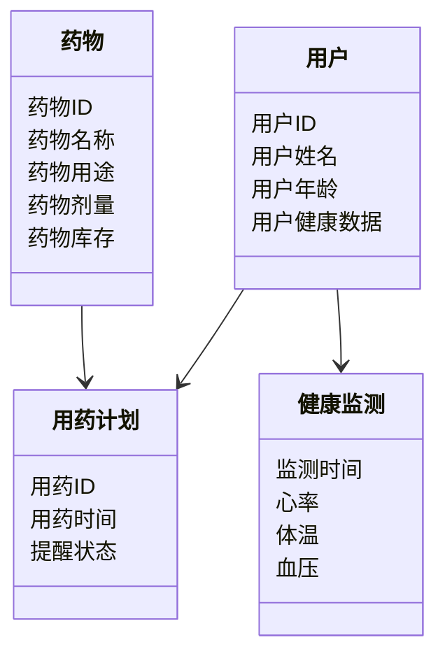
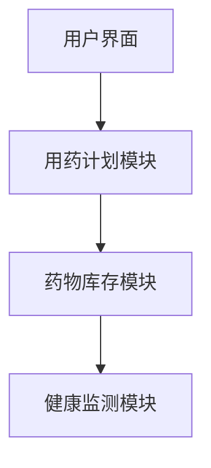
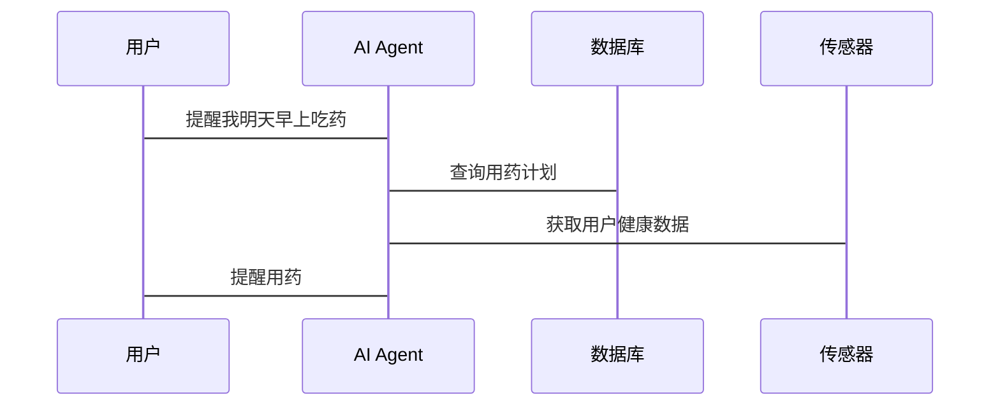

                 


# AI Agent在智能床头柜中的药物管理

> 关键词：AI Agent, 智能床头柜, 药物管理, 自然语言处理, 机器学习, 物联网技术

> 摘要：本文详细探讨了AI Agent在智能床头柜中的药物管理应用，分析了AI Agent的核心技术、药物管理系统的架构设计、算法实现以及实际应用场景。通过理论与实践相结合的方式，本文为读者提供了从基础概念到系统实现的全面解读，帮助读者深入了解AI Agent在智能床头柜中的药物管理的潜力和实现方法。

---

# 第1章: AI Agent与智能床头柜药物管理概述

## 1.1 AI Agent的基本概念

### 1.1.1 AI Agent的定义
AI Agent（人工智能代理）是指能够感知环境并采取行动以实现目标的智能实体。它能够通过传感器获取信息，利用算法进行决策，并通过执行器与环境交互。AI Agent在智能床头柜中的药物管理中，主要负责解析用户的用药需求、监控药物库存、提醒用药时间以及优化用药计划。

### 1.1.2 AI Agent的核心特征
- **自主性**：AI Agent能够在没有人工干预的情况下独立运行。
- **反应性**：能够实时感知环境变化并做出反应。
- **目标导向性**：通过设定目标来指导行为和决策。
- **学习能力**：能够通过数据不断优化自身的算法和决策模型。

### 1.1.3 AI Agent在智能床头柜中的应用场景
- **药物提醒**：基于用户的用药计划，AI Agent能够通过语音或灯光提醒用户按时服药。
- **库存管理**：实时监控药物库存，及时提醒用户补充药品。
- **健康监测**：结合健康传感器，AI Agent能够监测用户的健康状况，并根据数据调整用药建议。

## 1.2 智能床头柜的定义与功能

### 1.2.1 智能床头柜的基本功能
智能床头柜是一种集成多种智能技术的家居设备，主要功能包括：
- **药物存储**：提供安全的药物存储空间。
- **智能提醒**：通过AI Agent实现药物提醒功能。
- **健康监测**：集成健康传感器，监测用户的生理指标。

### 1.2.2 智能床头柜的硬件组成
智能床头柜的主要硬件组件包括：
- **传感器模块**：用于监测用户的健康数据，如心率、体温等。
- **显示模块**：用于显示用药提醒和健康数据。
- **语音交互模块**：支持语音输入和输出，方便用户与床头柜交互。
- **网络通信模块**：支持Wi-Fi或蓝牙连接，实现数据的上传和下载。

### 1.2.3 智能床头柜的软件系统
智能床头柜的软件系统主要负责：
- **数据采集与处理**：接收传感器数据并进行分析。
- **AI Agent算法**：实现药物提醒、库存管理和健康监测等功能。
- **用户界面**：提供友好的人机交互界面。

## 1.3 药物管理的核心问题

### 1.3.1 药物管理的基本需求
- **准确性**：确保用药提醒的准确性，避免漏服或错服。
- **实时性**：能够实时监控药物库存和用户的健康状况。
- **个性化**：根据用户的健康状况和用药需求提供个性化的管理方案。

### 1.3.2 药物管理中的常见问题
- **库存不足**：用户忘记及时补充药品，导致用药中断。
- **用药错误**：用户可能因为疏忽而服用错误的药物或剂量。
- **健康监测不足**：缺乏对用户健康状况的实时监测，无法提供精准的用药建议。

### 1.3.3 AI Agent在药物管理中的作用
- **智能提醒**：通过AI Agent的智能算法，确保用户按时用药。
- **库存管理**：实时监控药物库存，及时提醒用户补充药品。
- **健康监测**：结合健康传感器，提供个性化的用药建议。

## 1.4 本章小结
本章从AI Agent的基本概念出发，介绍了智能床头柜的功能和硬件组成，并分析了药物管理的核心问题及其解决方案。通过AI Agent的应用，智能床头柜能够实现智能化的药物管理，提升用户体验和健康管理水平。

---

# 第2章: AI Agent的核心技术与实现原理

## 2.1 AI Agent的核心技术

### 2.1.1 自然语言处理
自然语言处理（NLP）是AI Agent实现人机交互的重要技术。通过NLP，AI Agent能够理解用户的语音指令，并生成自然的语音反馈。例如，当用户说“提醒我明天早上吃药”，AI Agent能够解析这句话的含义，并设置相应的用药提醒。

### 2.1.2 机器学习
机器学习是AI Agent实现智能决策的核心技术。通过机器学习算法，AI Agent能够从用户的历史用药数据和健康数据中学习，预测用户的用药需求，并优化用药计划。例如，基于用户的用药记录和健康数据，AI Agent可以预测用户在未来一段时间内的用药需求。

### 2.1.3 规则引擎
规则引擎是一种用于定义和执行业务规则的工具。在AI Agent中，规则引擎可以用于实现基于规则的药物管理功能，例如根据用户的用药习惯设置用药提醒规则。

## 2.2 AI Agent的实现原理

### 2.2.1 数据采集与处理
AI Agent通过传感器和用户输入获取数据，包括用户的用药记录、健康数据和环境数据。这些数据经过预处理后，将被输入到机器学习模型中进行分析。

### 2.2.2 模型训练与推理
AI Agent利用机器学习算法对数据进行训练，生成能够预测用户用药需求的模型。例如，基于线性回归模型，AI Agent可以预测用户的用药频率和剂量。

### 2.2.3 交互与反馈机制
AI Agent通过语音交互模块与用户进行实时对话，理解用户的需求并提供相应的反馈。例如，当用户询问“明天的用药计划是什么”，AI Agent会根据预测模型生成结果并反馈给用户。

## 2.3 AI Agent的算法实现

### 2.3.1 基于规则的AI Agent
基于规则的AI Agent通过预定义的规则进行决策。例如，当用户的用药记录显示某药物需要每天服用一次，AI Agent可以根据时间规则设置用药提醒。

### 2.3.2 基于机器学习的AI Agent
基于机器学习的AI Agent通过训练模型进行预测和决策。例如，利用随机森林算法，AI Agent可以根据用户的健康数据和用药记录，预测用户的健康风险并提供个性化的用药建议。

### 2.3.3 混合型AI Agent
混合型AI Agent结合了基于规则和基于机器学习的两种方法。例如，AI Agent可以通过规则引擎处理简单的用药提醒任务，而通过机器学习模型处理复杂的健康监测任务。

## 2.4 本章小结
本章详细介绍了AI Agent的核心技术，包括自然语言处理、机器学习和规则引擎。并分析了AI Agent的实现原理，包括数据采集与处理、模型训练与推理以及交互与反馈机制。最后，介绍了基于规则、基于机器学习和混合型的三种AI Agent实现方式。

---

# 第3章: AI Agent在智能床头柜中的药物管理核心概念

## 3.1 药物管理系统的实体关系

### 3.1.1 用户实体
用户是药物管理系统的核心实体，包括用户的基本信息、用药记录和健康数据。

### 3.1.2 药物实体
药物实体包括药物的基本信息，如药物名称、用途、剂量和有效期等。

### 3.1.3 时间实体
时间实体用于记录用户的用药时间、提醒时间和健康监测时间等。

## 3.2 AI Agent与药物管理系统的交互流程

### 3.2.1 用户需求输入
用户通过语音或触控方式输入用药需求，例如“我要设置明天早上7点吃药”。

### 3.2.2 系统解析与处理
AI Agent通过自然语言处理技术解析用户的输入，生成相应的用药提醒任务。

### 3.2.3 系统反馈与执行
AI Agent通过语音或灯光提醒用户用药，并记录用户的用药行为。

## 3.3 药物管理系统的功能模块

### 3.3.1 药物库存管理
AI Agent能够实时监控药物库存，当库存不足时提醒用户补充药品。

### 3.3.2 药物提醒服务
AI Agent根据用户的用药计划，提供个性化的用药提醒服务。

### 3.3.3 药物用量监控
AI Agent通过分析用户的用药记录，监控药物的使用情况，并提供用量报告。

## 3.4 本章小结
本章分析了药物管理系统的实体关系，详细描述了AI Agent与药物管理系统的交互流程，并介绍了药物管理系统的功能模块，包括库存管理、提醒服务和用量监控。

---

# 第4章: AI Agent药物管理系统的算法原理与数学模型

## 4.1 算法原理

### 4.1.1 基于规则的药物提醒算法
基于规则的药物提醒算法通过预定义的规则进行决策，例如：
- 如果当前时间是用药时间，则触发提醒。
- 如果药物库存不足，则触发提醒。

### 4.1.2 基于机器学习的药物用量预测算法
基于机器学习的药物用量预测算法利用历史数据训练模型，预测未来的用药需求。例如，使用线性回归模型：
$$ y = \beta_0 + \beta_1x + \epsilon $$
其中，\( y \) 是预测的用药量，\( x \) 是时间变量，\( \beta_0 \) 和 \( \beta_1 \) 是模型参数，\( \epsilon \) 是误差项。

### 4.1.3 基于自然语言处理的用户意图识别算法
基于自然语言处理的用户意图识别算法通过分析用户的语言输入，识别用户的用药需求。例如，使用词袋模型（Bag-of-Words）进行文本分类，识别用户的意图是“提醒用药”还是“查询用药记录”。

## 4.2 数学模型与公式

### 4.2.1 线性回归模型
线性回归模型用于预测用户的用药需求，公式如下：
$$ y = \beta_0 + \beta_1x + \epsilon $$

### 4.2.2 时间序列预测模型
时间序列预测模型用于预测未来的用药需求，例如使用ARIMA模型：
$$ \phi(B)(1 - B)Z_t = \theta(B) \epsilon_t $$

### 4.2.3 朴素贝叶斯分类器
朴素贝叶斯分类器用于用户意图识别，公式如下：
$$ P(c|x) = \frac{P(x|c)P(c)}{P(x)} $$

## 4.3 本章小结
本章详细介绍了AI Agent药物管理系统的算法原理，包括基于规则的提醒算法、基于机器学习的预测算法和基于自然语言处理的意图识别算法。并给出了相关的数学模型和公式，为读者理解AI Agent的实现原理提供了理论基础。

---

# 第5章: AI Agent药物管理系统的系统分析与架构设计

## 5.1 问题场景介绍
智能床头柜中的药物管理需要解决以下问题：
- 如何实现智能化的用药提醒？
- 如何实时监控药物库存？
- 如何结合健康传感器提供个性化的用药建议？

## 5.2 项目介绍
本项目旨在开发一个基于AI Agent的智能床头柜药物管理系统，实现以下功能：
- 智能用药提醒
- 药物库存管理
- 健康监测与用药建议

## 5.3 系统功能设计
### 5.3.1 领域模型
领域模型是一个药物管理系统的核心功能模块，包括用户管理、药物管理、用药计划和健康监测等模块。领域模型的类图如下：



### 5.3.2 系统架构设计
系统架构设计采用分层架构，包括数据层、业务逻辑层和用户界面层。系统架构图如下：


### 5.3.3 系统接口设计
系统接口设计包括用户界面接口、传感器接口和网络通信接口。系统接口图如下：



### 5.3.4 系统交互流程
系统交互流程包括用户输入、系统解析、系统处理和系统反馈四个步骤。系统交互流程图如下：



## 5.4 本章小结
本章从问题场景出发，介绍了AI Agent药物管理系统的项目需求和系统架构设计。通过领域模型和系统架构图，详细描述了系统的功能模块和交互流程。

---

# 第6章: AI Agent药物管理系统的项目实战

## 6.1 环境安装

### 6.1.1 硬件设备
- 智能床头柜硬件：包括传感器模块、显示模块和语音交互模块。
- 开发工具：如Arduino IDE、Python开发环境等。

### 6.1.2 软件开发环境
- 编程语言：Python
- 开发框架：Flask或Django
- 机器学习库：Scikit-learn
- 自然语言处理库：spaCy或NLTK

## 6.2 系统核心实现源代码

### 6.2.1 AI Agent的核心代码
```python
class AIAgent:
    def __init__(self):
        self.sensor_data = {}
        self.drug_inventory = {}
        self.user_plan = {}

    def process_input(self, input_text):
        # 自然语言处理模块
        pass

    def predict_drug_usage(self):
        # 机器学习模型预测
        pass

    def trigger Reminder(self):
        # 提醒模块
        pass
```

### 6.2.2 药物提醒模块代码
```python
class DrugReminder:
    def __init__(self):
        self.current_time = None
        self.drug_plan = {}

    def set_time(self, time):
        self.current_time = time

    def check_reminder(self):
        if self.current_time in self.drug_plan:
            return True
        else:
            return False
```

## 6.3 代码应用解读与分析
- **AI Agent类**：负责与传感器和用户的交互，处理输入数据并触发提醒。
- **DrugReminder类**：负责管理用药计划和提醒逻辑，根据当前时间检查是否有用药提醒任务。

## 6.4 实际案例分析
假设用户设置每天早上7点服用降压药，AI Agent会根据用户的时间设置提醒任务，并在指定时间通过语音或灯光提醒用户。如果用户的健康传感器显示心率异常，AI Agent会结合用药记录提供个性化的用药建议。

## 6.5 本章小结
本章通过实际案例分析，详细介绍了AI Agent药物管理系统的实现过程。从环境安装到代码实现，再到案例分析，为读者提供了从理论到实践的完整指导。

---

# 第7章: 总结与展望

## 7.1 最佳实践
- **数据质量管理**：确保输入数据的准确性和完整性，提升模型的预测精度。
- **用户体验优化**：设计友好的用户界面和交互流程，提升用户的使用体验。
- **系统安全性**：加强数据加密和访问控制，确保用户隐私和数据安全。

## 7.2 小结
AI Agent在智能床头柜中的药物管理应用，不仅提升了药物管理的智能化水平，还优化了用户的用药体验。通过AI Agent的应用，智能床头柜能够实现个性化的用药提醒、智能化的库存管理和精准的健康监测。

## 7.3 注意事项
- 在实际应用中，需注意系统的实时性和稳定性，确保用药提醒的准确性。
- 数据隐私保护是系统设计的重要部分，需严格遵守相关法律法规。

## 7.4 拓展阅读
- 推荐阅读《人工智能：一种现代的方法》（Russell & Norvig, 2023）
- 推荐学习Python的机器学习库Scikit-learn和自然语言处理库spaCy。

---

# 作者：AI天才研究院/AI Genius Institute & 禅与计算机程序设计艺术 /Zen And The Art of Computer Programming

---

通过本文的详细解读，读者可以全面了解AI Agent在智能床头柜中的药物管理应用，掌握从理论到实践的实现方法。希望本文能够为相关领域的研究和应用提供有价值的参考。

