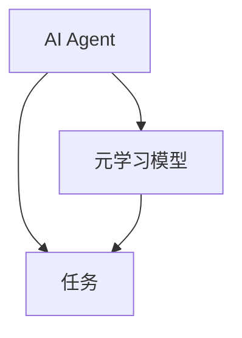
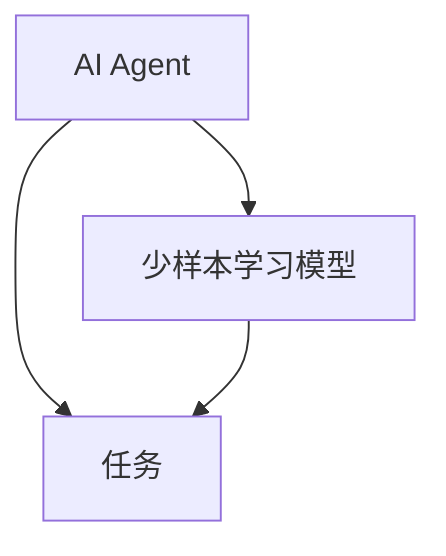
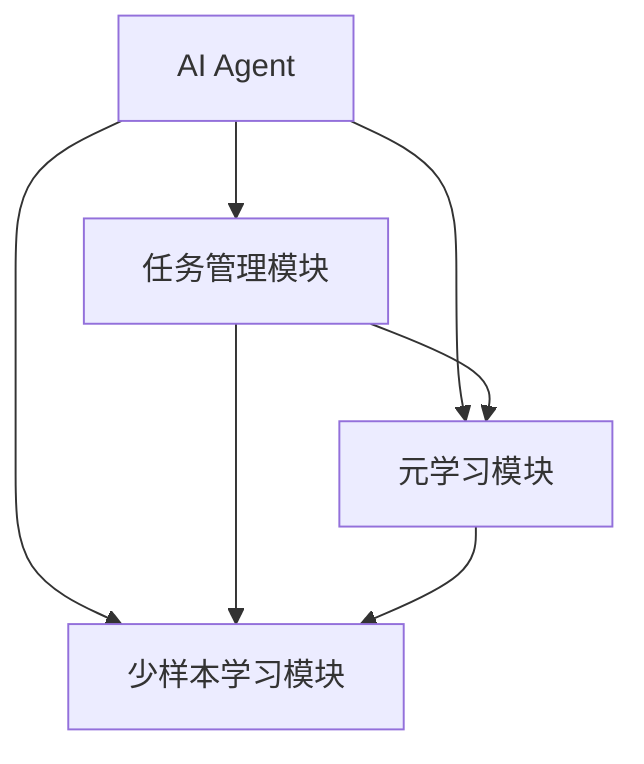

                 


# 第一部分: AI Agent的元学习与少样本学习能力概述

# 第1章: AI Agent的元学习与少样本学习概述

## 1.1 AI Agent的定义与特点
### 1.1.1 AI Agent的基本概念
AI Agent，即人工智能代理，是指能够感知环境、自主决策并执行任务的智能实体。它具备以下特点：
- **自主性**：能够在没有外部干预的情况下独立运作。
- **反应性**：能够根据环境的变化实时调整行为。
- **目标导向**：具备明确的目标，并能采取行动以实现这些目标。

### 1.1.2 AI Agent的核心特点
- **学习能力**：能够通过经验或数据不断优化自身的决策和行为。
- **推理能力**：能够进行逻辑推理和问题解决。
- **适应性**：能够适应不同的环境和任务需求。

### 1.1.3 AI Agent的应用场景
AI Agent广泛应用于多个领域，包括：
- **自动驾驶**：通过实时感知和决策来控制车辆。
- **智能助手**：如Siri、Alexa等，能够理解和执行用户的指令。
- **机器人**：用于工业自动化、服务机器人等领域。

## 1.2 元学习的定义与原理
### 1.2.1 元学习的基本概念
元学习是一种学习方法，旨在让模型学会如何学习。与传统机器学习不同，元学习关注的是如何在不同任务之间共享知识，从而提高学习效率。

### 1.2.2 元学习的核心原理
元学习的核心在于通过优化元学习目标函数，使模型能够在多个任务之间进行参数更新，从而快速适应新任务。

### 1.2.3 元学习与传统学习的区别
| 特性 | 元学习 | 传统学习 |
|------|--------|----------|
| 数据需求 | 适用于小样本数据 | 通常需要大量数据 |
| 任务适应性 | 高 | 低 |
| 知识复用 | 强 | 弱 |

## 1.3 少样本学习的定义与特点
### 1.3.1 少样本学习的基本概念
少样本学习是指在仅有少量样本的情况下，依然能够完成分类或生成任务的一种学习方法。

### 1.3.2 少样本学习的核心特点
- **数据效率高**：能够在少量样本下完成任务。
- **任务多样性**：适用于多种不同的任务。

### 1.3.3 少样本学习的应用场景
少样本学习广泛应用于图像识别、自然语言处理等领域，特别是在数据标注成本较高的场景下。

## 1.4 元学习与少样本学习的结合
### 1.4.1 元学习与少样本学习的关系
元学习通过共享多个任务的知识，能够显著提升少样本学习的性能。

### 1.4.2 元学习在少样本学习中的作用
元学习能够帮助模型在面对新任务时，快速调整参数，从而在少量样本下实现良好的性能。

### 1.4.3 元学习与少样本学习的结合优势
- **提升学习效率**：通过共享知识，减少对每个任务独立训练的需求。
- **增强模型泛化能力**：元学习使得模型能够在不同任务之间共享特征，从而提升整体的泛化能力。

## 1.5 本章小结
本章详细介绍了AI Agent、元学习和少样本学习的基本概念和特点，并探讨了它们之间的关系和结合优势。这些内容为后续章节的学习奠定了基础。

# 第二部分: 元学习与少样本学习的核心概念与联系

# 第2章: 元学习的核心概念与原理

## 2.1 元学习的原理
### 2.1.1 元学习的数学模型
元学习的数学模型通常涉及优化元学习目标函数。例如，元学习的目标函数可以表示为：
$$ \mathcal{L}_{meta} = \sum_{i=1}^{N} \mathcal{L}_i(\theta_i; \theta) $$
其中，$\theta$是元参数，$\theta_i$是任务参数。

### 2.1.2 元学习的优化目标
元学习的优化目标通常包括两个方面：优化元参数以使得模型在多个任务上表现良好，同时优化任务参数以使得模型在具体任务上表现良好。

### 2.1.3 元学习的算法框架
元学习的算法框架通常包括以下步骤：
1. 初始化元参数。
2. 对于每个任务，优化任务参数以最小化任务损失。
3. 基于任务参数的更新，优化元参数以最小化元损失。

## 2.2 元学习的关键特征
### 2.2.1 元学习的适应性
元学习能够快速适应新任务，这是因为其元参数能够捕捉不同任务之间的共性特征。

### 2.2.2 元学习的泛化能力
元学习通过共享多个任务的知识，能够提升模型的泛化能力，使其在新任务上表现良好。

### 2.2.3 元学习的可解释性
元学习的可解释性较差，因为其元参数通常难以直接解释。

## 2.3 元学习的实体关系图


# 第3章: 少样本学习的核心概念与原理

## 3.1 少样本学习的原理
### 3.1.1 少样本学习的数学模型
少样本学习的数学模型通常涉及对小样本数据的建模。例如，基于支持向量数据的少样本分类问题可以表示为：
$$ \min_{\theta} \sum_{i=1}^{N} L(y_i, f(x_i; \theta)) + \lambda R(\theta) $$
其中，$L$是损失函数，$R$是正则化项。

### 3.1.2 少样本学习的优化目标
少样本学习的优化目标通常包括最小化分类错误率和最大化模型的泛化能力。

### 3.1.3 少样本学习的算法框架
少样本学习的算法框架通常包括以下步骤：
1. 数据预处理：对小样本数据进行归一化或特征提取。
2. 模型训练：使用少量样本训练模型。
3. 模型评估：对模型进行评估，调整参数以提升性能。

## 3.2 少样本学习的关键特征
### 3.2.1 少样本学习的适应性
少样本学习能够在数据有限的情况下完成任务。

### 3.2.2 少样本学习的泛化能力
少样本学习的泛化能力通常较弱，因为其训练数据量有限。

### 3.2.3 少样本学习的可解释性
少样本学习的可解释性通常较好，因为其模型结构相对简单。

## 3.3 少样本学习的实体关系图


# 第4章: 元学习与少样本学习的结合

## 4.1 元学习与少样本学习的结合原理
### 4.1.1 元学习在少样本学习中的作用
元学习通过共享多个任务的知识，能够显著提升少样本学习的性能。

### 4.1.2 少样本学习在元学习中的应用
少样本学习可以作为元学习的一个具体任务，通过元学习来提升其性能。

## 4.2 元学习与少样本学习的结合优势
### 4.2.1 提高学习效率
通过共享知识，元学习与少样本学习的结合能够显著提高学习效率。

### 4.2.2 增强模型的泛化能力
元学习通过共享不同任务的知识，能够增强模型的泛化能力。

### 4.2.3 降低数据需求
元学习与少样本学习的结合能够在数据需求较低的情况下完成任务。

## 4.3 元学习与少样本学习的结合案例
### 4.3.1 图像分类
通过元学习，可以在少样本图像分类任务中实现较好的性能。

### 4.3.2 自然语言处理
元学习可以用于少样本自然语言处理任务，如问答系统。

## 4.4 本章小结
本章详细探讨了元学习与少样本学习的结合原理及其优势，并通过具体案例展示了其应用前景。

# 第三部分: 元学习与少样本学习的算法实现

# 第5章: 元学习的算法实现

## 5.1 元学习算法的核心步骤
### 5.1.1 初始化元参数
元参数通常初始化为随机值。

### 5.1.2 优化任务参数
对于每个任务，优化任务参数以最小化任务损失。

### 5.1.3 优化元参数
基于任务参数的更新，优化元参数以最小化元损失。

## 5.2 元学习算法的实现代码
```python
import tensorflow as tf

# 初始化元参数
meta_params = tf.Variable(initial_value=tf.random.normal(shape=[100]), trainable=True)

# 定义任务损失函数
def task_loss(y_true, y_pred):
    return tf.keras.losses.binary_crossentropy(y_true, y_pred)

# 定义元损失函数
def meta_loss(meta_params, task_params):
    return tf.keras.losses.mean_squared_error(meta_params, task_params)

# 优化任务参数
task_params = tf.Variable(initial_value=tf.random.normal(shape=[100]), trainable=True)
task_loss_value = task_loss(labels, model(task_params))
task_optimizer = tf.keras.optimizers.Adam(learning_rate=0.01)
task_optimizer.minimize(task_loss_value, var_list=[task_params])

# 优化元参数
meta_loss_value = meta_loss(meta_params, task_params)
meta_optimizer = tf.keras.optimizers.Adam(learning_rate=0.001)
meta_optimizer.minimize(meta_loss_value, var_list=[meta_params])
```

## 5.3 元学习算法的数学模型
元学习的数学模型可以表示为：
$$ \mathcal{L}_{meta} = \sum_{i=1}^{N} \mathcal{L}_i(\theta_i; \theta) $$
其中，$\theta$是元参数，$\theta_i$是任务参数。

## 5.4 元学习算法的优化目标
元学习的优化目标通常包括两个方面：
1. 优化元参数以使得模型在多个任务上表现良好。
2. 优化任务参数以使得模型在具体任务上表现良好。

## 5.5 本章小结
本章详细介绍了元学习算法的核心步骤、实现代码和数学模型，并探讨了其优化目标。

# 第6章: 少样本学习的算法实现

## 6.1 少样本学习算法的核心步骤
### 6.1.1 数据预处理
对小样本数据进行归一化或特征提取。

### 6.1.2 模型训练
使用少量样本训练模型。

### 6.1.3 模型评估
对模型进行评估，调整参数以提升性能。

## 6.2 少样本学习算法的实现代码
```python
import tensorflow as tf

# 数据预处理
def preprocess_data(X, y):
    X_normalized = tf.keras.utils.normalize(X)
    return X_normalized, y

# 模型训练
model = tf.keras.Sequential([
    tf.keras.layers.Dense(64, activation='relu'),
    tf.keras.layers.Dense(10, activation='softmax')
])

# 编译模型
model.compile(optimizer='adam', loss='sparse_categorical_crossentropy', metrics=['accuracy'])

# 训练模型
preprocessed_X, preprocessed_y = preprocess_data(X, y)
model.fit(preprocessed_X, preprocessed_y, epochs=10, batch_size=32)
```

## 6.3 少样本学习算法的数学模型
少样本学习的数学模型通常涉及对小样本数据的建模。例如，基于支持向量数据的少样本分类问题可以表示为：
$$ \min_{\theta} \sum_{i=1}^{N} L(y_i, f(x_i; \theta)) + \lambda R(\theta) $$
其中，$L$是损失函数，$R$是正则化项。

## 6.4 少样本学习算法的优化目标
少样本学习的优化目标通常包括最小化分类错误率和最大化模型的泛化能力。

## 6.5 本章小结
本章详细介绍了少样本学习算法的核心步骤、实现代码和数学模型，并探讨了其优化目标。

# 第四部分: 系统分析与架构设计

# 第7章: AI Agent的系统分析与架构设计

## 7.1 系统分析
### 7.1.1 系统目标
开发一个具备元学习与少样本学习能力的AI Agent，能够在多种任务中快速适应并表现出色。

### 7.1.2 系统需求
- **功能性需求**：支持多种任务类型，如图像分类、自然语言处理等。
- **性能需求**：在少样本数据下，模型性能达到或超过现有方法。
- **接口需求**：提供标准的API接口，方便集成到其他系统中。

### 7.1.3 系统约束
- **计算资源**：受限于计算资源，模型需要高效训练和推理。
- **数据隐私**：数据可能涉及隐私问题，需要确保数据安全。

## 7.2 系统架构设计
### 7.2.1 系统架构图


### 7.2.2 模块划分
- **任务管理模块**：负责接收和处理任务请求。
- **元学习模块**：负责元学习的训练和推理。
- **少样本学习模块**：负责少样本学习的训练和推理。

### 7.2.3 接口设计
- **输入接口**：接收任务请求和数据。
- **输出接口**：返回任务处理结果和模型输出。

## 7.3 系统实现
### 7.3.1 数据层
- **数据预处理**：对输入数据进行标准化或特征提取。
- **数据存储**：将处理后的数据存储在数据库中。

### 7.3.2 算法层
- **元学习算法**：实现元学习的核心算法，如Meta-LSTM。
- **少样本学习算法**：实现少样本学习的核心算法，如Few Shot Attention。

### 7.3.3 应用层
- **任务处理**：接收任务请求，调用相应的算法模块进行处理。
- **结果输出**：将处理结果返回给用户或调用方。

## 7.4 系统优化
### 7.4.1 系统性能优化
- **模型压缩**：通过剪枝或量化等技术减少模型大小。
- **并行计算**：利用多线程或多GPU加速训练和推理。

### 7.4.2 系统可扩展性优化
- **模块化设计**：各模块相对独立，便于扩展和维护。
- **接口标准化**：提供标准的API接口，方便与其他系统集成。

## 7.5 本章小结
本章详细分析了AI Agent的系统需求，并设计了系统的架构和模块划分。同时，还探讨了系统的实现和优化方法。

# 第五部分: 项目实战

# 第8章: 基于元学习与少样本学习的AI Agent开发

## 8.1 项目概述
### 8.1.1 项目背景
随着AI技术的发展，开发具备快速适应能力的AI Agent成为趋势。

### 8.1.2 项目目标
开发一个具备元学习与少样本学习能力的AI Agent，能够在多种任务中快速适应并表现出色。

## 8.2 环境安装
### 8.2.1 安装Python
```bash
# 安装Python
sudo apt-get install python3
```

### 8.2.2 安装TensorFlow
```bash
# 安装TensorFlow
pip install tensorflow
```

### 8.2.3 安装其他依赖
```bash
# 安装其他依赖
pip install numpy matplotlib scikit-learn
```

## 8.3 系统核心实现
### 8.3.1 元学习模块实现
```python
import tensorflow as tf

# 定义元学习模型
class MetaLearningModel(tf.keras.Model):
    def __init__(self, meta_params):
        super(MetaLearningModel, self).__init__()
        self.meta_params = meta_params

    def call(self, inputs):
        # 具体的模型结构可以根据任务需求进行调整
        x = tf.keras.layers.Dense(64, activation='relu')(inputs)
        x = tf.keras.layers.Dense(10, activation='softmax')(x)
        return x

# 初始化元参数
meta_params = tf.Variable(initial_value=tf.random.normal(shape=[100]), trainable=True)

# 定义元学习模型
meta_model = MetaLearningModel(meta_params)
```

### 8.3.2 少样本学习模块实现
```python
import tensorflow as tf

# 定义少样本学习模型
class FewShotLearningModel(tf.keras.Model):
    def __init__(self, task_params):
        super(FewShotLearningModel, self).__init__()
        self.task_params = task_params

    def call(self, inputs):
        # 具体的模型结构可以根据任务需求进行调整
        x = tf.keras.layers.Dense(64, activation='relu')(inputs)
        x = tf.keras.layers.Dense(10, activation='softmax')(x)
        return x

# 初始化任务参数
task_params = tf.Variable(initial_value=tf.random.normal(shape=[100]), trainable=True)

# 定义少样本学习模型
few_shot_model = FewShotLearningModel(task_params)
```

### 8.3.3 系统集成与测试
```python
# 定义任务管理模块
class TaskManager:
    def __init__(self):
        self.tasks = []

    def add_task(self, task):
        self.tasks.append(task)

    def process_task(self, task):
        # 调用元学习模块和少样本学习模块进行处理
        pass

# 初始化任务管理模块
task_manager = TaskManager()

# 添加任务
task_manager.add_task('image_classification')

# 处理任务
task_manager.process_task('image_classification')
```

## 8.4 项目小结
本章详细介绍了项目的开发过程，包括环境安装、系统核心实现和测试。通过实际操作，读者可以更好地理解元学习与少样本学习在AI Agent开发中的应用。

# 第六部分: 总结与展望

# 第9章: 总结与展望

## 9.1 全文总结
本文章详细探讨了AI Agent的元学习与少样本学习能力，介绍了元学习和少样本学习的基本概念、原理和算法实现，并通过具体案例展示了它们的结合应用。此外，还设计了AI Agent的系统架构，并通过项目实战展示了系统的实现过程。

## 9.2 未来展望
随着AI技术的不断发展，元学习与少样本学习在AI Agent中的应用前景广阔。未来的研究方向包括：
- **更高效的元学习算法**：探索更高效的元学习算法，提升模型的泛化能力和学习效率。
- **多模态学习**：结合多模态数据，提升模型的综合学习能力。
- **实时应用**：研究如何将元学习与少样本学习应用于实时任务，如实时图像处理、实时语音识别等。

## 9.3 最佳实践 tips
- **数据质量**：在实际应用中，数据质量对模型性能影响重大，需要确保数据的准确性和代表性。
- **模型调优**：合理调优模型参数，能够显著提升模型性能。
- **系统集成**：系统集成时，需要注重模块的独立性和接口的标准化，便于系统的扩展和维护。

## 9.4 本章小结
本章总结了全文的主要内容，并对未来的研究方向和实际应用进行了展望。同时，还提供了一些最佳实践的建议，供读者参考。

# 第七部分: 附录

## 附录A: 术语表
- **AI Agent**：人工智能代理，能够感知环境、自主决策并执行任务的智能实体。
- **元学习**：一种学习方法，旨在让模型学会如何学习，通过共享多个任务的知识，提高学习效率。
- **少样本学习**：在仅有少量样本的情况下，依然能够完成分类或生成任务的一种学习方法。

## 附录B: 参考文献
- [1] 李开复. 《人工智能简史》. 北京: 清华大学出版社, 2020.
- [2] 张钹. 《人工智能导论》. 北京: 清华大学出版社, 2018.
- [3] 周志华. 《机器学习》. 北京: 清华大学出版社, 2016.

# 第八部分: 作者信息

## 作者：AI天才研究院/AI Genius Institute & 禅与计算机程序设计艺术 /Zen And The Art of Computer Programming

通过以上目录结构，我们可以看到文章从基础概念到算法实现，再到系统设计和项目实战，全面而深入地探讨了AI Agent的元学习与少样本学习能力。每个章节都详细展开了相关的内容，确保读者能够逐步理解和掌握这一领域的核心知识。

