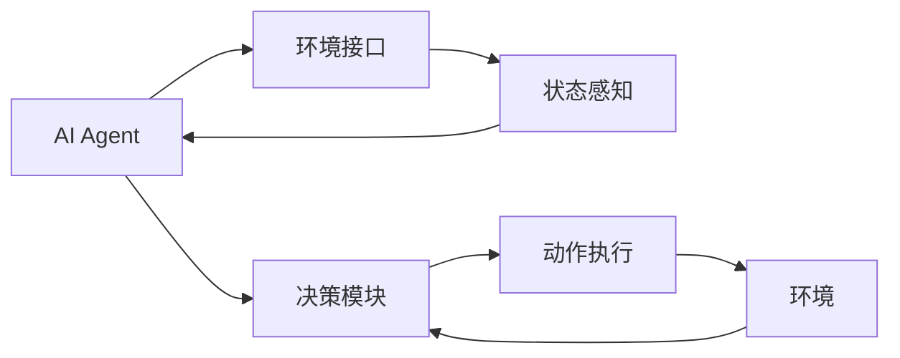
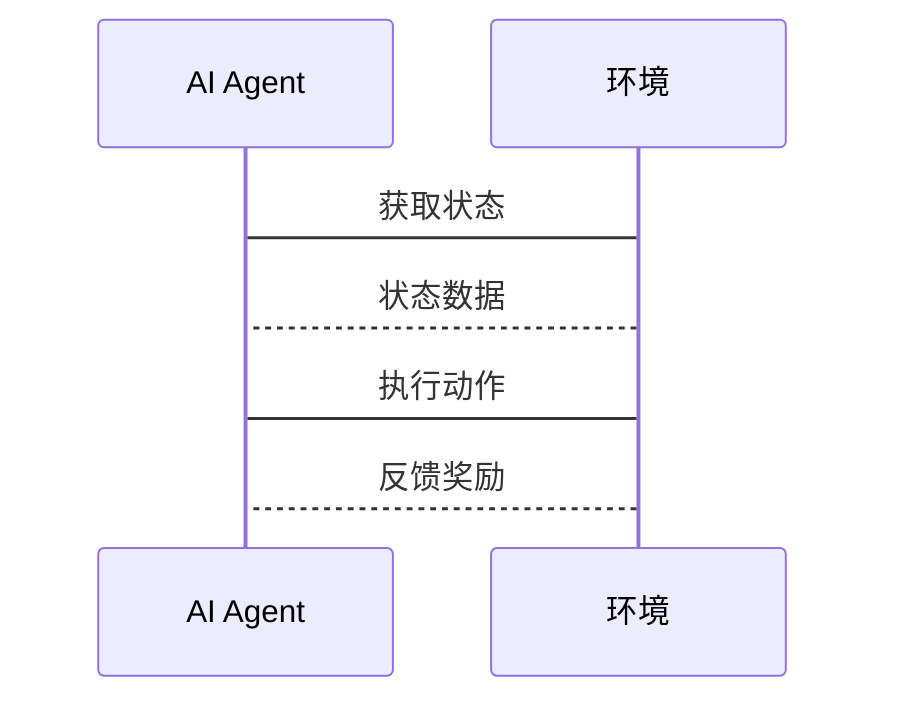

                 


# AI Agent的强化学习在智能制造中的应用

> 关键词：AI Agent, 强化学习, 智能制造, 算法原理, 系统架构

> 摘要：本文详细探讨了AI Agent在智能制造中的应用，重点分析了强化学习技术如何助力智能制造系统的优化与创新。文章从背景介绍、核心概念、算法原理、系统架构设计、项目实战到最佳实践，全面阐述了AI Agent与强化学习的结合及其在智能制造中的应用价值。

---

# 第一部分: AI Agent与强化学习基础

# 第1章: AI Agent与强化学习概述

## 1.1 智能制造的背景与挑战

### 1.1.1 智能制造的定义与特点
智能制造是一种通过智能化技术实现生产过程自动化、数字化和优化的制造模式。其核心特点包括：
- **自动化**：生产流程的自动化操作。
- **数字化**：数据的实时采集、分析与应用。
- **智能化**：系统具备学习、推理和决策能力。

### 1.1.2 智能制造的核心技术
智能制造依赖于多种先进技术的融合，包括：
- **物联网（IoT）**：设备间的数据互联与通信。
- **大数据分析**：海量数据的处理与挖掘。
- **人工智能（AI）**：智能化决策与优化。
- **机器人技术**：自动化操作与协作。

### 1.1.3 智能制造的典型应用场景
智能制造在多个领域展现出广泛的应用，例如：
- **智能工厂**：优化生产流程，降低能耗。
- **供应链管理**：实现高效物料调度与库存优化。
- **质量控制**：实时监控产品生产过程，确保产品质量。

## 1.2 AI Agent的基本概念

### 1.2.1 AI Agent的定义
AI Agent（智能体）是指在环境中能够感知并自主行动以实现目标的实体。它可以是一个软件程序或物理设备，具备以下特征：
- **自主性**：无需外部干预，自主决策。
- **反应性**：能够实时感知环境变化并做出反应。
- **目标导向**：基于目标进行决策与行动。

### 1.2.2 AI Agent的核心特征
AI Agent的核心特征包括：
- **感知能力**：通过传感器或数据接口获取环境信息。
- **决策能力**：基于感知信息进行推理与决策。
- **行动能力**：执行决策动作，影响环境状态。

### 1.2.3 AI Agent的分类与应用场景
AI Agent可以分为以下几类：
- **简单反射型**：基于预设规则进行反应。
- **基于模型的反应型**：基于环境模型进行决策。
- **目标驱动型**：以特定目标为导向进行行动。
- **效用驱动型**：以效用函数为优化目标进行决策。

典型应用场景包括：
- **工业机器人**：在生产线上进行自动化操作。
- **智能监控系统**：实时监控生产过程并发出警报。
- **供应链优化**：协调供应链中的各个环节，提高效率。

## 1.3 强化学习的基本原理

### 1.3.1 强化学习的定义
强化学习是一种通过试错机制，学习策略以最大化累积奖励的机器学习方法。其核心在于智能体通过与环境的交互，逐步优化自身的行为策略。

### 1.3.2 强化学习的核心要素
强化学习的关键要素包括：
- **状态（State）**：智能体所处的环境状况。
- **动作（Action）**：智能体在特定状态下采取的行为。
- **奖励（Reward）**：智能体采取动作后所获得的反馈，用于指导学习方向。
- **策略（Policy）**：智能体选择动作的概率分布。
- **值函数（Value Function）**：衡量某状态下采取特定动作的期望回报。

### 1.3.3 强化学习与监督学习的区别
| **对比维度** | **监督学习** | **强化学习** |
|--------------|--------------|--------------|
| 数据来源     | 标签数据     | 环境反馈     |
| 反馈机制     | 标签匹配     | 奖励/惩罚    |
| 应用场景     | 分类、回归   | 控制、游戏    |

## 1.4 AI Agent与强化学习的结合

### 1.4.1 AI Agent在强化学习中的角色
AI Agent作为强化学习的主体，负责感知环境、选择动作并执行行动。其主要职责包括：
- **感知环境**：通过传感器获取环境信息。
- **决策制定**：基于感知信息，选择最优动作。
- **行动执行**：根据决策结果，执行具体动作。

### 1.4.2 强化学习在AI Agent中的应用
强化学习为AI Agent提供了自适应优化的能力，使其能够：
- **动态调整策略**：根据环境变化实时优化行为。
- **复杂任务处理**：解决需要多步决策的问题。
- **自我改进**：通过试错机制不断提升性能。

### 1.4.3 AI Agent与强化学习的结合优势
- **自主性**：AI Agent具备自主决策能力，能够在复杂环境中独立运作。
- **适应性**：强化学习使AI Agent能够适应动态变化的环境。
- **高效性**：通过强化学习优化，AI Agent能够快速找到最优解决方案。

## 1.5 本章小结
本章从智能制造的背景出发，介绍了AI Agent和强化学习的基本概念，并分析了两者结合的优势。通过理解这些基础知识，读者可以为后续的深入学习打下坚实基础。

---

# 第2章: AI Agent与强化学习的核心概念

## 2.1 AI Agent的核心概念

### 2.1.1 状态空间
状态空间是AI Agent可能遇到的所有可能状态的集合。例如，在智能工厂中，状态可能包括设备运行状态、生产进度等。

### 2.1.2 行动空间
行动空间是AI Agent在特定状态下可以执行的所有可能动作的集合。例如，在设备维护场景中，AI Agent可以选择“检查设备”或“更换零件”等动作。

### 2.1.3 奖励函数
奖励函数是衡量AI Agent行为优劣的指标，通常以数值形式表示。例如，完成一次生产任务可获得奖励值+1，出现故障则获得惩罚值-1。

## 2.2 强化学习的核心概念

### 2.2.1 策略
策略是AI Agent选择动作的概率分布函数。例如，在状态s下，选择动作a的概率为π(a|s)。

### 2.2.2 动作价值函数
动作价值函数Q(s,a)表示在状态s下执行动作a后的期望累积奖励。数学表达式如下：
$$ Q(s, a) = \mathbb{E}[R | s, a] $$

### 2.2.3 探索与利用
- **探索**：尝试未尝试过的动作，以发现更好的策略。
- **利用**：根据当前知识，选择最优动作以最大化奖励。

## 2.3 AI Agent与强化学习的核心联系

### 2.3.1 状态-动作-奖励的关系
状态空间、动作空间和奖励函数构成了强化学习的核心框架。通过不断试验，AI Agent学习到最优策略。

### 2.3.2 AI Agent在强化学习中的决策过程
AI Agent通过感知环境状态，结合当前策略，选择最优动作，并根据反馈调整策略。

### 2.3.3 强化学习在AI Agent中的优化作用
强化学习通过不断试错，优化AI Agent的决策策略，使其在复杂环境中表现更优。

## 2.4 本章小结
本章详细阐述了AI Agent和强化学习的核心概念，分析了它们之间的联系，并为后续算法分析奠定了基础。

---

# 第3章: 强化学习算法原理

## 3.1 强化学习的基本算法

### 3.1.1 Q-learning算法

#### 3.1.1.1 算法流程
1. 初始化Q表，所有状态-动作对的Q值设为0。
2. 进入循环：
   - 选择当前状态s的动作a。
   - 执行动作a，观察新的状态s'和奖励r。
   - 更新Q(s, a) = r + γ * max(Q(s', a'))，其中γ为折扣因子。
3. 重复步骤2，直到收敛。

#### 3.1.1.2 Python代码实现
```python
import numpy as np
import random

class QLearning:
    def __init__(self, state_num, action_num, gamma=0.9):
        self.state_num = state_num
        self.action_num = action_num
        self.gamma = gamma
        self.Q = np.zeros((state_num, action_num))
    
    def choose_action(self, state, epsilon=0.1):
        if random.random() < epsilon:
            return random.randint(0, self.action_num-1)
        else:
            return np.argmax(self.Q[state, :])
    
    def update_Q(self, state, action, reward, next_state):
        self.Q[state, action] = reward + self.gamma * np.max(self.Q[next_state, :])
```

#### 3.1.1.3 示例
假设状态空间为3个状态，动作空间为2个动作，γ=0.9：
- 初始化Q表为3x2的零矩阵。
- 进行一次学习循环，更新Q值。

### 3.1.2 Deep Q-Network (DQN)算法

#### 3.1.2.1 算法流程
1. 初始化经验回放池和目标网络Q_target。
2. 进入循环：
   - 从经验池中随机抽取一批样本。
   - 训练主网络Q_main，使其预测的Q值逼近目标网络Q_target的值。
   - 定期更新目标网络Q_target = Q_main。
3. 重复步骤2，直到收敛。

#### 3.1.2.2 Python代码实现
```python
import numpy as np
import torch
import torch.nn as nn

class DQN:
    def __init__(self, state_num, action_num, learning_rate=0.01, gamma=0.9):
        self.state_num = state_num
        self.action_num = action_num
        self.gamma = gamma
        self.lr = learning_rate
        
        self.main_net = nn.Sequential(
            nn.Linear(state_num, 24),
            nn.ReLU(),
            nn.Linear(24, action_num)
        )
        self.target_net = nn.Sequential(
            nn.Linear(state_num, 24),
            nn.ReLU(),
            nn.Linear(24, action_num)
        )
        self.optimizer = torch.optim.Adam(self.main_net.parameters(), lr=self.lr)
    
    def choose_action(self, state, epsilon=0.1):
        if random.random() < epsilon:
            return random.randint(0, self.action_num-1)
        else:
            with torch.no_grad():
                return torch.argmax(self.main_net(torch.tensor(state))).item()
    
    def update(self, batch):
        states = torch.tensor(batch['states'])
        actions = torch.tensor(batch['actions'])
        rewards = torch.tensor(batch['rewards'])
        next_states = torch.tensor(batch['next_states'])
        
        Q_main = self.main_net(states).gather(1, actions.unsqueeze(1))
        Q_target = self.target_net(next_states).max(1)[0].detach()
        Q_target = rewards + self.gamma * Q_target
        
        loss = nn.MSELoss()(Q_main.squeeze(), Q_target)
        self.optimizer.zero_grad()
        loss.backward()
        self.optimizer.step()
        
        # 定期更新目标网络
        if self.step % 100 == 0:
            self.target_net.load_state_dict(self.main_net.state_dict())
```

#### 3.1.2.3 示例
- 初始化DQN算法，状态空间为3，动作空间为2。
- 使用经验回放池训练主网络，逐步逼近目标网络。

### 3.1.3 Policy Gradients算法

#### 3.1.3.1 算法流程
1. 初始化策略网络，参数θ。
2. 进入循环：
   - 采样一批状态s，根据策略网络选择动作a。
   - 计算策略的梯度，更新θ。
3. 重复步骤2，直到收敛。

#### 3.1.3.2 Python代码实现
```python
import torch
import torch.nn as nn

class PolicyGradients:
    def __init__(self, state_num, action_num, learning_rate=0.01):
        self.state_num = state_num
        self.action_num = action_num
        self.lr = learning_rate
        
        self.theta = nn.Parameter(torch.randn(state_num, action_num))
        self.optimizer = torch.optim.Adam([self.theta], lr=self.lr)
    
    def choose_action(self, state):
        with torch.no_grad():
            prob = torch.softmax(self.theta[state], dim=0)
            action = torch.multinomial(prob, 1).item()
        return action
    
    def update(self, states, actions, rewards):
        log_prob = torch.log(torch.softmax(self.theta[states], dim=0))
        loss = -torch.mean(log_prob * rewards)
        
        self.optimizer.zero_grad()
        loss.backward()
        self.optimizer.step()
```

#### 3.1.3.3 示例
- 初始化策略网络，状态空间为3，动作空间为2。
- 采样一批状态，选择动作并计算梯度，更新策略网络。

## 3.2 强化学习算法的数学模型

### 3.2.1 Q-learning的数学模型
$$ Q(s, a) = Q(s, a) + \alpha (r + \gamma \max Q(s', a') - Q(s, a)) $$

### 3.2.2 DQN的数学模型
$$ Q(s, a) = Q(s, a) + \alpha (r + \gamma Q'(s', a') - Q(s, a)) $$

### 3.2.3 Policy Gradients的数学模型
$$ \theta = \theta + \alpha \nabla_\theta (\mathbb{E}[R]) $$

## 3.3 强化学习算法的优缺点

| **算法**        | **优点**                              | **缺点**                              |
|-----------------|-------------------------------------|--------------------------------------|
| Q-learning      | 简单易实现，离线学习                | 无法处理高维状态空间，更新不稳定    |
| DQN             | 能处理高维状态，经验回放减少偏差     | 训练不稳定，收敛速度较慢              |
| Policy Gradients| 直接优化策略，适合处理连续动作空间   | 对策略空间敏感，训练困难              |

## 3.4 本章小结
本章详细介绍了Q-learning、DQN和Policy Gradients三种强化学习算法的原理、数学模型及优缺点，为后续的系统设计和项目实现奠定了理论基础。

---

# 第4章: 强化学习算法在智能制造中的应用

## 4.1 智能制造中的强化学习应用

### 4.1.1 质量控制
AI Agent可以通过强化学习优化质量控制流程，例如：
- 选择最优的检测参数。
- 实时调整检测阈值。

### 4.1.2 能耗优化
AI Agent可以通过强化学习实现生产流程中的能耗优化，例如：
- 动态调整设备运行参数。
- 优化能源使用策略。

### 4.1.3 供应链管理
AI Agent可以通过强化学习优化供应链管理，例如：
- 协调供应商与生产计划。
- 实时调整库存策略。

## 4.2 系统分析与架构设计

### 4.2.1 系统功能设计
系统功能模块包括：
- **状态感知模块**：采集环境数据。
- **决策模块**：执行强化学习算法，生成动作。
- **执行模块**：将决策结果转化为具体行动。
- **反馈模块**：收集环境反馈，更新强化学习模型。

### 4.2.2 系统架构设计
系统架构设计如下：


### 4.2.3 接口设计
系统主要接口包括：
- **状态输入接口**：接收环境状态数据。
- **动作输出接口**：发送决策动作到执行模块。
- **反馈输入接口**：接收环境反馈信息。

### 4.2.4 交互流程
系统交互流程如下：


## 4.3 系统实现

### 4.3.1 环境搭建
- **硬件环境**：配置工业机器人、传感器等设备。
- **软件环境**：安装Python、TensorFlow、Keras等开发工具。

### 4.3.2 核心代码实现
```python
import numpy as np
import gym

env = gym.make('CustomManufacturingEnv-v0')  # 自定义环境
agent = DQN(env.observation_space.shape[0], env.action_space.n)

for episode in range(1000):
    state = env.reset()
    total_reward = 0
    while True:
        action = agent.choose_action(state)
        next_state, reward, done, _ = env.step(action)
        agent.update(env.history)
        total_reward += reward
        state = next_state
        if done:
            break
    print(f'Episode {episode}, Total Reward: {total_reward}')
```

### 4.3.3 案例分析
以一个简单的生产流程优化为例：
- 初始化环境，训练AI Agent。
- 训练过程中，AI Agent逐步优化生产参数，提升效率。
- 测试阶段，验证优化效果。

## 4.4 本章小结
本章通过实际案例分析，展示了强化学习算法在智能制造中的应用价值，并详细阐述了系统设计与实现过程。

---

# 第5章: 项目实战——基于强化学习的智能制造优化

## 5.1 项目背景与目标

### 5.1.1 项目背景
智能制造系统中，生产效率的优化和质量控制的提升是两大核心目标。

### 5.1.2 项目目标
通过强化学习优化生产流程，实现以下目标：
- 提高生产效率。
- 降低能耗。
- 提升产品质量。

## 5.2 项目实施

### 5.2.1 环境搭建
- **安装依赖**：安装Python、TensorFlow、OpenAI Gym等工具。
- **配置硬件**：搭建工业机器人、传感器等硬件设备。

### 5.2.2 核心代码实现

#### 5.2.2.1 状态空间定义
```python
class ManufacturingEnv(gym.Env):
    def __init__(self):
        super().__init__()
        self.observation_space = gym.spaces.Box(low=0, high=100, shape=(3,))
        self.action_space = gym.spaces.Discrete(4)
    
    def reset(self):
        self.state = np.array([50, 50, 50])
        return self.state
    
    def step(self, action):
        # 执行动作并更新状态
        # 返回新的状态、奖励、是否终止、信息
        pass
```

#### 5.2.2.2 强化学习模型训练
```python
def train():
    env = ManufacturingEnv()
    agent = DQN(env.observation_space.shape[0], env.action_space.n)
    for episode in range(1000):
        state = env.reset()
        total_reward = 0
        while True:
            action = agent.choose_action(state)
            next_state, reward, done, _ = env.step(action)
            agent.update(env.history)
            total_reward += reward
            state = next_state
            if done:
                break
        print(f'Episode {episode}, Total Reward: {total_reward}')

if __name__ == '__main__':
    train()
```

### 5.2.3 实验结果与分析
- **训练曲线**：展示每轮的累积奖励变化。
- **收敛性分析**：分析模型收敛速度和稳定性。
- **性能对比**：与传统方法对比，验证强化学习的优越性。

## 5.3 项目总结

### 5.3.1 成功经验
- 算法选择得当，模型训练效果显著。
- 系统设计合理，实现过程顺利。

### 5.3.2 改进建议
- 进一步优化算法，提升训练效率。
- 结合更多实际场景，丰富应用案例。

## 5.4 本章小结
本章通过一个具体的智能制造优化项目，详细展示了强化学习技术的实战应用，为读者提供了宝贵的参考经验。

---

# 第6章: 最佳实践与总结

## 6.1 总结

### 6.1.1 AI Agent的核心作用
AI Agent通过强化学习技术，显著提升了智能制造系统的智能化水平和优化能力。

### 6.1.2 强化学习的优势
- **自适应优化**：能够动态调整策略，适应复杂环境。
- **高效决策**：通过试错机制，快速找到最优解决方案。

## 6.2 最佳实践 tips

### 6.2.1 算法选择
根据具体场景选择合适的强化学习算法：
- Q-learning适用于简单环境。
- DQN适用于高维状态空间。
- Policy Gradients适用于连续动作空间。

### 6.2.2 系统设计
- **模块化设计**：便于维护和扩展。
- **实时反馈**：确保模型能够及时更新。

### 6.2.3 性能优化
- **经验回放**：提升训练效率。
- **网络结构调整**：优化模型性能。

## 6.3 未来展望

### 6.3.1 技术发展
- **多智能体协同**：实现更加复杂的智能制造场景。
- **强化学习与博弈论结合**：提升系统决策的全局最优性。

### 6.3.2 应用拓展
- **智能化预测**：基于强化学习实现生产预测。
- **自适应维护**：优化设备维护策略。

## 6.4 本章小结
本章总结了全文的核心内容，提供了实际应用的建议，并展望了未来的发展方向。

---

# 作者：AI天才研究院/AI Genius Institute & 禅与计算机程序设计艺术 /Zen And The Art of Computer Programming

---

通过以上目录结构和内容概述，您可以根据需要进一步扩展每章的具体内容，添加更多的技术细节、案例分析和代码实现，以完成一篇完整且详尽的技术博客文章。

